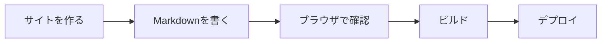
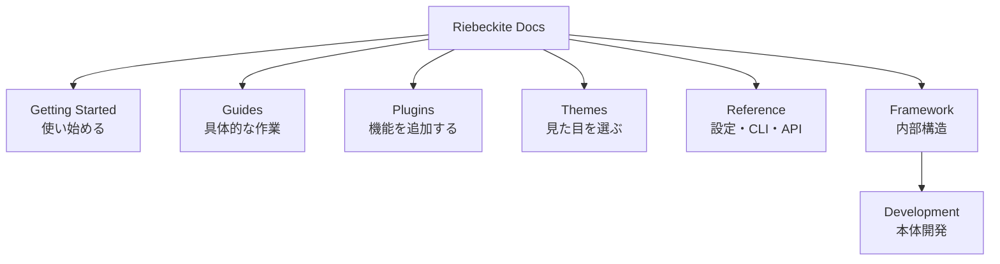
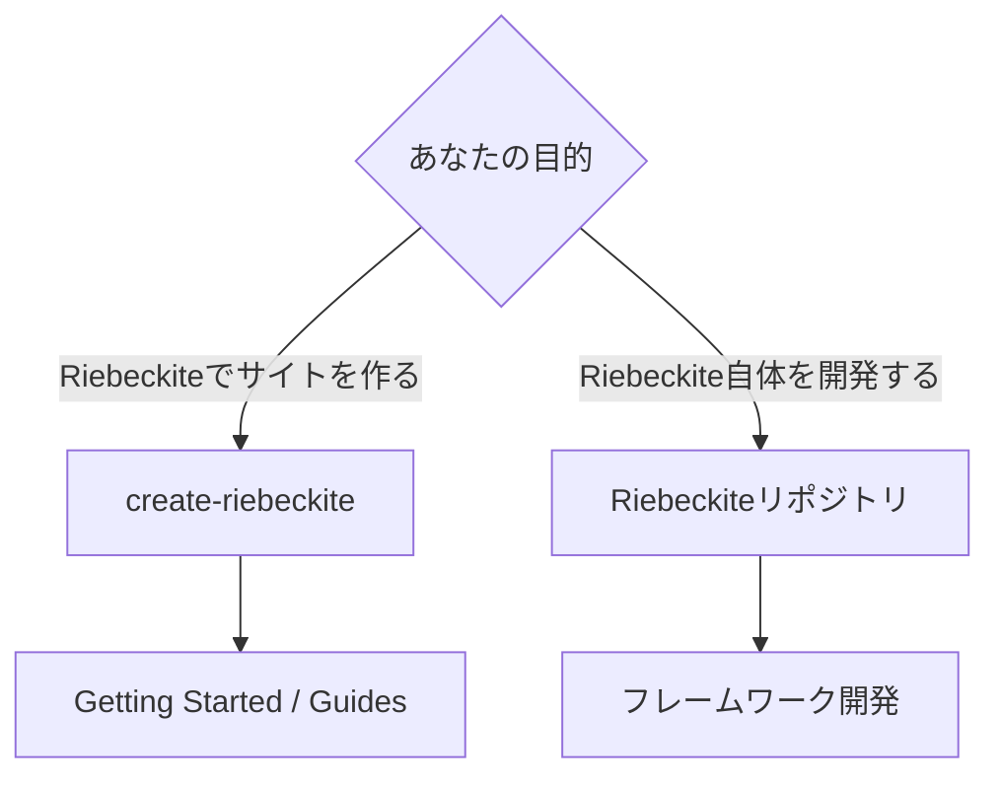
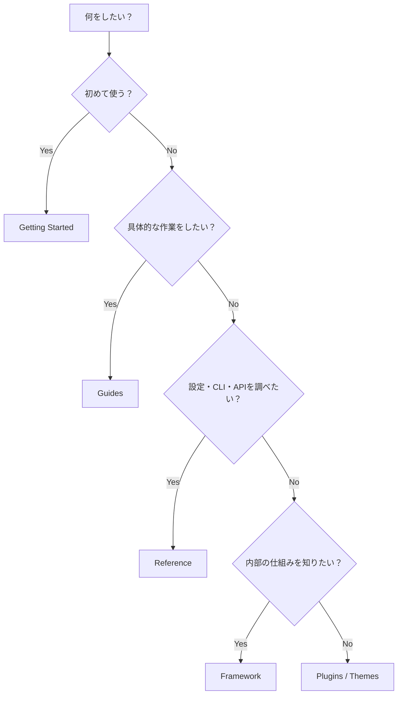

# Riebeckite ドキュメント

![[riebeckite-logo-horizontal.png]]

Riebeckite は、**Markdown や Obsidian のノートから公開サイトを作るためのフレームワーク**です。

Markdown を `content/` に置くだけのシンプルなサイトから、プラグイン、テーマ、多言語化、外部の Obsidian Vault を使うサイトまで構築できます。

初めて使う場合は、Riebeckite のリポジトリをクローンする必要はありません。

`create-riebeckite` から新しいサイトを作成します。

## はじめる

基本的な流れは次のとおりです。



まず [クイックスタート](./docs/getting-started/quick-start.md) から始めてください。

順番に進めたい場合は、

1. [クイックスタート](./docs/getting-started/quick-start.md)
2. [インストール](./docs/getting-started/installation.md)
3. [最初の記事](./docs/getting-started/first-content.md)
4. [プリセット](./docs/getting-started/presets.md)
5. [デプロイ](./docs/getting-started/deployment.md)

の順で読めます。

全章の一覧は [ドキュメント索引](./docs/README.md) にあります。

## 基本的な使い方

サイトを作成したら、基本的には次の流れで使います。

```text id="f2xd10"
create-riebeckite
      ↓
content/ に Markdown を書く
      ↓
riebeckite dev
      ↓
ブラウザで確認
      ↓
riebeckite build
      ↓
deploy
```

普段サイトを作るだけなら、Riebeckite 本体の内部構造を理解する必要はありません。

## 何をしたいですか？

目的に近いページから読めます。

| 目的 | 読むページ |
| --- | --- |
| 初めて Riebeckite を使う | [クイックスタート](./docs/getting-started/quick-start.md) |
| インストール方法を確認する | [インストール](./docs/getting-started/installation.md) |
| 最初の記事を書く | [最初の記事](./docs/getting-started/first-content.md) |
| サイトの構成を選ぶ | [プリセット](./docs/getting-started/presets.md) |
| デプロイする | [デプロイ](./docs/getting-started/deployment.md) |
| デプロイ先ごとの手順を確認する | [デプロイガイド](./docs/guides/deployment/README.md) |
| Markdown と frontmatter の書き方を知る | [コンテンツの書き方](./docs/guides/writing-content.md) |
| Obsidian Vault を公開する | [Obsidian](./docs/guides/obsidian.md) |
| コンテンツとサイトを別リポジトリにする | [コンテンツリポジトリ](./docs/guides/content-repositories.md) |
| 多言語サイトを作る | [多言語化](./docs/guides/localization.md) |
| Riebeckite を更新する | [Upgrading](./docs/guides/upgrading.md) |
| プラグインを探す | [プラグイン](./docs/plugins/README.md) |
| テーマを選ぶ | [テーマ](./docs/themes/README.md) |
| アクセシビリティの責任範囲を確認する | [アクセシビリティ](./docs/accessibility.md) |
| セキュリティと信頼モデルを確認する | [セキュリティモデル](./docs/security.md) |
| 設定や CLI、Public API を調べる | [リファレンス](./docs/reference/README.md) |
| Riebeckite の内部構造を理解する | [フレームワーク](./docs/framework/README.md) |
| Riebeckite 本体を開発する | [フレームワーク開発](./docs/framework/development.md) |

## ドキュメントの構成

Riebeckite のドキュメントは、目的ごとに分かれています。



### Getting Started

初めて Riebeckite を使う人向けのページです。

サイトの作成から最初の記事、プリセット、デプロイまでを扱います。

### Guides

具体的な目的を達成するための手順です。

たとえば、

- Obsidian Vault を使う
- コンテンツリポジトリを分離する
- 多言語化する
- Riebeckite をアップグレードする
- 特定の環境へデプロイする

といった作業を扱います。

### プラグイン

Riebeckite に機能を追加するプラグインを探すためのページです。

記事表示、検索、グラフ、Mermaid、Excalidraw など、必要な機能に応じてプラグインを追加できます。

### テーマ

サイトの見た目を変更するテーマを探すためのページです。

テーマを変更しても、コンテンツやプラグインの機能そのものは変わりません。

### リファレンス

設定値、CLI コマンド、Public API を調べるための資料です。

「この設定は何を意味するのか」「この API は何を提供するのか」を確認したいときに利用します。

### フレームワーク

Riebeckite の内部構造を理解したい人向けです。

コンテンツシステム、プラグインシステム、テーマシステム、ビルドシステム、HonoX 連携などを説明します。

通常のサイト利用では読む必要はありません。

## サイトを作る人と、本体を開発する人

Riebeckite には大きく2つの使い方があります。



### サイトを作る場合

Riebeckite のリポジトリはクローンしません。

`create-riebeckite` から始めます。

```text id="4s6dql"
create-riebeckite
      ↓
生成されたサイト
      ↓
content/
      ↓
dev / build
      ↓
deploy
```

普段利用するのは、生成されたサイト側です。

### Riebeckite 本体を開発する場合

Riebeckite 自体へ変更を加える場合だけ、リポジトリをクローンします。

この場合は、

- モノレポ
- ルートの `pnpm` コマンド
- `packages/*`
- `apps/web`
- フレームワークテスト
- 外部サイト E2E

などを扱います。

詳しくは [フレームワーク開発](./docs/framework/development.md) を参照してください。

`apps/web` は Riebeckite のドキュメント兼参照アプリです。一般ユーザーがサイトを作るためのテンプレートではありません。

## 迷ったら

どこを読めばよいか分からない場合は、次の基準で選べます。



簡単に分けると、

```text id="84zv4s"
初めて使う
  → Getting Started

具体的な作業をする
  → Guides

機能や見た目を追加する
  → Plugins / Themes

設定・CLI・APIを調べる
  → Reference

内部構造を理解する
  → Framework

Riebeckite本体を変更する
  → Framework Development
```

です。

Coding Agent 向けの短い開発ルールは [agents](./agents/README.md) に分けています。
