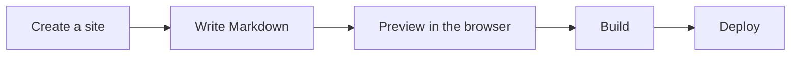
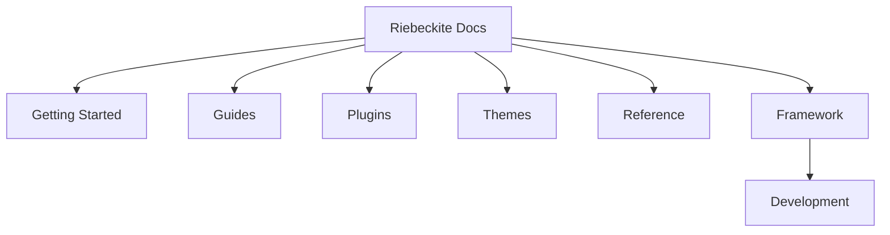
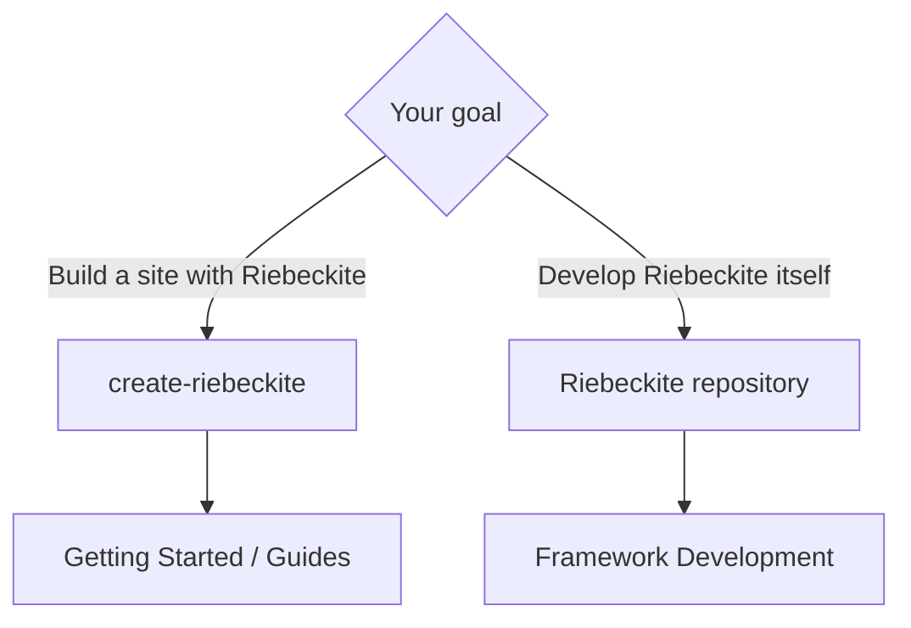
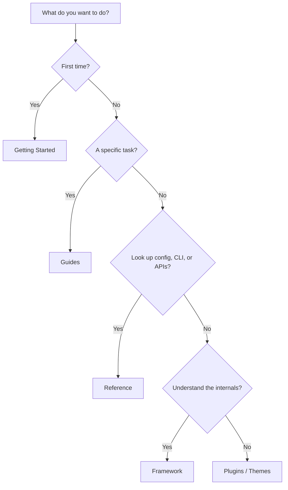

# Riebeckite documentation

![[riebeckite-logo-horizontal.png]]

Riebeckite is a **framework for turning Markdown and Obsidian notes into a published site**.

You can build anything from a simple site that just puts Markdown in `content/`, to a site that uses plugins, themes, localization, and an external Obsidian vault.

If you are new, you do not need to clone the Riebeckite repository.
Create a new site from `create-riebeckite`.

## Getting started

The basic flow is:



Start with [Quick Start](./docs/getting-started/quick-start.md).

To follow the steps in order:

1. [Quick Start](./docs/getting-started/quick-start.md)
2. [Installation](./docs/getting-started/installation.md)
3. [First Content](./docs/getting-started/first-content.md)
4. [Presets](./docs/getting-started/presets.md)
5. [Deployment](./docs/getting-started/deployment.md)

The full chapter list is in the [documentation index](./docs/README.md).

## Basic usage

Once a site exists, the usual flow is:

```text
create-riebeckite
      ↓
write Markdown in content/
      ↓
riebeckite dev
      ↓
preview in the browser
      ↓
riebeckite build
      ↓
deploy
```

If you only build sites, you do not need to understand Riebeckite's internals.

## What do you want to do?

Start from the page closest to your goal.

| Goal | Page |
| --- | --- |
| Use Riebeckite for the first time | [Quick Start](./docs/getting-started/quick-start.md) |
| Check how to install | [Installation](./docs/getting-started/installation.md) |
| Write your first content | [First Content](./docs/getting-started/first-content.md) |
| Choose a site setup | [Presets](./docs/getting-started/presets.md) |
| Deploy | [Deployment](./docs/getting-started/deployment.md) |
| Follow per-target deployment steps | [Deployment guides](./docs/guides/deployment/README.md) |
| Learn how to write Markdown and frontmatter | [Writing Content](./docs/guides/writing-content.md) |
| Publish an Obsidian vault | [Obsidian](./docs/guides/obsidian.md) |
| Keep content and site in separate repositories | [Content repositories](./docs/guides/content-repositories.md) |
| Build a multilingual site | [Localization](./docs/guides/localization.md) |
| Upgrade Riebeckite | [Upgrading](./docs/guides/upgrading.md) |
| Find a plugin | [Plugins](./docs/plugins/README.md) |
| Choose a theme | [Themes](./docs/themes/README.md) |
| Review accessibility responsibilities | [Accessibility](./docs/accessibility.md) |
| Review the security and trust model | [Security](./docs/security.md) |
| Look up configuration, CLI, or public APIs | [Reference](./docs/reference/README.md) |
| Understand Riebeckite's internals | [Framework](./docs/framework/README.md) |
| Develop Riebeckite itself | [Framework Development](./docs/framework/development.md) |

## Documentation structure

Riebeckite's documentation is split by purpose.



### Getting Started

Pages for people using Riebeckite for the first time.

Covers creating a site, your first content, presets, and deployment.

### Guides

Procedures for achieving a specific goal.

For example:

- Using an Obsidian vault
- Separating a content repository
- Adding localization
- Upgrading Riebeckite
- Deploying to a specific environment

### Plugins

Pages for finding plugins that add features to Riebeckite.

You can add plugins for articles, search, graphs, Mermaid, Excalidraw, and more, depending on what you need.

### Themes

Pages for finding themes that change the look of your site.

Changing the theme does not change the content or the features of your plugins.

### Reference

Material for looking up configuration values, CLI commands, and public APIs.

Use it when you want to know "what does this setting mean?" or "what does this API provide?".

### Framework

For people who want to understand Riebeckite's internals.

Explains the content system, plugin system, theme system, build system, HonoX integration, and more.

You do not need to read it for normal site usage.

## Building a site vs. developing the framework

Riebeckite has two broad uses.



### Building a site

You do not clone the Riebeckite repository.

Start from `create-riebeckite`.

```text
create-riebeckite
      ↓
generated site
      ↓
content/
      ↓
dev / build
      ↓
deploy
```

In normal use you work in the generated site.

### Developing Riebeckite itself

Clone the repository only when you are changing Riebeckite itself.

In that case you work with:

- the monorepo
- root `pnpm` commands
- `packages/*`
- `apps/web`
- framework tests
- external site E2E

See [Framework Development](./docs/framework/development.md) for details.

`apps/web` is Riebeckite's documentation and reference app. It is not a template for users building sites.

## When in doubt

If you are not sure what to read, use these criteria.



In short:

```text
First time
  → Getting Started

A specific task
  → Guides

Add features or change the look
  → Plugins / Themes

Look up config, CLI, or APIs
  → Reference

Understand the internals
  → Framework

Change Riebeckite itself
  → Framework Development
```

Short development rules for coding agents live in [agents](./agents/README.md).
