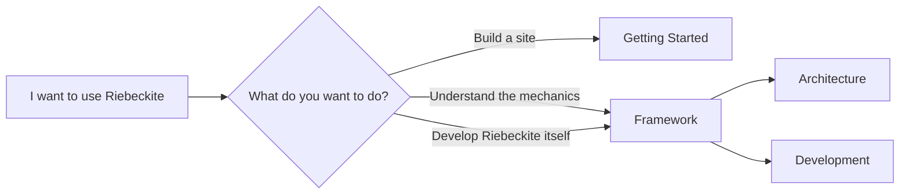
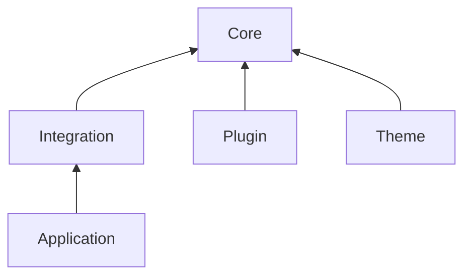

# Framework

Framework documentation is for people who want to understand or develop Riebeckite itself. If you only want to build a site, start with [Getting Started](../getting-started/README.md) and use [Reference](../reference/README.md) when you need exact fields or commands.

This chapter is for:

- People who want to understand Riebeckite's internal structure.
- People who want to know how plugins and themes work in detail.
- People who want to develop or change Riebeckite itself.

If you only want to build your own site with Riebeckite, you do not need to read this chapter from the start. Begin with [Getting Started](../getting-started/README.md).



## Read by responsibility

| I want to understand… | Page |
| --- | --- |
| Package ownership and dependency direction | [Architecture](./architecture.md) |
| How Markdown and assets become pages | [Content system](./content-system.md) |
| How plugins are resolved and run | [Plugin system](./plugin-system.md) |
| How plugins provide standalone pages | [Page system](./page-system.md) |
| How themes interact with CSS and plugin output | [Theme system](./theme-system.md) |
| Incremental builds, build state, and plugin cache | [Build system](./build-system.md) |
| How plugins declare build dependencies | [Build dependency contract](./build-dependency.md) |
| The HonoX/Vite adapter boundary | [HonoX integration](./honox-integration.md) |
| Diagnostics and Doctor | [Diagnostics](./diagnostics.md) |
| Read-only inspection commands | [Inspector](./inspector.md) |
| Logger, Tracer, and Profiler | [Observability](./observability.md) |
| Test layout and golden files | [Testing](./testing.md) |
| The monorepo development workflow | [Development](./development.md) |

## Where to start

If you want to understand the internal structure first, start with [Architecture](./architecture.md).

Riebeckite is broadly divided into these responsibilities:



After reading Architecture, move on to Content System, Plugin System, Theme System, and so on depending on the area you want to change.

## Responsibility boundaries

- **Core** owns content-processing contracts and orchestration. It does not depend on HonoX, Vite, a specific plugin, or a theme.
- **Plugins** extend Markdown, HTML, metadata, assets, client behavior, endpoints, SEO, diagnostics, and graph behavior.
- **Themes** own appearance: tokens, CSS, stable-hook styling, and safe theme attributes.
- **Integrations** connect Core to a web framework and bundler. The current supported adapter is HonoX/Vite.
- **Applications** hold site-specific routes, components, and islands.
- **CLI** is build-time tooling. Runtime Cloudflare Workers code must not access build state or filesystem caches.

## For repository development

The Riebeckite monorepo clone workflow is intentionally here, not in Getting Started. Use it only when you are changing Riebeckite itself: [Development](./development.md).

Development covers, among other things:

- cloning the monorepo
- `pnpm install`
- the root `pnpm` commands
- the layout of `packages/*`
- `apps/web`
- per-package tests
- scaffold and external-site verification

```text
Develop the Riebeckite repository itself
    → Framework / Development

Build a site with Riebeckite
    → Getting Started
```

`apps/web` is Riebeckite's documentation and reference application. General users do not need to copy `apps/web` or clone the Riebeckite monorepo to use Riebeckite.

## The boundary of this chapter

The Framework chapter covers Riebeckite's **internal design and framework development**. Normal usage — creating a site, adding content, configuring plugins and themes, and deploying — is described in [Getting Started](../getting-started/README.md) and Guides.

Keeping this boundary separate lets people who only want to build a site with Riebeckite do so without learning the internals of the framework.


