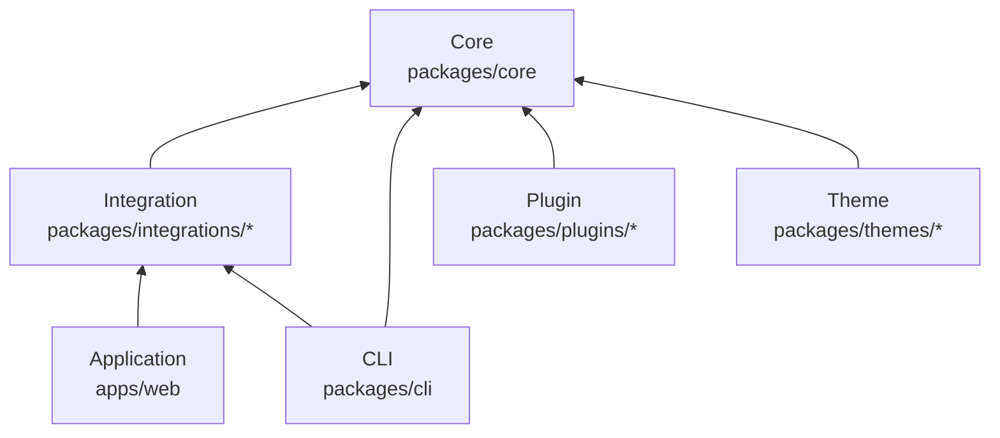
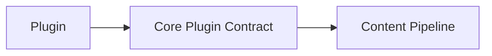
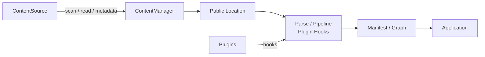
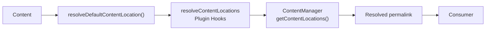
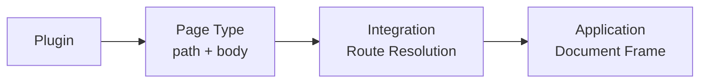
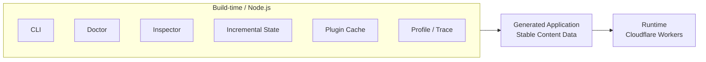
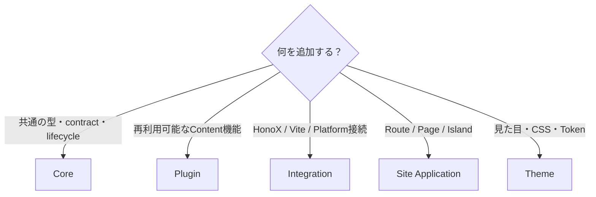

# Architecture

Riebeckite は、Core を中心に Plugin、Integration、Theme、Application を分離した pnpm workspace です。

重要な原則は、**内側の package が外側の実装を知らないこと**です。

たとえば Core はコンテンツ処理の仕組みを提供しますが、

- HonoX でどう表示するか
- Vite でどう build するか
- どの Plugin がインストールされているか
- Site がどんな UI を持つか

といったことは知りません。



矢印は依存方向です。

Core から Plugin、Integration、Application などへの逆向きの依存は作りません。

# Package の責務

Riebeckite のコードは、責務ごとに package を分けています。

| 場所 | 主な責務 |
| --- | --- |
| `packages/core` | Riebeckite の共通基盤 |
| `packages/plugins/*` | 再利用可能な機能拡張 |
| `packages/integrations/*` | Framework / Bundler / Platform との接続 |
| `packages/themes/*` | Theme と CSS |
| `packages/cli` | CLI と Node 上の Build Tooling |
| `apps/web` | 実際の Site Application |

## Core

```text id="cxz98n"
packages/core
```

Core は、特定の Web framework に依存しない Riebeckite の基盤です。

主に次の機能を所有します。

- config
- content orchestration
- manifest
- content graph
- pipeline
- Plugin runtime
- observability
- Theme contract
- 共通の型や lifecycle contract

Core は portable であることを重視します。

そのため、

```text id="zpfh9w"
HonoX
Vite
Cloudflare
特定の Plugin
Site 固有の UI
```

などへ依存させません。

## Plugin

```text id="56z84x"
packages/plugins/*
```

Plugin は、複数の Site で再利用できる機能を追加します。

たとえば、

- Markdown の変換
- HTML の変換
- metadata の追加
- asset の生成
- browser-side behavior
- Page Type の提供

などです。

Plugin は Core が公開している contract を利用して機能を拡張します。



Plugin のために Core が特定 Plugin の実装を知るような依存関係にはしません。

## Integration

```text id="n94ykv"
packages/integrations/*
```

Integration は Riebeckite と外部技術を接続します。

たとえば `@riebeckite/honox` は、

```text id="ldd2oa"
Riebeckite Core
      ↕
HonoX / Vite
```

を接続する役割を持ちます。

Framework、Bundler、Platform 固有の処理は Core ではなく Integration に配置します。

詳しくは [HonoX Integration](honox-integration.md) を参照してください。

## Theme

```text id="1as7cf"
packages/themes/*
```

Theme は Site の見た目を変更します。

主に、

- CSS
- semantic token
- stable CSS hook
- `data-*` attribute
- CSS cascade

を利用します。

Theme は presentation を担当しますが、Site の構造そのものは所有しません。

そのため Theme が、

- route
- Page Type ID
- application component
- Site の page composition

を所有することはありません。

## Site Application

```text id="9otuxo"
apps/web
```

`apps/web` は実際の Riebeckite Site Application です。

主に、

- routes
- application components
- islands
- page composition
- Site shell
- Workers との接続

を所有します。

Core や Integration が「どう表示するか」まで決めるのではなく、最終的な Site の構造は Application が決定します。

## CLI

```text id="k0pqbm"
packages/cli
```

CLI は Node.js 上で実行される command と build tooling を担当します。

たとえば、

```sh id="kt0j27"
riebeckite build
riebeckite check
riebeckite doctor
riebeckite inspect
riebeckite profile
```

などの入口を提供します。

CLI は必要に応じて Core や Integration の機能を呼び出します。

# Content の流れ

コンテンツ処理では、大きく `ContentSource` と `ContentManager` の責務を分離しています。



## ContentSource

`ContentSource` は「コンテンツをどこから、どう読み込むか」を担当します。

主に、

- scan
- read
- content identity
- `mtime`
- size
- ETag
- hash

など、source に関する情報を提供します。

たとえば filesystem を使う Content Source ならファイルを読み込みますが、`ContentManager` 自身が filesystem を直接探索するわけではありません。

新しい Content Source を追加するときも、この contract を通します。

## ContentManager

`ContentManager` は読み込まれたコンテンツを処理します。

主に、

- public location の解決
- parse
- pipeline
- Plugin hooks
- manifest
- content graph

を担当します。

つまり、

```text id="g1g93m"
ContentSource
    ↓
コンテンツを取得する

ContentManager
    ↓
コンテンツを解決・処理する
```

という分担です。

ContentManager に独自の filesystem scan を追加するのではなく、`ContentSource` の contract を利用してください。

# Public URL の解決

コンテンツの URL は filesystem path や slug から推測しません。

Riebeckite が明示的に **Public Location** を解決します。

基本的な流れは次のようになります。



Consumer は、この処理によって確定した `permalink` を使用します。

たとえば、

```text id="ez3dhv"
content/posts/hello.md
```

という filesystem path があっても、

```text id="qysr09"
/posts/hello
```

になるとは限りません。

Plugin や config によって、

```text id="i4omv8"
/blog/hello/
```

へ解決されているなら、それが正式な公開 URL です。

そのため Consumer 側で、

```text id="crklqd"
filesystem path → slug → URL
```

のような再計算をしないでください。

**解決済みの `permalink` が public URL の source of truth です。**

# Page Type

Plugin は Page Type を使って、通常の Markdown content とは異なるページを提供できます。

ただし Page Type は特定の Web framework に依存しません。



Plugin が提供するのは、主に public path と page body です。

それを実際の URL として処理するのは Integration、最終的な HTML document として組み立てるのは Application です。

Plugin が HonoX route や Site shell を所有する必要はありません。

詳しくは [Page System](./page-system.md) を参照してください。

# Build-time と Runtime

Riebeckite では、Build 時にだけ必要なものと、公開 Site の Runtime で必要なものを分離します。



次のものは Build-time の情報です。

- `.riebeckite/build/content-state.json`
- Plugin Cache
- CLI
- Doctor
- Inspector
- Profile / Trace

Cloudflare Workers の request runtime は、これらを読み書きしません。

Runtime が利用するのは Build によって生成された application と、安定した content data です。

これにより、Build の最適化用 state と公開 Site の動作を分離しています。

また Build が失敗した場合、新しい不完全な state で以前の正常な state を置き換えません。

# コードをどこに置くか

新しい機能を追加するときは、まず「どの package がその責務を持つべきか」を考えます。



判断の目安は次のとおりです。

| 追加するもの | 配置先 |
| --- | --- |
| 持ち運べる型や lifecycle contract | **Core** |
| 再利用可能な content の振る舞い | **Plugin** |
| Vite / HonoX / Platform との接続 | **Integration** |
| Route / Page composition / Island | **Site Application** |
| Visual token / CSS | **Theme** |

迷った場合は、**その機能を成立させるために必要な最も内側の package** に置きます。

ただし、内側の package から外側へ依存させてはいけません。

たとえば、

```text id="mfpzfj"
「Plugin Page を HonoX で表示したい」
```

からといって Core に HonoX のコードを追加するのではなく、

```text id="qlfw3c"
Core
  → framework-independent な Page contract

Plugin
  → Page を提供

HonoX Integration
  → Page を route と接続

Site
  → 最終的な document を描画
```

と責務を分割します。

この境界を維持することで、Core や Plugin を特定の Site、Framework、Platform に固定せず再利用できます。

関連する設計については [Content System](content-system.md)、[Plugin System](plugin-system.md)、[Theme System](theme-system.md)、[HonoX Integration](honox-integration.md) を参照してください。
