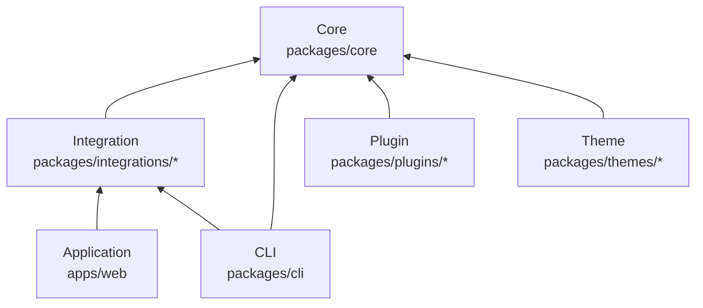
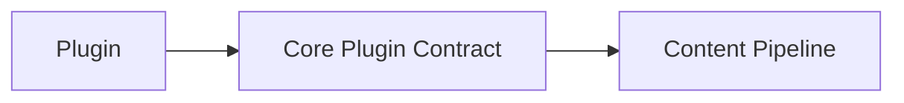
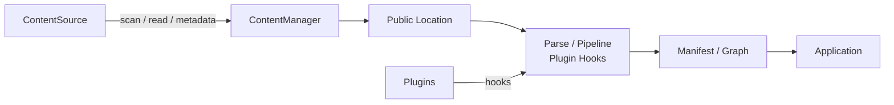
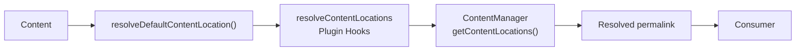
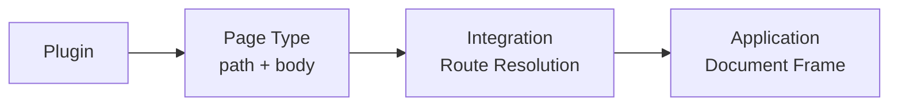
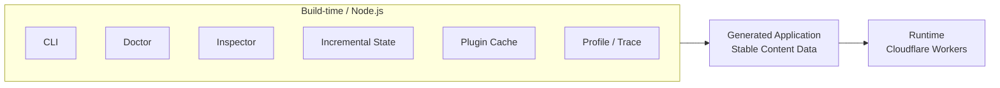
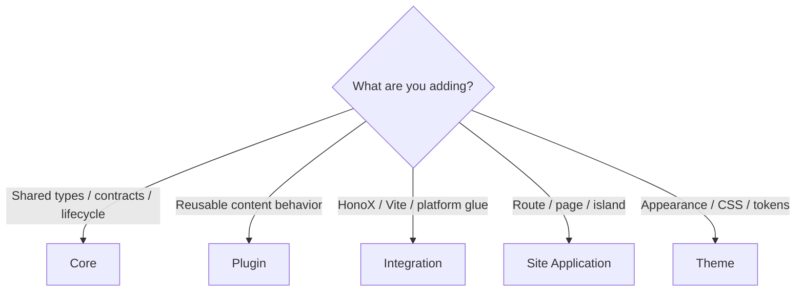

# Architecture

Riebeckite is a pnpm workspace that separates Core from Plugin, Integration,
Theme, and Application, with intentionally one-way dependencies.

The guiding principle is that **an inner package does not know the
implementation of an outer one**. Core provides the content-processing
machinery, but it does not know:

- how HonoX renders it,
- how Vite builds it,
- which plugins are installed, or
- what UI the site has.



Arrows point in the dependency direction. There is never a reverse dependency
from Core to a plugin, integration, application, or theme.

## Package ownership

| Area | Owns | Must not own |
| --- | --- | --- |
| `packages/core` | portable contracts, configuration, content orchestration, manifests, graphs, pipelines, plugin runtime, observability, and theme contracts | HonoX/Vite APIs, a named plugin, or application UI |
| `packages/plugins/*` | reusable Markdown, HTML, metadata, asset, diagnostic, browser, and Page Type capabilities | application routes or framework-specific routing |
| `packages/integrations/*` | framework, bundler, and platform adapters | reusable domain policy already represented by Core |
| `packages/themes/*` | presentation configuration and CSS | components, routes, plugins, or content loading |
| `apps/web` | the concrete routes, islands, application components, and Worker deployment | reusable framework contracts |
| `packages/cli` | Node-oriented commands and build tooling | request-time application behavior |

```text
Application -> Integration -> Core
Plugin --------------------> Core contracts
Theme ---------------------> Core theme contract
CLI -----------------------> Core and integration APIs
```

Core must never gain a reverse dependency on HonoX, a theme, a plugin, or the application. Put a concern at the first layer that can own it without importing an outer layer.

## Core

```text
packages/core
```

Core is the Riebeckite foundation, independent of any specific web framework.
It owns:

- config
- content orchestration
- manifest
- content graph
- pipeline
- plugin runtime
- observability
- the theme contract
- shared types and lifecycle contracts

Core is deliberately portable. It does not depend on:

```text
HonoX
Vite
Cloudflare
a specific plugin
site-specific UI
```

## Plugin

```text
packages/plugins/*
```

A plugin adds functionality that can be reused across multiple sites, for
example:

- Markdown transformation
- HTML transformation
- adding metadata
- generating assets
- browser-side behavior
- providing Page Types

A plugin extends functionality through the contracts Core publishes:



Core is never made to know the implementation of a specific plugin.

## Integration

```text
packages/integrations/*
```

An integration connects Riebeckite to an external technology. For example,
`@riebeckite/honox` connects:

```text
Riebeckite Core
      ↕
HonoX / Vite
```

Framework, bundler, and platform-specific work belongs in an integration, not
in Core. See [HonoX Integration](./honox-integration.md).

## Theme

```text
packages/themes/*
```

A theme changes a site's appearance through:

- CSS
- semantic tokens
- stable CSS hooks
- `data-*` attributes
- the CSS cascade

A theme owns presentation, but not the site's structure. A theme never owns:

- routes
- Page Type IDs
- application components
- the site's page composition

## Site Application

```text
apps/web
```

`apps/web` is the concrete Riebeckite site application. It owns:

- routes
- application components
- islands
- page composition
- the site shell
- the connection to Workers

Core and integrations do not decide how things are displayed; the final site
structure is decided by the application.

## CLI

```text
packages/cli
```

The CLI owns the commands and build tooling that run on Node.js, providing
entry points such as:

```sh
riebeckite build
riebeckite check
riebeckite doctor
riebeckite inspect
riebeckite profile
```

The CLI calls Core and integration functionality as needed.

## Content and rendering flow

Content processing separates the responsibilities of `ContentSource` and
`ContentManager`.



`ContentSource` discovers and reads source material and supplies source metadata. `ContentManager` interprets that material, resolves each entry's public location, runs the pipeline and plugin hooks, creates the manifest and graph, and coordinates content-related work. Public URLs come from the resolved location (`ContentManager.getContentLocations()`: the Core default resolver, then `resolveContentLocations` plugin hooks); consumers read the resolved `permalink` and never derive a URL from a slug or filesystem path. A feature that needs files should use the source contract rather than adding a second filesystem scanner.

```text
ContentSource -> ContentManager -> resolve public locations
                                      |-> parse/process pipeline
                                      |-> plugin hooks
                                      |-> manifest and content graph
                                      `-> integration/application rendering
```

### ContentSource

`ContentSource` is responsible for "where content comes from and how it is
read". It supplies source information such as:

- scan
- read
- content identity
- `mtime`
- size
- ETag
- hash

A filesystem-backed content source reads files, but `ContentManager` itself
does not walk the filesystem directly. New content sources are added through
this contract.

### ContentManager

`ContentManager` processes the content that was read. It is responsible for:

- resolving the public location
- parse
- pipeline
- plugin hooks
- manifest
- content graph

The division is:

```text
ContentSource
    ↓
obtain the content

ContentManager
    ↓
resolve and process the content
```

Rather than adding an ad-hoc filesystem scan to `ContentManager`, use the
`ContentSource` contract.

## Resolving public URLs

A content URL is not guessed from a filesystem path or slug. Riebeckite
explicitly resolves a **Public Location**. The basic flow is:



Consumers use the `permalink` that this process settles on. For example, even
if a filesystem path is:

```text
content/posts/hello.md
```

it does not necessarily become:

```text
/posts/hello
```

If a plugin or config resolves it to:

```text
/blog/hello/
```

then that is the canonical public URL. Consumers must not recompute:

```text
filesystem path → slug → URL
```

**The resolved `permalink` is the source of truth for the public URL.**

## Page Types

A plugin can use a Page Type to provide a page that differs from ordinary
Markdown content. A Page Type does not depend on a specific web framework.



A plugin mainly provides a public path and a page body. Turning that into an
actual URL is the integration's job, and assembling the final HTML document is
the application's job. A plugin does not need to own a HonoX route or the site
shell. See [Page system](./page-system.md).

Plugins may extend the process through published contracts; they do not become a hidden second application layer. A Page Type contributes a framework-independent body and public paths, while the integration resolves it through a generic route and the application retains the document frame. Themes only style the rendered result through theme configuration, CSS tokens, stable hooks, and `data-*` attributes; they do not branch on Page Type IDs.

## Build-time and runtime boundary

Riebeckite separates what is only needed at build time from what the public
site needs at runtime.



The following belong to build time:

- `.riebeckite/build/content-state.json`
- plugin caches
- CLI
- Doctor
- Inspector
- profile / trace

The Cloudflare Workers request runtime does not read or write these. Runtime
code consumes generated application output and stable content data, not a
writable `.riebeckite` directory.

The CLI, Inspector, Doctor, profiler traces, incremental state at `.riebeckite/build/content-state.json`, and filesystem plugin caches belong to Node/build time. They are not mutable dependencies of the Cloudflare Workers request runtime.

This boundary keeps deployments reproducible: a failed build does not mutate the previous valid state, and a request cannot depend on local files that do not exist in a Worker.

## Choosing a location

When adding a feature, first decide which package should own it.



The rule of thumb is:

| What you are adding | Where it goes |
| --- | --- |
| A portable type or lifecycle contract | **Core** |
| Reusable content behavior | **Plugin** |
| Vite / HonoX / platform glue | **Integration** |
| A route, page composition, or island | **Site Application** |
| Visual tokens and CSS | **Theme** |

- Add a portable type or lifecycle contract to **Core**.
- Add reusable content behavior to a **plugin**.
- Add Vite, HonoX, or platform glue to an **integration**.
- Add a route, page composition, or island to **`apps/web`**.
- Add visual tokens and CSS only to a **theme**.

If you are unsure, put the feature in **the innermost package that can support
it** — but an inner package must never depend on an outer one. For example,
"I want to display a Plugin Page with HonoX" does not justify adding HonoX code
to Core. Instead, split the responsibilities:

```text
Core
  → a framework-independent Page contract

Plugin
  → provides the Page

HonoX Integration
  → connects the Page to a route

Site
  → renders the final document
```

Keeping this boundary lets Core and plugins be reused without being tied to a
specific site, framework, or platform.

See [Content system](./content-system.md), [Plugin system](./plugin-system.md), [Theme system](./theme-system.md), and [HonoX integration](./honox-integration.md) before changing a boundary.
