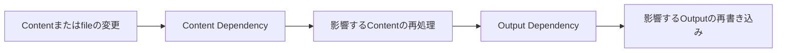

# Build Dependency Contract

Incremental Buildの無効化はCoreの責務です。PluginはどのContentが影響を受けるかを計算せず、依存stateも自分では持ちません。契約を宣言すると、何を再利用するかはCoreが決めます。

Pluginが関わる契約は、Content DependencyとOutput Dependencyの二つです。前者は`processedContentCache`で、Coreがどのsource Contentを処理し直すかを決めます。後者は`outputDependencies`と`context.output.emit`で、Coreがどの出力ファイルを書き直すかを決めます。両者は独立した契約です。

## Content Dependency

`processedContentCache`は、Pluginの処理済みContentをBuild間でどう再利用してよいかを示す契約です。

| `dependencyMode` | 意味 |
| --- | --- |
| `none` | 処理結果がsource Content、frontmatter、Pluginのoptions、宣言したversionだけに依存する。 |
| `tracked` | 他のContentやfileをCore経由で読む。Coreがその読み取りを記録し、利用側だけを再処理する。 |
| `unsafe` | Git、network、時刻、process stateなど、Coreが観測できない入力に依存する。永続的な再利用は行わない。 |

Contentを変化させるPluginが契約を宣言していない場合、そのPluginは`unsafe`として扱われます。

`version`は契約の名前です。Coreは解決済みのPlugin設定もcache keyに含めます。そのため、options、hooks、versionのいずれかを変えると、cacheされたentryは無効です。

### Coreが記録する入力

CoreのContent API経由の読み取りが、安定したidentityを持つdependencyになります。

| 種類 | 記録される場面 | identity |
| --- | --- | --- |
| `content` | `readContent`、`renderContent`、`renderNoteEmbed` | Contentのslug |
| `file` | `contentSource.read`と`readContentSourceEntry`などのhelper | file path |
| `link` | link先がpermalinkに解決されたとき | link id |

`contentSource.scan()`はentryを列挙するだけでdependencyを作りません。filesystem、network、時計への直接アクセスはCoreから見えないため、それらの入力は`unsafe`です。

### 再利用と検証

次のBuildでCoreは、cacheされた処理済みContentを取り出したあと、記録したcontent、file、linkのdependencyをすべて読み直し、fingerprintを比べます。一つでも変わっていれば、そのentryを捨てて処理し直します。

cacheが省略するのはMarkdownとHTMLの処理だけです。post処理のhooks（`onPostParsed`、`onPostProcessed`）とmanifestのhook（`onManifestCreated`）は、cacheの有無にかかわらず常に実行対象です。manifest段階の処理はそこに置いてください。

### 影響範囲の決定

Coreは各entryのdependency identityをbuild stateに永続化し、そこから逆引きindexを作ります。dependencyが変わると、依存するentryに印を付け、さらにその依存先へと無効化を伝播させます。Contentが追加または削除された場合も、変わったlink先を参照していたentryは無効です。初回Buildや前回のstateが無いときは、すべてのnoteを処理します。

## Output Dependency

Output DependencyはContent Dependencyとは別の契約です。種類ごとに、change setの異なる部分に反応します。

| 種類 | 影響を受ける条件 |
| --- | --- |
| `content { slug }` | そのContentが変わったとき |
| `tag { tag }` | そのtagを持つContentが変わったとき |
| `folder { folder }` | そのfolderのContentが変わったとき |
| `global` | いずれかのContentが変わったとき |
| `unknown` | 常に。Coreは全Outputの再生成も要求する。 |

宣言する場所は三つです。

| 対象 | 宣言場所 |
| --- | --- |
| Plugin page | `pageTypes[].outputDependencies` |
| manifest entry HTMLを更新するPlugin | rootの`outputDependencies`。CoreがすべてのContent Outputに加算する。 |
| 生成output | `context.output.emit(..., { dependencies })`。未宣言なら`unknown`。 |

対象が特定できる場合は`content`、`tag`、`folder`を使ってください。manifest全体に依存する集合変換は`global`です。表現できない入力だけに`unknown`を使います。

`none`、`tracked`、`unsafe`は処理済みContentの再利用を示す契約であり、Outputの再利用を示すものではありません。たとえばPluginは`none`と`global` output dependencyを安全に組み合わせられます。また、`tracked`でも生成outputには狭い`content` dependencyを指定できます。誤ったoutput宣言では古いfileが残るため、outputの範囲を完全に表現できない場合は`unknown`を使ってください。`unknown`ではincremental SSGよりfull output renderを優先します。

## Plugin作者向けのルール

- Contentを変化させるPluginはすべて`processedContentCache`を宣言します。
- 他のContentやfileはCoreのAPI経由でのみ読み、dependencyとして記録させます。
- Content mapを持ったり、vaultを再走査したり、Plugin固有のincremental stateを保存したりしません。
- 観測できない入力がある場合は`unsafe`を使います。広い再処理は許容できますが、古い結果の再利用は許容できません。
- manifest段階の変更と生成outputにはOutput Dependencyを宣言します。

正確なfieldは[Plugin API](../reference/plugin-api.md)、Build lifecycleは[Build System](./build-system.md)を参照してください。
