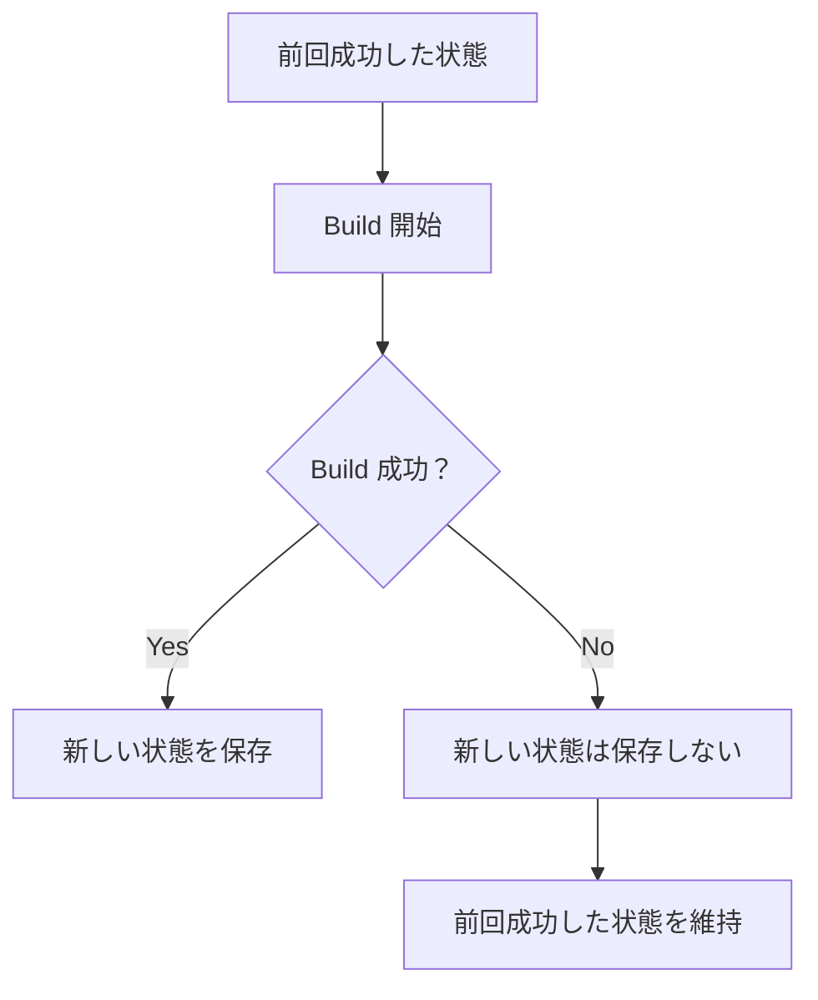
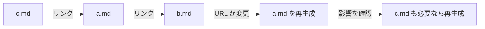

# Build System

Riebeckite の Build System は、Markdown などのコンテンツと設定を読み込み、最終的な Web サイトを生成する仕組みです。

通常の build では、大きく次の処理を行います。

1. 設定とプラグインを読み込む
2. Markdown などのコンテンツを読み込む
3. プラグインによる変換を行う
4. 公開するページやリンクを決定する
5. サイト全体で必要な情報を整理する
6. 画像などのアセットやブラウザ用のコードを生成する
7. HonoX を使って Web サイトを build する

Riebeckite は、前回の build 結果を利用して、変更された部分だけを処理する **incremental build** にも対応しています。

## Build の流れ

build を実行すると、最初に Riebeckite が設定と使用するプラグインを読み込みます。

次に、Content Source から Markdown などのコンテンツを読み込み、設定されたプラグインによる変換を行います。

このとき、Markdown を HTML に変換するだけでなく、次のような情報も決定します。

- どのコンテンツを公開するか
- 各ページをどの URL で公開するか
- ページ同士がどのようにリンクしているか
- どの画像やファイルが必要か
- プラグインが追加するページやファイル

これらの情報をもとに、サイト全体のページ情報やリンク関係、必要なアセットなどを生成します。

最後に HonoX が、それまでに生成された情報を使って Web サイト全体を build します。

## Incremental Build

毎回すべてのコンテンツを最初から処理すると、サイトが大きくなるほど build に時間がかかります。

そこで Riebeckite は、前回の build から何が変更されたかを確認し、必要な部分だけを処理します。

前回の build 情報は、次のファイルに保存されます。

```text
.riebeckite/build/content-state.json
```

この情報は build を高速化するためのものであり、サイトを正しく生成するために必須のものではありません。

たとえば、

- 前回の情報が存在しない
- 現在のバージョンでは利用できない
- 安全に再利用できるか判断できない

といった場合は、無理に再利用せず、必要な処理を最初から行います。

つまり、**高速化のための情報がなくても、同じサイトを正しく生成できること**が前提です。

### Full Build

前回の build 情報を使わず、すべてを処理したい場合は `--full` を使用します。

```sh
pnpm exec riebeckite build --full
```

incremental build の結果に問題がありそうな場合の確認や、build 時間を比較したい場合などに利用できます。

### Build に失敗した場合

前回の build 情報は、**build が正常に完了した場合だけ更新されます**。



新しい build が途中で失敗しても、前回正常に完了した build の情報は残ります。

失敗途中の情報で、正常だった状態を上書きすることはありません。

## 変更をどう検出するか

Riebeckite は、Content Source が提供するファイル情報を使って、コンテンツが変更されたかを判断します。

たとえば、次のような情報を利用できます。

- 更新日時
- ファイルサイズ
- ETag
- ファイル内容から計算した hash

利用できる情報は Content Source によって異なります。

更新日時だけに頼るのではなく、利用可能な情報を組み合わせて、前回の結果を安全に再利用できるか判断します。

## 関連するページが変更された場合

ファイル自体を編集していなくても、そのファイルが参照しているページなどが変更されると、再生成が必要になることがあります。

たとえば `a.md` が `b.md` にリンクしているとします。



`b.md` の URL が変更されると、`a.md` 自体を編集していなくても、`a.md` に書かれているリンクを更新する必要があります。

そのため Riebeckite は、「ファイルが変更されたか」だけでなく、「そのファイルが何を参照しているか」も記録します。

たとえば、次のような関係を確認します。

- リンクしているページ
- 使用している画像やファイル
- ページの生成結果に影響するその他の情報

参照先が変更された場合は、その影響を受けるページも再生成します。

さらに、そのページを参照している別のページにも影響がある場合は、必要な範囲まで再生成します。

### コンテンツの追加・削除

コンテンツの追加や削除は、既存ファイルの編集より広い範囲に影響する場合があります。

たとえば、存在しないページへの Wikiリンクがある状態で、新しくそのページが追加されたとします。

追加前はリンク先を見つけられませんが、追加後は正しいページへリンクできるようになります。

コンテンツの追加や削除によってリンクの解決結果が変わった場合も、影響するページを再生成します。

初回 build や、前回の build 情報が存在しない場合は、すべてのコンテンツを処理します。

## コンテンツ処理のキャッシュ

Riebeckite は、Markdown を HTML に変換した結果を次の場所に保存します。

```text
.riebeckite/cache/content/v3
```

これにより、変更されていない Markdown を毎回最初から処理する必要がなくなります。

初めて build する場合など、利用できるキャッシュがない build を **cold build**、前回の処理結果を再利用できる build を **warm build** と呼びます。

warm build では、変更されていないページの HTML や frontmatter を再利用できます。

ただし、前回の結果を無条件に再利用するわけではありません。

Riebeckite は、たとえば次のような変更がないか確認します。

- Markdown の内容
- frontmatter
- Riebeckite のバージョン
- プラグインの設定や実行順序
- ページが参照しているコンテンツやファイル

変更があった場合や、安全に再利用できるか判断できない場合は、そのページを通常どおり処理し直します。

プラグインについても、処理結果を安全に再利用できることが確認できない場合はキャッシュを使用しません。

### キャッシュに問題がある場合

このキャッシュも build を高速化するためのものであり、サイトの正しさを左右するものではありません。

次のような場合は、キャッシュを使わず通常の処理に戻ります。

- キャッシュが存在しない
- バージョンが合わない
- 保存された情報が壊れている
- 現在のコンテンツや設定と一致しない

キャッシュを完全に作り直したい場合は、次のディレクトリを削除できます。

```text
.riebeckite/cache
```

build log の `Persistent content cache` では、キャッシュがどの程度利用されたか確認できます。

- `hits`: 再利用できた数
- `misses`: 再処理した数
- `bypasses`: 安全性のためキャッシュを使用しなかった数

### GitHub Actions でのキャッシュ

GitHub Actions では、生成されたサイトそのものではなく、次の build 用データをキャッシュします。

```text
.riebeckite/cache
.riebeckite/build/content-state.json
```

`dist/` はキャッシュしません。

また、最終的なページ生成に使用する `.riebeckite/ssg-output-cache.json` は、ファイルを転送する時間に対して得られる効果が小さいため、ローカルでのみ利用します。

Cloudflare 用の workflow については [GitHub Actions](../guides/deployment/github-actions.md) を参照してください。

## 最終ページの再利用

Markdown の処理結果とは別に、Riebeckite は最終的に生成されるページやファイルについても、変更されていないものを再利用できます。

前回の build と比較して変更の影響を受けていないページは、再度生成する代わりに、次のファイルに保存された結果を利用します。

```text
.riebeckite/ssg-output-cache.json
```

たとえば Markdown を 1 ファイルだけ変更した場合、サイト内のすべてのページを生成し直すのではなく、その変更によって影響を受けるページだけを生成できます。

一方、以前は存在していたものの、現在はサイトから削除されたページやファイルは出力から削除されます。

この仕組みについても、安全に再利用できるか判断できない場合はキャッシュを使用せず、すべてのページを生成します。

たとえば次のような場合です。

- 前回の情報が存在しない
- バージョンが合わない
- 保存された情報が壊れている
- アプリケーションや設定が変更された
- どのページに影響する変更なのか判断できない

完全に作り直したい場合は、次のファイルを削除できます。

```text
.riebeckite/build/content-state.json
.riebeckite/ssg-output-cache.json
```

なお、`dist/` はキャッシュではありません。

`dist/` は最終的に生成された Web サイトの出力先です。

この最適化は build の方法を高速化するだけであり、Cloudflare Workers への deploy 方法を変更するものではありません。

## Plugin Cache

Plugin Cache は、プラグイン自身が計算結果を一時的に保存するための仕組みです。

たとえば、build のたびに同じ計算を行う必要がない場合に、その結果を保存して次回の build で再利用できます。

Plugin Cache には次の特徴があります。

- プラグインごとに分けて保存される
- JSON として保存できるデータを扱う
- 削除されても再生成できる
- build を高速化する目的で使用する

Plugin Cache がなくなっても、サイトを正しく build できる必要があります。

また、Plugin Cache や incremental build の情報は build 時にだけ使用するものであり、公開後の Workers が読み書きするデータとしては使用しません。

## `.riebeckite` ディレクトリ

`.riebeckite` には、キャッシュや前回の build 情報など、Riebeckite が build のために使用するデータが保存されます。

これらはユーザーが作成したコンテンツではありません。

そのため、Riebeckite が Markdown などのコンテンツを探すとき、`.riebeckite` ディレクトリは対象外になります。

## Build 関連のコマンド

通常のプロジェクトを build するコマンドは次のとおりです。

```sh
pnpm build
```

Riebeckite の build は次のコマンドです。

```sh
pnpm exec riebeckite build
```

前回の build 情報を使わずに build するには `--full` を付けます。

```sh
pnpm exec riebeckite build --full
```

full build の処理時間を詳しく確認するには、次のコマンドを実行します。

```sh
pnpm exec riebeckite profile --full
```

### Build とその他のコマンドの違い

`check`、`doctor`、`inspect` は、それぞれ build とは異なる役割を持っています。

| コマンド | 主な役割 |
| --- | --- |
| `build` | Web サイトを生成する |
| `build --full` | 前回の build 情報を使わずに Web サイトを生成する |
| `profile` | build の処理時間を調べる |
| `check` | 設定やプラグインの構成を確認する |
| `doctor` | プロジェクトに問題がないか診断する |
| `inspect` | 保存されている build 情報などを確認する |

`check` や `doctor` が成功しても、実際の build が必ず成功することを保証するものではありません。

また、`inspect` はすでに存在する情報を確認するためのコマンドです。build 情報を新しく作るためのコマンドではありません。

詳しいコマンドについては [CLI](../reference/cli.md)、build 情報の確認については [Inspector](inspector.md)、コンテンツの読み込みについては [Content system](content-system.md) を参照してください。

## Build System を変更するときのルール

Build System やプラグインから新しいファイルを生成する場合は、「どの仕組みがそのファイルを管理するのか」を明確にします。

特に、次の点に注意してください。

- どの仕組みが生成したファイルなのか明確にする
- 不要になった古いファイルを適切に削除する
- `check` や `inspect` などの確認用コマンドから、意図せずファイルを書き換えない
- キャッシュには、結果に影響する設定やバージョンの変更を反映する
- 安全に再利用できると確認できないデータは再利用しない
- 再利用できない場合でも、通常の build で正しい結果を生成できるようにする
- build が失敗した場合は、そのことが分かるようにする
- 新しい build が成功するまで、前回成功した情報を残しておく

基本原則は、**build の速さよりも、生成されるサイトの正しさを優先すること**です。

incremental build や各種キャッシュは build を高速化するための仕組みです。

それらをすべて削除したとしても、同じ正しい Web サイトを生成できることが Riebeckite の Build System の前提です。
