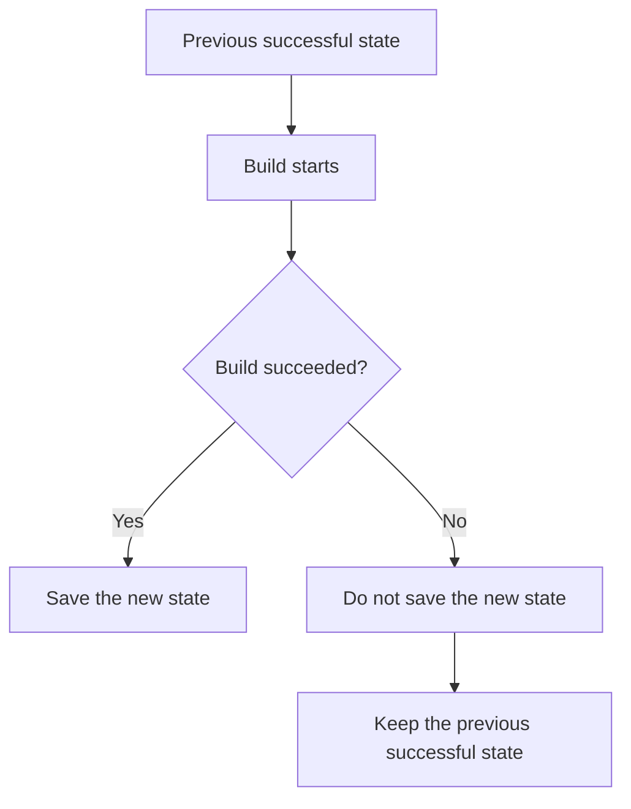
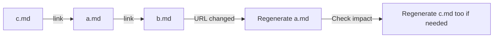

# Build System

Riebeckite's Build System reads content such as Markdown plus the configuration
and generates the final web site.

A normal build roughly performs the following work:

1. Resolve the configuration and plugins
2. Read content such as Markdown
3. Run plugin transformations
4. Decide which pages and links are published
5. Collect the information the whole site needs
6. Emit assets such as images and browser-side code
7. Build the web site with HonoX

Riebeckite also supports an **incremental build** that reuses the previous
build result and processes only what changed.

## What a build owns

An explicit build resolves configuration and plugins, reads content, runs content and plugin pipelines, creates the manifest and content graph, emits registered assets and client entries, and records successful incremental state. The HonoX integration then builds the application with the generated entries.

Build state is application-scoped at `.riebeckite/build/content-state.json`. It is an optimization, not a source of truth. A missing, incompatible, or unsafe state causes an initial/full path; `--full` requests that path explicitly. State is saved only after a successful build, so a failure retains the prior valid state.

## The build flow

When a build runs, Riebeckite first resolves the configuration and the plugins
it will use.

It then reads content such as Markdown from the ContentSource and runs the
configured plugin transformations.

At this point it decides not only how to convert Markdown to HTML but also:

- which content is published
- which URL each page is published at
- how pages link to each other
- which images and files are required
- which pages and files the plugins add

From this information it generates the site-wide page information, the link
relationships, and the required assets.

Finally HonoX uses the generated information to build the whole web site.

## Incremental build

Processing every piece of content from scratch on every run makes builds slower
as the site grows.

Riebeckite therefore checks what changed since the previous build and processes
only what is needed.

The previous build information is stored in:

```text
.riebeckite/build/content-state.json
```

This information exists to speed up the build; it is not required to generate
the site correctly.

For example, when:

- the previous information does not exist
- it cannot be used with the current version
- it cannot be determined to be safe to reuse

Riebeckite does not force reuse and runs the necessary work from the beginning.

In other words, the premise is that **the same site can be generated correctly
even without the speed-up information**.

### Full build

Use `--full` to process everything without using the previous build
information.

```sh
pnpm exec riebeckite build --full
```

This is useful for checking when an incremental build result looks suspicious,
or for comparing build times.

### When a build fails

The previous build information is **updated only when the build completes
successfully**.



Even if a new build fails partway through, the information from the previous
successful build remains. A partial failure never overwrites a valid state.

## When related pages change

Even if a file is not edited itself, it may need to be regenerated when a page
it references changes.

For example, suppose `a.md` links to `b.md`:



If the URL of `b.md` changes, the link written in `a.md` must be updated even
though `a.md` itself was not edited.

Riebeckite therefore records not only "was the file changed" but also "what
does the file reference". For example, it tracks:

- linked pages
- images and files in use
- other information that affects a page's generated output

When a referenced target changes, the affected pages are regenerated. If those
pages are referenced by yet other pages, the affected range is regenerated as
needed.

### Adding and removing content

Adding or removing content can have a wider effect than editing an existing
file.

For example, suppose a WikiLink points to a page that does not exist yet, and
that page is then added. Before it is added the link cannot resolve; after it is
added the link resolves to the correct page.

When adding or removing content changes how links resolve, the affected pages
are regenerated as well.

On the first build, or when no previous build information exists, all content is
processed.

## Incremental inputs

`ContentSource` metadata may contain mtime, size, ETag, or a hash. Treat mtime as a hint only: timestamp-only comparisons are not sufficient for correctness when metadata can be unreliable. Plugin cache is separate from build state, plugin-scoped, JSON-serializable, regenerable build-time data. Neither may be required at Workers request time.

State tracks each entry's fingerprint together with its dependencies: the notes it links to (whose resolved permalink it may embed) and the assets it references (whose metadata, such as attachment size, it may render). A changed dependency invalidates the dependent entry and, transitively, its dependents. Added or removed entries change which link targets resolve, so entries that reference an affected target are invalidated as well. On the first build, or when no previous state is available, every note is processed. The `.riebeckite` state directory is build-time state, not content, and is never scanned.

## Persistent per-content cache

The processed Markdown result for each note is stored in `.riebeckite/cache/content/v3`. A build without an entry is a **cold build**. Restoring compatible entries before a later build makes it a **warm build**: unchanged notes can reuse their processed HTML and frontmatter while the normal build still generates `dist/`.

An entry key includes its Markdown source, parsed frontmatter, the cache schema, and the processing-pipeline fingerprint. The fingerprint includes content-filter configuration, plugin configuration and order, plugin `cacheVersion` and processed-content cache contracts, and the Core compatibility version. Cached content also records logical content, file, and link dependencies; changed or missing dependencies are misses. Unsafe plugins bypass this cache. Cache data contains logical slugs and normalized source paths rather than workspace paths, so it can be copied to a different runner or workspace on the same operating system.

This cache is an optimization, never a correctness dependency. Missing entries, incompatible versions, malformed metadata, fingerprint or dependency mismatches, and corrupted JSON are safe misses. Delete `.riebeckite/cache` to force cold processing; a filesystem access failure still fails the build because it requires attention. The build log reports one `Persistent content cache` line with `hits`, `misses`, and `bypasses`, plus a concise `Content` line (total, processed, and reused counts) and the total `Build complete` duration.

### When the cache has problems

This cache also exists to speed up the build; it does not determine whether the
site is correct.

In the following cases Riebeckite falls back to normal processing without using
the cache:

- the cache does not exist
- the version does not match
- the stored information is corrupted
- it does not match the current content or configuration

To rebuild the cache completely, delete:

```text
.riebeckite/cache
```

The `Persistent content cache` line in the build log shows how much the cache
was used:

- `hits`: reused
- `misses`: reprocessed
- `bypasses`: not used because it was not safe to do so

### Caching in GitHub Actions

For GitHub Actions, cache `.riebeckite/cache` and `.riebeckite/build/content-state.json`, not `dist/`. The output cache (`.riebeckite/ssg-output-cache.json`) stays local because its build-time saving does not offset the transfer cost. The generated Cloudflare workflow does this automatically; see [GitHub Actions](../guides/deployment/github-actions.md).

## Output-level incremental SSG

Persistent per-content cache reuses Markdown and plugin processing. Output-level incremental SSG separately reuses final routes and generated files. After building the current manifest, Core compares its output descriptors with the previous successful state. HonoX renders only affected content and plugin-page routes, restores unchanged generated output from `.riebeckite/ssg-output-cache.json`, and removes outputs no longer owned by the site. The build log reports an `SSG outputs` line with the `rendered`, `reused`, and `removed` counts. For example, when only one Markdown file changes, Riebeckite generates only the pages affected by that change instead of regenerating every page in the site.

The state and output cache are optimizations. A missing, incompatible, malformed, or incomplete output state, an application/configuration fingerprint change, or an `unknown` output dependency makes HonoX render every output. Delete `.riebeckite/build/content-state.json` and `.riebeckite/ssg-output-cache.json` to force that safe path. `dist/` is not a cache: Vite may recreate it, and unchanged site outputs are re-emitted from the output cache. This is a build optimization only; it does not change Wrangler's Cloudflare Workers deployment protocol.

## Plugin cache

Plugin cache is a mechanism for a plugin itself to store intermediate results
temporarily.

For example, when the same computation does not need to run on every build, a
plugin can store the result and reuse it on the next build.

Plugin cache has the following characteristics:

- stored separately per plugin
- handles data that can be stored as JSON
- can be regenerated after deletion
- used to speed up the build

A site must still build correctly even without the plugin cache.

Plugin cache and incremental build information are used only at build time; they
are not data that Workers read and write after publication.

## The `.riebeckite` directory

`.riebeckite` stores the data Riebeckite uses for builds, such as caches and the
previous build information.

This is not content created by the user. Riebeckite therefore does not scan the
`.riebeckite` directory when it looks for content such as Markdown.

## Commands and lifecycle

```sh
pnpm build                 # configured project build
pnpm exec riebeckite build # content/application build
pnpm exec riebeckite build --full
pnpm exec riebeckite profile --full
```

Use `check` for validation and `doctor` for health diagnostics; neither substitutes for a build. Use `inspect` to view existing state, never to manufacture it. See [CLI](../reference/cli.md), [Inspector](./inspector.md), and [Content system](./content-system.md).

### Build vs. other commands

`check`, `doctor`, and `inspect` each have a role distinct from `build`.

| Command | Main role |
| --- | --- |
| `build` | Generate the web site |
| `build --full` | Generate the web site without the previous build information |
| `profile` | Measure build processing time |
| `check` | Validate the configuration and plugin composition |
| `doctor` | Diagnose whether the project has problems |
| `inspect` | View stored build information |

A successful `check` or `doctor` does not guarantee that an actual build will
succeed.

Also, `inspect` is a command for viewing information that already exists. It is
not a command for creating new build information.

## Safe changes

When adding generated output, make its owner and cleanup behavior explicit. Do not silently write during validation or inspection. Cache keys must include every relevant version/input; raise a full-build fallback rather than reusing uncertain output. Keep failures observable and avoid deleting a previous successful state before replacement is known to be valid.

When the Build System or a plugin generates a new file, make explicit which
mechanism owns that file. In particular:

- make clear which mechanism generated the file
- remove old files that are no longer needed
- do not let validation commands such as `check` or `inspect` write files
  unintentionally
- reflect settings and version changes that affect the result in the cache
- do not reuse data that cannot be confirmed as safe to reuse
- still generate the correct result through a normal build even when reuse is
  not possible
- make a build failure observable
- keep the previous successful information until a new build succeeds

The basic principle is to **prioritize the correctness of the generated site
over build speed**.

Incremental build and the various caches exist to speed up the build. The
premise of Riebeckite's Build System is that the same correct web site can be
generated even if all of them are deleted.
