# Content System

The Content System turns files such as Markdown and images into content that
Riebeckite can treat as a site. It does more than convert Markdown to HTML. It
answers questions such as:

- What article is this file?
- May it be published?
- At which URL is it published?
- How does it relate to other articles?
- What did plugins add or change?

It resolves these questions and makes the same information available across the
whole site.

## Overview

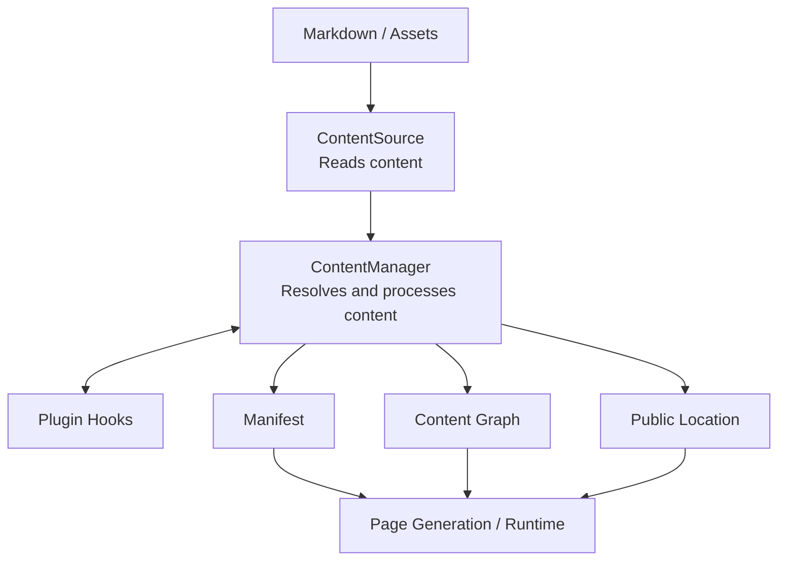

`ContentSource` and `ContentManager` are the center of the system. In short:

```text
ContentSource
  = where content is read from

ContentManager
  = how the loaded content is handled
```

## Two explicit responsibilities

`ContentSource` is the boundary for finding and reading source data. It owns scanning, reading, identity, and source metadata such as mtime, size, ETag, or hashes. `FileSystemContentSource` is the normal local implementation.

Content does not have to live inside the site repository. Riebeckite can read
from a site repository, an external repository, or an Obsidian vault, and all of
them reach `ContentManager` through the same `ContentSource` interface.

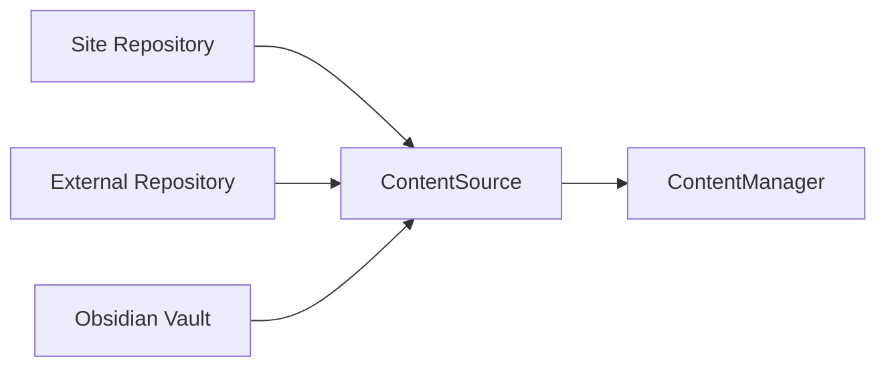

Because the storage location is abstracted this way, later processing stays the
same even if content moves.

`ContentManager` owns the meaning of that data: parsing, Markdown/HTML pipeline execution, post processing, plugin orchestration, manifest creation, and content-graph construction. It should not grow direct filesystem behavior that bypasses `ContentSource`.

### Three kinds of "location"

When working with the Content System, keep three things distinct:

| Kind | Meaning |
| --- | --- |
| Filesystem path | Where the file actually lives |
| Logical path | The content identifier relative to the content root |
| Public location | The URL on the web site |

A file such as `C:\projects\garden\content\posts\hello.md` is handled internally
as the logical path `posts/hello.md`, and its public location might be
`/blog/hello/`.

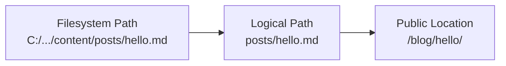

Separating these three lets a content repository move to another repository
while the site keeps the same URL and content-processing rules.

## ContentManager

`ContentManager` manages the content it receives from `ContentSource` and turns
it into a state the site can use. Its main responsibilities are:

- Read Markdown frontmatter and body
- Decide whether content is published
- Organize slug, permalink, and content ID
- Run plugin hooks
- Resolve public locations
- Generate the manifest
- Generate the content graph
- Prepare query indexes

In other words, `ContentManager` is the orchestrator at the center of the
Content System.

### Plugins join processing

Plugins can hook into the `ContentManager` lifecycle. Representative hooks
include:

```text
onContentLoaded
onPostParsed
onPostProcessed
onManifestCreated
```

Conceptually the flow is:

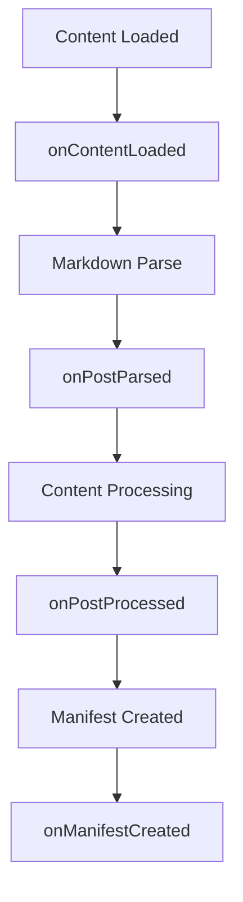

Plugins use this lifecycle to extend content.

## Processing model

```text
scan/read source
  -> resolve public locations        (default resolver + plugin hooks)
  -> parse post -> process post -> create manifest -> graph
                        |
                        `--- plugin lifecycle/content hooks ---'
```

Public locations are resolved before any content that needs a URL is processed, so a consumer never has to invent one. Plugin hooks observe or extend defined phases such as configuration resolution, content loaded, parsed/processed posts, manifest creation, and build start/end. Keep source I/O, semantic interpretation, and rendering distinct so a remote source can replace the filesystem source without changing Core policy.

## Public location and URLs

A content entry separates three notions of identity:

- **slug** — the internal lookup key used by `contentIndex`, the manifest `bySlug` map, the content graph, and application-level selection keys such as `/explore?note=<slug>`.
- **permalink** — the resolved canonical public URL used in article links, feeds, sitemaps, and metadata.
- **content ID** — an optional, source-authored stable identity exposed as `ContentManifestEntry.contentId` and indexed by `ContentManifest.byContentId`. It is independent of both the slug and all public locations.

| Name | What it represents | Example |
| --- | --- | --- |
| `slug` | A short name for the content | `hello-world` |
| `permalink` | The public URL on the site | `/blog/hello-world/` |
| content ID | A stable identifier for the content itself | `article-01` |

In particular, **a slug and a public URL are not the same thing**. Each has a
different purpose:

```text
slug
  hello-world

permalink
  /blog/hello-world/

content ID
  019abc...
```

They are distinct. A consumer that needs a public URL reads `ContentManifestEntry.permalink` (also available as `entry.publicLocation`); it must not build a URL from a slug or filesystem path. Turning a slug into a URL is the Core default resolver's job alone.

### Default public location

By default, `resolveDefaultContentLocation` resolves public locations:

```text
index
  ↓
/

everything else
  ↓
/{slug}
```

This is the default resolver, not a compatibility fallback. Plugins can add or
change public locations through the `resolveContentLocations` hook.

Resolution is a single, stateless pipeline:

1. Core seeds every entry with the official default resolver, `resolveDefaultContentLocation(content)`, where `content` is a `ContentLocationInput` (`slug`, `path`, `markdown`). The default policy is `index` -> `/` and every other entry -> `/{slug}`. This is the Core default public-location policy, not a compatibility fallback.
2. Each enabled plugin may replace locations through the optional `resolveContentLocations` hook, which receives the `ContentLocationInput` list and returns `ContentPublicLocation` values. Plugin-specific URL strategies stay inside the plugin.
3. `ContentManager.getContentLocations()` returns the resolved `ReadonlyMap<string, ContentPublicLocation>`. A `ContentPublicLocation` carries the canonical `permalink`, optional `redirects`, and optional opaque `metadata` that Core does not interpret.

The manifest stores the resolved result: `ContentManifestEntry.permalink` and `.publicLocation`, plus the `byPermalink` index and the `redirects` map. The content graph and `readOnlyContentGraph(source, locations)` consume those resolved entries rather than deriving URLs. If a public location is not resolved for an entry, Core raises an explicit error instead of falling back to a slug-derived URL.

### ContentPublicLocation

`ContentPublicLocation` represents **where content is published on the site**.
Normally one article has one canonical public location:

```text
Article
   ↓
/blog/article/
```

A plugin may add an alias URL or a redirect:

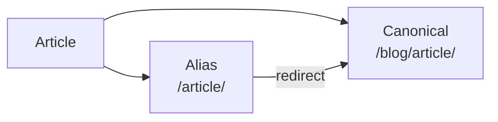

Public locations are not used only for page generation. They are also referenced
by:

- In-site links
- Redirects
- Sitemaps
- Search indexes
- The language switcher
- The content graph

Riebeckite therefore manages URLs explicitly as `ContentPublicLocation` rather
than letting each feature compute its own URL string.

### Stable content IDs

Set the standard `id` frontmatter field when content needs an identity that
survives a rename, permalink change, alias, or redirect. IDs are optional, so
existing content without `id` has no generated substitute and keeps its current
behavior. Core never uses a slug, path, permalink, alias, or redirect as a
stable ID.

```yaml
---
id: note-7f4e9b
---
```

Values must be non-empty, trimmed strings, and each explicit ID must be unique
within a manifest; invalid or duplicate IDs fail the manifest build rather than
silently selecting an identity.

## Manifest, graph, and runtime

The manifest is the generated content representation used by the application. The content graph represents relationships and can be extended through the plugin graph contract. Reading a runtime manifest is not an explicit build. Incremental build state belongs only to the explicit build path and is never a mutable Worker runtime dependency.

The manifest is the list of content finalized at build time. Each entry carries,
for example, its logical path, metadata, public location, plugin results, and the
information incremental build needs.

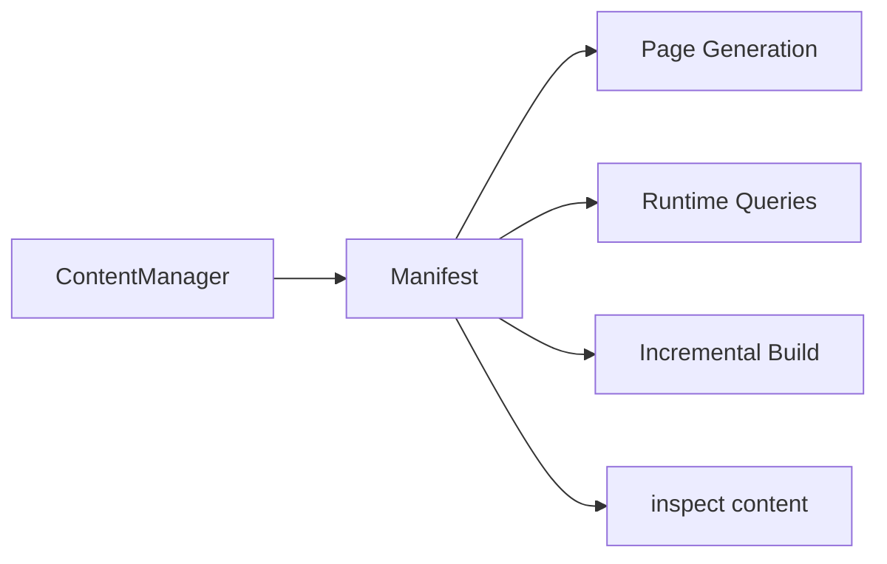

The manifest is the boundary that passes the Content System's resolved result to
other parts of the system. Consumers read the resolved manifest instead of
re-reading Markdown and recomputing the same information.

### Content graph

The content graph represents relationships between content. A WikiLink such as

```markdown
[[Article B]]
```

creates the relationship:

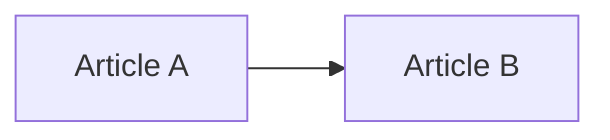

The graph also supports backlinks:

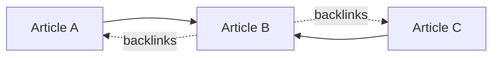

The content graph is not only for graph displays. It is the basis for features
such as:

- WikiLinks
- Markdown links
- Backlinks
- Taxonomy
- Series
- Related posts
- Local graph
- Garden explorer

Plugins can add information to the graph through `extendContentGraph`.

## Content queries

Core exposes a portable query layer over resolved manifest entries:

- `queryContentEntries(entries, spec)` filters by tags, folder, frontmatter, and date range, applies one or more sort keys, and slices the result with `limit`/`offset`.
- `queryContentPage(entries, spec)` applies the same selection and returns the page slice together with `page` metadata (`page`, `pageCount`, `hasPrevious`, `hasNext`); `resolveContentQueryPagination(total, spec)` computes that metadata alone.
- `groupContentEntries(entries, groupBy, options)` runs the same selection and groups the result by tags, folder, date granularity (`year`/`month`/`day`), or a frontmatter field.

Both functions operate on `ContentManifestEntry` values, so links use the resolved `permalink`; a query never builds a public content URL from a slug. Applications and plugins compose these functions to build listing pages and taxonomy views, while Core keeps ownership of manifest and graph construction rather than routing.

The representative APIs are `queryContentEntries`, `queryContentPage`, and
`groupContentEntries`. These are **not APIs that search files**. A query runs
against the index already resolved at build time:

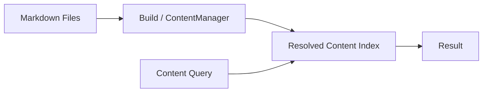

At runtime, plugins and applications should not re-read Markdown and rebuild
their own state.

## Content collections

`buildContentCollections(entries, definitions)` turns the same query selection into listing collections. A definition declares a `kind`, a `groupBy` (tags, folder, date, or a frontmatter field), a site-local `basePath`, optional `filter`/`sort`/`order` values, and optional `resolveTitle`/`resolvePath` builders. Every generated `ContentCollection` carries the group `value`, the resolved `path`, a `title`, and its `entries` in query order.

This is the shared mechanism behind taxonomy, folder, and archive listings. A `tag` definition groups by `tags` under `/tags`; an `archive` definition groups by date under `/archive`; both are produced by the same call. Routing stays in the application, while the collection contract and the query engine stay in Core. Listing entries still link through `ContentManifestEntry.permalink` and never construct a URL from a slug.

It can, for example, take all articles, sort them by date, classify them by tag,
and split them into pages.

A definition may set `pageSize` to split a collection across pages. Each page is emitted as its own `ContentCollection` whose `path` is the collection path plus `/page/<n>` for later pages, and its `page` metadata carries `current`, `count`, `size`, `total`, `previousPath`, and `nextPath` for building navigation.

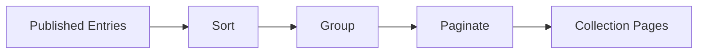

Plugins and site applications use this mechanism to build article lists, tag
lists, and similar views.

## Assets

Images and attachments are handled as entries separate from the Markdown body.
For example, with:

```text
content/
├─ article.md
└─ images/
   └─ example.png
```

Riebeckite maps the asset to a URL that can be used on the site while preserving
its logical path:

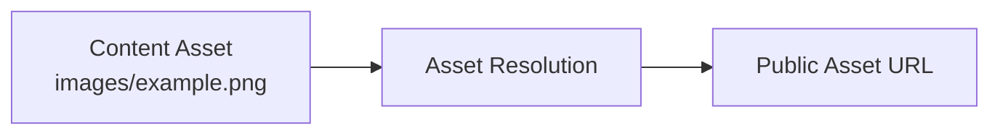

The exact URL form can depend on plugins and configuration. What matters is that
arbitrary files outside the content root are not turned into public URLs. The
Content System's publication boundary decides what is safe to publish.

## Separating the content repository

Placing the site and the content in different repositories does not change the
basic Content System flow:

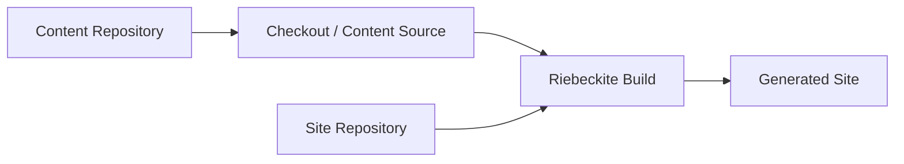

The content repository provides content. The site repository's build decides
what is published, which plugins are used, at which URLs content is published,
and which site is generated. Because of this, `ContentManager` and plugins do not
need to special-case the filesystem layout even when the content repository is
separate.

## Correctness rules

- Preserve canonical content identity across source, manifest, and graph.
- Treat slug and permalink as separate concepts: obtain public URLs only from the resolved `ContentPublicLocation`.
- Treat source metadata as change evidence, not universally reliable truth.
- Make publication/exclusion policy visible in configuration.
- Return diagnostics for recoverable user-facing problems; do not silently omit content.
- Keep graph extensions deterministic for identical inputs.

When changing the Content System, keep the following principles:

| Principle | Reason |
| --- | --- |
| Resolve `content.directory` against `appRoot` | Gives each site a stable base |
| Plugins do not depend on filesystem paths | Keeps the content source exchangeable |
| Publication follows `publishStrategy` and frontmatter | Centralizes the publication boundary |
| Register public locations as `ContentPublicLocation` | Prevents each feature from computing its own URL |
| Runtime uses the build-time index | Separates runtime from the source filesystem |
| The site build decides the final published state | Separates the content repository from the site |

Overall, keep this boundary intact:

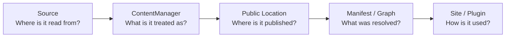

**Source is how content is read, ContentManager is how content is resolved,
Public Location is where it is published, and Manifest / Graph are the resolved
result.** Features should not re-read the filesystem or Markdown on their own;
sharing the same resolved result through the Content System is the basis of
Riebeckite's content architecture.

See [Configuration](../reference/configuration.md), [Build system](./build-system.md), and [Plugin system](./plugin-system.md).
