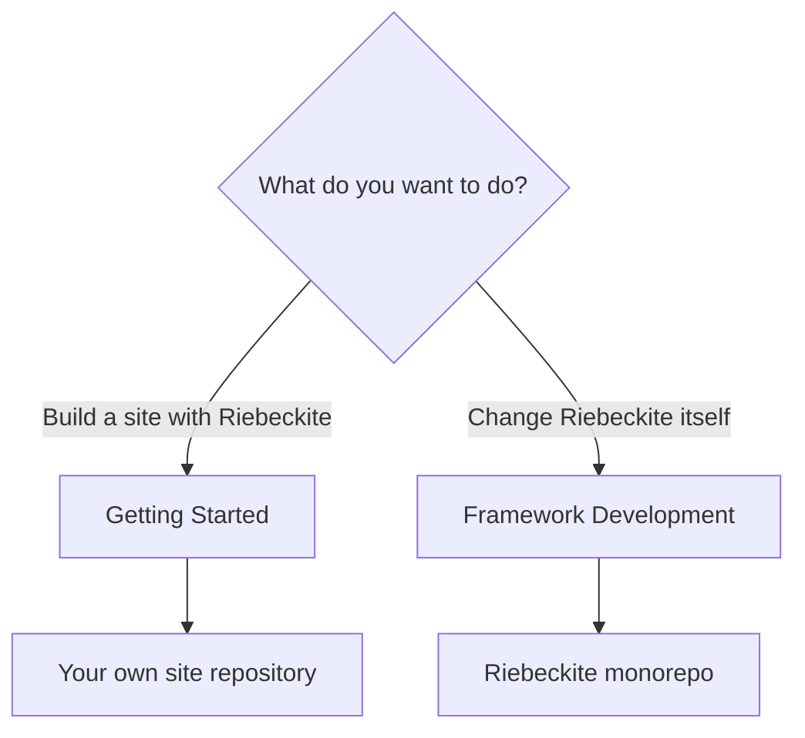
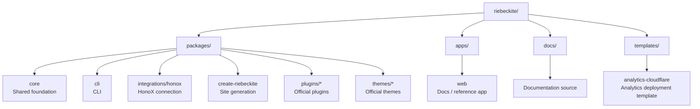
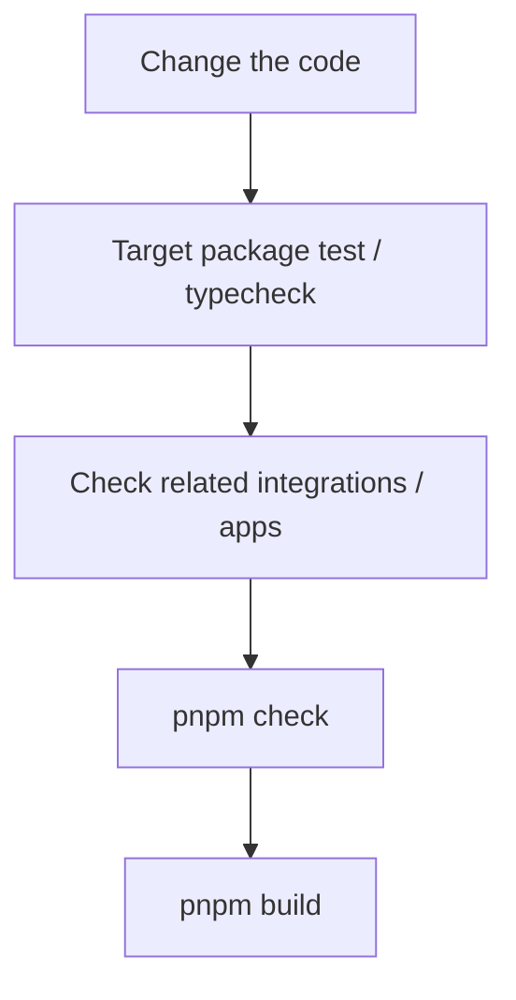
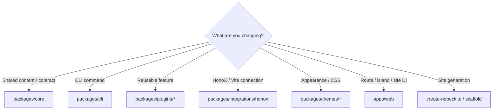
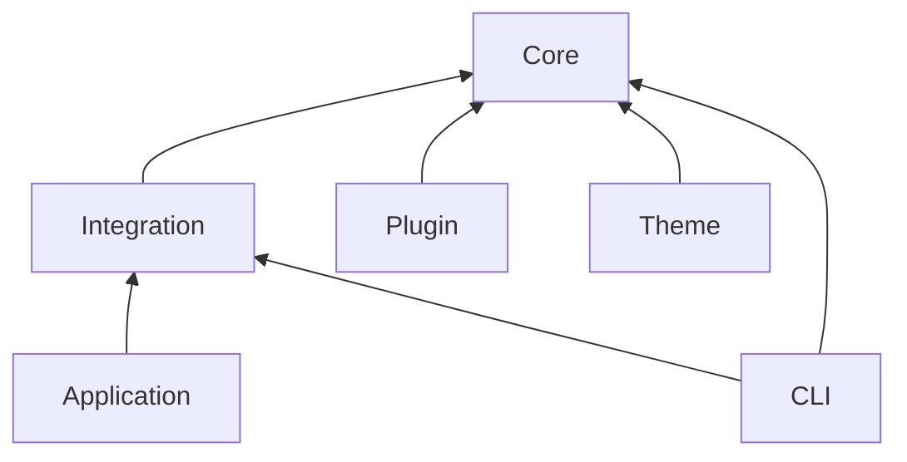
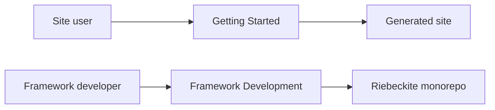

# Framework Development

This page is for people developing Riebeckite itself: core, CLI, HonoX integration, official plugins, official themes, templates, or the reference app. It is intentionally separate from [Getting Started](../getting-started/README.md). Users who only want to publish a site should use `create-riebeckite` instead of cloning this monorepo.

Use this monorepo when you are changing things such as:

- Core features
- The CLI
- The HonoX integration
- Official plugins and themes
- The site scaffold and templates
- The official documentation or the reference application

If you only want to build your own site with Riebeckite, **you do not need to clone this repository.** Start from [Getting Started](../getting-started/README.md) instead.



## Getting started

To develop Riebeckite itself, clone the repository and install the dependencies:

```bash
git clone https://github.com/rerurate/riebeckite.git
cd riebeckite
pnpm install
pnpm build
```

You can now develop the packages in the workspace.

### Start the development server

```bash
pnpm dev
```

The reference app in `apps/web` lets you see Riebeckite changes as a real site.

`apps/web` is not just a demo: it is also the reference application used during framework development to confirm that Core, plugins, themes, and the integration combine correctly.

## Repository layout

Riebeckite is a monorepo built on the pnpm workspace.

The top level is split roughly like this:



| Path | Purpose |
| --- | --- |
| `packages/core` | public config, content, pipeline, plugin, theme, diagnostics, observability APIs |
| `packages/cli` | `riebeckite` command |
| `packages/integrations/honox` | HonoX integration and scaffold generator |
| `packages/create-riebeckite` | public site scaffolding entrypoint |
| `packages/plugins/*` | official plugins |
| `packages/themes/*` | official themes |
| `apps/web` | official documentation app and framework-development reference application |
| `docs/` | documentation source read by the official docs app |
| `templates/analytics-cloudflare` | Analytics Worker deployment templates |

For the detailed responsibilities of each package, see [Architecture](./architecture.md).

## Common commands

The commands you use most often during framework development are:

| Command | Purpose |
| --- | --- |
| `pnpm dev` | Start the development site. |
| `pnpm build` | Build the workspace. |
| `pnpm check` | Check the whole repository. |
| `pnpm test` | Run the tests. |
| `pnpm typecheck` | Check TypeScript types. |
| `pnpm check:docs` | Check the documentation. |
| `pnpm check:scaffold` | Check the generated sites. |

Use targeted commands when possible:

- `pnpm check:docs` validates Markdown links and docs structure.
- `pnpm check:scaffold` validates generated scaffold output.
- `pnpm typecheck` checks packages.
- `pnpm --filter <package> test` runs a package test when available.

### When you change the documentation

```bash
pnpm check:docs
```

This validates Markdown links and the documentation structure. Run it whenever you add, move, or delete documentation.

### When you change the scaffold

```bash
pnpm check:scaffold
```

This validates that the generated Riebeckite site has the correct structure. It matters when you change things such as:

- the scaffold generator
- a preset
- a template
- the generated `package.json`
- the initial site structure

### Check package types

```bash
pnpm typecheck
```

This reports TypeScript type errors.

### Test a specific package

When you only want to check the package you changed, you can use `--filter`:

```bash
pnpm --filter <package> test
```

For example, if you only changed one plugin, you can start from that package's tests instead of running the entire repository test suite.

## Basic change flow

The checks you need depend on the change, but the basic approach is to **verify a small scope first and widen it at the end**.



For example, if you change a plugin, run that plugin's tests first:

```bash
pnpm --filter <plugin-package> test
```

If that passes, run type checking or check the reference app as needed, and finally run the repository-wide checks. You do not need to run the heaviest command from scratch on every change.

## Where to make the change

When adding a feature, first pick the package that matches the responsibility.



If you are unsure, use the responsibility boundaries in [Architecture](./architecture.md) as the standard.

## Package boundaries

When changing the framework, keep the dependency direction between packages intact. The rough dependency relationship is:



In particular, do not create a reverse dependency from Core to the outside. For example, Core must not depend on concrete implementations such as:

```text
apps/web
packages/plugins/*
HonoX
Vite
```

Put framework-independent contracts in Core, and have integrations and plugins use those contracts.

## Use the public API

APIs that external plugins and themes can also use should be referenced through public exports. Use a public entrypoint such as:

```ts
import { ... } from "@riebeckite/core";
```

Avoid depending directly on package internals like this:

```ts
import { ... } from "@riebeckite/core/src/...";
```

`src/**` is an internal implementation and is not a stable public API. Implementing official plugins and themes as consumers of the public API wherever possible confirms that the contract is actually usable from external packages.

## Treat scaffolds as standalone sites

A scaffold must not be structured to work only inside the Riebeckite monorepo. A generated site has to work without depending on the monorepo's internal sources:

```text
create-riebeckite
       ↓
Generated Site
       ↓
npm packages
       ↓
build
```

So when you change the scaffold, confirm not only that it works inside the workspace but also that it stands up as an external site. `check:scaffold` and the external-site E2E tests exist to verify this boundary.

## Documentation boundaries

General-user documentation does not assume that you cloned the Riebeckite monorepo or set up the workspace.



This is because people who build a site and people who develop the framework need different environments. Monorepo-specific commands, the internal package structure, and how to build the framework are covered in this Framework Development section.

## Boundaries to maintain

Framework changes should especially preserve the following:

- Do not create a reverse dependency from Core to the application, plugin internals, or framework-specific implementations.
- Keep a public API that lets external plugins and themes be implemented without importing `src/**`.
- Do not require monorepo setup in general-user documentation.
- Keep scaffolds working as sites that are independent of the monorepo.
- Verify from the changed scope and widen to the whole repository as needed.

See [Architecture](./architecture.md), [Testing](./testing.md), [CLI](../reference/cli.md), and [HonoX Integration](./honox-integration.md).
