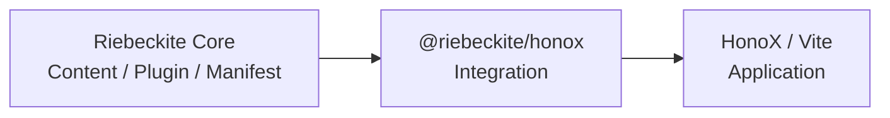
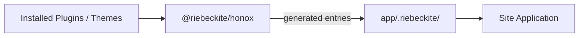
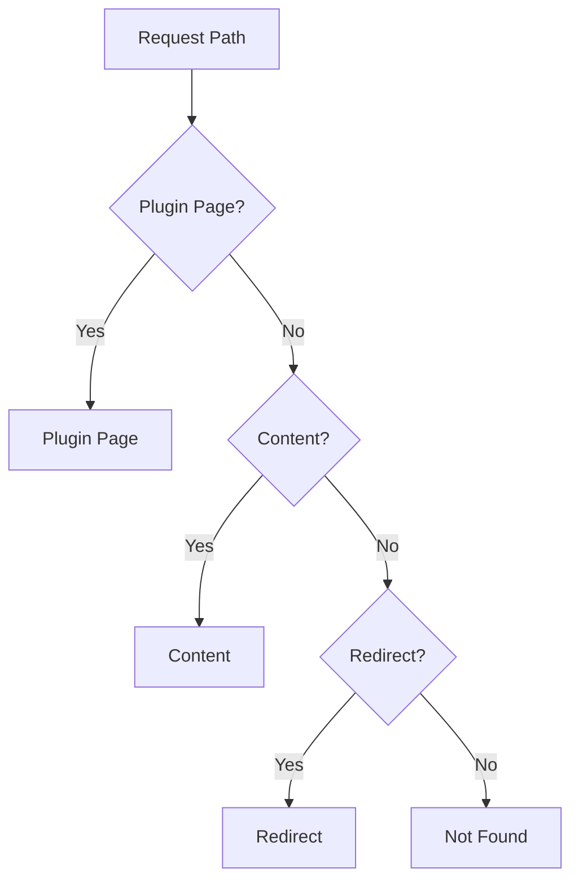
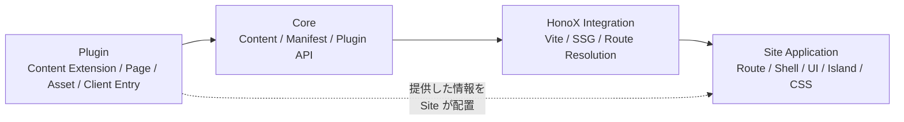

# HonoX Integration

`@riebeckite/honox` は、Riebeckite Core と HonoX / Vite を接続する integration です。

Core はコンテンツやプラグインの処理を担当しますが、HonoX の route や Vite の build 方法については知りません。

その間を接続するのが `@riebeckite/honox` です。



主に次の処理を担当します。

- application root / config の解決
- Vite の development / build
- SSG の設定
- plugin / theme の style entry 生成
- client entry の生成
- Riebeckite のコンテンツと HonoX application の接続

これにより、通常の Site は Riebeckite 内部の Vite / HonoX 設定を毎回組み立てる必要がありません。


## このページの構成

- [UI Primitive](./honox-integration/ui.ja.md)
- [Site Application の責務](./honox-integration/site.ja.md)

## 基本的な使い方

通常は `vite.config.ts` で `riebeckiteVite()` を登録します。

```ts
import { riebeckiteVite } from "@riebeckite/honox";
import { defineConfig } from "vite";

export default defineConfig({
  plugins: [honox({ ... }), ...riebeckiteVite(), build()],
});
```

`riebeckiteVite()` は通常の Site 向けの higher-level helper です。

Riebeckite の Vite plugin を追加するだけでなく、次の設定もまとめて行います。

- SSG entry の設定
- extension mapping
- SSR に必要な external dependency の設定
- plugin / theme の生成 entry の接続

HonoX plugin、deployment 用 build plugin、Tailwind など、Site 自身が必要とする Vite plugin と組み合わせて利用できます。

## Root と Config

`riebeckiteVite()` では、必要に応じて次の場所を指定できます。

| Option | 意味 |
| --- | --- |
| `appRoot` | Site application の基準ディレクトリ |
| `configRoot` | Riebeckite config を探す基準 |
| `configFile` | 使用する config file |
| `workspaceRoot` | monorepo 開発時の workspace root |

通常は指定する必要はありません。

`appRoot` の既定値は Vite root、`configRoot` の既定値は `appRoot` です。

Riebeckite config は `configRoot` を基準に読み込みます。

一方、

```ts
content: {
  directory: "./content",
}
```

のような content directory は `appRoot` を基準に解決します。

`resolveHonoxApplication()` は、これらの root と解決済み config をまとめて返します。

CLI と Vite がこの共通モデルを利用することで、それぞれが異なる方法で application を解決しないようにしています。

### `workspaceRoot`

`workspaceRoot` は、Riebeckite 自体を monorepo で開発するときに source package alias を利用するための設定です。

npm から Riebeckite をインストールした通常の Site では必要ありません。

その場合は Site 自身の `node_modules` から package が解決されます。

## `.riebeckite` に生成されるファイル

Integration は application 内の

```text
app/.riebeckite/
```

へ、plugin や theme を接続するためのファイルを生成します。

たとえば plugin style や theme style です。client module は `.riebeckite` には生成されず、virtual module として提供されます。



`.riebeckite` は integration が管理する生成物です。

**Site の source code として直接編集しないでください。**

## Lower-level API

より細かく integration を制御したい場合は、lower-level API も利用できます。

- `riebeckite`
- `riebeckiteSsg`
- `riebeckiteSsgExtensionMap`
- `createRiebeckiteSsg`

通常の Site では `riebeckiteVite()` を利用し、独自の build integration が必要な場合のみ lower-level API を利用してください。

## Routing と SSG

HonoX の runtime routing と静的生成では、同じ URL が同じページとして扱われる必要があります。

特に catch-all route がある場合、SSG の route 列挙に注意が必要です。

Riebeckite はこのために2つの helper を提供します。

### `contentRouteSsgParams`

```ts
contentRouteSsgParams(routePath, params)
```

`hono/ssg` の `ssgParams` の代わりとして使用します。

この helper は、その route 自身に属する params だけを返します。

たとえば、

```text
/:slug{.+}
```

という catch-all route があっても、

```text
/tags/:slug{.+}
```

に属するページまで横取りしません。

### `ssgEnumerableHandler`

```ts
ssgEnumerableHandler(handler)
```

`next()` を使って sibling route に処理を渡す handler を、SSG の列挙対象として残すための helper です。

Hono は middleware 形式の handler を通常 SSG の列挙対象から外すため、この差を補います。

## Plugin Page

Plugin は通常の content とは別に、独自のページを提供できます。

その場合は、

```ts
resolveContentRoute(manifest, path)
```

ではなく、

```ts
resolveRiebeckiteRoute(content, path)
```

を使用します。

SSG params には、

```ts
pluginPageSsgParams(content)
```

を追加します。

生成された Site の catch-all route は、これらをまとめた `resolveRiebeckiteContentRequest(c, content)` を使用します。この helper が content / Plugin Page / redirect / not-found を解決し、`htmlLanguage` と `headTags` を context へ設定するため、Site は返された結果を自身の composition に渡すだけで済みます。root `/` も同じ mechanics を共有する `resolveRiebeckiteHomeRequest(c, content)` で解決します。

Route resolver は次の順序で URL を解決します。



Plugin Page の body は意図的に文字列として扱います。

Site が持つ既存の document frame 内へ描画し、`page.headTags` も Site の frame へ渡します。

この仕組みにより、Plugin が独自ページを提供するためだけに HonoX の route file を追加する必要はありません。

## Integration の境界

Riebeckite の routing では、すでに解決された公開 URL を使用します。

基本的には、

```text
byPermalink
    ↓
redirects
```

の順で request を解決します。

filesystem path やディレクトリ構造から公開 URL を逆算しません。

また、`slug` はコンテンツを内部で検索するためのキーです。

実際に公開される URL は、解決済みの `permalink` です。

### 責務のまとめ

Riebeckite 全体では、次のように責務を分離します。



HonoX / Vite / Cloudflare 固有の処理は integration または Site Application に閉じます。

Core は HonoX routing を所有しません。

Plugin はページ、アセット、client entry などを提供できますが、Site 全体の route composition や UI 構造は所有しません。

**Core はコンテンツを扱い、Integration は HonoX と接続し、Plugin は機能を提供し、Site が最終的な表示を決める**、という境界を維持してください。

build state の扱いについては [Build system](./build-system.ja.md)、package ごとの責務については [Architecture](./architecture.ja.md) を参照してください。
