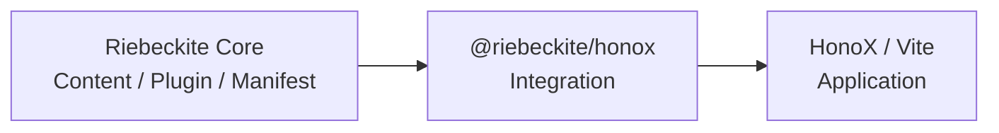
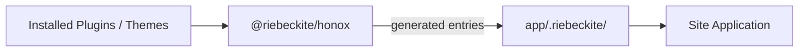
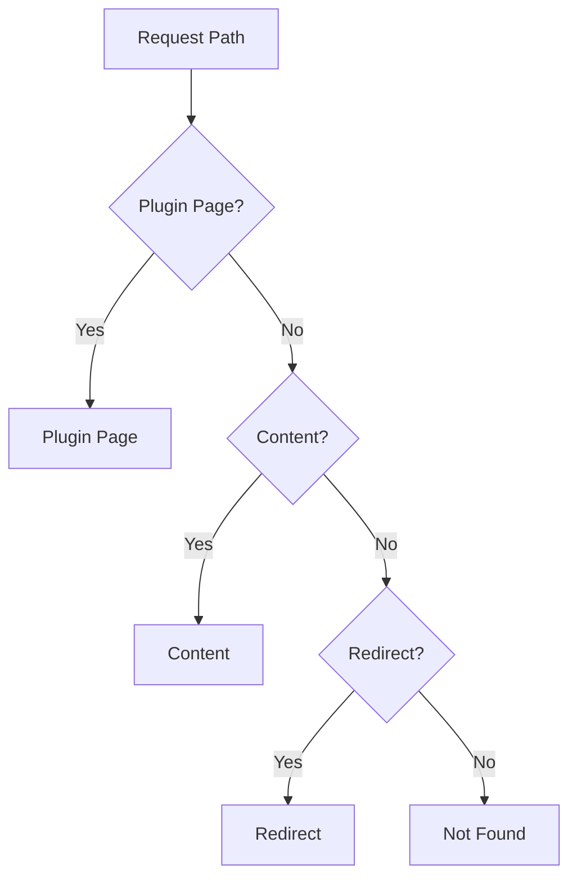
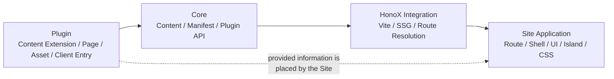

# HonoX Integration

`@riebeckite/honox` connects portable Core behavior to HonoX and Vite. It owns application-root/config resolution, Vite development and build integration, SSG extension mapping, generated plugin/theme style entries, and the HonoX application build workflow.

Core handles content and plugin processing, but it does not know HonoX routes or how Vite builds. `@riebeckite/honox` connects the two:



It mainly handles:

- application root and config resolution
- Vite development and build
- SSG configuration
- generating plugin and theme style entries
- generating client entries
- connecting Riebeckite content to the HonoX application

As a result, a normal site does not have to assemble Riebeckite's internal Vite/HonoX configuration each time.

## How this page is organized

- [UI primitives](./honox-integration/ui.md)
- [Site application contract](./honox-integration/site.md)

## Basic usage

Register the integration with `riebeckiteVite()` from `vite.config.ts`. It is
the higher-level helper for a normal site: it appends the Riebeckite plugins,
applies the SSG entry and extension-map defaults, and contributes the SSR
externals the runtime needs, so the site does not restate Vite/HonoX internals.
Combine it with the site's own plugins (the HonoX plugin, a deployment build
plugin, Tailwind, and so on):

```ts
import { riebeckiteVite } from "@riebeckite/honox";
import { defineConfig } from "vite";

export default defineConfig({
  plugins: [honox({ ... }), ...riebeckiteVite(), build()],
});
```

`riebeckiteVite()` is the higher-level helper for a normal site. Besides adding
the Riebeckite Vite plugin, it also:

- sets the SSG entry
- configures the extension mapping
- sets the SSR external dependencies
- connects the generated plugin/theme entries

It works alongside any Vite plugins the site needs, such as the HonoX plugin, a
deployment build plugin, or Tailwind.

## Root and Config

`riebeckiteVite` accepts the same optional `configRoot`, `appRoot`, `configFile`,
and monorepo-only `workspaceRoot` as the lower-level plugin:

| Option | Meaning |
| --- | --- |
| `appRoot` | Base directory of the site application |
| `configRoot` | Base used to find the Riebeckite config |
| `configFile` | The config file to use |
| `workspaceRoot` | Workspace root during monorepo development |

Normally you do not need to specify any of them.

`appRoot` defaults to the Vite root, and `configRoot` defaults to `appRoot`. A
config path is imported relative to `configRoot`; `content.directory` is
resolved relative to `appRoot`.

```ts
content: {
  directory: "./content",
}
```

`resolveHonoxApplication` returns these roots together with the resolved config,
so CLI and Vite use the same model instead of resolving the application in
different ways.

### `workspaceRoot`

`workspaceRoot` is only for source-package aliases during monorepo development;
installed npm consumers use their own `node_modules` without it.

## Generated files in `.riebeckite`

The integration creates generated import entries below `app/.riebeckite/` that
connect plugins and themes, for example plugin and theme styles. The required
client module is exposed as a virtual module rather than written into that
directory.



`.riebeckite` is integration output. Do not edit it as application source.

## Bootstrap modules

A generated site imports framework-owned bootstrap modules instead of keeping
resolved config and content-manager code in the application: the resolved
config is `virtual:riebeckite/config`, and the configured content runtime is
`virtual:riebeckite/content`. This is why `app/config.ts`, `app/content.ts`, and
`app/constants/paths.ts` are not generated. The SSG entry `app/server.ts`
re-exports both, and `riebeckiteSsg` finds the manifest through them.

A script that runs outside Vite (for example a Node script started with `tsx`)
can resolve the same config with `resolveHonoxConfig` from
`@riebeckite/honox/runtime`.

## Lower-level API

The lower-level pieces remain exported for callers that need full control:
`riebeckite` (the Vite plugin), `riebeckiteSsg` (static generation),
`riebeckiteSsgExtensionMap`, and `createRiebeckiteSsg` (the SSG wrapper that
fills in Riebeckite's defaults). For a normal site use `riebeckiteVite()`; use
the lower-level API only when you need a custom build integration.

`riebeckiteSsg` starts its internal Vite server with the resolved application
root and define values, so invoking `riebeckite build` from a subdirectory
yields the same output as invoking it from the application root.
`defaultSsgEntry` is the root-relative `./app/server.ts` entry, and
`defaultSsrExternals` is the SSR externals list both helpers use. The SSG entry
must re-export the resolved `config` and `content`
(`export { config, content }`): that is how `riebeckiteSsg` finds the manifest to
emit plugin-generated outputs and to run the per-page HTML inspections. Other
exports are `loadRiebeckiteConfig`, `resolveHonoxApplication`,
`resolveHonoxApplicationRoot`, `buildHonoxApplication`, and
`startHonoxDevServer`.

## Routing and SSG

HonoX runtime routing and static generation must treat the same URL as the same
page. This is especially important for catch-all routes, where SSG route
enumeration needs care. Riebeckite provides two helpers for this.

### `contentRouteSsgParams`

```ts
contentRouteSsgParams(routePath, params)
```

Use it as a drop-in replacement for `ssgParams` from `hono/ssg`. It emits params
only for the route's own enumeration request, so a shallow catch-all such as
`/:slug{.+}` does not capture the enumeration of a deeper sibling like
`/tags/:slug{.+}`.

### `ssgEnumerableHandler`

```ts
ssgEnumerableHandler(handler)
```

It keeps a route handler visible to SSG enumeration while it still calls `next()`
to defer to those siblings; Hono otherwise skips middleware-shaped handlers.

## Plugin Page

When plugins provide Page Types, use `resolveRiebeckiteRoute(content, path)`
instead of `resolveContentRoute(manifest, path)` and merge
`pluginPageSsgParams(content)` with the content parameters. The resolver first
returns a plugin page, then falls through to content and redirects.

The generated site's catch-all route wraps this in
`resolveRiebeckiteContentRequest(c, content)`, which resolves content, plugin
pages, redirects, and not-found and sets the `htmlLanguage` and `headTags`
context, so the site only composes the returned result. The root `/` is resolved
by `resolveRiebeckiteHomeRequest(c, content)`, which shares the same mechanics.

The route resolver resolves URLs in this order:



Its page body is intentionally a string: render it inside the site's existing
document frame and pass `page.headTags` to that frame. Plugin packages never
need to add HonoX route files just to provide a page.

## Integration boundaries

Article routing resolves a request against the manifest's already-resolved public
locations (`byPermalink`, then `redirects`), never by inferring a URL from a
filesystem path, directory layout, or slug. A slug remains an internal content
lookup key; the public URL is the resolved `permalink`.

### Summary of responsibilities

Across Riebeckite, responsibilities are separated like this:



Keep HonoX, Vite, Cloudflare, and route APIs in this package or `apps/web`;
Core remains portable. Core does not own HonoX routing. A plugin can expose
assets, client entries, endpoints, and renderers, but Core does not become a
HonoX router. The application decides concrete route composition and islands.

**Core handles content, the Integration connects to HonoX, plugins provide
features, and the site decides the final presentation.**

Use [Build system](build-system.md) for state behavior and
[Architecture](architecture.md) for package ownership.
