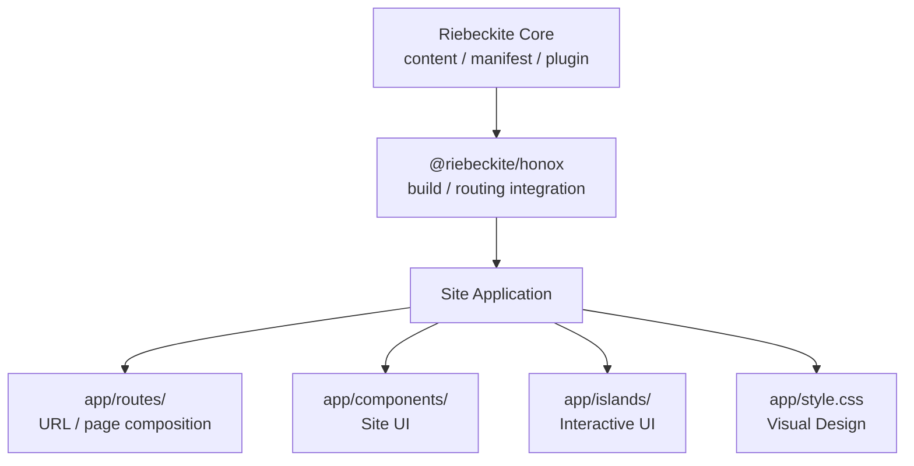
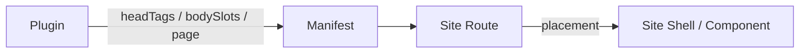

# Site Application の責務

Riebeckite Site は、最終的には通常の HonoX application です。

`@riebeckite/honox` は content と build を接続しますが、実際にユーザーが見る UI の設計は Site が管理します。通常の HonoX で編集する手順は [サイトのカスタマイズ](../../guides/customizing-your-site.ja.md) を参照してください。



主なディレクトリの責務は次のとおりです。

| ディレクトリ | Site が持つ責務 |
| --- | --- |
| `app/routes/` | URL処理、ページ構成、redirect、response metadata |
| `app/components/` | Site 固有の UI |
| `app/islands/` | 対話 UI と client-side state |
| `app/style.css` | 色、layout、typography、extension style |

## Site Shell

```text
app/routes/_renderer.tsx
```

は Site 全体の shell です。

ここでは主に、

- document head
- navigation
- page chrome
- application client entry

などを管理します。

Route は `ContentManager` からコンテンツを取得し、

```ts
resolveRiebeckiteRoute(content, c.req.path)
```

で request URL を解決します。

その結果をどの component tree で表示するかは Site が決定します。

Riebeckite repository にある `apps/web` は実装例の1つであり、外部 Site が同じ layout を使う必要はありません。

## Plugin と Site の境界

Plugin は Site に情報や UI fragment を提供できます。

ただし、**最終的にどこへ描画するかは Site が決定します。**



### Head Tags

Plugin が document head に情報を追加したい場合は、

```ts
ContentManifestEntry.headTags
```

へ `meta` / `link` / `script` を記述します。

Plugin 自身が `<head>` を描画するわけではありません。

`resolveRiebeckiteContentRequest` / `resolveRiebeckiteHomeRequest` が、解決した entry の `headTags` を route context へ設定します。`_renderer.tsx` がそれを読み取って描画します。

```tsx
import { PluginHeadTags } from "@riebeckite/honox/ui";

const headTags = c.get("headTags") ?? [];

<head>
  <PluginHeadTags tags={headTags} />
</head>;
```

つまり、

```text
Plugin
  ↓ headTags を提供
Framework resolver
  ↓ context へ設定
_renderer.tsx
  ↓
<head> に描画
```

という関係です。

たとえば `@riebeckite/plugin-discord-embed` は、この仕組みを使って `theme-color` を提供します。

Plugin は `<head>` 自体や tag の並び順を所有しません。

### RiebeckiteHead と PluginHeadTags

`@riebeckite/honox/ui` より公開される 2 つの primitive は、head composition の責務分離を明確にします。

#### `RiebeckiteHead`

```tsx
import { RiebeckiteHead } from "@riebeckite/honox/ui";

<RiebeckiteHead title="My Site" headTags={[]} />
```

Framework が次の標準的な head contents を描画します。

- `<meta charset="utf-8">`
- `<meta name="viewport" content="width=device-width, initial-scale=1.0">`
- `<title>`（title prop が提供する値）
- `<link rel="icon" href="/favicon.ico">`（faviconHref プロップで上書き可能、null で省略可）
- `<ColorModeScript />`（colorModeScript プロップで制御、default true）
- stylesheet entries（stylesheets プロップ、default `["/app/style.css"]`）
- client script entry（clientSrc プロップ、default `"/app/client.ts"`、null で省略可）
- `PluginHeadTag` values の変換（headTags プロップ）
- 子要素（children prop）は標準の後に追加

`RiebeckiteHead` は `<head>` 要素自身を描画しません。Site は `<head>` の ownership を保持し、その中に `RiebeckiteHead` を配置できます。

#### `PluginHeadTags`

```tsx
import { PluginHeadTags } from "@riebeckite/honox/ui";

<PluginHeadTags tags={headTagsFromManifest} />
```

`PluginHeadTag` values (meta / link / script) を JSX 要素に変換します。`RiebeckiteHead` を使わず、Site が自分で head を組み立てる際に使用します。

#### 使用例

Site が `<head>` 所有権を維持しつつ標準 head をFrameworkに任せる場合：

```tsx
import { RiebeckiteHead, ThemeRoot } from "@riebeckite/honox/ui";

export default jsxRenderer(({ children }, c) => (
  <ThemeRoot
    theme={config.theme}
    lang={c.get("htmlLanguage") ?? config.site.locale}
  >
    <head>
      <RiebeckiteHead
        title={config.site.title}
        headTags={c.get("headTags") ?? []}
      />
      <meta name="custom-site-value" content="..." />
    </head>
    <body class="riebeckite-page rb-site">{children}</body>
  </ThemeRoot>
);
```

Frameworkは標準 head rendering メカニクス（charset、viewport、default title、favicon wiring、color-mode bootstrap、stylesheet/client entry wiring、PluginHeadTag 変換）と theme-root attribute 導出を担当し、Site は `<head>`/`<body>` 構成とカスタム meta/link/script の所有権を保持します。favicon FILE (`/public/favicon.ico`) は Site-owned のまま、default link wiring にのみ Framework が所有権を持ちます。

Plugin が head tags を提供する場合は、既存の `headTags` メカニズムはそのまま機能します。`RiebeckiteHead` と `headTags` は併用可能です。

### Body Slots

本文の途中へ Plugin の HTML を表示したい場合は、

```ts
ContentManifestEntry.bodySlots
```

を使用します。

Plugin は slot 名と HTML fragment を提供します。

たとえば、

```text
properties
```

という slot があれば、Route は slot object を article component へ渡し、Site は、

```tsx
<Article
  content={post}
  bodySlots={route.entry.bodySlots}
/>
```

のように article component 内の任意の位置へ配置できます。

ここでの `Article` は Site 自身の article component であり、同名の `@riebeckite/honox/ui` primitive ではありません。scaffold の starter は標準 slot を決まった位置へ描画します(`article.aside`、`article.header`、`article.metadata`、`article.before-content`、`article.after-content`、`article.footer`)。plugin 作者はこれらから選ぶか、Site に独自名の描画を依頼します。独自 slot は Site が描画を選ぶまで何も表示しません。

Site はどの slot をどこへ置くかを選び、描画の仕組みは公開 `ContentSlot` primitive に任せます。

```tsx
<ArticleContent>
  <ContentSlot slots={bodySlots} name="article.header" />
  <ContentSlot
    slots={bodySlots}
    name="article.metadata"
    class="site-article__metadata"
  />
  <ArticleBody html={post.html ?? ""} />
</ArticleContent>
```

`ContentSlot` は slot lookup、存在しない slot や空 slot の扱い、HTML fragment の描画、`data-slot` の付与を担当します。Site が `dangerouslySetInnerHTML` を直接書く必要はありません。順序、可視性、Site 固有 class、独自 slot 名は引き続き Site が所有します。`slots` を直接読んだり、任意の wrapper で包んだり、同じ slot を複数回描画する escape hatch も残っています。

Plugin が route や shell の構造を書き換える必要はありません。

`@riebeckite/plugin-properties` では、

```ts
render: "slot"
```

を指定すると `properties` slot を提供します。

`render: "html"` は従来どおり、生成 HTML の先頭または末尾へ直接挿入します。

記事末尾の Plugin section は `article.footer` に集約します。article component ではこの slot を一度だけ描画し、fragment の順序は解決済み Plugin の `order` で決めます。空の contribution は DOM node を生成しません。

## 独自 Site を作る

外部 Site でも、公開 primitive を使いながら自由に component を構成できます。

```tsx
import type { ContentBodySlots, PostContent } from "@riebeckite/core";
import {
  Article,
  ArticleBody,
  ArticleContent,
  ArticleLayout,
  ContentSlot,
} from "@riebeckite/honox/ui";

export function SiteArticle({
  post,
  bodySlots,
}: {
  post: PostContent;
  bodySlots?: ContentBodySlots;
}) {
  return (
    <Article class="site-article">
      <ArticleLayout>
        <ArticleContent>
          <ContentSlot slots={bodySlots} name="article.header" />
          <ArticleBody html={post.html ?? ""} />
          <ContentSlot slots={bodySlots} name="article.footer" />
        </ArticleContent>
      </ArticleLayout>
    </Article>
  );
}
```

見た目は Site の CSS で定義します。

```css
@import "./.riebeckite/framework-styles.css";
@import "./.riebeckite/plugin-styles.css";
@import "./.riebeckite/theme-styles.css";

.site-article {
  max-width: 48rem;
  margin: 0 auto;
}
```

`.riebeckite` 内の生成 CSS 自体を直接編集しないでください。

### Islands

Island も通常の Site module として管理します。

```text
app/islands/
```

へ HonoX island を配置し、それを利用する route または component から import します。

hydration や client-side state は Site 内で管理します。

`app/client.ts` では、

```ts
createClient();
initRiebeckiteClient();
```

の両方を初期化します。

`initRiebeckiteClient()` は、インストールされている Plugin や Theme が提供する browser entry を起動するために使用されます。

Plugin は client entry を提供できますが、

- Site route
- shell
- component
- island
- CSS design

そのものを所有してはいけません。
