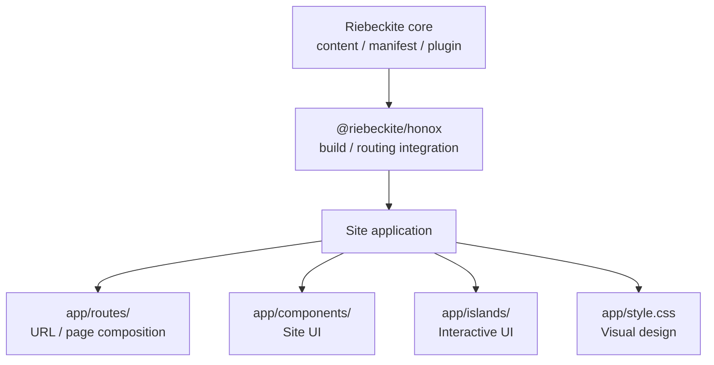
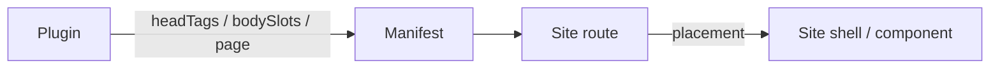

# Site application contract

A Riebeckite site is a normal HonoX application. The integration supplies
content and build wiring; the application owns every user-facing decision.
Keep the following source directories in the site, rather than in an
integration, theme, or plugin. For a walkthrough of editing them with ordinary
HonoX, see [Customizing Your Site](../../guides/customizing-your-site.md).



| Directory | Site-owned responsibility |
| --- | --- |
| `app/routes/` | URL handling, page composition, redirects, and response metadata |
| `app/components/` | Reusable site presentation and composition of the public UI primitives |
| `app/islands/` | Optional interactive UI and its client-side state |
| `app/style.css` and local CSS | Visual tokens, layout, typography, and imports of generated extension styles |

`app/routes/_renderer.tsx` is the site shell. It owns the document head,
navigation, page chrome, and the application client entry. A route resolves a
request with `resolveRiebeckiteContentRequest(c, content)` from
`@riebeckite/honox/server` — which also sets the `htmlLanguage` and `headTags`
context — then chooses its own component tree. When a route needs only route
resolution, without context assignment or loading the processed content, use the
lower-level `resolveRiebeckiteRoute(content, c.req.path)`. The reference
application in `apps/web` is one implementation, not a required layout.

Plugins provide information and UI fragments; the site decides where they are
rendered:



## Head tag handoff

When a plugin provides document head tags, the shell still belongs to the
site. A plugin only describes `meta` / `link` / `script` on
`ContentManifestEntry.headTags`; it never renders them.
`resolveRiebeckiteContentRequest` / `resolveRiebeckiteHomeRequest` set the
resolved entry's tags into the route context, and `app/routes/_renderer.tsx`
decides whether to render them. A plugin does not own the `<head>` or the tag
order.

```tsx
// app/routes/_renderer.tsx
import { PluginHeadTags } from "@riebeckite/honox/ui";

const headTags = c.get("headTags") ?? [];

<head>
  <PluginHeadTags tags={headTags} />
</head>;
```

The flow is:

```text
Plugin
  ↓ provides headTags
Framework resolver
  ↓ sets them on the context
_renderer.tsx
  ↓
renders into <head>
```

For example, `@riebeckite/plugin-discord-embed`, which aligns the Discord embed
color, supplies `theme-color` through this contract.

## RiebeckiteHead and PluginHeadTags

`@riebeckite/honox/ui` provides two primitives that clarify the separation of
responsibilities between the framework and the site for head composition.

### `RiebeckiteHead`

```tsx
import { RiebeckiteHead } from "@riebeckite/honox/ui";

<RiebeckiteHead title="My Site" headTags={[]} />
```

The framework renders the standard head contents:

- `<meta charset="utf-8">`
- `<meta name="viewport" content="width=device-width, initial-scale=1.0">`
- `<title>` (the value provided by the `title` prop)
- `<link rel="icon" href="/favicon.ico">` (overridable via the `faviconHref` prop; pass `null` to omit)
- `<ColorModeScript />` (controlled by the `colorModeScript` prop, default `true`)
- stylesheet entries (via the `stylesheets` prop, default `["/app/style.css"]`)
- client script entry (via the `clientSrc` prop, default `"/app/client.ts"`; `null` omits it)
- conversion of `PluginHeadTag` values (via the `headTags` prop)
- child elements (via the `children` prop) appended after the standard ones

`RiebeckiteHead` does **not** render the `<head>` element itself. The site retains
ownership of `<head>` and can add custom meta/link/script alongside it.

### `PluginHeadTags`

```tsx
import { PluginHeadTags } from "@riebeckite/honox/ui";

<PluginHeadTags tags={headTagsFromManifest} />
```

Converts `PluginHeadTag` values (meta / link / script) into JSX elements. Use this
when the site composes its own head and does not use `RiebeckiteHead`.

For example, a site that keeps `<head>` ownership and uses `RiebeckiteHead`:

```tsx
import { RiebeckiteHead, ThemeRoot } from "@riebeckite/honox/ui";

export default jsxRenderer(({ children }, c) => (
  <ThemeRoot
    theme={config.theme}
    lang={c.get("htmlLanguage") ?? config.site.locale}
  >
    <head>
      <RiebeckiteHead
        title={config.site.title}
        headTags={c.get("headTags") ?? []}
      />
      <meta name="custom-site-value" content="..." />
    </head>
    <body class="riebeckite-page rb-site">{children}</body>
  </ThemeRoot>
));
```

The framework owns the standard head rendering mechanics (charset, viewport, default title, favicon wiring, color-mode bootstrap, stylesheet/client entry wiring, PluginHeadTag conversion) and theme-root attribute derivation. The site still owns `<head>`/`<body>` composition and can add custom meta/link/script. The favicon FILE (`/public/favicon.ico`) remains site-owned; only the default link wiring is framework-owned.

Plugin-provided head tags continue to work through the existing `headTags` mechanism. `RiebeckiteHead` and `headTags` can be used together.

## Body slot handoff

When a plugin contributes HTML that belongs inside the note body, the site still
owns where it is rendered. A plugin only writes an HTML fragment into
`ContentManifestEntry.bodySlots` under a slot name; it never changes a route,
the shell, or the render order. A site route passes the slot object to its
article component, which decides whether and where to render each slot.

```tsx
// app/routes/[slug{.+}].tsx
<Article
  content={post}
  bodySlots={route.entry.bodySlots}
/>;
```

The `Article` here is the site's own article component, not the
`@riebeckite/honox/ui` primitive of the same name. The scaffolded starter
renders the standard slots at fixed positions: `article.aside`,
`article.header`, `article.metadata`, `article.before-content`,
`article.after-content`, and `article.footer`. A plugin author picks one of
those, or asks the site to render a custom name; a custom slot renders nothing
until the site chooses to render it.

The site chooses which slot goes where and delegates the rendering mechanics to
the public `ContentSlot` primitive.

```tsx
<ArticleContent>
  <ContentSlot slots={bodySlots} name="article.header" />
  <ContentSlot
    slots={bodySlots}
    name="article.metadata"
    class="site-article__metadata"
  />
  <ArticleBody html={post.html ?? ""} />
</ArticleContent>
```

`ContentSlot` owns the slot lookup, missing and empty handling, HTML fragment
rendering, and the `data-slot` attribute, so the site never writes
`dangerouslySetInnerHTML` for a standard slot. Order, visibility, site classes,
and custom slot names still belong to the site. The escape hatches remain:
read `slots` directly, wrap a slot in any element, and render the same slot more
than once.

For example, `@riebeckite/plugin-properties` publishes its property panel on
the `properties` slot when configured with `render: "slot"`. The default
`render: "html"` keeps inserting the panel at the start or end of the note HTML.
A plugin never owns routes or the shell.

Article-end plugin sections share `article.footer`. Render that slot once in
the article component; the resolved plugin `order` determines the fragment
sequence, and an empty contribution does not create a DOM node.

For example, an external site can compose an article with the stable primitive
contract while retaining all presentation ownership:

```tsx
// app/components/article.tsx
import type { ContentBodySlots, PostContent } from "@riebeckite/core";
import {
  Article,
  ArticleBody,
  ArticleContent,
  ArticleLayout,
  ContentSlot,
} from "@riebeckite/honox/ui";

export function SiteArticle({
  post,
  bodySlots,
}: {
  post: PostContent;
  bodySlots?: ContentBodySlots;
}) {
  return (
    <Article class="site-article">
      <ArticleLayout>
        <ArticleContent>
          <ContentSlot slots={bodySlots} name="article.header" />
          <ArticleBody html={post.html ?? ""} />
          <ContentSlot slots={bodySlots} name="article.footer" />
        </ArticleContent>
      </ArticleLayout>
    </Article>
  );
}
```

Import generated extension styles from the site's stylesheet, but never edit
the generated files themselves:

```css
/* app/style.css */
@import "./.riebeckite/framework-styles.css";
@import "./.riebeckite/plugin-styles.css";
@import "./.riebeckite/theme-styles.css";

.site-article { max-width: 48rem; margin: 0 auto; }
```

Islands are also ordinary application modules. Place a HonoX island under
`app/islands/`, import it from the route or component that owns it, and keep
its hydration and client state local to the site. `app/client.ts` must continue
to initialize both `createClient()` and `initRiebeckiteClient()`; the latter
starts browser entries contributed by installed plugins and themes. A plugin
may contribute its own client entry, but it must not take ownership of a
site's routes, shell, components, islands, or CSS decisions.

The external-site E2E fixture contains this minimal arrangement: a site shell,
a local article component built from `@riebeckite/honox/ui`, a local island,
and site CSS. It is built from packed npm artifacts, so it is the supported
example for copying and overriding these boundaries.
