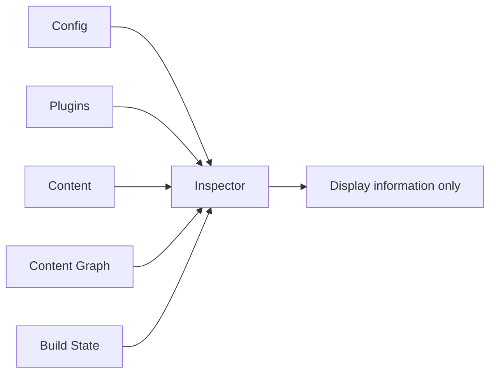
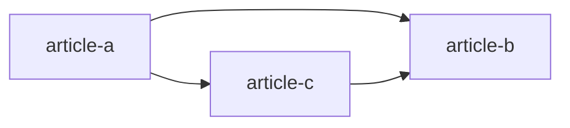
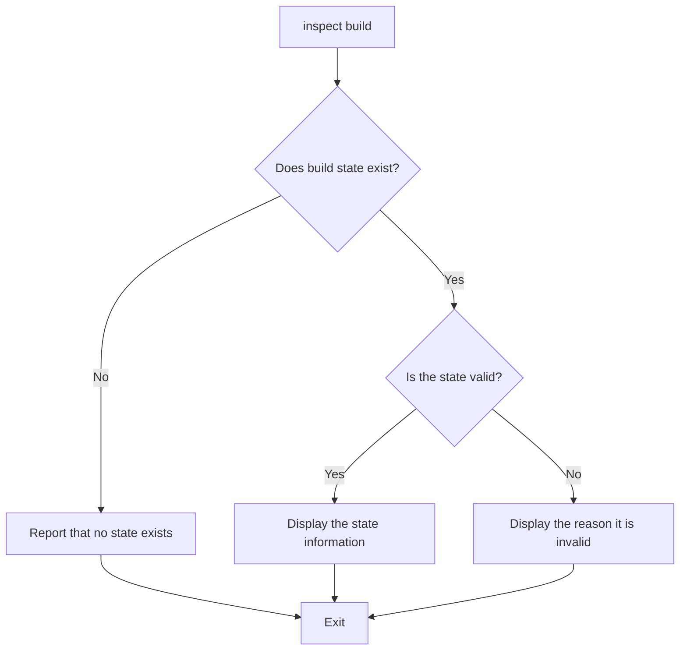
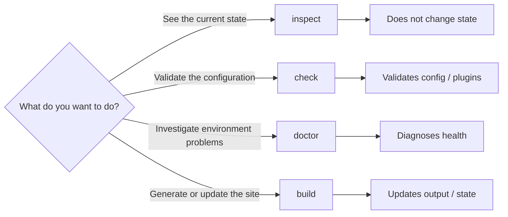

# Inspector

Inspector answers questions about already-resolved state. It is a read-only
tool for seeing how Riebeckite currently understands your site.

Use it through the CLI:

```sh
riebeckite inspect config
riebeckite inspect plugins
riebeckite inspect content --list
riebeckite inspect graph
riebeckite inspect build
```



Inspector only reads this information. It does not build, and it does not
change your configuration.

## Basic usage

Inspector has a command for each target you want to inspect:

| Command | What you can inspect |
| --- | --- |
| `riebeckite inspect config` | Resolved configuration |
| `riebeckite inspect plugins` | Enabled plugins |
| `riebeckite inspect content --list` | Published content and URLs |
| `riebeckite inspect graph` | Relationships between content |
| `riebeckite inspect build` | Incremental build state |

## Inspecting the config

```sh
riebeckite inspect config
```

This shows the **resolved config** that Riebeckite actually uses. It is not
the raw values written in the config file; it is what Riebeckite ends up
recognizing after defaults and other processing are applied.

Use it when something such as:

> I configured it, but it does not behave as expected.

happens, to first check the effective configuration.

## Inspecting plugins

```sh
riebeckite inspect plugins
```

This shows the plugins that are currently enabled. Use it to check whether a
plugin you intended to add is really being loaded.

## Inspecting content

```sh
riebeckite inspect content --list
```

This lists the content Riebeckite recognizes. For each entry you can check the
resolved **canonical permalink**.

For example, even if a file exists at:

```text
content/posts/hello.md
```

and its real public URL is:

```text
/blog/hello/
```

Inspector shows the finally resolved `/blog/hello/`. In other words, this
information is about the **URL actually used by the site**, not the filesystem
location.

If a Public Location plugin provides identity metadata, it also shows the
content ID and where that ID came from.

## Inspecting the content graph

```sh
riebeckite inspect graph
```

This shows the relationships between content. For example, it lets you check
how Riebeckite understands link relationships such as:



It is also useful when developing a plugin that uses links, backlinks, or the
graph.

## Inspecting build state

```sh
riebeckite inspect build
```

This shows the state used by incremental builds. If a valid state exists, its
information is displayed. If the state is unavailable, the reason is shown as
well.

For example:

- The state file does not exist
- The JSON is malformed
- The state version does not match the current Riebeckite
- The state structure is unrecognized

Inspector does **not** repair any of these.



Even if the state is broken, Inspector never creates a new state or rewrites
the existing one.

## Read-only guarantee

Inspection is factual and non-mutating. It must not run a build, write
incremental state or plugin cache, emit assets, render special artifacts
merely for display, invoke Vite/HonoX build work, or auto-fix configuration.
If the requested information does not exist because no build has completed,
report that condition plainly.

`inspect content --list` reports each entry's resolved canonical permalink.
When a public-location plugin records identity metadata, it also shows the ID
and the ID source.

`inspect build` reports the incremental state status. When the state is
invalid, it also reports the reason: malformed JSON, an unsupported state
version, or an unrecognized structure.

This property makes Inspector safe to use not only during development but also
in CI.

## inspect / check / doctor / build

Riebeckite has commands that look similar, but they have different roles:



| What you want to do | Command |
| --- | --- |
| Check the current resolved result | `inspect` |
| Validate config / plugins | `check` |
| Diagnose problems including the environment | `doctor` |
| Generate or update the site or build state | `build` |

If you are unsure, think: **"to just look, `inspect`; to validate, `check`; to
investigate a problem, `doctor`; to generate, `build`."**

This division of roles prevents a command that only checks state from
accidentally modifying cache or deployment output. See
[CLI](../reference/cli.md), [Diagnostics](./diagnostics.md), and
[Build System](./build-system.md) for details.
