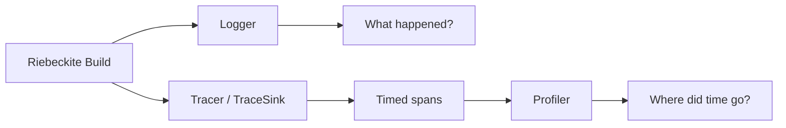
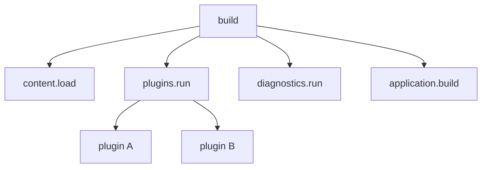
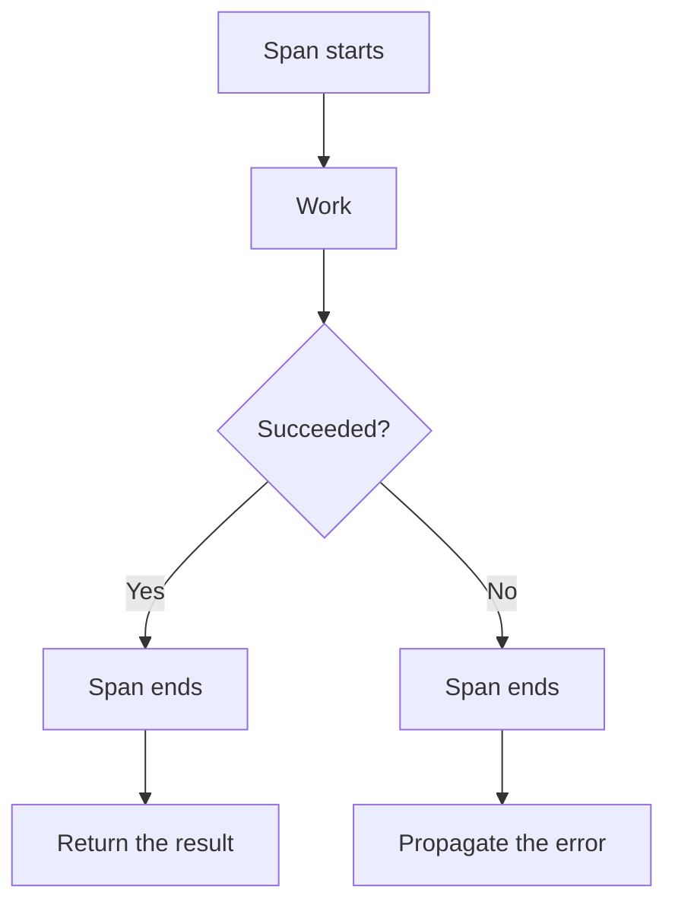
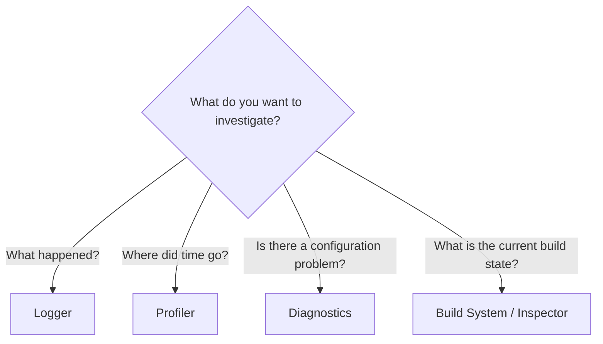

# Observability

Observability is how you find out **what happened and where the time went**
while Riebeckite runs.

Riebeckite separates three mechanisms with different purposes:

- **Logger** — know what happened.
- **Tracer** — record which work took how long.
- **Profiler** — aggregate traces to see where a build should be investigated.



## Logger / Tracer / Profiler differences

| Signal | Answers | Contract |
| --- | --- | --- |
| Logger | What happened or failed? | structured, safe operational messages |
| Tracer / `TraceSink` | Where did work occur and how long did it take? | nested timed spans |
| Profiler | Where should build performance be investigated? | consumes trace data and reports it |

If a build is slow, do not add a flood of Logger messages to find the cause.
Record durations with the Tracer and read the result in the Profiler.

Conversely, reporting an event such as "the plugin failed to load" is the
Logger's job.

## Trace

A trace divides build work into units called **spans** and records their
duration. For example, a build might run like this:



`build` is the parent span, and the work inside it becomes child spans. This
lets you investigate not just "the whole build is slow" but "a specific plugin
inside `plugins.run` is slow".

### Where to create spans

You do not need a span in every function. Add them at boundaries where knowing
the duration is meaningful:

- major build phases
- plugin work
- I/O such as reading files
- diagnostics
- other work whose performance you want to check independently

Span names should be stable enough to compare between builds, such as:

```text
content.load
plugins.run
diagnostics.run
application.build
```

Avoid designs where the span name itself changes every run because of an input
file name.

### Always close spans

Close a span on failure as well as success:



A trace is not a substitute for error handling. On failure, record the span and
still propagate the error according to the normal caller contract. Do not
swallow an error for the sake of a trace.

## Parallel work and time

When reading a trace, remember that **the sum of durations is not necessarily
the elapsed time**. For example, suppose plugin A and plugin B run in parallel:

```mermaid
gantt
    title Parallel plugin work
    dateFormat X
    axisFormat %L ms

    section Plugins
    Plugin A :a, 0, 100
    Plugin B :b, 0, 100
```



If each takes 100 ms, the cumulative work is 200 ms:

```text
Plugin A = 100ms
Plugin B = 100ms
```

But because the two run at the same time, the actual elapsed time is about
100 ms.

```text
Cumulative work = 200ms
Wall-clock time = about 100ms
```

The Profiler preserves this distinction. Simply adding child span durations and
reporting `plugins.run = 200ms` would make parallel work look like a slow serial
path.

## Profiler

The Profiler aggregates traces so you can see where a build spends its time.
Run it from the CLI:

```sh
riebeckite profile
```

To measure without reusing incremental state:

```sh
riebeckite profile --full
```

`--full` is useful when you want to investigate whole-build performance without
the effect of the incremental build.

The goal of the Profiler is to narrow the next place to investigate, starting
from the fact that something is "slow".

The profile report separates plugin-cache activity from persistent-content-cache activity. It reports content-cache hits, misses, and bypasses together with the reason for each miss (for example `no-entry` or `dependency-changed`) and each bypass (for example an l10n safe bypass), so a warm build that is not reusing entries can be explained without reading cache internals.

## Measuring diagnostics

Diagnostics are measured like any other build phase. The Profiler shows the
duration of the:

```text
diagnostics.run
```

span, and also the number of findings diagnostics produced:

- total
- error
- warning
- info

This lets you see how long diagnostics took and how many problems they reported
at the same time:

```text
diagnostics.run
├─ duration
├─ total
├─ error
├─ warning
└─ info
```

If diagnostics account for most of the build time, that is a signal to
investigate the phase further.

## Investigating a problem

Choose the mechanism by the kind of question you have:



When a build fails, use the Logger and Diagnostics; when a build is slow, use the
Tracer and Profiler; when you want to check the incremental build state, combine
them with the Inspector.

Run `riebeckite profile [--full]` for CLI-driven reporting. Pair it with
[Build system](./build-system.md) and [Diagnostics](./diagnostics.md) when
investigating a problem. See [Inspector](./inspector.md) to check the current
state.
