# Page System

Page System は、Plugin が **Site の route を直接追加せずに独立したページを提供する**ための仕組みです。

たとえば Plugin が、

```text id="9twdpj"
/explore
/report
/tags/example
```

のような独自ページを提供したい場合に使用します。

Page System がない場合、Plugin ごとに HonoX の route を Site Application へ追加する必要があります。

Page System では Plugin は「この URL に、このページを提供する」という情報だけを公開し、実際の routing や document の描画は Site が担当します。

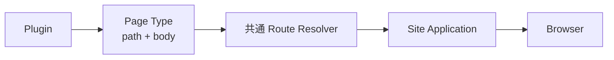

`pageTypes` は通常の `RiebeckitePlugin` が持つ capability の1つです。

Page 専用の別種類の Plugin を作るわけではありません。

# どんなときに使うか

Page Type は、Plugin が**独立した URL を持つページ**を提供するときに使用します。

たとえば、

- Garden Explorer
- Plugin のレポート画面
- Plugin が生成する一覧ページ
- 独自の検索・閲覧ページ

などです。

一方、記事本文の中へ何かを表示するだけなら Page Type は必要ありません。

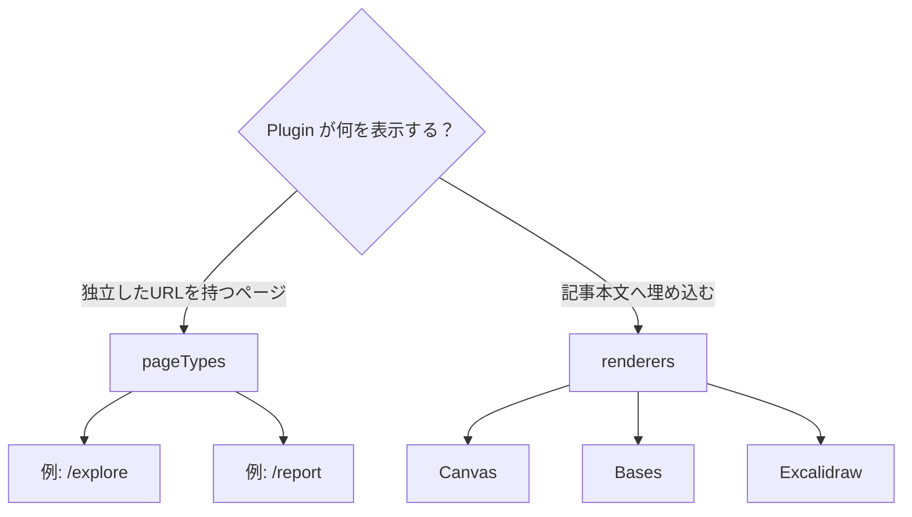

Canvas、Bases、Excalidraw のように記事内へ埋め込む機能は `renderers` を使用します。

# 誰が何を担当するか

Page System では、Plugin がページ全体を所有するわけではありません。

責務を次のように分離します。

| 層 | 責務 |
| --- | --- |
| Core | Page Type の contract、検証、path 列挙、解決、競合検出 |
| Plugin | Page Type ID、公開 path、framework 非依存の HTML body |
| HonoX Integration | 共通 route resolver、SSG parameter helper |
| Site Application | route、document frame、metadata、HTML の描画 |
| Theme | token と stable hook による見た目 |

全体では次のような関係になります。

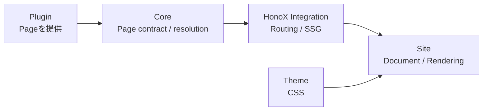

**route と document frame は Site Application が所有します**。

Plugin はページの内容を提供しますが、

```html id="snxwcb"
<html>
<head>
...
<body>
```

のような document 全体を生成するわけではありません。

# Page System が解決する問題

Page System 導入前は、独立ページを持つ Plugin ごとに Site 側へ専用 route が必要でした。

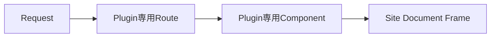

この方式では Plugin を追加するだけでは動かず、Site Application の route も変更する必要があります。

つまり Plugin と Site の結合が強くなります。

Page System では、すべての Plugin Page が共通 route resolver に参加します。

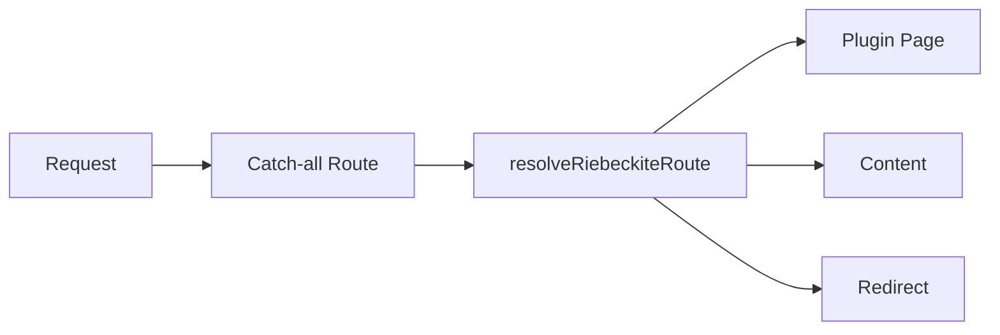

これにより、新しい Plugin Page を追加するたびに HonoX route を追加する必要がありません。

# Build と Request の流れ

Page System には、大きく2つの処理があります。

## Build 時

Build 時には、Plugin が提供する Page Type から静的生成する URL を集めます。

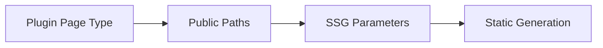

たとえば Plugin が、

```text id="9ifm52"
/report
```

を提供していれば、その path を SSG の生成対象にできます。

## Request 時

Request が来ると、共通 resolver がどの種類のページかを判断します。

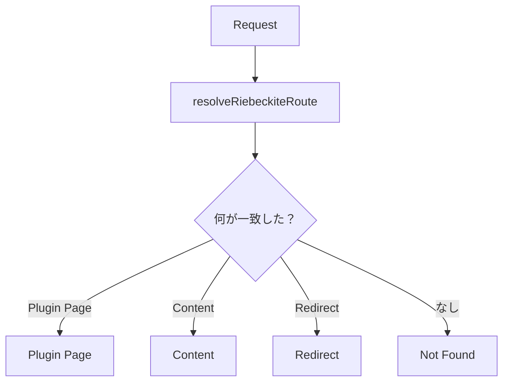

Plugin Page が解決された場合、その body を Site の document frame 内へ描画します。

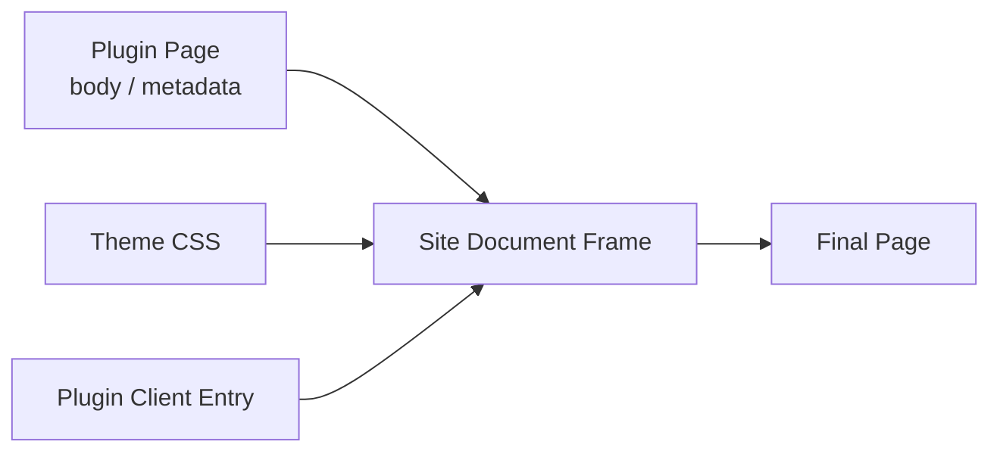

# Page Type を作る

Page Type は Plugin の `pageTypes` に定義します。

```ts id="1ql4hf"
import { definePlugin } from "@riebeckite/core";

export function reportPlugin() {
  return definePlugin({
    name: "report",

    pageTypes: [
      {
        id: "example.report",
        paths: ["/report"],

        resolve: ({ pathname, manifest }) =>
          pathname === "/report"
            ? {
                type: "example.report",
                pathname,
                title: "Report",
                body: `<p>${manifest.publicEntries.length} published entries</p>`,
              }
            : null,
      },
    ],
  });
}
```

この例では、

```text id="1wlj0z"
/report
```

というページを Plugin が提供します。

ページ本文には、到達可能な記事数を表示しています。

Plugin が HonoX component や route file を作る必要はありません。

# Manifest と公開境界

Page Type の `resolve` には `PluginPageContext` が渡されます。

その中の、

```ts id="dw2bby"
PluginPageContext.manifest
```

は解決済みの Manifest です。`entries` には `draft` と `scheduled` も含まれるため、Page の出力には使いません。

到達可能な URL を網羅する場合は `publicEntries`（`public` と `unlisted`）、読者へ一覧として見せる場合は `discoverableEntries`（`public` のみ）を使います。entry ごとに分岐が必要な場合だけ、解決済みの `entry.publishing` を読みます。

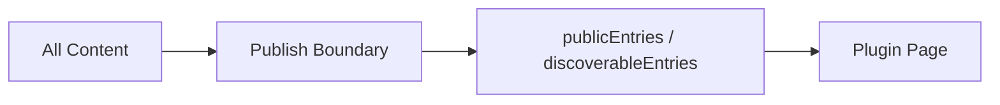

非公開コンテンツを Plugin Page 側で独自に探索して表示する設計にはしません。

これによって Page System も通常の Site と同じ公開境界を維持できます。

# Page Type ID

各 Page Type には ID が必要です。

```ts id="0evifc"
id: "example.report"
```

Page Type ID は、すべての Plugin を通して一意である必要があります。

たとえば、

```text id="tvplf6"
riebeckite.garden-explorer
example.report
example.search
```

のように Plugin や用途が分かる namespace を持たせると衝突を避けやすくなります。

# Path

静的なページは `paths` に公開 path を指定します。

```ts id="7rvyz2"
paths: ["/report"]
```

複数のページを提供することもできます。

```ts id="wea35u"
paths: [
  "/report",
  "/report/archive",
]
```

動的ページを静的生成する場合は、SSG path を **`manifest.publicEntries` から導出**します。

filesystem を独自に scan して path を作るのではなく、Content System が解決した公開状態を利用してください。

# Page Type の競合

複数の Page Type が同じ URL に一致する可能性があります。

その場合は `priority` を使って解決します。


最も高い `priority` を持つ Page Type が選ばれます。

ただし、同じ最大 priority の Page Type が複数一致した場合は、どちらかを暗黙的に選びません。

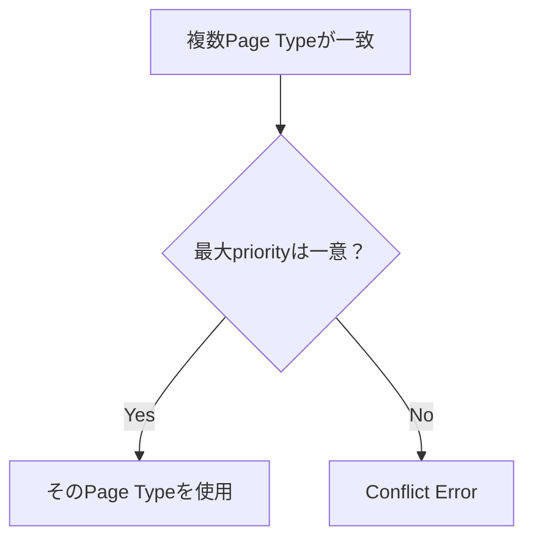

競合を明示的なエラーにすることで、Plugin の登録順などによって結果が変わることを防ぎます。

# HonoX Site へ接続する

Plugin Page を利用する HonoX Site には、共通の catch-all route が必要です。

`create-riebeckite` などで生成された Site には、必要な構成があらかじめ含まれています。

概念的には次のように接続します。

```tsx id="xxj9rm"
import {
  contentRouteSsgParams,
  resolveRiebeckiteContentRequest,
  riebeckiteSsgParams,
} from "@riebeckite/honox/server";
import { PageBody } from "@riebeckite/honox/ui";
import { createRoute } from "honox/factory";

export default createRoute(
  contentRouteSsgParams("/:slug{.+}", () => riebeckiteSsgParams(content)),
  async (c) => {
    const resolved = await resolveRiebeckiteContentRequest(c, content);

    if (resolved.kind === "response") return resolved.response;

    if (resolved.kind === "page") {
      return c.render(<PageBody html={resolved.page.body} />);
    }

    return c.render(/* Site 固有の article composition */);
  },
);
```

通常の Site 利用者が Plugin ごとにこの route を追加する必要はありません。

共通 route が Plugin Page をまとめて解決します。

# Page が返せるもの

Plugin Page は HTML body に加えて、必要に応じてページの metadata を提供できます。

たとえば、

```text id="m7yad8"
body
title
description
headTags
language
```

などです。

ただし、Plugin がそれらを**どの位置へ描画するかまで決定するわけではありません**。

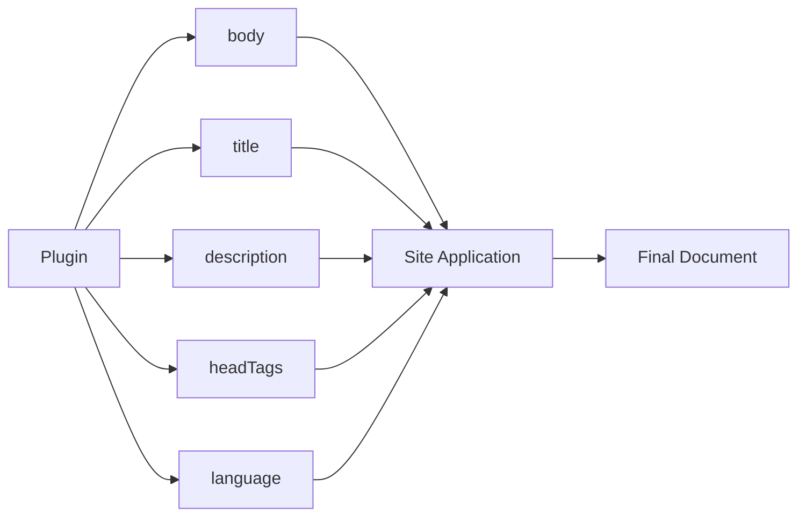

Site Application がこれらを受け取り、既存の document frame に反映します。

このため、Plugin Page でも Site 全体の navigation、header、footer、Theme などをそのまま利用できます。

# HTML の安全性

Page Type の `body` は HTML として描画されます。

そのため Plugin は、**自分自身が安全に生成できる HTML だけを返す**必要があります。

たとえば request parameter をそのまま HTML に埋め込むような処理は避けます。

```ts id="8m9qrl"
// Avoid
body: `<p>${untrustedRequestValue}</p>`
```

信頼できない入力を扱う場合は、適切に escape / sanitize してから使用します。

最終的に HTML をどのように描画するかは Site Application の boundary で決定します。

Page Type が Site の HTML safety policy を回避する仕組みにはしません。

# Page Type と Theme

Theme は Page Type ID を知る必要がありません。

たとえば、

```text id="z67p3o"
example.report
```

専用の Theme logic を作るのではなく、

- semantic token
- stable CSS hook
- `data-*` attribute
- CSS cascade

を利用して見た目を変更します。


これにより、新しい Page Type が追加されても Theme と Plugin を直接結合せずに済みます。

# Page System の境界

Page System では、**Plugin はページを提供するが、Application を所有しない**ことが最も重要です。

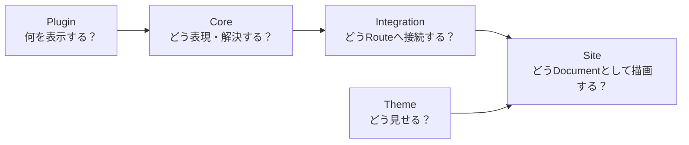

責務は次のとおりです。

```text id="9w3k80"
Plugin
  → Page の内容と公開 path を提供する

Core
  → Page Type の共通 contract と解決規則を提供する

HonoX Integration
  → Page Type を routing / SSG へ接続する

Site Application
  → route、document frame、metadata、HTML safety を所有する

Theme
  → Site の見た目を変更する
```

という関係になります。

この境界によって Plugin は HonoX や特定 Site の構造に依存せず、インストールするだけで独立ページを提供できます。

Page Type の全フィールドと実行時検証については [Plugin API](../reference/plugin-api.md#page-type)、Site との接続については [HonoX Integration](./honox-integration.md) を参照してください。
