# Page System

The Page System lets a plugin provide a standalone page without taking over an
application route. It is a capability on the normal `RiebeckitePlugin`
contract, not a second kind of plugin.

A plugin uses it when it wants to serve its own pages such as:

```text
/explore
/report
/tags/example
```

Without the Page System, every plugin that provides a page would need its own
HonoX route added to the site application. With the Page System, a plugin only
publishes "this URL provides this page"; the site owns the actual routing and
document rendering.

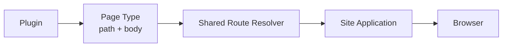

## When to use it

Use a Page Type when a plugin provides a page with its own URL, for example:

- Garden Explorer
- A plugin report screen
- A listing page generated by a plugin
- A custom search or browse page

You do not need a Page Type when you only want to display something inside an
article body.

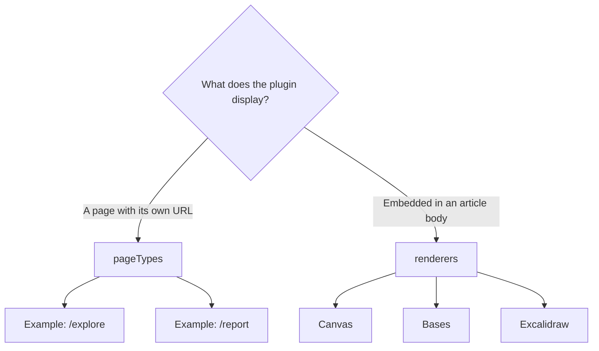

Features embedded inside an article, such as Canvas, Bases, and Excalidraw, use
`renderers` instead.

## Responsibilities

| Layer | Responsibility |
| --- | --- |
| Core | Page Type contract, validation, path enumeration, resolution, and conflicts |
| Plugin | Page Type ID, public paths, and a framework-independent HTML body |
| HonoX integration | Generic route resolver and SSG parameter helper |
| Site application | Catch-all route, document frame, metadata, and safe HTML rendering |
| Theme | Tokens and stable hooks; no knowledge of a Page Type ID is required |

A plugin does not own the whole page. The overall relationship looks like this:

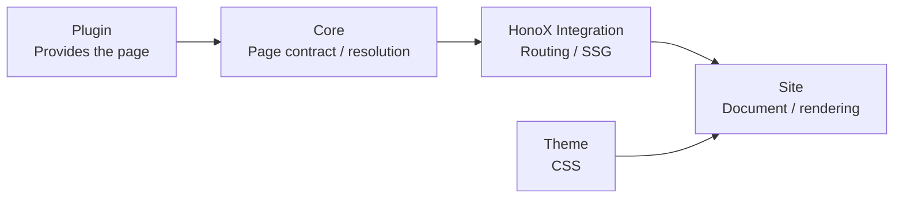

**The route and document frame are owned by the site application.** A plugin
provides the page content, but it does not generate a whole document:

```html
<html>
<head>
...
<body>
```

`PluginPageContext.manifest` is the resolved manifest. Its `entries` still
contains `draft` and `scheduled`, so a Page Type must read `publicEntries`
(routable) or `discoverableEntries` (public only) for page output instead.

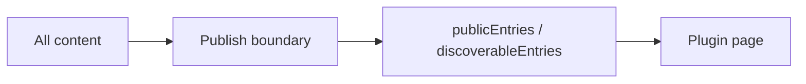

A Page Type should not search for non-public content on its own. This keeps the
Page System on the same publication boundary as a normal site.

## The problem the Page System solves

Before the Page System, every plugin with a standalone page needed a dedicated
route on the site side:

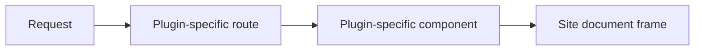

That approach did not work by adding a plugin alone; it also required changing
the site application's routes, which coupled plugins tightly to the site.

With the Page System, every plugin page participates in one shared route
resolver:

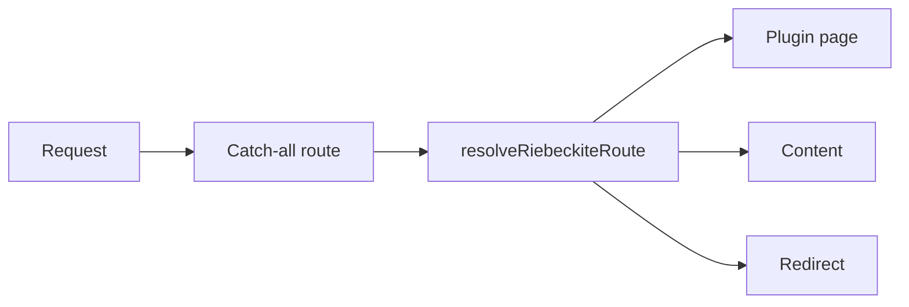

Adding a new plugin page no longer requires adding a HonoX route.

## Build and request flow

The Page System has two main phases.

### At build time

At build time, the Page Types a plugin provides are collected into the URLs to
statically generate:

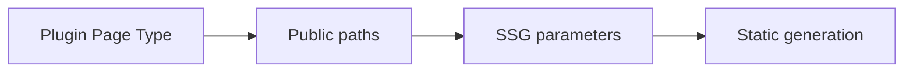

For example, if a plugin provides:

```text
/report
```

that path can become an SSG generation target.

### At request time

When a request arrives, the shared resolver decides which kind of page it is:

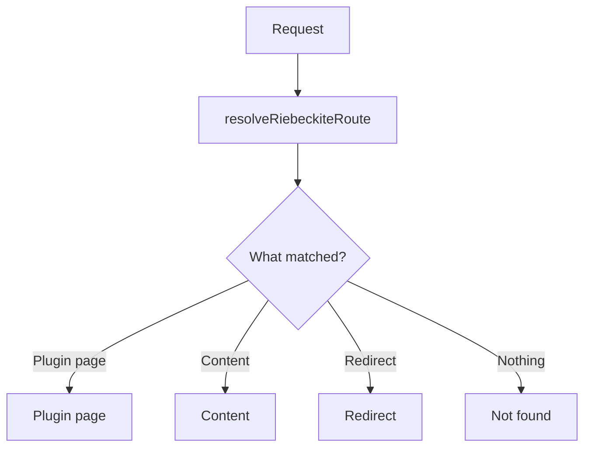

When a plugin page is resolved, its body is rendered inside the site's document
frame:

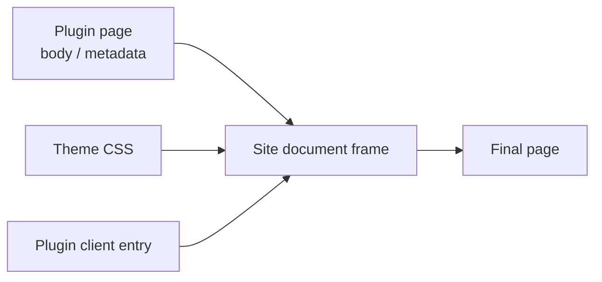

## Rendering pipeline

Before Page Types, a standalone plugin feature needed a dedicated route:

```text
request -> plugin-specific application route -> plugin component -> document frame
```

With the Page System, plugins participate through one generic route:

```text
build: plugin Page Types -> public paths -> SSG parameters
request: catch-all route -> resolveRiebeckiteRoute
                           -> plugin page | content | redirect
plugin page -> site document frame -> theme CSS and plugin client entries
```

The route and frame remain site-owned. Plugins return a body fragment and
optional `title`, `description`, `headTags`, and `language`; the site decides how
those values are represented in the document.

## Authoring a Page Type

Use `pageTypes` when the feature is an independent screen. Use `renderers` for
content embeds such as Canvas, Bases, and Excalidraw: they belong inside an
article and do not need a page of their own.

```ts
import { definePlugin } from "@riebeckite/core";

export function reportPlugin() {
  return definePlugin({
    name: "report",
    pageTypes: [{
      id: "example.report",
      paths: ["/report"],
      resolve: ({ pathname, manifest }) => pathname === "/report"
        ? {
            type: "example.report",
            pathname,
            title: "Report",
            body: `<p>${manifest.publicEntries.length} published entries</p>`,
          }
        : null,
    }],
  });
}
```

In this example the plugin provides a page at:

```text
/report
```

The page body shows the number of reachable entries. The plugin does not need to
create a HonoX component or route file.

IDs are globally unique. A request with multiple matching Page Types selects
the greatest `priority`; equal priorities are an explicit error. Declare
`paths` for every static page and derive dynamic paths from
`manifest.publicEntries` when SSG must emit them.

## Page Type IDs

Every Page Type needs an ID:

```ts
id: "example.report"
```

A Page Type ID must be unique across all plugins. A namespace that identifies
the plugin or its purpose avoids collisions:

```text
riebeckite.garden-explorer
example.report
example.search
```

## Paths

Static pages declare their public path in `paths`:

```ts
paths: ["/report"]
```

A plugin can provide several pages:

```ts
paths: [
  "/report",
  "/report/archive",
]
```

To statically generate dynamic pages, derive the SSG paths from
**`manifest.publicEntries`**. Do not scan the filesystem to build paths; use the
publication state resolved by the Content System.

## Page Type conflicts

Several Page Types may match the same URL. `priority` resolves the conflict:

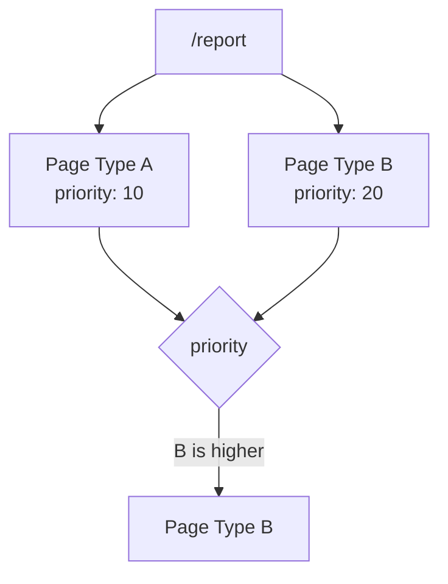

The Page Type with the greatest `priority` is selected. If several Page Types
share the highest priority, one is not chosen implicitly:

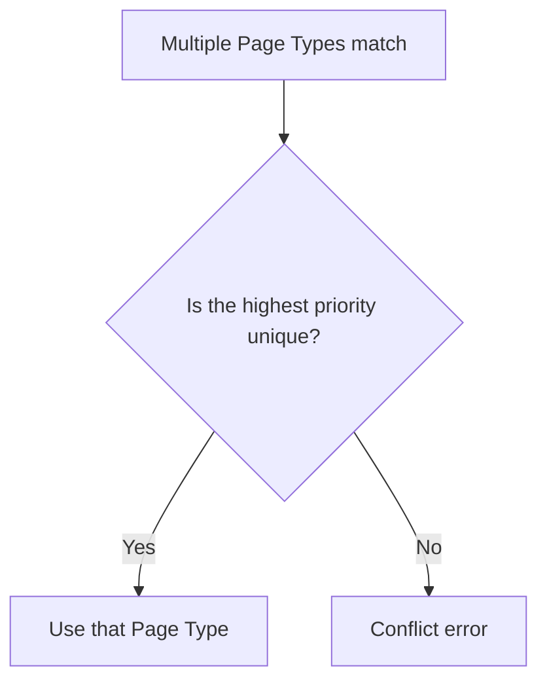

Making the conflict an explicit error prevents the result from depending on
plugin registration order.

## HonoX application wiring

Every HonoX site that uses plugin pages needs the generic catch-all route. The
scaffolded site already includes it. The root `/` is resolved by
`resolveRiebeckiteHomeRequest(c, content)`, which shares the same mechanics:

```tsx
import {
  contentRouteSsgParams,
  resolveRiebeckiteContentRequest,
  riebeckiteSsgParams,
} from "@riebeckite/honox/server";
import { PageBody } from "@riebeckite/honox/ui";
import { createRoute } from "honox/factory";

export default createRoute(
  contentRouteSsgParams("/:slug{.+}", () => riebeckiteSsgParams(content)),
  async (c) => {
    const resolved = await resolveRiebeckiteContentRequest(c, content);

    if (resolved.kind === "response") return resolved.response;

    if (resolved.kind === "page") {
      return c.render(<PageBody html={resolved.page.body} />);
    }

    return c.render(/* site-specific article composition */);
  },
);
```

A normal site user does not need to add this route per plugin. The shared route
resolves plugin pages together, and the root `/` is resolved by
`resolveRiebeckiteHomeRequest(c, content)`, which shares the same mechanics.

## What a page can return

A plugin page can provide page metadata in addition to the HTML body, for
example:

```text
body
title
description
headTags
language
```

It does not decide **where** those values are rendered:

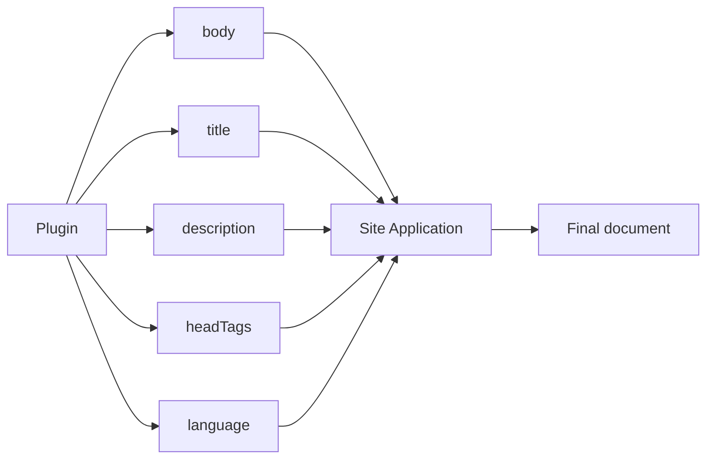

The site application receives them and reflects them in the existing document
frame. A plugin page therefore still uses the site's navigation, header,
footer, and theme.

## HTML safety

A Page Type's `body` is rendered as HTML, so a plugin must only return HTML it
can generate safely. Do not embed a request parameter directly into HTML:

```ts
// Avoid
body: `<p>${untrustedRequestValue}</p>`
```

Escape or sanitize untrusted input before using it. The final decision on how
HTML is rendered lives at the site application boundary; a Page Type is not a
mechanism to bypass the site's HTML safety policy.

## Page Types and themes

A theme does not need to know a Page Type ID. Instead of writing theme logic for
`example.report`, use:

- semantic tokens
- stable CSS hooks
- `data-*` attributes
- the CSS cascade

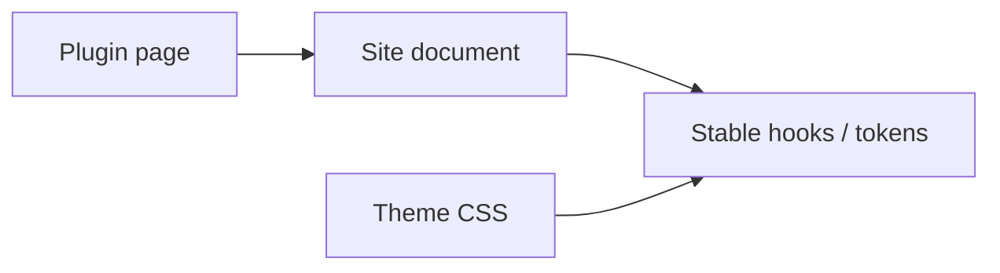

A new Page Type can therefore be added without coupling the theme directly to
the plugin.

## Page System boundaries

The most important rule is that **a plugin provides a page but does not own the
application**:

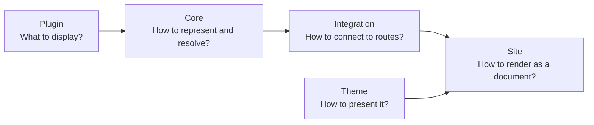

The responsibilities are:

```text
Plugin
  → provides the page content and public path

Core
  → provides the shared Page Type contract and resolution rules

HonoX Integration
  → connects Page Types to routing / SSG

Site Application
  → owns routes, the document frame, metadata, and HTML safety

Theme
  → changes the site's appearance
```

This boundary lets a plugin provide standalone pages without depending on
HonoX or a specific site structure.

Keep the frame's HTML policy at the application boundary. A plugin must only
return HTML it is responsible for generating; an application must not treat
untrusted request input as a page body.

For the complete fields and runtime validation rules, see the
[Plugin API](../reference/plugin-api.md#pages). For the site connection, see
[HonoX Integration](./honox-integration.md).
