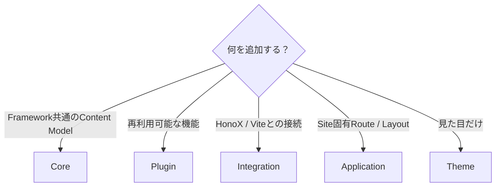
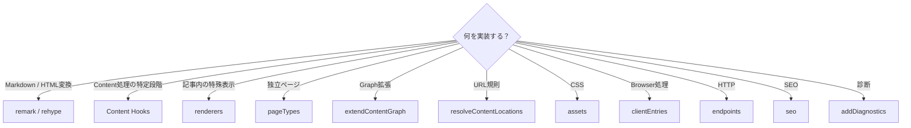
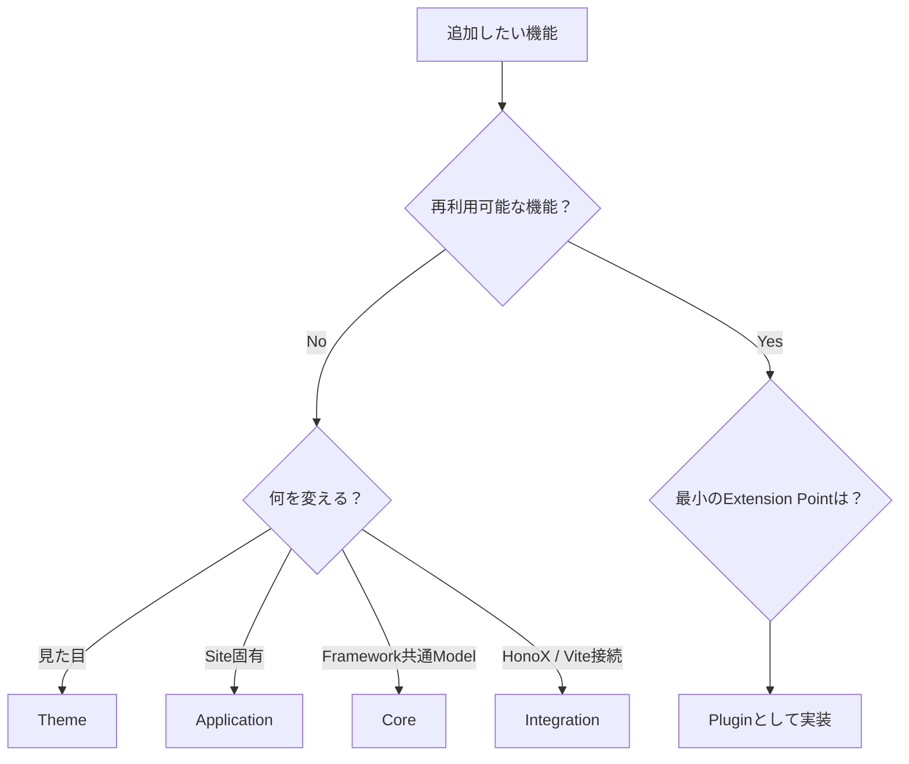

# プラグイン作成の詳細

このページは、Riebeckite Plugin を実際に設計・実装するときの詳細ガイドです。

初めて Plugin を作る場合は、先に [はじめてのプラグイン作成](../plugins/writing-a-plugin.ja.md) を読んでください。

このページでは、その先に必要になる、

- どの拡張ポイントを使うか
- Plugin 同士の依存関係
- Lifecycle
- Content Pipeline
- Renderer / Page Type
- CSS / Browser 処理
- Cache / Diagnostics
- Package としての配布

までをまとめて扱います。

各型やフィールドの完全な定義を確認したい場合は [Plugin API](../reference/plugin-api.ja.md) を参照してください。


## このページの構成

- [プラグインの依存関係と Lifecycle](./plugin-system/lifecycle.ja.md)
- [Content パイプラインと拡張ポイント](./plugin-system/pipeline.ja.md)
- [プラグインの配布と検証](./plugin-system/distribution.ja.md)

## 1. Plugin にするべき機能

Plugin は **Riebeckite に再利用可能な機能を追加する仕組み**です。

たとえば、

- Markdown / HTML の解釈
- Content Transformation
- 独自形式の Renderer
- Browser Behavior
- Diagnostics
- HTTP Endpoint
- SEO
- 独立ページ

などを実装できます。

一方、すべての拡張を Plugin にするわけではありません。



特に、

```text id="6pgq3j"
見た目だけ
  → Theme

Site 固有の Route / Layout
  → Application

HonoX / Vite との接続
  → Integration

Framework 全体の Content Model
  → Core
```

です。

「何でも Plugin にする」のではなく、その機能がどの責務に属するかを先に判断してください。


## 2. 最小の Plugin

Plugin は `definePlugin()` で定義します。

```ts id="sf8rf2"
import { definePlugin } from "@riebeckite/core";

export function examplePlugin() {
  return definePlugin({
    name: "example",
  });
}
```

Site では `riebeckite.config.ts` の `plugins` に追加します。

```ts id="32z2wh"
export default defineConfig({
  plugins: [
    examplePlugin(),
  ],
});
```

これが最小構成です。


## 3. Options を追加する

Plugin に設定が必要なら Factory の引数として受け取ります。

```ts id="m8h0dc"
type ExampleOptions = {
  enabled?: boolean;
};

export function examplePlugin(
  options: ExampleOptions = {},
) {
  return definePlugin({
    name: "example",
    options,
  });
}
```

利用側では、

```ts id="xw3gy8"
export default defineConfig({
  plugins: [
    examplePlugin({
      enabled: true,
    }),
  ],
});
```

のように指定できます。

条件付き Plugin も利用できます。

```ts id="d7esfe"
plugins: [
  condition && myPlugin(),
]
```

`false`、`null`、`undefined` は Plugin Input の解決時に除外されます。

また、

```ts id="3ud7ge"
enabled: false
```

の Plugin も実行されません。


## 4. 拡張ポイントを選ぶ

Plugin を実装するときは、必要な最小の拡張ポイントを選びます。



現在の主な Contract は次のとおりです。

| 領域 | API |
| --- | --- |
| Identity | `name`, `enabled`, `order`, `options` |
| Dependency | `provides`, `requires`, `optional` |
| Validation | `validateOptions` |
| Cache | `cacheVersion`, `context.cache` |
| Lifecycle | `setup`, `buildStart`, `buildEnd`, `dispose` |
| Content Hooks | `onConfigResolved`, `onContentLoaded`, `onPostParsed`, `onPostProcessed`, `onManifestCreated` |
| Public Location | `resolveContentLocations` |
| Pipeline | `remarkPlugins`, `rehypePlugins`, `extendMarkdownPipeline`, `extendHtmlPipeline` |
| Graph | `extendContentGraph` |
| Diagnostics | `addDiagnostics` |
| 本文内の描画 | `renderers` |
| 独立ページ | `pageTypes` |
| Browser | `assets`, `clientEntries` |
| HTTP | `endpoints` |
| SEO | `seo` |

すべてを実装する必要はありません。

UI や output の拡張ポイントは複数あり、優劣の順列ではなく選択肢です。Markdown / HTML 変換、renderer、Page Type、body Slot、公開する Hono JSX component、client entry があります。どれを選ぶかは [UI の提供方法](../plugins/writing-a-plugin.ja.md#ui-の提供方法) を参照してください。


## 27. 実装前の確認

Plugin を作り始める前に、最後に次の順番で考えると責務を分離しやすくなります。



Plugin にすると決めた後も、

**その機能に本当に必要な Extension Point だけを使用する**

ことが重要です。

Filesystem を再走査する前に Manifest や Content Graph が使えないか、独自 Route を追加する前に Page Type が使えないか、Client JavaScript を追加する前に SSR / Build-time だけで完結できないかを確認してください。

これによって Plugin を小さく保ち、Core、Integration、Application との不要な結合を避けられます。


## 関連資料

- [はじめてのプラグイン作成](../plugins/writing-a-plugin.ja.md) — 最初の Plugin を作る
- [Plugin System](./plugin-system.ja.md) — Plugin System 全体の考え方
- [Plugin API](../reference/plugin-api.ja.md) — API Contract
- [Page System](./page-system.ja.md) — 独立ページ
- [Content System](./content-system.ja.md) — Manifest / Graph / Pipeline
- [Architecture](./architecture.ja.md) — Core / Plugin / Integration / Theme / App の責務
- [Framework Reference](../reference/README.ja.md) — Public API
