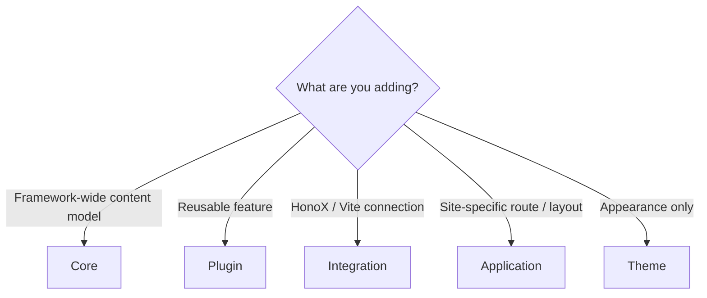
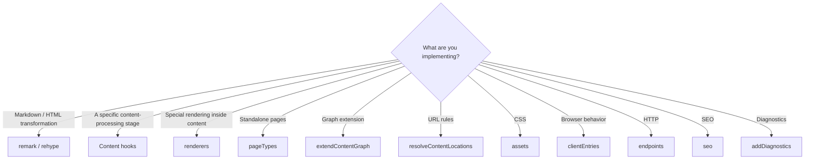
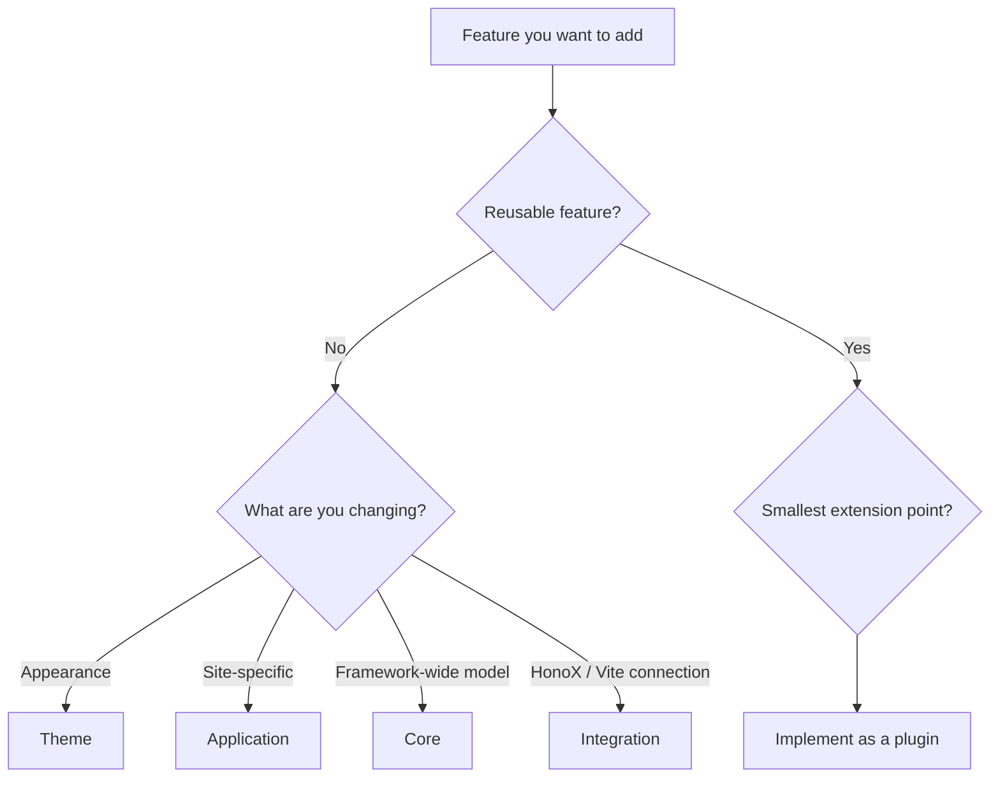

# Plugins in Depth

[Your First Plugin](../plugins/writing-a-plugin.md) is a short walkthrough that gets a plugin running. This page is its "in depth" companion: it collects everything you refer to while building a plugin — extension points, capabilities, lifecycle, pipelines, and packaging.

If you are new, read [your first plugin](../plugins/writing-a-plugin.md) first, and use this page when you want more detail. For the complete API surface, see [Plugin API](../reference/plugin-api.md).

## How this page is organized

- [Dependencies, context, and lifecycle](./plugin-system/lifecycle.md)
- [Content processing and extension points](./plugin-system/pipeline.md)
- [Packaging and verification](./plugin-system/distribution.md)

## 1. What a plugin does

A plugin adds **features**: Markdown/HTML interpretation, reusable content transformation, plugin-specific renderers, reusable browser behavior, plugin-specific diagnostics, and endpoint/SEO extensions.

**What does not go in a plugin:**

- framework-wide content model → Core
- the HonoX/Vite connection → Integration
- application-specific routes / layout → App
- appearance-only changes → Theme ([Theme System](./theme-system.md))



Rather than turning everything into a plugin, first decide which responsibility the
feature belongs to.

## 2. A minimal plugin and options

```ts
import { definePlugin } from "@riebeckite/core";

export function examplePlugin() {
  return definePlugin({
    name: "example",
  });
}
```

Give the factory typed options and keep the resolved options in `options`.

```ts
type ExampleOptions = {
  enabled?: boolean;
};

export function examplePlugin(options: ExampleOptions = {}) {
  return definePlugin({
    name: "example",
    options,
  });
}
```

Register it in `riebeckite.config.ts`:

```ts
export default defineConfig({
  plugins: [examplePlugin({ enabled: true })],
});
```

`false | null | undefined` entries are dropped from the plugin input, and `enabled: false` is never executed.

```ts
plugins: [
  condition && myPlugin(),
]
```

## 3. The extension points

The current Core contract covers the following areas. **You do not implement all of them — use the smallest extension point your plugin needs.**



UI and output have several extension points, and they are alternatives rather than a progression: Markdown/HTML transformation, renderers, Page Types, body slots, exported Hono JSX components, and client entries. To choose between them, see [Providing UI or output](../plugins/writing-a-plugin.md#providing-ui-or-output).

| Area | API |
| --- | --- |
| Identity | `name`, `enabled`, `order`, `options` |
| Dependency | `provides`, `requires`, `optional` |
| Validation | `validateOptions` |
| Cache | `cacheVersion`, `context.cache` |
| Lifecycle | `setup`, `buildStart`, `buildEnd`, `dispose` |
| Content hooks | `onConfigResolved`, `onContentLoaded`, `onPostParsed`, `onPostProcessed`, `onManifestCreated` |
| Public Location | `resolveContentLocations` |
| Pipeline | `remarkPlugins`, `rehypePlugins`, `extendMarkdownPipeline`, `extendHtmlPipeline` |
| Graph | `extendContentGraph` |
| Diagnostics | `addDiagnostics` |
| Rendering inside content | `renderers` |
| Standalone pages | `pageTypes` |
| Browser integration | `assets`, `clientEntries` |
| HTTP integration | `endpoints` |
| SEO | `seo` |

## Before you implement

Before starting a plugin, thinking through the following order helps keep
responsibilities separate.



Even after deciding on a plugin, it is important to **use only the extension
points that feature actually needs**. Before rescanning the filesystem, check
whether the Manifest or Content Graph can be used instead; before adding a
custom route, check whether a Page Type can be used instead; before adding
client JavaScript, check whether SSR or build-time processing alone is enough.

This keeps plugins small and avoids unnecessary coupling to Core, Integration,
and the Application.

## Further reading

- [Your First Plugin](../plugins/writing-a-plugin.md) — a step-by-step introduction
- [Plugin System](./plugin-system.md) — all extension points in detail
- [Plugin API](../reference/plugin-api.md) — the API contract
- [Page System](./page-system.md) — standalone pages
- [Content System](./content-system.md) — Manifest / Graph / pipeline contracts
- [Architecture](./architecture.md) — responsibilities of Core / Plugin / Integration / Theme / App
- [Framework Reference](../reference/README.md) — public APIs like `definePlugin`
