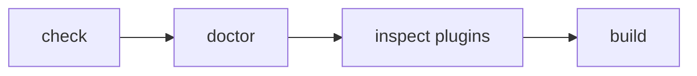

# プラグインの配布と検証

このページは [プラグイン作成の詳細](../plugin-system.ja.md) の一部で、Plugin のパッケージ化、配布、検証を扱います。

## 22. Site 内だけで使う Plugin

Plugin は npm に公開しなくても利用できます。

Site 内に、

```text id="17msvn"
site/
└─ extensions/
   └─ local-plugin.ts
```

のように置いて `definePlugin()` できます。

```ts id="mqm2gv"
// site/extensions/local-plugin.ts

return definePlugin({
  name: "site-local",

  assets: [
    {
      pluginName: "site-local",
      kind: "style",
      moduleSpecifier:
        "/extensions/plugin.css",
    },
  ],
});
```

Site-local Plugin も Published Plugin と同じ、

- Dependency Resolution
- Pipeline
- Hooks
- Diagnostics
- Renderer
- Page Type

などの Contract を利用します。

`createStyleAsset()` と `createClientEntry()` は
`@riebeckite/plugin-<name>/...` の specifier しか組み立てないため、その名前で
ない package（未公開 Plugin、別名の公開 package）は Host Bundler が解決できる
`moduleSpecifier` を直接指定してください。


## 23. Package として配布する

Plugin を再利用可能な Package として配布する場合は、たとえば次の構成にできます。

```text id="fs7fzp"
packages/plugins/example/
├─ index.ts
├─ components/       # 必要な場合のみ
├─ client.ts         # 必要な場合のみ
├─ src/
│  ├─ remark.ts
│  ├─ rehype.ts
│  ├─ renderer.ts
│  └─ types.ts
├─ style.css         # 必要な場合のみ
├─ package.json
├─ README_ja.md
└─ README.md
```

Riebeckite repository 内では `packages/plugins/backlinks` が参考になります。

公開 package では Build 済み ESM と型定義を publish し、`exports` をその成果物へ
向け、`prepack` script で build します。Repository の build script は publish
されないため、`esbuild`（`format: "esm"`、`packages: "external"`、
`external: ["@riebeckite/*"]`）と `tsc --emitDeclarationOnly` による小さな build を
用意してください。最小構成の `package.json` は
[Repository 外で Plugin を配布する](../../reference/plugin-api.ja.md#repository-外で-plugin-を配布する)
を参照してください。

ただし、すべての Plugin に `client.ts`、`style.css`、`components/` が必要なわけではありません。

必要なものだけを作成してください。


## 24. Repository 外で配布する

外部 Plugin Package は Riebeckite monorepo の内部構造に依存させません。

基本的には、

```text id="8pn4j3"
@riebeckite/core
```

の Public API を利用します。

Plugin 自身が持つ、

```text id="svimxk"
./client
./components
./style.css
```

などは、自身の `package.json` の `exports` で公開します。

次のような Internal Import は使用しません。

```ts id="y6jy1n"
import {
  something,
} from "@riebeckite/core/src/...";
```

monorepo 内にしか存在しない相対 Path にも依存しないでください。


## 25. ESM

NodeNext / ESM Package では、Build 後の JavaScript を Node.js が実際に解決できる必要があります。

Development 時だけ TypeScript Loader が、

```text id="5k12um"
extensionless import
```

などを解決できている状態に依存しないでください。

Package の正しさは Source Code だけではなく、**Build 後の配布形式でも確認する**必要があります。


## 26. Plugin を検証する

実装後は、小さい範囲から順番に確認します。



まず Configuration と Plugin Resolution を確認します。

```sh id="bgxy4d"
pnpm exec riebeckite check
```

次に Project の Health を確認します。

```sh id="8bfj5k"
pnpm exec riebeckite doctor
```

解決された Plugin を確認します。

```sh id="ad0h9x"
pnpm exec riebeckite inspect plugins
```

最後に実際の生成物まで確認します。

```sh id="f7grlr"
pnpm exec riebeckite build
```

Plugin が解決されない場合は、まず `check` の出力から、

- Import Error
- Missing Capability
- Duplicate Provider
- Dependency Cycle
- Invalid Options

などを確認してください。
