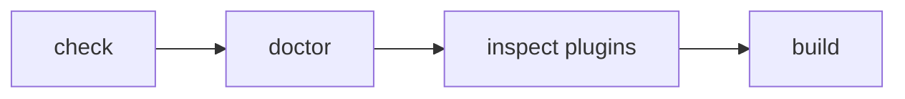

This page is part of [Plugins in Depth](../plugin-system.md) and covers packaging and verification.

# Packaging and verification

## 4. Packaging for distribution

A plugin does not have to be published to npm to be used. A site can define one
directly, for example:

```text
site/
└─ extensions/
   └─ local-plugin.ts
```

```ts
// site/extensions/local-plugin.ts

return definePlugin({
  name: "site-local",

  assets: [
    {
      pluginName: "site-local",
      kind: "style",
      moduleSpecifier: "/extensions/plugin.css",
    },
  ],
});
```

A site-local plugin uses the same contracts as a published one — dependency
resolution, pipeline, hooks, diagnostics, renderers, and Page Types.
`createStyleAsset()` and `createClientEntry()` only build
`@riebeckite/plugin-<name>/...` specifiers, so for a package that does not use
that name (an unpublished plugin, or a published package under a different
name) specify a `moduleSpecifier` the host bundler can resolve directly.

To distribute a plugin as a reusable package, use `packages/plugins/backlinks`
as a template. Recommended layout:

```text
packages/plugins/example/
├─ index.ts          ← factory calling definePlugin, re-exports public parts
├─ components/       ← components (if any)
├─ client.ts         ← only when needed
├─ src/
│  ├─ remark.ts
│  ├─ rehype.ts
│  ├─ renderer.ts
│  └─ types.ts
├─ style.css         ← only when needed
├─ package.json
├─ README_ja.md
└─ README.md
```

A distributed plugin depends only on `@riebeckite/core` and declares its own subpaths (`./client`, `./components`, `./style.css`) in `exports`. Never import `@riebeckite/core/src/**` or reference monorepo paths:

```ts
import {
  something,
} from "@riebeckite/core/src/...";
```

Not every plugin needs `client.ts`, `style.css`, or `components/` — create only
what it actually uses. For the package surface and current constraints, see "Public packages and import paths" in [Framework Reference](../../reference/README.md).

Publish built ESM plus type declarations and point `exports` at the built files; build them in a `prepack` script so packing and publishing ship fresh output. The repository's build script is not published, so supply a small build: bundle the entry points with `esbuild` (`format: "esm"`, `packages: "external"`, `external: ["@riebeckite/*"]`) and emit declarations with `tsc --emitDeclarationOnly`. See [Distributing a Plugin outside this repository](../../reference/plugin-api.md#distributing-a-plugin-outside-this-repository) for a minimal manifest.

In NodeNext/ESM packages, keep imports resolvable by Node after the build. Do not rely on the development TypeScript loader accidentally resolving extensionless imports. A package's correctness must be checked not only from its source code but also **from the built distribution form**.

## 5. Verify



```sh
npm exec riebeckite check               # validate config and plugin resolution
npm exec riebeckite doctor              # health check
npm exec riebeckite inspect plugins     # list resolved plugins
npm exec riebeckite build               # confirm it appears in the output
```

If a plugin does not resolve, start with `check` for capability or import errors. Look for:

- import error
- missing capability
- duplicate provider
- dependency cycle
- invalid options

Also ask whether you really need a plugin — perhaps configuration or an app implementation suffices.
