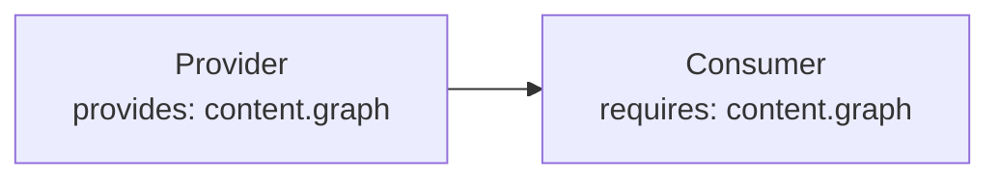
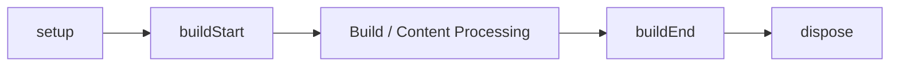
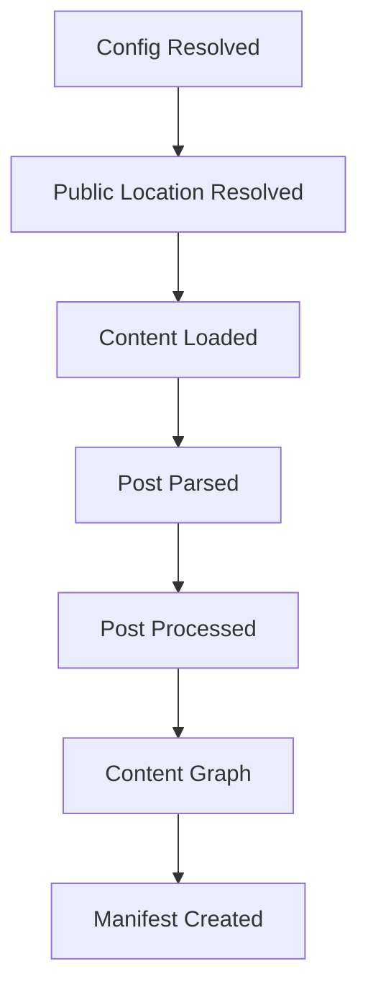

# プラグインの依存関係と Lifecycle

このページは [プラグイン作成の詳細](../plugin-system.ja.md) の一部で、Plugin 同士の依存関係、Options の検証、Plugin Context、Lifecycle を扱います。

## 5. Plugin の依存関係

Plugin 同士に実際の依存関係がある場合は Capability Contract を使用します。

```ts id="mdj2qn"
definePlugin({
  name: "consumer",

  provides: [
    "example.output",
  ],

  requires: [
    "content.graph",
  ],

  optional: [
    "example.optional",
  ],
});
```

それぞれ、

| Field | 意味 |
| --- | --- |
| `provides` | この Plugin が提供する Capability |
| `requires` | 必須の Capability |
| `optional` | あれば利用する Capability |

です。

Resolver は依存関係をもとに実行順を解決します。



次の状態は Configuration Error になります。

- 必須 Capability がない
- Provider が重複している
- Dependency Cycle がある

`order` は依存解決前の基本順序です。

実際の依存関係を表現するために `order` を使わないでください。


## 6. Options を検証する

TypeScript の型だけでは Runtime Value を完全には保証できません。

必要な Plugin は `validateOptions` を実装します。

```text id="09xj48"
Options
   ↓
validateOptions
   ↓
Structured Issues
   ↓
riebeckite check
```

Validator は副作用を持たせません。

特に、

- Filesystem Scan
- Build
- Cache Write
- 外部状態の変更

を行わないでください。

問題は Structured Issue として返し、Config Validation からまとめて表示できるようにします。


## 7. Plugin Context

Plugin は Framework の Service を `PluginContext` から受け取ります。

基本的な Context は概念的に次のようになります。

```ts id="jrp2vo"
type PluginContext = {
  config?: ResolvedRiebeckiteConfig;
  contentIndex: Map<string, string>;
  diagnostics: Diagnostic[];
  cache: PluginCache;
  output: GeneratedOutputSink;
  logger: Logger;
  tracer: Tracer;
  contentSource?: ContentSource;
};
```

Hook によって、

```text id="2t18qa"
slug
markdown
content
manifest
entries
location input
```

などが追加されます。

Plugin 内で Framework Service の Global Singleton を作るのではなく、Context から必要な Service を受け取ることを優先します。


## 8. Lifecycle

Framework Lifecycle には、

```text id="oy9iqs"
setup
buildStart
buildEnd
dispose
```

があります。

概念的には、



という流れになります。

`setup`、`buildStart`、`onConfigResolved`、Content 処理、`buildEnd` は、1つの `ContentManager` につき一度だけ実行されます。`buildEnd` は Diagnostics の収集後に完成した Manifest を受け取る唯一の終端 Hook です。`dispose` は確保した Resource の解放に使用し、解決済み Plugin の逆順で実行されます。

Lifecycle の実行順は、解決済み Plugin Order に従います。

Hook で Error が発生した場合は、

- Plugin 名
- Hook 名
- 元の Cause

が分かる形で上位へ伝播させてください。


## 9. Content Lifecycle

Content は複数の段階を通って処理されます。



全体の順序は `setup` → `buildStart` → `onConfigResolved` → Public Location 解決 → `onContentLoaded` → Markdown / HTML Pipeline → `onPostParsed` → `onPostProcessed` → `extendContentGraph` → `onManifestCreated` → Diagnostics → `buildEnd` です。

代表的な Hook は、

```text id="6idgbj"
onConfigResolved
onContentLoaded
onPostParsed
onPostProcessed
onManifestCreated
```

です。

必要な段階の Hook だけを使用してください。

たとえば Manifest にすでに存在する情報を `onContentLoaded` で独自に再構築する、といった実装は避けます。
