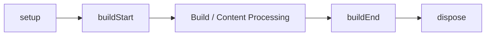
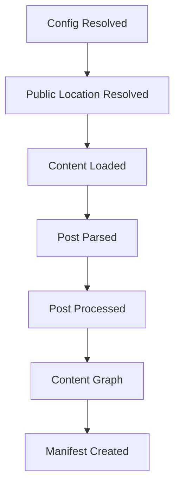

This page is part of [Plugins in Depth](../plugin-system.md) and covers dependencies, plugin context, and lifecycle.

# Dependencies, context, and lifecycle

## 3-1. Dependency / capability

```ts
definePlugin({
  name: "consumer",
  provides: ["example.output"],
  requires: ["content.graph"],
  optional: ["example.optional"],
});
```

| Field | Meaning |
| --- | --- |
| `provides` | capabilities this plugin offers |
| `requires` | mandatory capabilities |
| `optional` | capabilities used when present |

The resolver places providers before consumers:


The following states are configuration errors:

- a required capability is missing
- a provider is duplicated
- there is a dependency cycle

`order` is only a base ordering before dependency resolution. Unrelated plugins keep their input order as much as possible. Prefer the capability contract over raw `order` when dependencies exist.

## 3-2. validateOptions

TypeScript types do not fully guarantee runtime values after the config file executes. Plugins that need it provide `validateOptions`. A validator must **have no side effects** — no filesystem scanning, no builds, no cache writes, and no modification of external state. Return problems as structured issues so config validation can display them together.

```text
Options
   ↓
validateOptions
   ↓
Structured Issues
   ↓
riebeckite check
```

## 3-3. Plugin context

```ts
type PluginContext = {
  config?: ResolvedRiebeckiteConfig;
  contentIndex: Map<string, string>;
  diagnostics: Diagnostic[];
  cache: PluginCache;
  output: GeneratedOutputSink;
  logger: Logger;
  tracer: Tracer;
  contentSource?: ContentSource;
};
```

Depending on the hook, `slug`, `markdown`, `content`, `manifest`, `entries`, and location input are added. Prefer receiving framework services from the context over creating global singletons.

## 3-4. Lifecycle

`setup`, `buildStart`, `onConfigResolved`, content processing, and `buildEnd` run once per `ContentManager`. `buildEnd` receives the completed manifest after diagnostics have been collected and is the only terminal build hook. `dispose` frees acquired resources and runs in reverse resolved order. Named lifecycle and content hook failures identify the plugin, hook, and original cause. Other hook families follow resolved plugin order.



## 3-5. Content pipeline stages



```text
setup → buildStart → config resolved → public locations resolved
→ content loaded → Markdown/HTML pipeline → post parsed → post processed
→ content graph → manifest created → diagnostics → build end
```

The representative hooks are:

```text
onConfigResolved
onContentLoaded
onPostParsed
onPostProcessed
onManifestCreated
```

Use only the hooks you actually need. Do not reconstruct later-stage information in earlier stages. For example, avoid rebuilding information that already exists in the Manifest inside `onContentLoaded`.
