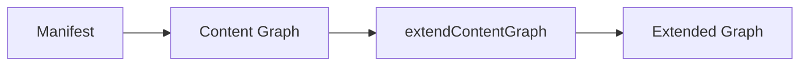
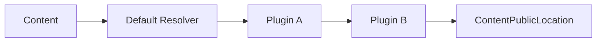
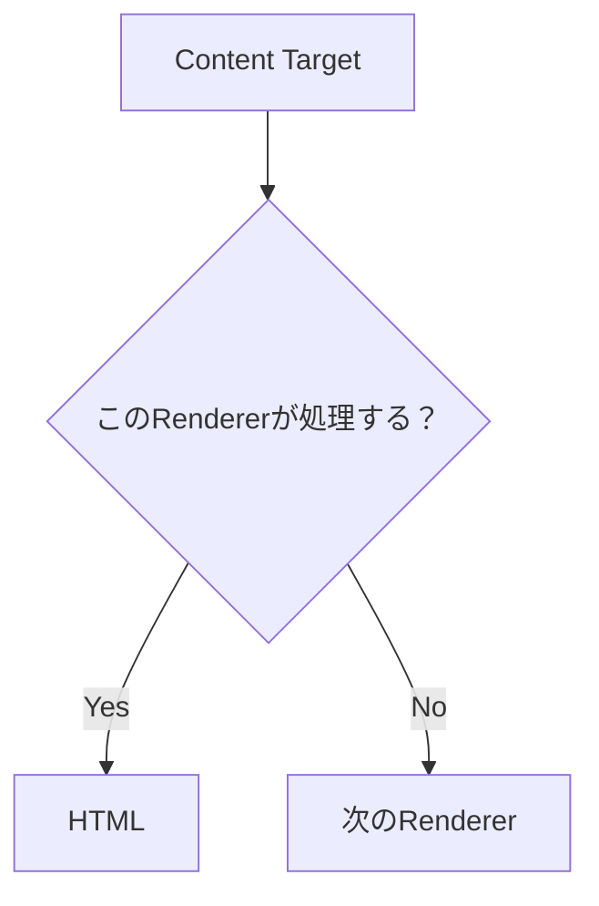
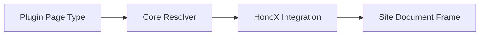
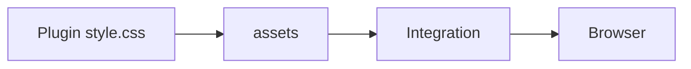
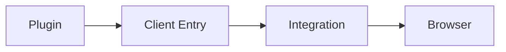
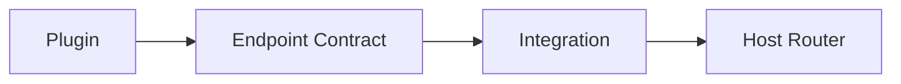
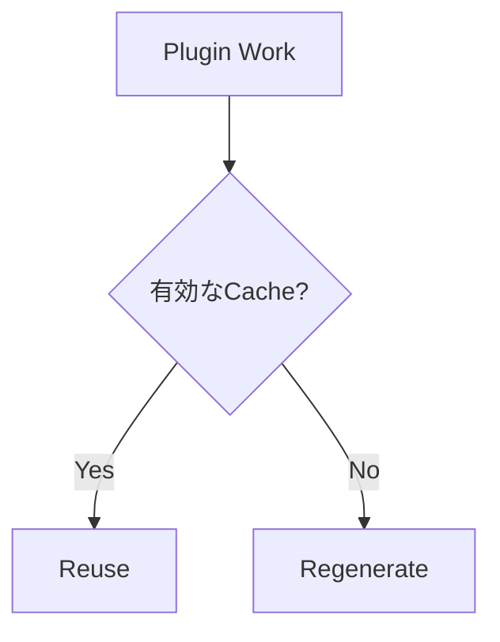

# Content パイプラインと拡張ポイント

このページは [プラグイン作成の詳細](../plugin-system.ja.md) の一部で、Content を扱う拡張ポイント（Markdown / HTML Pipeline、Content Graph、Renderer、Page Type など）を扱います。

## 10. Markdown / HTML Pipeline

Markdown や HTML の意味を変換する場合は remark / rehype を利用します。

単純な Plugin なら、

```ts id="twapvp"
definePlugin({
  name: "example",

  remarkPlugins: [
    remarkExample,
  ],

  rehypePlugins: [
    rehypeExample,
  ],
});
```

と宣言できます。

Pipeline 自体を構成する必要がある場合は、

```ts id="5fj1xn"
definePlugin({
  name: "example",

  extendMarkdownPipeline(pipeline) {
    pipeline.use(remarkExample);
  },

  extendHtmlPipeline(pipeline) {
    pipeline.use(rehypeExample);
  },
});
```

を使用します。

Markdown / HTML の意味変換を Application Component に持ち込まず、Plugin の Pipeline 処理として実装するのが基本です。


## 11. Content Graph

Content Graph を拡張する場合は `extendContentGraph` を使用します。



Backlinks や Graph 系機能を実装するために、Plugin が Filesystem を再走査しないでください。

すでに解決された Manifest / Content Graph を利用します。


## 12. Public Location

Content の公開 URL を変更する Plugin では `resolveContentLocations` を使用します。

最初に Core が Default Location を解決します。

```text id="dug8by"
index
  → /

その他
  → /{slug}
```

その後、解決済み Plugin Order に従って Location Hook が実行されます。



結果は `ContentPublicLocation` として、

- Manifest
- Content Graph
- Markdown Pipeline

などから利用されます。

URL Strategy は Plugin が所有します。

Core は特定 Plugin の URL 規則を知りません。

Consumer は最終的な、

```ts id="b9m3p8"
entry.permalink
```

を利用します。

Location を解決できない場合は、slug へ暗黙的に fallback せず明示的な Error とします。


## 13. Renderers

`renderers` は記事本文内の特殊な Content Target を HTML へ変換します。

たとえば、

```text id="o4apio"
Canvas
Bases
Excalidraw
Attachment
Media
```

などです。

Renderer Context には、

```text id="pbh0ss"
kind
path
raw
label
url
embed
```

と通常の `PluginContext` が含まれます。



処理対象でなければ `null` を返します。

これによって複数 Renderer が同じ Pipeline に参加できます。


## 14. Page Types

独立した URL を持つ画面を Plugin が提供する場合は `pageTypes` を使用します。

たとえば、

```text id="9tlwkd"
/explore
/report
/tags/example
```

などです。

Page Type は、

- 一意な `id`
- SSG 用 `paths`
- 必要に応じた `priority`
- `resolve`

を持ちます。

Resolver は Framework 非依存の HTML Body または `null` を返します。

必要なら、

```text id="pjgd7n"
title
description
headTags
```

も返せます。

ただし Document Frame は Site Application が所有します。



Taxonomy の一覧や Explorer のような独立画面には Page Type を使用します。

Canvas、Bases、Excalidraw のような記事本文への埋め込みには Renderer を使用します。

Plugin が HonoX Route File や Document Frame を所有しないことが重要です。

Page Type の詳しい仕組みは [Page System](../page-system.ja.md) を参照してください。


## 15. Assets

Plugin 固有の Stylesheet は Plugin Package 内に置き、`assets` から公開します。

```ts id="b4qrvi"
assets: [
  {
    pluginName: "example",
    kind: "style",
    moduleSpecifier:
      "@riebeckite/plugin-example/style.css",
  },
]
```

Integration がこの Module Specifier を解決して Browser へ届けます。



Plugin 固有 CSS を `apps/web` にコピーしたり、Browser から `/node_modules` を直接参照させたりしないでください。


## 16. CSS Hooks

再利用可能な UI を Plugin が描画する場合は、最外要素に Stable Root Hook を付けます。

Plugin / Feature Hook は、

```text id="59lz7m"
rr-<feature>
```

とします。

たとえば、

```text id="gj2f5a"
rr-search
rr-callout
rr-query
rr-code
```

です。

内部要素では BEM を利用できます。

```text id="9lq6se"
rr-search
rr-search__input
rr-search__result
rr-search--loading
```

Namespace の役割は次のとおりです。

| Namespace | 用途 |
| --- | --- |
| `rb-*` | Framework の構造 Hook |
| `--rb-*` | Framework の Semantic Token |
| `rr-*` | Plugin / Feature Hook |
| `--rr-*` | Plugin 固有 Token |

Plugin の出力を `rb-*` Namespace に置かないでください。

既存 Class がある場合は削除せず、`rr-*` Hook を追加します。

また、

```text id="21g4wg"
rr-feature__*
rr-feature--*
```

は原則として内部実装です。

Theme から利用してよい子孫 Class だけを Public Hook として文書化してください。


## 17. Client Entries

Browser 上で初期化処理が必要な場合だけ `clientEntries` を使用します。

```ts id="a8cjlk"
clientEntries: [
  {
    pluginName: "example",
    moduleSpecifier:
      "@riebeckite/plugin-example/client",
    exportName: "initExample",

    publicConfig: {
      selector: ".example",
    },
  },
]
```



SSR / Build-time だけで完結する Plugin に Client JavaScript を追加しないでください。

`publicConfig` は Browser へ渡されるため、

- Token
- Credential
- Secret
- Private Service URL

などを含めてはいけません。

Plugin の `options` が自動的に Client へ渡されることもありません。


## 18. Endpoints / SEO

HTTP Endpoint を提供する場合は `endpoints` Contract を使用します。



HonoX など特定の Route Framework を Plugin 本体へ直接組み込まないでください。

SEO へ参加する場合は `seo` を使用します。

たとえば Metadata や Feed に Plugin が情報を追加できます。

Application Route 側へ Plugin 固有 SEO Logic を再実装しないことが重要です。


## 19. Diagnostics

Plugin 固有の問題は `addDiagnostics` から報告します。

```ts id="1xq5te"
addDiagnostics(context) {
  return [
    {
      // Diagnostic contract
    },
  ];
}
```

診断結果は可能な限り Structured Data として返してください。

Plugin が、

```ts id="c4x89a"
console.log(...)
```

で独自の CLI Output を作るのではなく、Diagnostics または Logger を使用します。


## 20. Plugin Cache

`context.cache` は Plugin ごとに分離された Build-time Cache です。

保存するデータには次の条件があります。

- 再生成できる
- JSON Serializable
- Plugin Namespace 内で完結する
- 壊れていても安全に Cache Miss として扱える

`cacheVersion` を使って Cache Format の互換性を管理できます。

Write は Atomic に行います。



これは Runtime Database ではありません。

Cloudflare Workers などの永続 Storage として使用しないでください。


## 21. Logger / Tracer

Plugin では Framework の Logger / Tracer を利用できます。

```ts id="j7ad6k"
context.logger.info("...");

await context.tracer.span(
  "plugin.example.work",
  {
    plugin: "example",
  },
  async () => {
    // work
  },
);
```

Logger は処理内容を記録し、Tracer は処理時間などを Structured Trace として記録します。

Profiler はこの Trace を利用するため、Plugin ごとに独自の Stopwatch や Profiling System を作る必要はありません。
