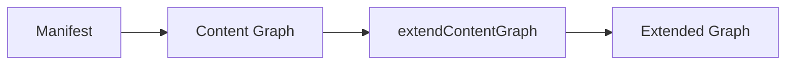
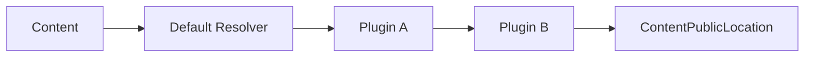
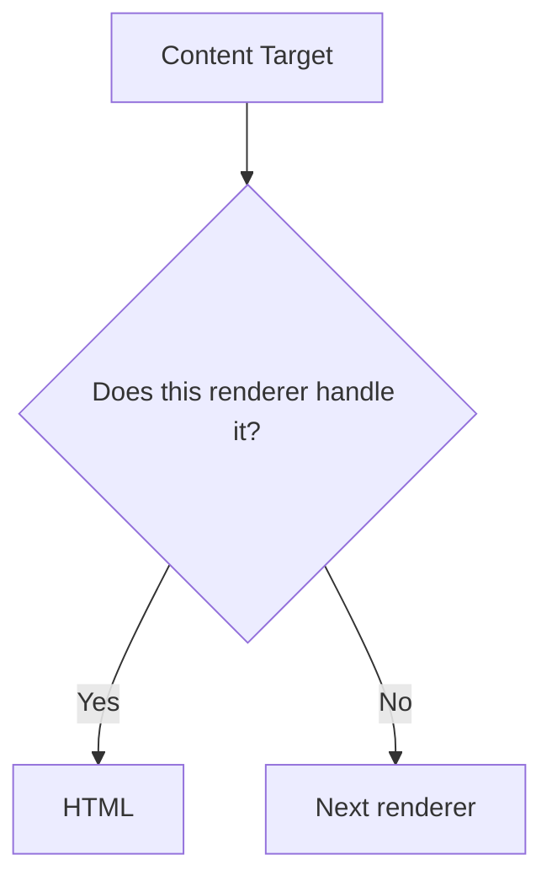
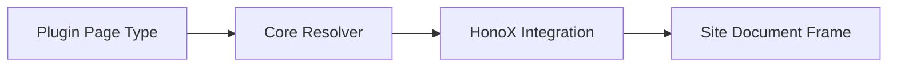
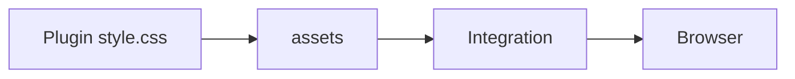
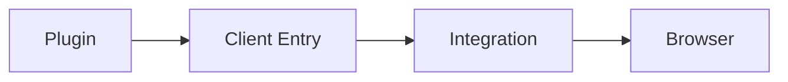
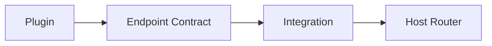
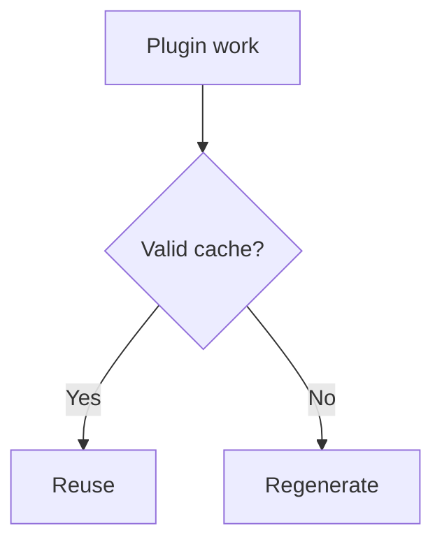

This page is part of [Plugins in Depth](../plugin-system.md) and covers content processing and the extension points.

# Content processing and extension points

## 3-6. Markdown / HTML pipeline

Simple remark/rehype plugins are declared as arrays.

```ts
definePlugin({
  name: "example",
  remarkPlugins: [remarkExample],
  rehypePlugins: [rehypeExample],
});
```

To compose the pipeline itself:

```ts
definePlugin({
  name: "example",
  extendMarkdownPipeline(pipeline, context) {
    pipeline.use(remarkExample);
  },
  extendHtmlPipeline(pipeline) {
    pipeline.use(rehypeExample);
  },
});
```

Semantic Markdown/HTML transformation belongs in the plugin; do not bring AST processing into application components.

## 3-7. Content graph and public locations

`extendContentGraph` extends the graph before or after construction within the framework contract. For backlinks or graph features, do not rescan the filesystem yourself — use the existing Content Graph / Manifest contract.



`resolveContentLocations` replaces the public location of content entries. Core first applies the default resolver (`resolveDefaultContentLocation`: `index` → `/`, otherwise `/{slug}`), then runs each plugin hook in resolved plugin order, and keeps the result as `ContentPublicLocation` in the manifest / graph / pipeline. URL strategy is the plugin's responsibility. An unresolved location is an **explicit error**, not a slug fallback.



Consumers read the resolved `entry.permalink`.

## 3-8. Renderers

`renderers` transform a content target into plugin-specific HTML. Examples include Canvas, Bases, Excalidraw, Attachment, and Media. The context includes `kind`, `path`, `raw`, `label`, `url`, `embed`, plus the usual `PluginContext`. Return `null` when the target is not yours so other renderers are tried.



## 3-9. Page Types

`pageTypes` provides an independent screen through the site's generic catch-all route. Examples include `/explore`, `/report`, and `/tags/example`. A type has a globally unique `id`, static or manifest-derived `paths`, an optional `priority`, and `resolve`. It returns a framework-independent HTML body or `null`. It may also describe `title`, `description`, and `headTags`; the site document frame renders those values.

Use a Page Type for a page such as a taxonomy listing or explorer. Use a renderer for an article embed such as Canvas, Bases, or Excalidraw. Plugins do not add HonoX route files or own the document frame.



Page Type IDs are validated at runtime and must be unique. If more than one type resolves a request, the greatest priority wins; a tie is an error. Use the resolved manifest passed to the resolver, reading `manifest.publicEntries` or `manifest.discoverableEntries` rather than `manifest.entries`. The application wires `resolveRiebeckiteRoute` and `pluginPageSsgParams` into its catch-all route; the scaffold does this already. See [Page System](../page-system.md) for the full rendering flow and [Plugin API](../../reference/plugin-api.md#pages) for the contract.

## 3-10. Assets

Put plugin stylesheets inside the plugin package and declare the module specifier in `assets`.

```ts
assets: [{
  pluginName: "example",
  kind: "style",
  moduleSpecifier: "@riebeckite/plugin-example/style.css",
}]
```

Do not copy plugin CSS into `apps/web`, and never reference `/node_modules` directly from the browser. The integration resolves the module specifier and delivers it to the browser:



**In-site plugins**: a plugin does not have to be published. Define it inside the site with `definePlugin` and pass it to `plugins`. Resolution order, dependency resolution, pipeline hooks, and diagnostics use the same contract as a package.

```ts
// site/extensions/local-plugin.ts
return definePlugin({
  name: "site-local",
  assets: [{
    pluginName: "site-local",
    kind: "style",
    moduleSpecifier: "/extensions/plugin.css",
  }],
});
```

`createStyleAsset()` and `createClientEntry()` build `@riebeckite/plugin-<name>/...` specifiers, so they fit only a package literally named that way. An unpublished plugin, or a published package under any other name, must provide an explicit `moduleSpecifier` the host bundler can resolve.

## 3-11. CSS hooks

Plugin CSS lives in the plugin package and reaches the browser through `assets`. When a plugin renders an independent, reusable feature, put a stable root hook on the outermost element.

- Name plugin/feature hooks `rr-<feature>` (`rr-search`, `rr-callout`, `rr-query`, `rr-code`, …). Below the root, use the BEM shape `rr-<feature>`, `rr-<feature>__element`, `rr-<feature>--modifier`.
- Keep existing classes on the same element. `rr-` hooks are additions, so existing selectors and site overrides keep working.
- Do not put plugin output in the `rb-` namespace. `rb-*` classes and `--rb-*` tokens belong to the framework's structural hooks and semantic design tokens. Plugin-specific tokens are `--rr-*`, with `--rb-*` as fallback.
- `rr-<feature>__*` and `rr-<feature>--*` are internal implementation details. Document only the descendants you want themes to style.

| Namespace | Purpose |
| --- | --- |
| `rb-*` | Framework structural hooks |
| `--rb-*` | Framework semantic tokens |
| `rr-*` | Plugin / feature hooks |
| `--rr-*` | Plugin-specific tokens |

## 3-12. Client entries

Use `clientEntries` only when browser initialization is required.

```ts
clientEntries: [{
  pluginName: "example",
  moduleSpecifier: "@riebeckite/plugin-example/client",
  exportName: "initExample",
  publicConfig: { selector: ".example" },
}]
```



Do not add client JavaScript to plugins that work purely at SSR/build time. `publicConfig` is passed to the client initializer and recorded in the manifest so static hosts can use it. Plugin `options` are not passed to the client automatically. Never register tokens, credentials, or private service URLs as public config.

## 3-13. Endpoints and SEO

HTTP endpoints use the `endpoints` contract. Do not embed route-framework implementations in the plugin itself; the integration connects the endpoint contract to the host router.



`seo` lets a plugin participate in SEO processing (metadata/feeds). Do not reimplement plugin-specific SEO logic in application routes.

## 3-14. Diagnostics

```ts
addDiagnostics(context) {
  return [{
    // follows the Diagnostic contract
  }];
}
```

Return diagnostics as structured data whenever possible. Use Diagnostics / Logger instead of `console.log` from the plugin.

## 3-15. Plugin cache

`context.cache` is a **build-time cache** isolated per plugin.

- Store only regenerable values
- JSON-serializable values
- Do not reference across plugin namespaces
- Switch compatibility with `cacheVersion`
- Treat corrupt caches as safe misses
- Writes are atomic
- Do not use it as a runtime database



It is not Cloudflare Workers persistent storage.

## 3-16. Logger / tracer

```ts
context.logger.info("...");
await context.tracer.span("plugin.example.work", { plugin: "example" }, async () => {
  // work
});
```

The profiler uses structured traces; plugins do not need their own stopwatch/reporting system.
