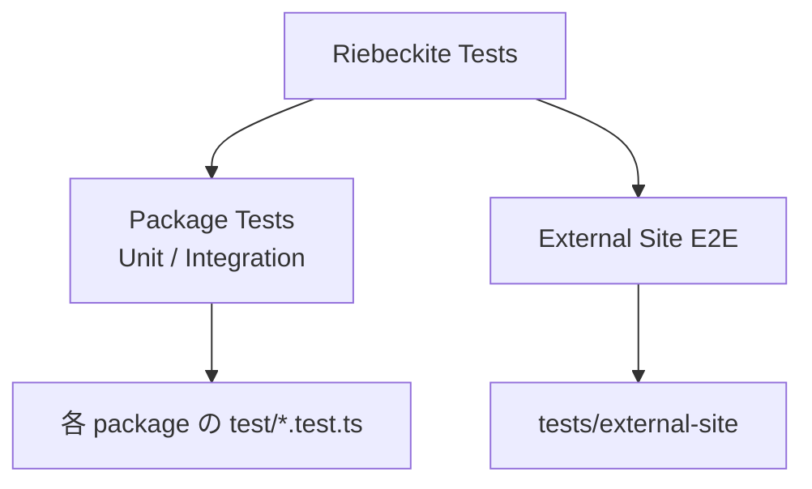
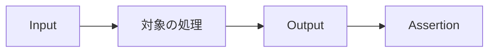
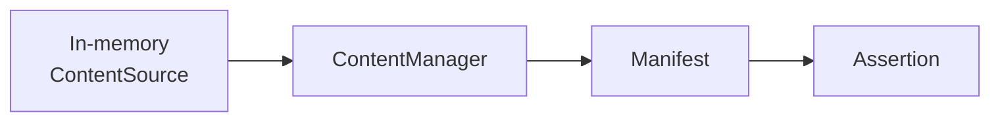
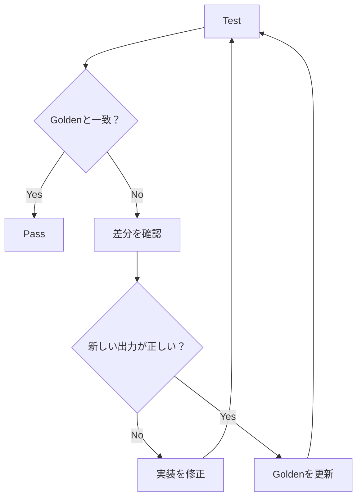
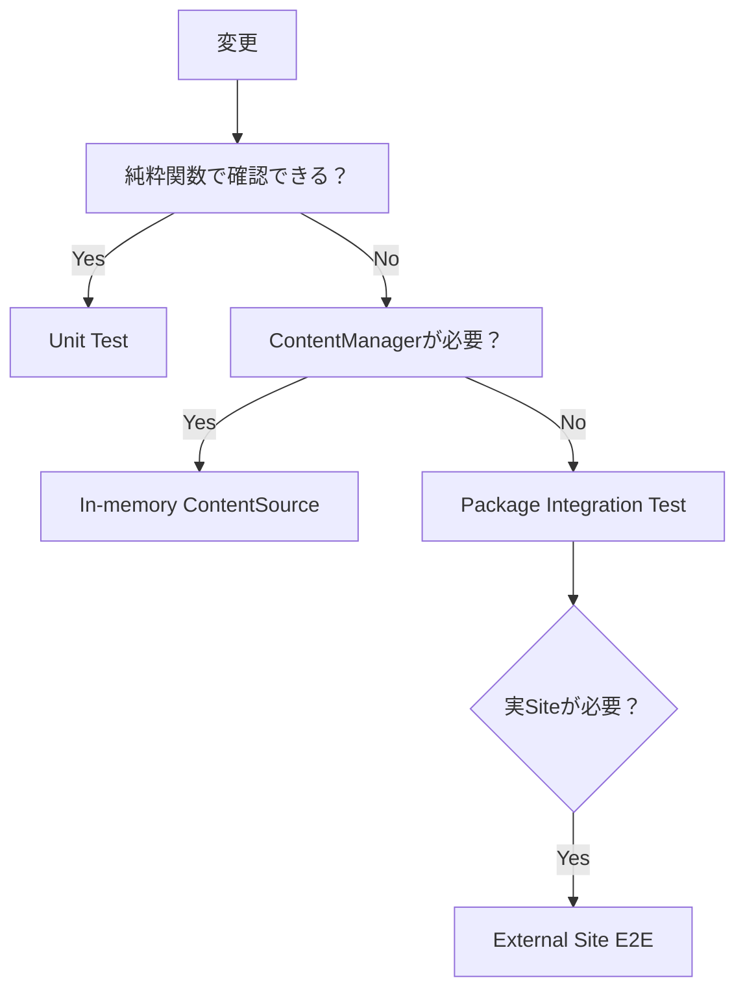
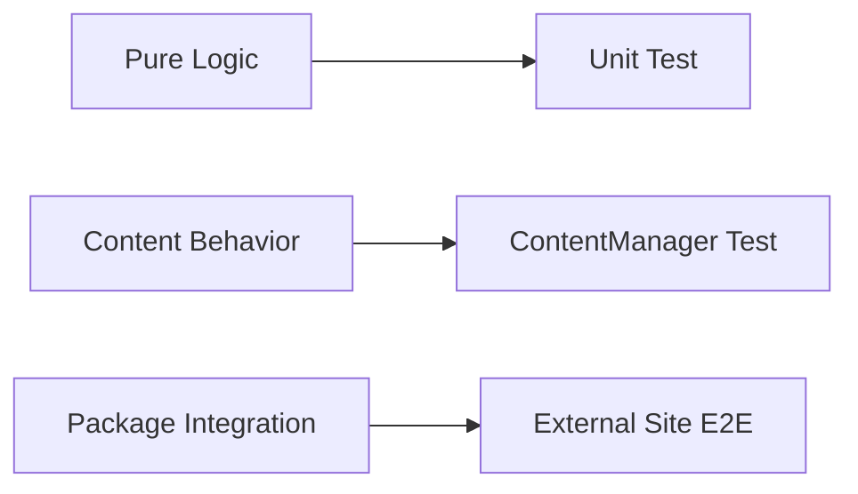

# テスト

Riebeckite では、変更によって既存の動作が壊れていないことを自動テストで確認します。

基本のテスト環境は、

- Node.js 組み込みの `node:test`
- TypeScript を直接実行する `tsx`

です。

Jest や Vitest などの追加のテストフレームワークは使用しません。

また、HTML や JSON のように手作業では確認しづらい大きな出力には **Golden File** を使用します。期待する出力そのものをファイルとして保存することで、変更内容を Pull Request の差分として確認できます。

# テストの種類

Riebeckite には大きく2種類のテストがあります。



このページで主に扱うのは、**各 Package に置くテスト**です。

実際の外部 Site を生成して検証する End-to-End Test は、

```text
tests/external-site
```

にあります。

```sh
pnpm test:e2e:external
```

で実行できます。

External Site E2E を動かす再利用可能な Engine は、

```text
@riebeckite/test/e2e
```

にあります。

一方、

- Riebeckite repository 固有の Fixture
- テスト対象 Package の一覧
- Repository 固有の Assertion

は `tests/external-site` に置きます。

第三者 Plugin を外部 Package の立場で検証する Fixture は `tests/plugin-dx` にあります（独立した pnpm workspace）。

```sh
pnpm test:plugin-dx            # Public API だけで書いた Plugin の Unit Test
pnpm test:plugin-dx:external   # packed tarball を隔離 Site へ install して検証
```

`test:plugin-dx:external` は `@riebeckite/core` と fixture Plugin を `pnpm pack` し、monorepo の外の隔離 Site に install して、公開 Package だけで Plugin が動作することを確認します。外部配布する Plugin の回帰検知に利用できます。

# テストを実行する

よく使うコマンドは次のとおりです。

| コマンド | 内容 |
| --- | --- |
| `pnpm test` | `test` Script を持つすべての Package をテスト |
| `pnpm --filter <package> test` | 特定の Package だけテスト |
| `pnpm test:update` | すべての Golden File を現在の出力で更新 |
| `pnpm test:e2e:external` | External Site E2E を実行 |
| `pnpm test:plugin-dx` | 外部 Package 視点の Plugin Fixture をテスト |
| `pnpm test:plugin-dx:external` | packed tarball を隔離 Site へ install して Plugin を検証 |
| `pnpm test:registry` | Scaffold の install Contract を npm 公開 artifact に対して実行 |

Scaffold の install Contract は、既定では **workspace を `pnpm pack` した artifact** を install して検証します。そのため、新しい Package を追加した branch でも publish 前に検証できます。`pnpm test:registry` は同じ Contract を npm からの install に切り替え、公開済み artifact が解決できることを確認します。Release 後に実行してください。

通常は、変更した範囲に近いテストから実行してください。

たとえば TOC Plugin だけを変更した場合は、

```sh
pnpm --filter @riebeckite/plugin-toc test
```

とします。

その後、必要に応じて Repository 全体の、

```sh
pnpm test
```

を実行します。

# Golden File を部分的に更新する

1つの Package の Golden File だけを更新したい場合は、`UPDATE_GOLDEN=1` を設定してテストします。

PowerShell では、

```powershell
$env:UPDATE_GOLDEN=1; pnpm --filter @riebeckite/plugin-toc test
```

です。

Golden File の更新は単にテストを通すために行うものではありません。

**新しい出力が正しいことを確認してから更新してください。**

# テストの置き場所

各 Package のテストは、

```text
test/*.test.ts
```

に置きます。

たとえば、

```text
packages/plugins/example/
├─ src/
├─ test/
│  ├─ example.test.ts
│  └─ __golden__/
│     └─ example.html
├─ package.json
└─ index.ts
```

のような構成です。

Package 自身が `test` Script を持ちます。

```json
{
  "scripts": {
    "test": "node --import tsx --test \"test/*.test.ts\""
  }
}
```

`test/` とテストファイルは、

- Type Check
- Package Build
- 公開 Package の `files`

から除外されます。

そのため、Riebeckite の利用者へテストコードが配布されたり、利用側の Build に影響したりしません。

# 共有テストユーティリティ

複数 Package から利用するテスト用機能は、

```text
@riebeckite/test
```

にあります。

必要な Package の `devDependencies` に追加し、

```ts
import {
  assertGolden,
} from "@riebeckite/test";
```

のように Public API から利用します。

テスト専用の共通処理を各 Plugin にコピーしないでください。

# Plugin のテスト

Plugin のテストは、確認したい範囲に合わせて次の4段階に分けられます。すべてを行う必要はありません。小さい範囲から始めてください。

```text
Level 1  Pure logic            通常の test runner でよい
Level 2  Markdown / HTML       Pipeline に Plugin を渡して変換結果を検証
Level 3  Content / lifecycle   ContentManager + In-memory ContentSource
Level 4  外部パッケージ境界     packed tarball を隔離 Site へ install
```

## Level 1: Pure Logic

Option の解決、文字列変換、AST ヘルパーなど、Riebeckite に依存しない処理は `node:test` などの通常の test runner でテストします。この段階では `@riebeckite/test` も `ContentManager` も不要です。

## Level 2: Markdown / HTML Transformation

Markdown / HTML の変換は、公開されている `Pipeline` に Plugin を渡して検証できます。

```ts
import { Pipeline } from "@riebeckite/core";
import { tipPlugin } from "../src/index.ts";

const pipeline = new Pipeline(new Map(), new Map(), undefined, {
  plugins: [tipPlugin()],
});

const { html } = await pipeline.execute(":::tip\nSave often.\n:::");
assert.match(html, /<aside class="rr-tip">/);
```

`Pipeline` の第1引数は content index、第2引数は permalink の `Map` です。単一 Document の変換なら空で構いません。第3引数は embed など他 Content を参照する場合だけ必要です。

`ContentManager` を使わずに変換だけを確認できるため、Plugin のテストで最もよく使う段階です。

## Level 3: Content / lifecycle

Content の読み込み、hook、manifest、body slot、Page Type を検証する場合は `ContentManager` を使います。後述の「Content を扱うテスト」と同じ In-memory `ContentSource` の形で、`getProcessedContent()` は Pipeline と Content hook を通した結果を、`getManifest()` は解決済み Plugin を含む manifest を返します。

## Level 4: 外部パッケージ境界

配布する Package は、`pnpm pack` した tarball を monorepo の外の隔離 Site へ install して検証します。これによって、公開 Export の不足、`@riebeckite/core/src/**` への誤った依存、`dependencies` の宣言漏れ、型定義の欠落を検出できます。

Repository の `tests/plugin-dx` がこの検証の実例で、前述のとおり `pnpm test:plugin-dx` と `pnpm test:plugin-dx:external` で実行します。

## `@riebeckite/test` の役割

`@riebeckite/test` は、Golden File の比較（`assertGolden` / `assertGoldenJson`）など、複数 Package で共有するテスト Helper を提供します。**必須ではありません**。Level 1〜3 のほとんどは `node:test` と公開 Core API（`Pipeline` / `ContentManager`）だけで書けます。`@riebeckite/test/e2e` は外部 Site を生成して検証する Repository 向けの Engine で、第三者 Plugin が通常使うものではありません。

# 基本的なテストの書き方

基本は、対象 Package の処理へ入力を渡して、その結果を検証します。

```ts
import assert from "node:assert/strict";
import { test } from "node:test";

import { renderBreadcrumbNav } from "../src/render.ts";

test("renders nothing for a single root item", () => {
  assert.equal(
    renderBreadcrumbNav([]),
    "",
  );
});
```

Riebeckite の Plugin Logic には純粋関数として切り出せる処理が多いため、すべてのテストで Build Pipeline 全体を起動する必要はありません。



小さい処理は、可能な限りこの形で直接テストします。

# Content を扱うテスト

Content System の動作を確認したい場合は、実際の Filesystem を用意するより、In-memory の `ContentSource` を利用するのが基本です。

```ts
const source = {
  async scan() {
    return [
      {
        path: "notes/index.md",
      },
    ];
  },

  async read(entry) {
    return `# ${entry.path}`;
  },
};

const config = resolveConfig({
  content: {
    directory: ".",
  },
});

const manager = new ContentManager(
  source,
  [],
  { config },
);

const manifest =
  await manager.getManifest();
```

これによって、



という小さい範囲で Content System を検証できます。

実際の Site や Vite Build が必要な問題でなければ、テストのためだけに Application 全体を組み立てないでください。

# Golden File

HTML や大きな JSON のように、個別の Assertion を大量に書くより出力全体を確認した方が分かりやすい場合は Golden File を使用します。

`@riebeckite/test` には2つの Helper があります。

| Helper | 用途 |
| --- | --- |
| `assertGolden(actual, goldenUrl)` | HTML、Markdown、Text、Serialized JSON |
| `assertGoldenJson(value, goldenUrl)` | Object / JSON |

`assertGoldenJson()` は比較前に、

```ts
JSON.stringify(value, null, 2)
```

で整形します。

# Golden File の配置

期待値は、

```text
test/__golden__/
```

に置きます。

たとえば、

```text
test/
├─ toc.test.ts
└─ __golden__/
   └─ toc.html
```

です。

テストからは `import.meta.url` を基準に URL を渡します。

```ts
import { test } from "node:test";
import {
  assertGolden,
} from "@riebeckite/test";

test("renders the table of contents", () => {
  assertGolden(
    renderToc(entries),
    new URL(
      "./__golden__/toc.html",
      import.meta.url,
    ),
  );
});
```

絶対 Path や Current Working Directory に依存させないことが重要です。

# Golden File の比較

既定では出力を少し正規化してから比較します。

具体的には、

```text
CRLF / CR
    ↓
LF

末尾の複数改行
    ↓
1つの改行
```

へ統一します。

これによって Windows / Linux や Editor の設定による不要な差分を防ぎます。

バイト単位で厳密な比較が必要な場合は、

```ts
assertGolden(
  actual,
  goldenUrl,
  {
    normalize: false,
  },
);
```

とします。

# Golden File が一致しない場合

Golden File が、

- 存在しない
- 現在の出力と一致しない

場合、テストは失敗します。

出力の変更が意図したものであることを確認したら、

```sh
pnpm test:update
```

で Golden File を更新します。



Golden File をコミットするのは意図的です。

出力の変更を、

```diff
- 以前の出力
+ 新しい出力
```

として Pull Request 上でレビューできるようにするためです。

**Golden File の更新そのものを修正として扱わず、なぜ出力が変わったのかを必ず確認してください。**

# Node の Snapshot を使わない理由

Riebeckite では Node.js 組み込みの Snapshot Assertion、

```text
--test-update-snapshots
```

は使用していません。

これは Node.js 22.3 以降を必要とします。

Riebeckite は Node.js 20.19 以降も対象としているため、独自の Golden File Helper を使用します。

# Package にテストを追加する

まだテストを持っていない Package に追加する場合は、次の順番で設定します。

## 1. `tsx` を追加する

Package の `devDependencies` に `tsx` を追加します。

## 2. `test` Script を追加する

```json
{
  "scripts": {
    "test": "node --import tsx --test \"test/*.test.ts\""
  }
}
```

## 3. 必要なら `@riebeckite/test` を追加する

Golden Helper などを使う場合は、

```text
@riebeckite/test
```

を `devDependencies` に追加します。

## 4. Plugin Metadata を更新する

Plugin Package の場合は、

```text
scripts/package_metadata.mjs
```

の `hasTests` に Package Directory 名を追加します。

## 5. Package Metadata を検証する

Dependency を変更したら、

```sh
pnpm install
pnpm check:packages
```

を実行します。

`scripts/check_packages.mjs` は Package の Metadata と `scripts/package_metadata.mjs` の定義を比較します。

たとえば、

- `test` Script が必要なのに存在しない
- `hasTests` に追加されていない
- 期待する Metadata と一致しない

といった問題を検出します。

# 何をテストするか

テストでは、**決定的で再現可能な振る舞い**を優先します。

特に次のような処理はテストに向いています。

- Option の解決
- Validation
- Default Value
- Permalink の解決
- TOC の構築
- Metadata の抽出
- HTML Rendering
- JSON Generation
- 空の入力
- Frontmatter の欠落
- Slug の重複
- 不正な Attribute

たとえば純粋関数なら、

```text
同じ入力
   ↓
同じ処理
   ↓
常に同じ出力
```

になるため、安定したテストを書きやすくなります。

# 避けるべきテスト

次のような外部状態へ直接依存するテストは、可能な限り避けます。

```text
Network
Current Time
Random Value
Machine-specific Absolute Path
Current Working Directory
```

たとえば、

```ts
const now = new Date();
```

を処理の内部で直接取得すると、テストする時刻によって結果が変化します。

代わりに必要な値を注入できるようにします。

```ts
function createEntry(now: Date) {
  // ...
}
```

テストでは固定値を渡せます。

```ts
const now =
  new Date("2026-01-01T00:00:00Z");

const entry =
  createEntry(now);
```

乱数なども同様です。

テスト側で実際の時刻や乱数を予測するのではなく、**決定に必要な値を外から渡せる設計**が重要です。

# どの範囲までテストするか

変更した処理に最も近い、小さい範囲からテストします。



単純な Renderer の修正を確認するために External Site E2E を使う必要はありません。

逆に、

- Package の配布形式
- External Consumer からの Import
- 実際の Site Build
- Integration をまたぐ問題

などは Unit Test だけでは十分ではないため、External Site E2E で確認します。

# 基本方針

Riebeckite のテストでは、

**変更した振る舞いを確認できる最小の範囲で、決定的なテストを書く**

ことを基本にします。



大きな Build を毎回再現するのではなく、純粋関数や In-memory `ContentSource` で確認できる処理は小さくテストします。

一方、Package 境界や実際の External Consumer に関係する問題は E2E で確認します。

Golden File は、複雑な出力を「テストを通すための Snapshot」ではなく、**レビュー可能な期待出力**として扱ってください。
