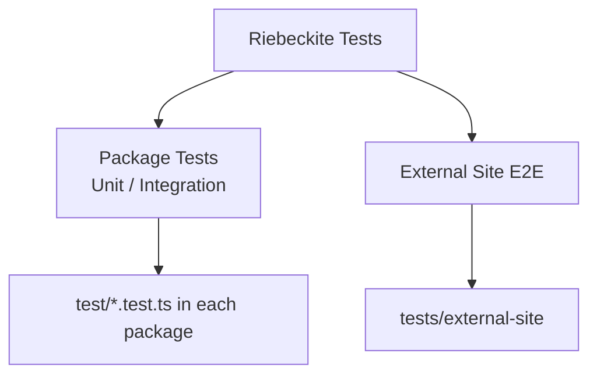
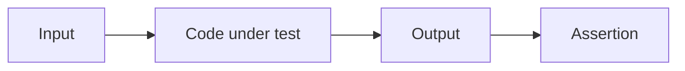
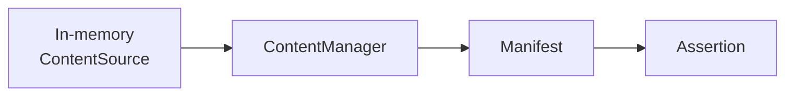
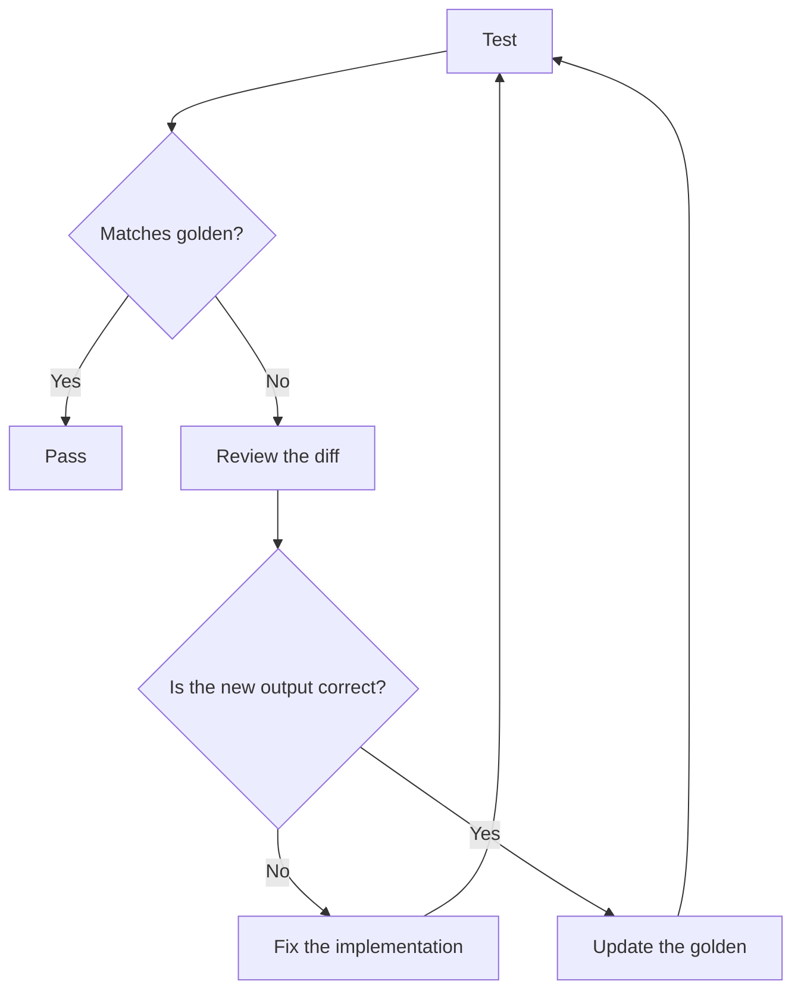
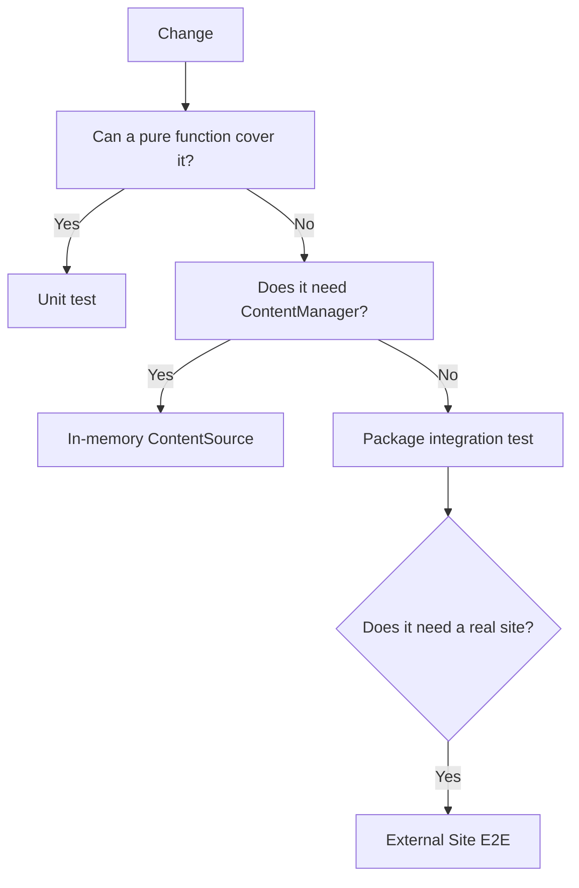
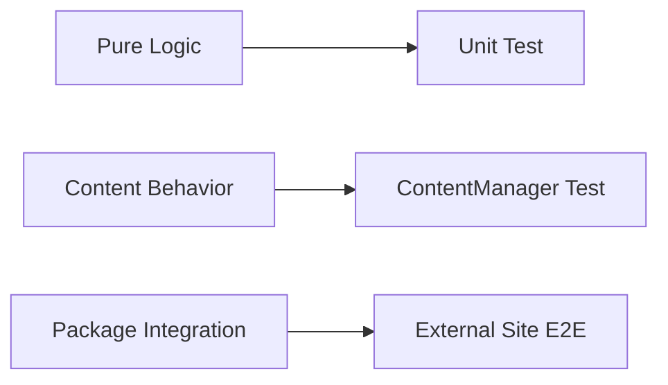

# Testing

Riebeckite tests run on the Node.js built-in test runner (`node:test`) with
`tsx` for TypeScript, so no separate test framework is required. Output that is
expensive to assert by hand is recorded as committed golden files, which keeps
changes to that output visible in review.

End-to-end coverage of a real site lives separately in `tests/external-site` and
runs with `pnpm test:e2e:external`; this document covers package unit tests. The
reusable engine that drives it lives in `@riebeckite/test/e2e`, while the
repository-specific fixture, package list, and assertions stay in
`tests/external-site`.

## Types of tests

Riebeckite has two broad kinds of tests:



This page mainly covers the **tests that live next to each package**.

## Running tests

|Command|What it does|
|---|---|
|`pnpm test`|Run every package that defines a `test` script (`pnpm -r test`)|
|`pnpm --filter @riebeckite/plugin-toc test`|Run one package's tests|
|`pnpm test:update`|Rewrite every golden file with the current output|
|`pnpm test:e2e:external`|Run the external-site integration suite|
|`pnpm test:registry`|Run the scaffold install contracts against npm-published artifacts|

The scaffold install contracts validate the generated site against **locally
packed workspace artifacts** by default, so a branch that adds a new package can
be verified before it is published. `pnpm test:registry` switches the same
contracts to install from npm and assert the published artifacts resolve; run it
after a release.

Usually start with the tests closest to your change. If you only changed the TOC
plugin, for example:

```sh
pnpm --filter @riebeckite/plugin-toc test
```

Run the full repository suite with `pnpm test` afterwards when the change can
affect other packages.

For a single package you can also update only its golden files by setting
`UPDATE_GOLDEN=1` before its test script. In PowerShell:

```powershell
$env:UPDATE_GOLDEN=1; pnpm --filter @riebeckite/plugin-toc test
```

## Where tests live

Each package keeps its tests in `test/*.test.ts` and declares its own `test`
script (`node --import tsx --test "test/*.test.ts"`). Test directories and test
files are excluded from type checking, from builds, and from published `files`,
so they never ship or affect consumers.

For example:

```text
packages/plugins/example/
├─ src/
├─ test/
│  ├─ example.test.ts
│  └─ __golden__/
│     └─ example.html
├─ package.json
└─ index.ts
```

Shared test utilities live in the workspace package `@riebeckite/test`. Add it
to a package's `devDependencies` and import from `@riebeckite/test`. Do not copy
test-only helpers into each plugin.

## Writing a test

Import the public surface of the package under test and assert on the output.
Most plugin logic is pure and can be tested without a full build pipeline.

```ts
import assert from "node:assert/strict";
import { test } from "node:test";

import { renderBreadcrumbNav } from "../src/render.ts";

test("renders nothing for a single root item", () => {
  assert.equal(renderBreadcrumbNav([]), "");
});
```



Content-facing behavior is usually exercised through an in-memory
`ContentSource` and `resolveConfig`, then `ContentManager`:

```ts
const source = {
  async scan() {
    return [{ path: "notes/index.md" }];
  },
  async read(entry) {
    return `# ${entry.path}`;
  },
};
const config = resolveConfig({ content: { directory: "." } });
const manager = new ContentManager(source, [], { config });
const manifest = await manager.getManifest();
```



This exercises the Content System in a small scope. Do not assemble the whole
application just for a test unless the problem needs a real site or a Vite build.

## Golden files

`@riebeckite/test` provides two helpers for large or structured output:

- `assertGolden(actual, goldenUrl)` for text (HTML, Markdown, serialized JSON).
- `assertGoldenJson(value, goldenUrl)` for objects, which formats the value
  with `JSON.stringify(value, null, 2)` before comparing.

Pass the expected file as a `URL` built from `import.meta.url` and keep the
recorded file under `test/__golden__/`:

```ts
import { assertGolden } from "@riebeckite/test";

test("renders the table of contents", () => {
  assertGolden(renderToc(entries), new URL("./__golden__/toc.html", import.meta.url));
});
```

On default normalization the helper converts CRLF/CR to LF and collapses
trailing newlines to one, so golden files stay stable across platforms and
editors. Pass `{ normalize: false }` when byte-exact output matters.

A missing or mismatched golden file fails the test. When the new output is
correct, regenerate it with `pnpm test:update` and review the resulting diff.
Golden files are committed on purpose: a change to recorded output should be
readable in a pull request.



Do not treat updating the golden file as the fix itself: confirm why the output
changed before regenerating it.

Node's built-in snapshot assertion (`--test-update-snapshots`) is intentionally
not used because it requires Node 22.3+, while Riebeckite supports Node 20.19+.

## Adding tests to a package

1. Add `tsx` to the package's `devDependencies` and a `test` script:
   `node --import tsx --test "test/*.test.ts"`.
2. If the tests use the golden helpers, add `@riebeckite/test` to
   `devDependencies` and import them from `@riebeckite/test`.
3. If the package is a plugin, add its directory name to the `hasTests` list in
   `scripts/package_metadata.mjs`.
4. Run `pnpm install` when dependencies change, then `pnpm check:packages` to
   confirm the expected metadata matches.

`scripts/check_packages.mjs` compares each package's metadata against
`scripts/package_metadata.mjs`, so a missing `test` script or an unlisted plugin
is reported as a failure.

## What to test

Prefer deterministic, pure behavior:

- Option resolution, validation, and default handling.
- Content processing such as permalink resolution, TOC construction, and
  metadata extraction.
- Rendered HTML and generated JSON, captured as golden files.
- Boundary cases: empty input, missing frontmatter, duplicate slugs, and
  malformed attributes.

## Tests to avoid

Avoid tests that depend on the network, the wall clock, or absolute paths. These
external states make a test non-deterministic:

```text
Network
Current Time
Random Value
Machine-specific Absolute Path
Current Working Directory
```

For example, reading the time inside the code under test changes the result
depending on when the test runs:

```ts
const now = new Date();
```

Instead, make the needed value injectable:

```ts
function createEntry(now: Date) {
  // ...
}
```

The test then passes a fixed value:

```ts
const now = new Date("2026-01-01T00:00:00Z");

const entry = createEntry(now);
```

The same applies to randomness. Do not predict the real time or a random value in
the test; design the code so the value needed for the decision is passed in from
outside.

## How much to test

Start from the smallest scope closest to the change:



You do not need the External Site E2E suite to verify a simple renderer change.
Conversely, package distribution format, imports from an external consumer, a
real site build, and problems that cross integrations are not sufficiently
covered by unit tests and should be checked with External Site E2E.

## Basic policy

Riebeckite tests follow one principle: **write deterministic tests at the
smallest scope that can verify the changed behavior.**



Rather than reproducing a large build every time, test pure functions and
in-memory `ContentSource` behavior in a small scope. Problems that involve
package boundaries or a real external consumer are checked with E2E.

Treat a golden file not as a snapshot to make the test pass but as a **reviewable
expected output**.
