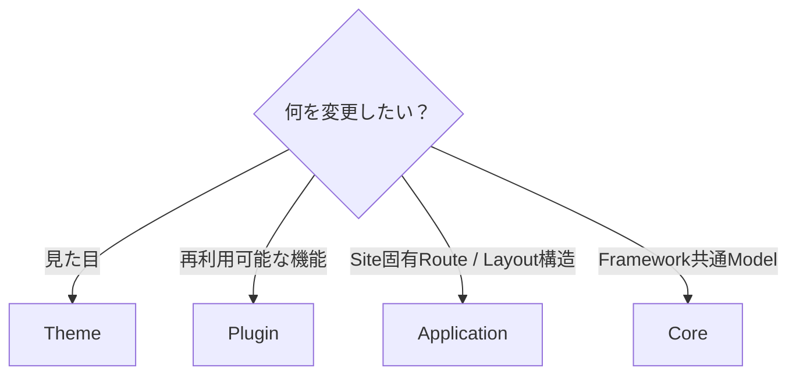
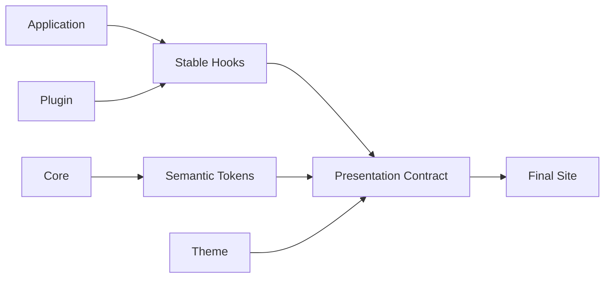

# テーマ作成の詳細

このページは、Riebeckite Theme を実際に設計・実装するときの詳細ガイドです。

初めて Theme を作る場合は、先に [はじめてのテーマ作成](../themes/writing-a-theme.ja.md) を読んでください。

このページでは、その先に必要になる、

- Theme の責務
- `defineTheme`
- Color Mode
- Typography
- Layout
- Design Token
- Stable CSS Hook
- Theme 固有 Option
- CSS Cascade
- Package としての配布

までをまとめて扱います。

各型やフィールドの完全な定義を確認したい場合は [Theme API](../reference/theme-api.ja.md) を参照してください。


## このページの構成

- [Color Mode](./theme-system/color-mode.ja.md)
- [Typography と Article Layout](./theme-system/typography.ja.md)
- [Design Tokens](./theme-system/tokens.ja.md)
- [Theme Root と Attributes](./theme-system/theme-root.ja.md)
- [Stable CSS Hooks と Cascade](./theme-system/css.ja.md)
- [テーマの配布と検証](./theme-system/distribution.ja.md)

## 1. Theme にするべき変更

Theme は **Presentation Layer** です。

Site の機能や Content の意味は変更せず、見た目だけを変更します。

| Theme でできる | Theme ではしない |
| --- | --- |
| Token の上書き・追加 | Component Replacement |
| CSS Rule の定義 | JSX の注入 |
| Theme 固有 `data-*` Attribute | Route の追加 |
| Color Mode の宣言 | Plugin の追加・削除 |
| Typography の宣言 | Client Script の実行 |
| Layout Preset の宣言 | DOM Transformation |
| Stable Hook の Styling | Island の登録 |
| `userCss` による最終上書き | Filesystem / ContentManager へのアクセス |

迷った場合は、次のように判断します。



基本的には、

```text id="kl9kkm"
機能
  → Plugin

見た目
  → Theme

Site 固有 Route
  → Application
```

です。

見た目を変えるためだけに Plugin を作ったり、機能を追加するために Theme を拡張したりしないでください。


## 2. 最小の Theme

Theme は `defineTheme()` で定義します。

```ts id="yplspq"
import { defineTheme } from "@riebeckite/core";

export function exampleTheme() {
  return defineTheme({
    name: "example",

    styles: [
      {
        moduleSpecifier:
          "@riebeckite/theme-example/style.css",
      },
    ],
  });
}
```

Site では `theme` に指定します。

```ts id="ij1yvm"
export default defineConfig({
  theme: exampleTheme(),
});
```

これが最小構成です。


## 3. `defineTheme` の Contract

Theme が扱う主な Contract は次のとおりです。

| 領域 | 内容 |
| --- | --- |
| Identity | `name` |
| Theme 固有設定 | `options` |
| CSS | `styles[].moduleSpecifier` |
| 共通設定 | `colorMode`, `typography`, `articleLayout`, `tokens`, `userCss` |
| Attributes | 安全な `data-*` Attribute |

たとえば、

```ts id="k0nh8m"
import { defineTheme } from "@riebeckite/core";

export function exampleTheme() {
  return defineTheme({
    name: "example",

    options: {
      // Theme 固有 Option
    },

    styles: [
      {
        moduleSpecifier:
          "@riebeckite/theme-example/style.css",
      },
    ],

    attributes: {
      "data-example-flag": "on",
    },
  });
}
```

のように定義できます。

`styles[].moduleSpecifier` は Host Bundler が解決する Module Specifier です。

CSS File を Application Directory へコピーするための Path ではありません。


## 4. Site 内だけで使う Theme

Theme は npm Package として公開しなくても利用できます。

たとえば、

```text id="10b70z"
site/
└─ extensions/
   ├─ local-theme.ts
   └─ theme.css
```

のように Site 内へ置けます。

```ts id="31fzcq"
// site/extensions/local-theme.ts

import { defineTheme } from "@riebeckite/core";

export function localTheme() {
  return defineTheme({
    name: "site-local",

    styles: [
      {
        moduleSpecifier:
          "/extensions/theme.css",
      },
    ],

    attributes: {
      "data-site-local": "on",
    },
  });
}
```

Site-local Theme の、

- `name`
- `styles`
- `attributes`
- `tokens`

も Published Theme と同じ `resolveThemeConfig` の経路で解決・sanitize・適用されます。


## 19. Theme Factory Options

Theme 固有の機能は Factory Option として定義します。

```ts id="94pd1f"
type NewspaperOptions = {
  density?:
    | "compact"
    | "comfortable";
};

export function newspaperTheme(
  options: NewspaperOptions = {},
) {
  return defineTheme({
    name: "newspaper",

    options,

    attributes: {
      "data-newspaper-density":
        options.density
        ?? "comfortable",
    },

    styles: [
      {
        moduleSpecifier:
          "@riebeckite/theme-newspaper/style.css",
      },
    ],
  });
}
```

この Option は Core の `ThemeConfig` に追加しません。

```text id="2cqt02"
newspaper の density
  → newspaperTheme が所有

tokyonight の neon
  → tokyonightTheme が所有
```

Theme 固有の概念は、その Theme Package 内で完結させます。


## 31. Theme を作るときの基本方針

Theme の実装では、最終的に次の境界を維持することが重要です。



Theme は Application や Plugin の内部構造を所有しません。

Framework と Plugin が公開した、

```text id="ysb8qa"
Stable CSS Hooks
Semantic Design Tokens
Theme Attributes
CSS Cascade
```

という Presentation Contract を利用します。

Theme 固有の設定は Theme Package 内に閉じ込め、Core へ漏らしません。

そして、Theme の変更によって、

```text id="e6c5sk"
Content
Route
Manifest
Content Graph
Plugin Behavior
Client Behavior
```

が変化しない状態を維持してください。

**機能は Plugin、構造は Framework / Application、見た目は Theme**

という境界を守ることで、Theme を交換しても同じ Site と Plugin をそのまま利用できます。


## 関連資料

- [はじめてのテーマ作成](../themes/writing-a-theme.ja.md) — 最初の Theme を作る
- [Theme System](./theme-system.ja.md) — Theme System 全体の考え方
- [Plugin System](./plugin-system.ja.md) — Plugin との責務の違い
- [Framework Reference](../reference/README.ja.md) — `defineTheme` などの Public API
