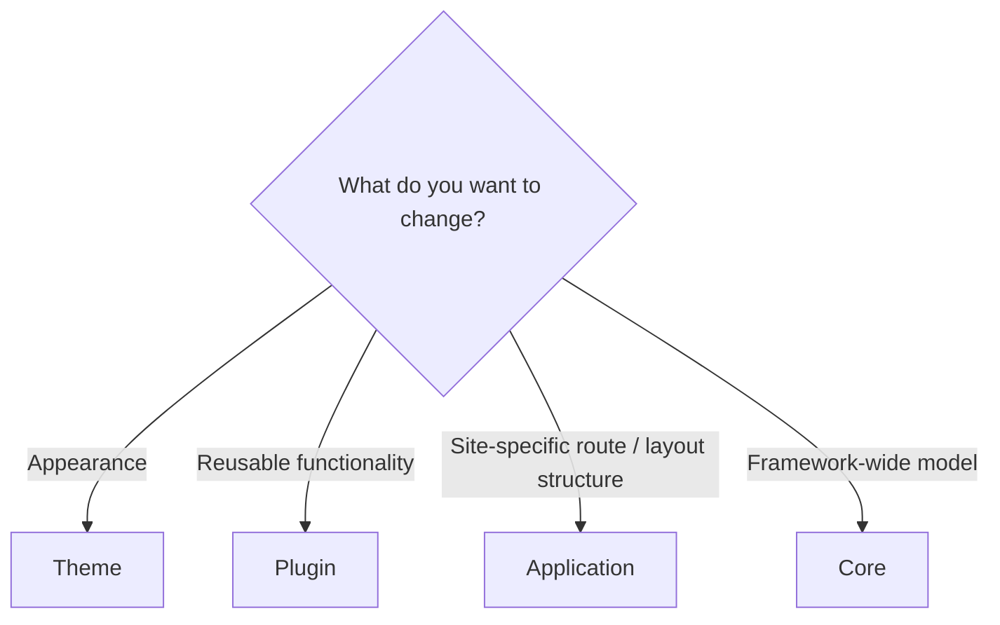
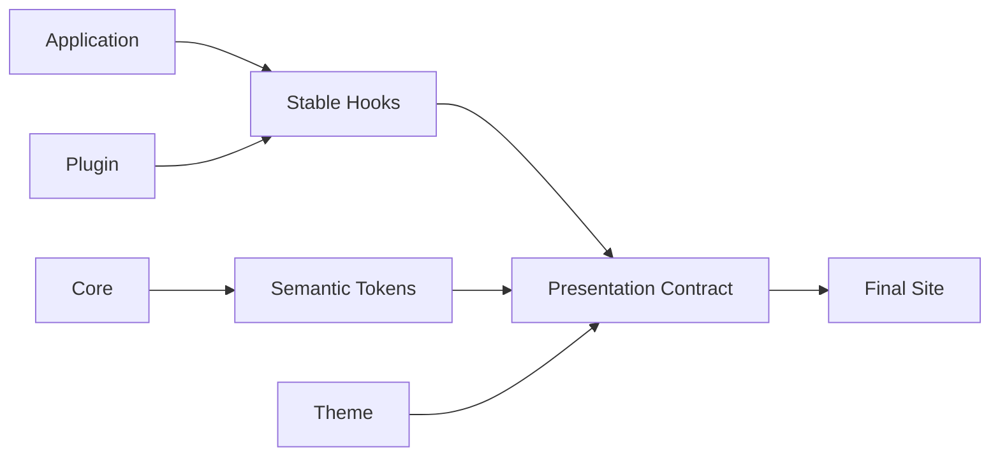

# Themes in Depth

[Your First Theme](../themes/writing-a-theme.md) is a short walkthrough that gets a theme running. This page is its "in depth" companion: it collects everything you refer to while building a theme — options, tokens, hooks, the CSS cascade, and packaging.

If you are new, read [your first theme](../themes/writing-a-theme.md) first, and use this page when you want more detail. For the complete API surface, see [Theme API](../reference/theme-api.md).

## How this page is organized

- [Color mode](./theme-system/color-mode.md)
- [Typography and article layout](./theme-system/typography.md)
- [Design tokens](./theme-system/tokens.md)
- [Theme root and attributes](./theme-system/theme-root.md)
- [Stable CSS hooks and the cascade](./theme-system/css.md)
- [Packaging and verification](./theme-system/distribution.md)

## 1. What a theme can and cannot do

A theme is the **presentation layer**. It changes tokens, stylesheet rules, and theme-specific `data-*` attributes. It does not change content semantics or application structure.

| Can | Cannot |
| --- | --- |
| Override or add tokens | Component replacement |
| Define stylesheet rules | JSX injection |
| Declare theme-specific `data-*` attributes | Route additions |
| Declare color mode / typography / layout presets | Adding or removing plugins |
| Provide the final override through `userCss` | Client script execution |
| Style stable hooks | DOM transformation, island registration, filesystem access, ContentManager access |

If you are unsure, decide like this:



In short:

```text
Functionality
  -> Plugin

Appearance
  -> Theme

Site-specific route
  -> Application
```

Keep the boundary: do not write a plugin just to change appearance, and do not extend a theme to add features. Features go in plugins, plain appearance in themes, and site-specific routes in the app.

## 2. The defineTheme contract

`defineTheme` is imported from `@riebeckite/core`. A theme's main contract has five areas.

| Area | Contents |
| --- | --- |
| Identity | `name` |
| Factory options | `options` |
| Styles | `styles[].moduleSpecifier` |
| Common config | `colorMode`, `typography`, `articleLayout`, `tokens`, `userCss` |
| Attributes | safe `data-*` attributes |

```ts
import { defineTheme } from "@riebeckite/core";

export function exampleTheme() {
  return defineTheme({
    name: "example",
    options: { /* theme-specific options */ },
    styles: [
      { moduleSpecifier: "@riebeckite/theme-example/style.css" },
    ],
    attributes: { "data-example-flag": "on" },
  });
}
```

`styles[].moduleSpecifier` is a module specifier resolved by the host bundler. It is not a contract for copying filesystem paths into the application.

Pass it to `theme` in the site config:

```ts
export default defineConfig({
  theme: exampleTheme(),
});
```

That is the minimal setup.

### 2-1. In-site themes

A theme does not have to be published. Compose an existing theme or define one directly with `defineTheme`, then pass it to `theme`. A theme can live in the site:

```text
site/
└─ extensions/
   ├─ local-theme.ts
   └─ theme.css
```

```ts
// site/extensions/local-theme.ts
import { defineTheme } from "@riebeckite/core";

export function localTheme() {
  return defineTheme({
    name: "site-local",
    styles: [
      { moduleSpecifier: "/extensions/theme.css" },
    ],
    attributes: { "data-site-local": "on" },
  });
}
```

An in-site theme's `name`, `styles`, `attributes`, and `tokens` go through the same `resolveThemeConfig` path (resolution, sanitization, application) as a published theme.

## 7. Theme factory options

Resolve theme-specific options inside the theme package. Do not grow Core's `ThemeConfig` with them.

```ts
type NewspaperOptions = {
  density?: "compact" | "comfortable";
};

export function newspaperTheme(options: NewspaperOptions = {}) {
  return defineTheme({
    name: "newspaper",
    options,
    attributes: {
      "data-newspaper-density": options.density ?? "comfortable",
    },
    styles: [
      { moduleSpecifier: "@riebeckite/theme-newspaper/style.css" },
    ],
  });
}
```

Theme-specific options matter only when that theme is selected; they never leak into Core or other themes.

```text
newspaper density
  -> owned by newspaperTheme

tokyonight neon
  -> owned by tokyonightTheme
```

## Principles for building a theme

Keep the final boundary:



A theme does not own the internal structure of the application or plugins. It uses the presentation contract published by the framework and plugins:

```text
Stable CSS Hooks
Semantic Design Tokens
Theme Attributes
CSS Cascade
```

Keep theme-specific settings inside the theme package and out of Core. Changing the theme must not change:

```text
Content
Route
Manifest
Content Graph
Plugin Behavior
Client Behavior
```

**Functionality in plugins, structure in the framework or application, appearance in themes.** With that boundary, you can exchange themes while reusing the same site and plugins.

## Further reading

- [Your First Theme](../themes/writing-a-theme.md) — a step-by-step introduction
- [Theme System](./theme-system.md) — the conceptual contracts
- [Plugin System](./plugin-system.md) — the boundary with themes (features = plugins)
- [Framework Reference](../reference/README.md) — public APIs like `defineTheme`
