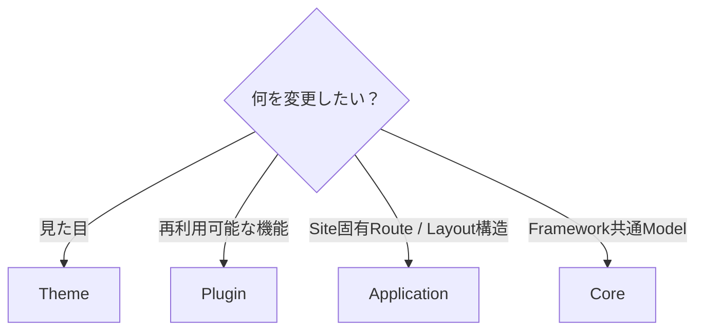
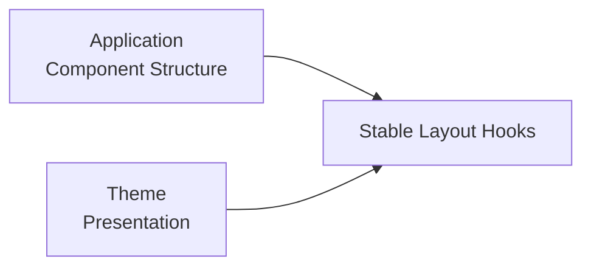
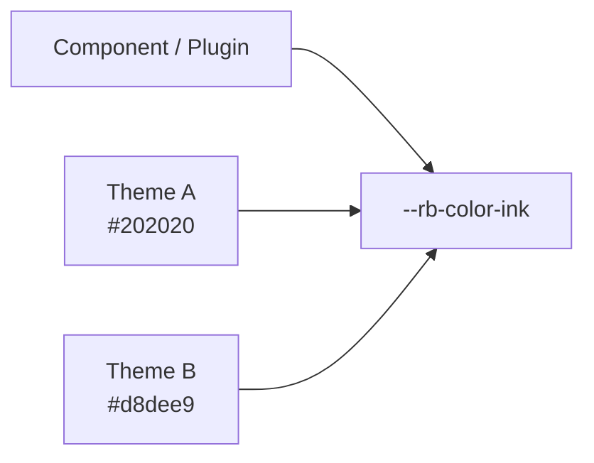
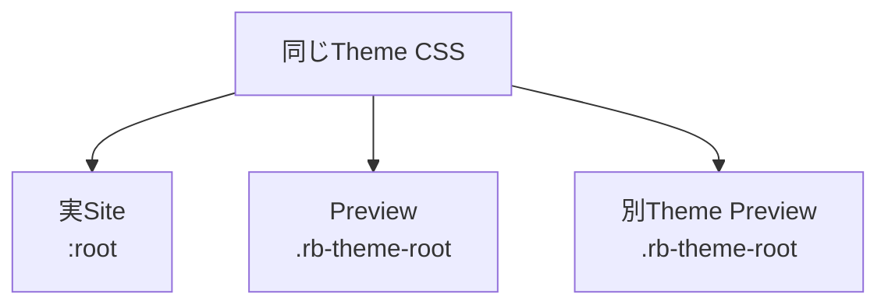
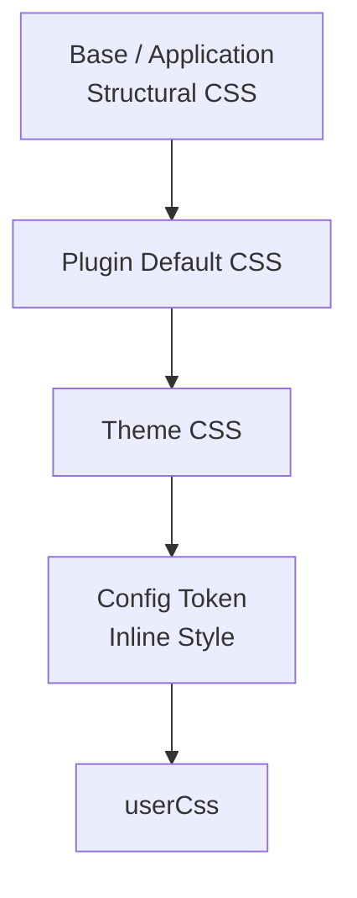
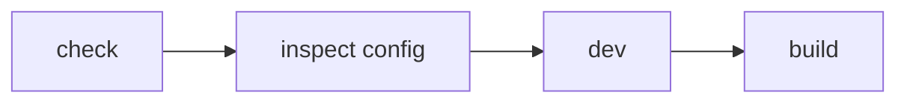
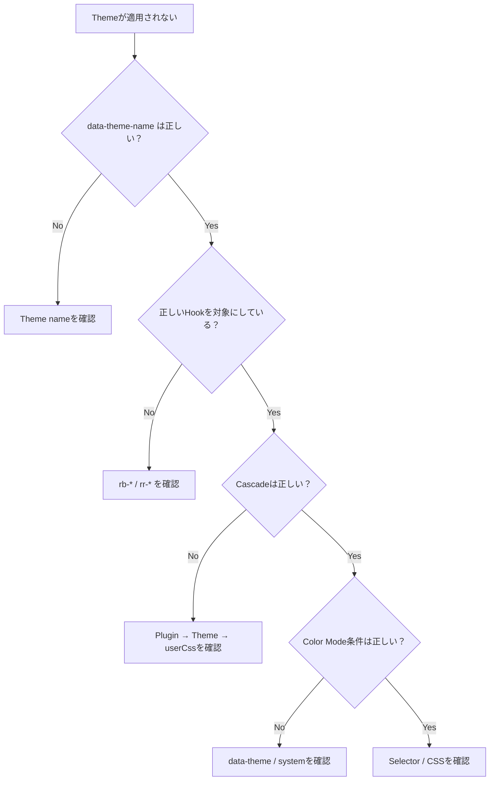
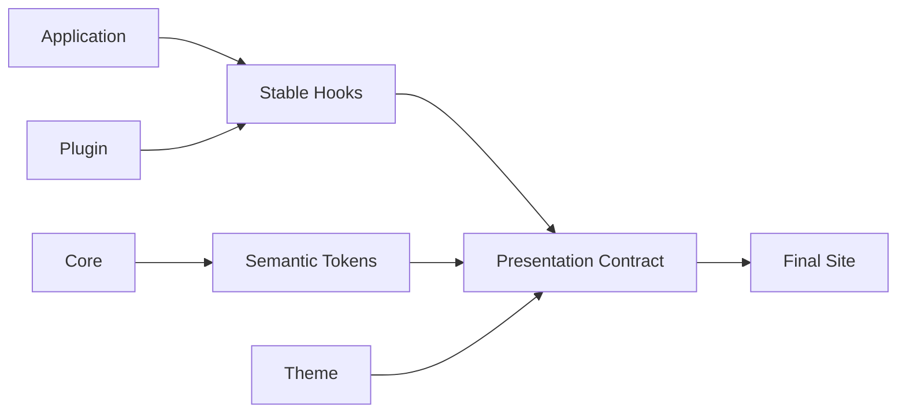

# テーマ作成の詳細

このページは、Riebeckite Theme を実際に設計・実装するときの詳細ガイドです。

初めて Theme を作る場合は、先に [はじめてのテーマ作成](../themes/writing-a-theme.md) を読んでください。

このページでは、その先に必要になる、

- Theme の責務
- `defineTheme`
- Color Mode
- Typography
- Layout
- Design Token
- Stable CSS Hook
- Theme 固有 Option
- CSS Cascade
- Package としての配布

までをまとめて扱います。

各型やフィールドの完全な定義を確認したい場合は [Theme API](../reference/theme-api.md) を参照してください。

# 1. Theme にするべき変更

Theme は **Presentation Layer** です。

Site の機能や Content の意味は変更せず、見た目だけを変更します。

| Theme でできる | Theme ではしない |
| --- | --- |
| Token の上書き・追加 | Component Replacement |
| CSS Rule の定義 | JSX の注入 |
| Theme 固有 `data-*` Attribute | Route の追加 |
| Color Mode の宣言 | Plugin の追加・削除 |
| Typography の宣言 | Client Script の実行 |
| Layout Preset の宣言 | DOM Transformation |
| Stable Hook の Styling | Island の登録 |
| `userCss` による最終上書き | Filesystem / ContentManager へのアクセス |

迷った場合は、次のように判断します。



基本的には、

```text id="kl9kkm"
機能
  → Plugin

見た目
  → Theme

Site 固有 Route
  → Application
```

です。

見た目を変えるためだけに Plugin を作ったり、機能を追加するために Theme を拡張したりしないでください。

# 2. 最小の Theme

Theme は `defineTheme()` で定義します。

```ts id="yplspq"
import { defineTheme } from "@riebeckite/core";

export function exampleTheme() {
  return defineTheme({
    name: "example",

    styles: [
      {
        moduleSpecifier:
          "@riebeckite/theme-example/style.css",
      },
    ],
  });
}
```

Site では `theme` に指定します。

```ts id="ij1yvm"
export default defineConfig({
  theme: exampleTheme(),
});
```

これが最小構成です。

# 3. `defineTheme` の Contract

Theme が扱う主な Contract は次のとおりです。

| 領域 | 内容 |
| --- | --- |
| Identity | `name` |
| Theme 固有設定 | `options` |
| CSS | `styles[].moduleSpecifier` |
| 共通設定 | `colorMode`, `typography`, `articleLayout`, `tokens`, `userCss` |
| Attributes | 安全な `data-*` Attribute |

たとえば、

```ts id="k0nh8m"
import { defineTheme } from "@riebeckite/core";

export function exampleTheme() {
  return defineTheme({
    name: "example",

    options: {
      // Theme 固有 Option
    },

    styles: [
      {
        moduleSpecifier:
          "@riebeckite/theme-example/style.css",
      },
    ],

    attributes: {
      "data-example-flag": "on",
    },
  });
}
```

のように定義できます。

`styles[].moduleSpecifier` は Host Bundler が解決する Module Specifier です。

CSS File を Application Directory へコピーするための Path ではありません。

# 4. Site 内だけで使う Theme

Theme は npm Package として公開しなくても利用できます。

たとえば、

```text id="10b70z"
site/
└─ extensions/
   ├─ local-theme.ts
   └─ theme.css
```

のように Site 内へ置けます。

```ts id="31fzcq"
// site/extensions/local-theme.ts

import { defineTheme } from "@riebeckite/core";

export function localTheme() {
  return defineTheme({
    name: "site-local",

    styles: [
      {
        moduleSpecifier:
          "/extensions/theme.css",
      },
    ],

    attributes: {
      "data-site-local": "on",
    },
  });
}
```

Site-local Theme の、

- `name`
- `styles`
- `attributes`
- `tokens`

も Published Theme と同じ `resolveThemeConfig` の経路で解決・sanitize・適用されます。

# 5. Color Mode

Theme は3種類の Color Mode を扱えます。

```ts id="9qfwqg"
type ThemeColorMode =
  | "light"
  | "dark"
  | "system";
```

| Mode | 動作 |
| --- | --- |
| `light` | Light 配色 |
| `dark` | Dark 配色 |
| `system` | OS の設定に追従 |

Theme は `data-theme` と Semantic Token を使って配色を切り替えます。

個々の Component に Light / Dark の色を直接埋め込まないでください。

# 6. Color Mode の CSS

基本となる CSS は次の形です。

```css id="m87m0s"
/* Light */
:is(:root, .rb-theme-root)
[data-theme-name="<name>"] {
  /* ... */
}

/* Dark */
:is(:root, .rb-theme-root)
[data-theme-name="<name>"]
[data-theme="dark"] {
  /* ... */
}

/* System */
@media (prefers-color-scheme: dark) {
  :is(:root, .rb-theme-root)
  [data-theme-name="<name>"]
  :not([data-theme]) {
    /* ... */
  }
}
```

Server は `colorMode` が `"system"` 以外なら `<html>` に `data-theme` を出力します。

```html id="s6hs50"
<html
  data-theme-name="example"
  data-theme="dark"
>
```

`"system"` の場合は `data-theme` を出力しません。

```html id="k3dd13"
<html data-theme-name="example">
```

この違いは重要です。

# 7. `system` では Attribute を削除する

実行時に Color Mode を変更する場合は、

```text id="h03gwl"
light
  → data-theme="light"

dark
  → data-theme="dark"

system
  → data-theme を削除
```

とします。

たとえば、

```ts id="iyf9ao"
document.documentElement.dataset.theme =
  "dark";
```

から System へ戻す場合は、

```ts id="6t0p0r"
delete document.documentElement.dataset.theme;
```

とします。

次のように空文字へ変更してはいけません。

```ts id="o2i8bp"
document.documentElement.dataset.theme = "";
```

これは、

```html id="25ohm9"
<html data-theme="">
```

となり、依然として `[data-theme]` Selector に一致するためです。

その結果、

```css id="qfrb4j"
:not([data-theme])
```

が成立せず、System Mode の Media Query が機能しません。

`@riebeckite/plugin-color-mode` がこの Contract の参照実装です。

# 8. Typography

Theme は Typography Preset を指定できます。

```ts id="6q5em7"
type ThemeTypographyPreset =
  | "system"
  | "serif"
  | "sans";
```

Preset は、

- Body
- Heading
- Code

などの Semantic Font Token に反映されます。

Font を個々の Component に直接指定するのではなく、Semantic Token を通して Site 全体の Typography を統一します。

# 9. Article Layout

Theme は Article Layout Preset を指定できます。

```ts id="l0kwo9"
type ThemeArticleLayoutPreset =
  | "article"
  | "sidebar"
  | "full-width";
```

Theme が決めるのは Layout の **Presentation** です。

Route や Component Tree そのものを Theme が差し替えるわけではありません。



# 10. Design Tokens

Theme の中心となるのが Semantic Design Token です。

Component や Plugin は、

```text id="9vwkwf"
このThemeの黒
このThemeの灰色
```

のような Theme 固有の値を参照するのではなく、

```text id="zfg9dh"
本文色
背景色
Accent
Border
```

という**意味**を参照します。



これによって Theme を交換しても Component を変更する必要がありません。

# 11. Color Tokens

主な Color Token は次のとおりです。

| Token | CSS Variable |
| --- | --- |
| `paper` | `--rb-color-paper` |
| `ink` | `--rb-color-ink` |
| `muted` | `--rb-color-muted` |
| `accent` | `--rb-color-accent` |
| `border` | `--rb-color-border` |
| `borderStrong` | `--rb-color-border-strong` |
| `surface` | `--rb-color-surface` |
| `surfaceHover` | `--rb-color-surface-hover` |
| `overlay` | `--rb-color-overlay` |
| `danger` | `--rb-color-danger` |
| `success` | `--rb-color-success` |
| `codeBackground` | `--rb-color-code-background` |

# 12. Typography Tokens

| Token | CSS Variable |
| --- | --- |
| `bodyFont` | `--rb-font-body` |
| `headingFont` | `--rb-font-heading` |
| `monoFont` | `--rb-font-mono` |

# 13. Layout Tokens

| Token | CSS Variable |
| --- | --- |
| `pageMaxWidth` | `--rb-layout-page-max` |
| `articleMaxWidth` | `--rb-layout-article-max` |
| `sidebarWidth` | `--rb-layout-sidebar` |
| `contentGap` | `--rb-layout-gap` |

CSS では次のように定義します。

```css id="u6csj3"
@layer base {
  :is(:root, .rb-theme-root)
  [data-theme-name="example"] {
    --rb-color-paper: #fafafa;
    --rb-color-ink: #202020;
    --rb-color-accent: #555;

    --rb-font-body:
      system-ui, sans-serif;

    --rb-layout-article-max: 48rem;
  }
}
```

Token 名と CSS Variable 名が完全に同じとは限りません。

たとえば、

```text id="avjyrb"
borderStrong
  → --rb-color-border-strong

surfaceHover
  → --rb-color-surface-hover

codeBackground
  → --rb-color-code-background
```

のように kebab-case へ変換されます。

# 14. Semantic Token を使う

Plugin や Component でも Semantic Token を利用してください。

```css id="0ld7xq"
/* Good */

.rr-example {
  color:
    var(--rb-color-ink);

  background:
    var(--rb-color-surface);
}
```

次のように Theme 固有の色を直接指定することは避けます。

```css id="5tkz4j"
/* Avoid */

.rr-example {
  color: #171717;
  background: #f6efe2;
}
```

後者では Theme を交換しても Plugin の色が変わりません。

Plugin 固有の意味を持つ Token が必要なら、

```text id="fbfuw6"
--rr-*
```

を Plugin 側で定義できます。

必要に応じて、

```css id="8qr5yn"
--rr-example-background:
  var(--rb-color-surface);
```

のように `--rb-*` を fallback として利用できます。

# 15. Theme Root

Theme CSS は Document 全体へ無条件に適用しません。

基本 Selector は、

```css id="36j35i"
:is(:root, .rb-theme-root)
[data-theme-name="<name>"]
```

です。

`<name>` には Theme の Identity Name が入ります。

組み込み Theme では、たとえば、

```text id="l0yyse"
riebeckite
minimal
gruvbox
sakura
tokyonight
rerurate
```

があります。

# 16. Theme Root が必要な理由

通常の Site では Application が `<html>` に Theme 名を付けます。

```html id="18amdy"
<html data-theme-name="minimal">
```

この場合は `:root` が Theme Root になります。

一方、Theme Gallery では、

```html id="3ynnb9"
<div
  class="rb-theme-root"
  data-theme-name="minimal"
>
  ...
</div>

<div
  class="rb-theme-root"
  data-theme-name="gruvbox"
>
  ...
</div>
```

のように、同じ Document 内で複数 Theme を表示できます。



そのため Theme CSS を裸の、

```css id="69pszy"
:root {
  /* ... */
}
```

として定義しないでください。

# 17. Theme Rule の Scope

Color Mode、Typography、Theme Option、Element Rule も同じ Theme Root に閉じ込めます。

```css id="bsov79"
/* Light */
:is(:root, .rb-theme-root)
[data-theme-name="<name>"] {
  /* ... */
}

/* Dark */
:is(:root, .rb-theme-root)
[data-theme-name="<name>"]
[data-theme="dark"] {
  /* ... */
}

/* System */
@media (prefers-color-scheme: dark) {
  :is(:root, .rb-theme-root)
  [data-theme-name="<name>"]
  :not([data-theme]) {
    /* ... */
  }
}

/* Typography */
:is(:root, .rb-theme-root)
[data-theme-name="<name>"]
[data-typography="serif"] {
  /* ... */
}

/* Theme Option */
:is(:root, .rb-theme-root)
[data-theme-name="<name>"]
[data-example-option="on"] {
  /* ... */
}

/* Elements */
:is(:root, .rb-theme-root)
[data-theme-name="<name>"]
:focus-visible {
  /* ... */
}
```

`data-theme-name` は Application が出力します。

Preview では `.rb-theme-root` と同じ Theme Name を指定します。

# 18. Theme 固有 Attributes

Theme 固有 Option を CSS へ渡したい場合は、安全な `data-*` Attribute を利用します。

```ts id="ylx4jp"
return defineTheme({
  name: "newspaper",

  attributes: {
    "data-newspaper-density":
      "compact",
  },
});
```

CSS では、

```css id="4evhcs"
:is(:root, .rb-theme-root)
[data-theme-name="newspaper"]
[data-newspaper-density="compact"] {
  /* ... */
}
```

のように利用できます。

Theme API から、

```text id="cn9sza"
class
style
id
lang
```

などを自由に変更する設計にはしません。

Framework が所有する Attribute と Theme 固有 Attribute を分離してください。

## ThemeRoot と themeRootAttributes

Framework は `ThemeRoot` という UI primitive を提供し、`<html>` 要素への theme 属性の付与を担当します。

```tsx
import { ThemeRoot } from "@riebeckite/honox/ui";

<ThemeRoot
  theme={config.theme}
  lang={c.get("htmlLanguage") ?? config.site.locale}
>
  {children}
</ThemeRoot>
```

`ThemeRoot` は次のように `<html>` 要素を描画します。

```html
<html
  lang="ja"
  data-theme-name="minimal"
  data-theme="dark"
  data-typography="system"
  data-article-layout="article"
>
```

Framework は `themeRootAttributes(theme)` を使って、theme の `attributes` に加え、以下の予約属性を `<html>` へ出力します。

- `data-theme`: Color Mode の状態 (`"light"` / `"dark"` / 未設定の場合は削除)
- `data-theme-name`: Theme の識別子
- `data-typography`: Typography Preset の値
- `data-article-layout`: Article Layout Preset の値

独自の `<html>` 属性を追加したい場合は、`ThemeRoot` の代わりに `themeRootAttributes` を直接使えます。

```tsx
import { themeRootAttributes } from "@riebeckite/honox/ui";

<html
  lang={c.get("htmlLanguage") ?? config.site.locale}
  {...themeRootAttributes(config.theme)}
  data-custom-attr="..."
>
  ...
</html>
```

ただし、Framework が予約する `data-theme`, `data-theme-name`, `data-typography`, `data-article-layout` は theme 側の `attributes` では上書きされません。

Plugin や Theme が独自に `themeAttributes()` を実装していた場合は、Framework が提供する `ThemeRoot` / `themeRootAttributes()` への移行を検討してください。Framework が所有する attribute namespace と Theme 固有の namespace を明確に分離できます。

# 19. Theme Factory Options

Theme 固有の機能は Factory Option として定義します。

```ts id="94pd1f"
type NewspaperOptions = {
  density?:
    | "compact"
    | "comfortable";
};

export function newspaperTheme(
  options: NewspaperOptions = {},
) {
  return defineTheme({
    name: "newspaper",

    options,

    attributes: {
      "data-newspaper-density":
        options.density
        ?? "comfortable",
    },

    styles: [
      {
        moduleSpecifier:
          "@riebeckite/theme-newspaper/style.css",
      },
    ],
  });
}
```

この Option は Core の `ThemeConfig` に追加しません。

```text id="2cqt02"
newspaper の density
  → newspaperTheme が所有

tokyonight の neon
  → tokyonightTheme が所有
```

Theme 固有の概念は、その Theme Package 内で完結させます。

# 20. Stable CSS Hooks

Theme は Application や Plugin の内部 Markup ではなく、公開された Stable CSS Hook を対象にします。

Hook には大きく2つの Namespace があります。

| Namespace | 所有者 | 用途 |
| --- | --- | --- |
| `rb-*` | Framework | Site の構造 |
| `rr-*` | Plugin / Feature | Plugin UI |

Framework が提供する代表的な Hook は、

```text id="etblkj"
.rb-theme-root
.rb-site
.rb-article
.rb-article-layout
.rb-article-header
.rb-article-body
.rb-article-content
.rb-article-meta
.rb-article-footer
.rb-sidebar
```

です。

レンダリングされた Markdown 本文は `.rb-article-content` に包まれ、Markdown のセマンティックなベースライン（リストマーカーと字下げ、見出し、段落とブロックの余白、表、図、定義リスト、インラインコード、整形済みブロック）はこの wrapper が持ちます。`.rb-article-body` は header、metadata、本文、plugin slot を含む article body のシェルです。ベースラインはレイヤー化されているため、テーマは構造を再宣言する必要はなく、`--rb-*` トークンとレイヤー外のキャラクター規則で見た目を表現します。

Plugin は、

```text id="rt44pe"
.rr-search
.rr-callout
.rr-table-of-contents
.rr-backlinks
.rr-local-graph
.rr-code
.rr-code-tabs
.rr-lightbox
.rr-excalidraw
.rr-mermaid
.rr-query
.rr-cardlink
.rr-diff-history
.rr-attachment
.rr-media
.rr-recent-posts
.rr-garden-explorer
```

などの Root Hook を提供できます。

Theme はこれらの Stable Hook を対象にします。

# 21. Plugin の内部 Class

Plugin は内部で、

```text id="u7bmkr"
.rr-search
.rr-search__input
.rr-search__result
.rr-search--loading
```

のような BEM Class を使う場合があります。

基本的に Public Hook は、

```text id="9k6dgy"
.rr-search
```

です。

```text id="1ggxg1"
__input
__result
--loading
```

などは、Plugin が明示的に Public Hook として文書化していない限り内部実装として扱います。

`.sr-only` のような一般的な Helper Class も Plugin Hook ではありません。

後方互換性のため旧 Class と `.rr-*` が同じ要素に存在する場合でも、Theme は `.rr-*` を利用してください。

# 22. Character Layer

Theme は Token を変更するだけでなく、Stable Hook を直接 Style して視覚的な個性を与えられます。

たとえば、

```css id="n72uhc"
:is(:root, .rb-theme-root)
[data-theme-name="example"]
.rb-article-header {
  border-bottom:
    var(--rb-rule-width)
    solid
    var(--rb-color-border);
}
```

のような変更です。

対象にできるのは Stable Hook です。

Theme 側で新しい、

```text id="mkmfyh"
rb-*
rr-*
```

Class を発明して Framework Contract のように扱わないでください。

Character Layer も Presentation 専用です。

Content、Structure、Behavior を変更してはいけません。

# 23. CSS Layer

Token Definition は `@layer base` に置きます。

```css id="43rbsh"
@layer base {
  :is(:root, .rb-theme-root)
  [data-theme-name="example"] {
    --rb-color-accent: #b45309;
  }
}
```

一方、Stable Hook に対する Character Rule は **unlayered** にします。

```css id="s2xwqm"
:is(:root, .rb-theme-root)
[data-theme-name="example"]
.rb-article-header {
  border-bottom:
    var(--rb-rule-width)
    solid
    var(--rb-color-border);
}
```

Application の Structural CSS と Plugin CSS も unlayered です。

Theme CSS はそれらより後に読み込まれるため、通常は `!important` を使わなくても上書きできます。

`!important` に依存しないでください。

# 24. Web Font

Theme Package は Self-hosted Web Font を含めることができます。

たとえば、

```text id="8g43c5"
styles/
├─ theme.css
└─ fonts/
   └─ example-serif-latin.woff2
```

のように配置します。

CSS では相対 URL を使います。

```css id="66ktv6"
@font-face {
  font-family: "Example Serif";

  src:
    url("./fonts/example-serif-latin.woff2")
    format("woff2");

  font-weight: 400 700;
  font-display: swap;
}
```

Font を同梱する場合は、その Font の License File も Package に含めてください。

Latin Subset のような比較的小さい Font は同梱できます。

日本語などの CJK Font は File Size が大きいため、基本的には System Font Stack へ fallback します。

# 25. `userCss`

`userCss` は Site 利用者が Theme の上から最終調整するための CSS です。

```ts id="mphtk3"
theme: defaultTheme({
  userCss: [
    "/extensions/custom.css",
  ],
}),
```

Theme の Stylesheet より後に読み込まれるため、`userCss` が最終的な Override になります。

Theme Package 側で `userCss` より強い Selector や `!important` を多用しないでください。

# 26. CSS Cascade

Riebeckite では CSS の読み込み順も Contract の一部です。



順番は、

```text id="jz92ku"
Framework Structural CSS
        ↓
Base / Application CSS
        ↓
Plugin Default CSS
        ↓
Theme CSS
        ↓
Config Token Inline Style
        ↓
userCss
```

です。

この順番は偶然ではなく、Presentation Extension の Contract として保証されます。

`@riebeckite/honox` は、

```text id="i2y97j"
.riebeckite/framework-styles.css
.riebeckite/plugin-styles.css
.riebeckite/theme-styles.css
```

を生成します。

Site は Framework Stylesheet を Plugin Stylesheet より先に、Plugin Stylesheet を Theme Stylesheet より先に読み込みます。

そのため、

```text id="4w8d9d"
Plugin
  → 標準の見た目

Theme
  → Plugin の見た目を変更

userCss
  → Site 利用者が最終調整
```

という関係になります。

生成された Stylesheet を直接編集したり、Import 順を変更したりしないでください。

# 27. Package として配布する

公開 Theme は、たとえば次の構成にできます。

```text id="c4cx40"
packages/themes/example/
├─ src/
│  └─ index.ts
├─ styles/
│  ├─ theme.css
│  └─ fonts/          # 必要な場合のみ
├─ package.json
├─ README_ja.md
└─ README.md
```

Riebeckite Repository 内では、

```text id="7s39yd"
packages/themes/minimal
```

が雛形になります。

`src/index.ts` では Theme Factory を公開します。

```ts id="lhhz91"
import { defineTheme } from "@riebeckite/core";

export function exampleTheme() {
  return defineTheme({
    name: "example",

    styles: [
      {
        moduleSpecifier:
          "@riebeckite/theme-example/style.css",
      },
    ],
  });
}
```

`package.json` では Stylesheet を、

```text id="8md3uw"
./style.css
```

として Export します。

# 28. Repository 外で Theme を配布する

外部 Theme Package は Riebeckite monorepo の内部構造へ依存させません。

基本的には、

```text id="a8r4we"
@riebeckite/core
```

の Public API だけを利用します。

次のような Internal Import は避けてください。

```ts id="0q5wfe"
import {
  something,
} from "@riebeckite/core/src/...";
```

また、

```text id="mpy5js"
../../../../packages/core/...
```

のような monorepo 内部 Path にも依存しません。

Theme の Stylesheet も Package 自身の Export として公開します。

# 29. Theme を検証する

Theme を作成・変更したら、次の順番で確認します。



まず Configuration を確認します。

```sh id="cb8y30"
pnpm exec riebeckite check
```

次に解決された Theme 設定を確認します。

```sh id="56lmdw"
pnpm exec riebeckite inspect config
```

実際の表示を確認する場合は、

```sh id="i9vjkb"
pnpm exec riebeckite dev
```

を使います。

最後に生成物まで確認します。

```sh id="tsbdjv"
pnpm exec riebeckite build
```

`check`、`doctor`、`inspect` は Build Output を変更しません。

Theme を交換しても、

- Route
- Manifest
- Content Graph
- Client Behavior

は変わらないことが基本です。

# 30. 見た目がおかしい場合

Theme が期待どおりに適用されない場合は、まず次の順番で確認します。



特に確認するのは、

1. `data-theme-name` が Theme の `name` と一致しているか
2. `.rb-*` / `.rr-*` の正しい Stable Hook を対象にしているか
3. Plugin CSS → Theme CSS → `userCss` の順になっているか
4. `system` なのに `data-theme=""` が残っていないか
5. Theme Root の外へ Selector が漏れていないか

です。

# 31. Theme を作るときの基本方針

Theme の実装では、最終的に次の境界を維持することが重要です。



Theme は Application や Plugin の内部構造を所有しません。

Framework と Plugin が公開した、

```text id="ysb8qa"
Stable CSS Hooks
Semantic Design Tokens
Theme Attributes
CSS Cascade
```

という Presentation Contract を利用します。

Theme 固有の設定は Theme Package 内に閉じ込め、Core へ漏らしません。

そして、Theme の変更によって、

```text id="e6c5sk"
Content
Route
Manifest
Content Graph
Plugin Behavior
Client Behavior
```

が変化しない状態を維持してください。

**機能は Plugin、構造は Framework / Application、見た目は Theme**

という境界を守ることで、Theme を交換しても同じ Site と Plugin をそのまま利用できます。

## 関連資料

- [はじめてのテーマ作成](../themes/writing-a-theme.md) — 最初の Theme を作る
- [Theme System](./theme-system.md) — Theme System 全体の考え方
- [Plugin System](./plugin-system.md) — Plugin との責務の違い
- [Framework Reference](../reference/README.md) — `defineTheme` などの Public API
