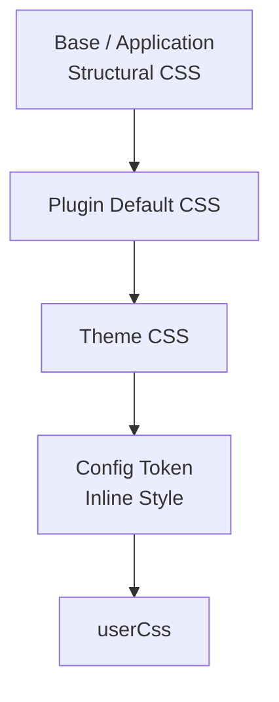
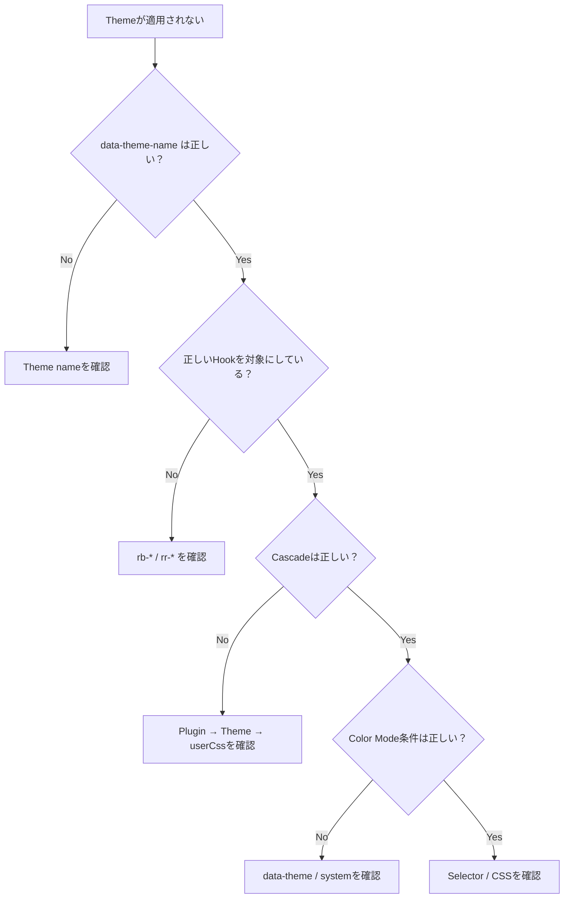

# Stable CSS Hooks と Cascade

このページは [テーマ作成の詳細](../theme-system.ja.md) の一部で、Stable CSS Hook、Character Layer、`userCss`、CSS Cascade を扱います。

## 20. Stable CSS Hooks

Theme は Application や Plugin の内部 Markup ではなく、公開された Stable CSS Hook を対象にします。

Hook には大きく2つの Namespace があります。

| Namespace | 所有者 | 用途 |
| --- | --- | --- |
| `rb-*` | Framework | Site の構造 |
| `rr-*` | Plugin / Feature | Plugin UI |

Framework が提供する代表的な Hook は、

```text id="etblkj"
.rb-theme-root
.rb-site
.rb-article
.rb-article-layout
.rb-article-header
.rb-article-body
.rb-article-content
.rb-article-meta
.rb-article-footer
.rb-sidebar
```

です。

レンダリングされた Markdown 本文は `.rb-article-content` に包まれ、Markdown のセマンティックなベースライン（リストマーカーと字下げ、見出し、段落とブロックの余白、表、図、定義リスト、インラインコード、整形済みブロック）はこの wrapper が持ちます。`.rb-article-body` は header、metadata、本文、plugin slot を含む article body のシェルです。ベースラインはレイヤー化されているため、テーマは構造を再宣言する必要はなく、`--rb-*` トークンとレイヤー外のキャラクター規則で見た目を表現します。

Plugin は、

```text id="rt44pe"
.rr-search
.rr-callout
.rr-table-of-contents
.rr-backlinks
.rr-local-graph
.rr-code
.rr-code-tabs
.rr-lightbox
.rr-excalidraw
.rr-mermaid
.rr-query
.rr-cardlink
.rr-diff-history
.rr-attachment
.rr-media
.rr-recent-posts
.rr-garden-explorer
```

などの Root Hook を提供できます。

Theme はこれらの Stable Hook を対象にします。


## 21. Plugin の内部 Class

Plugin は内部で、

```text id="u7bmkr"
.rr-search
.rr-search__input
.rr-search__result
.rr-search--loading
```

のような BEM Class を使う場合があります。

基本的に Public Hook は、

```text id="9k6dgy"
.rr-search
```

です。

```text id="1ggxg1"
__input
__result
--loading
```

などは、Plugin が明示的に Public Hook として文書化していない限り内部実装として扱います。

`.sr-only` のような一般的な Helper Class も Plugin Hook ではありません。

後方互換性のため旧 Class と `.rr-*` が同じ要素に存在する場合でも、Theme は `.rr-*` を利用してください。


## 22. Character Layer

Theme は Token を変更するだけでなく、Stable Hook を直接 Style して視覚的な個性を与えられます。

たとえば、

```css id="n72uhc"
:is(:root, .rb-theme-root)
[data-theme-name="example"]
.rb-article-header {
  border-bottom:
    var(--rb-rule-width)
    solid
    var(--rb-color-border);
}
```

のような変更です。

対象にできるのは Stable Hook です。

Theme 側で新しい、

```text id="mkmfyh"
rb-*
rr-*
```

Class を発明して Framework Contract のように扱わないでください。

Character Layer も Presentation 専用です。

Content、Structure、Behavior を変更してはいけません。


## 23. CSS Layer

Token Definition は `@layer base` に置きます。

```css id="43rbsh"
@layer base {
  :is(:root, .rb-theme-root)
  [data-theme-name="example"] {
    --rb-color-accent: #b45309;
  }
}
```

一方、Stable Hook に対する Character Rule は **unlayered** にします。

```css id="s2xwqm"
:is(:root, .rb-theme-root)
[data-theme-name="example"]
.rb-article-header {
  border-bottom:
    var(--rb-rule-width)
    solid
    var(--rb-color-border);
}
```

Application の Structural CSS と Plugin CSS も unlayered です。

Theme CSS はそれらより後に読み込まれるため、通常は `!important` を使わなくても上書きできます。

`!important` に依存しないでください。


## 24. Web Font

Theme Package は Self-hosted Web Font を含めることができます。

たとえば、

```text id="8g43c5"
styles/
├─ theme.css
└─ fonts/
   └─ example-serif-latin.woff2
```

のように配置します。

CSS では相対 URL を使います。

```css id="66ktv6"
@font-face {
  font-family: "Example Serif";

  src:
    url("./fonts/example-serif-latin.woff2")
    format("woff2");

  font-weight: 400 700;
  font-display: swap;
}
```

Font を同梱する場合は、その Font の License File も Package に含めてください。

Latin Subset のような比較的小さい Font は同梱できます。

日本語などの CJK Font は File Size が大きいため、基本的には System Font Stack へ fallback します。


## 25. `userCss`

`userCss` は Site 利用者が Theme の上から最終調整するための CSS です。

```ts id="mphtk3"
theme: defaultTheme({
  userCss: [
    "/extensions/custom.css",
  ],
}),
```

Theme の Stylesheet より後に読み込まれるため、`userCss` が最終的な Override になります。

Theme Package 側で `userCss` より強い Selector や `!important` を多用しないでください。


## 26. CSS Cascade

Riebeckite では CSS の読み込み順も Contract の一部です。



順番は、

```text id="jz92ku"
Framework Structural CSS
        ↓
Base / Application CSS
        ↓
Plugin Default CSS
        ↓
Theme CSS
        ↓
Config Token Inline Style
        ↓
userCss
```

です。

この順番は偶然ではなく、Presentation Extension の Contract として保証されます。

`@riebeckite/honox` は、

```text id="i2y97j"
.riebeckite/framework-styles.css
.riebeckite/plugin-styles.css
.riebeckite/theme-styles.css
```

を生成します。

Site は Framework Stylesheet を Plugin Stylesheet より先に、Plugin Stylesheet を Theme Stylesheet より先に読み込みます。

そのため、

```text id="4w8d9d"
Plugin
  → 標準の見た目

Theme
  → Plugin の見た目を変更

userCss
  → Site 利用者が最終調整
```

という関係になります。

生成された Stylesheet を直接編集したり、Import 順を変更したりしないでください。


## 30. 見た目がおかしい場合

Theme が期待どおりに適用されない場合は、まず次の順番で確認します。



特に確認するのは、

1. `data-theme-name` が Theme の `name` と一致しているか
2. `.rb-*` / `.rr-*` の正しい Stable Hook を対象にしているか
3. Plugin CSS → Theme CSS → `userCss` の順になっているか
4. `system` なのに `data-theme=""` が残っていないか
5. Theme Root の外へ Selector が漏れていないか

です。
