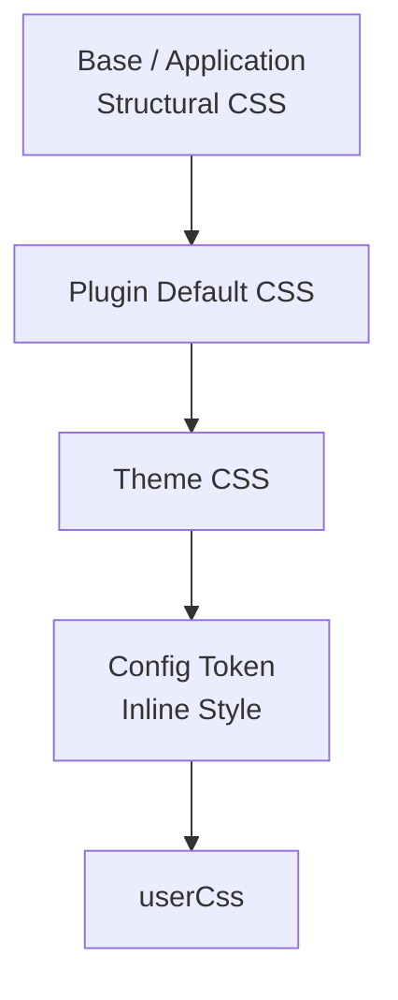
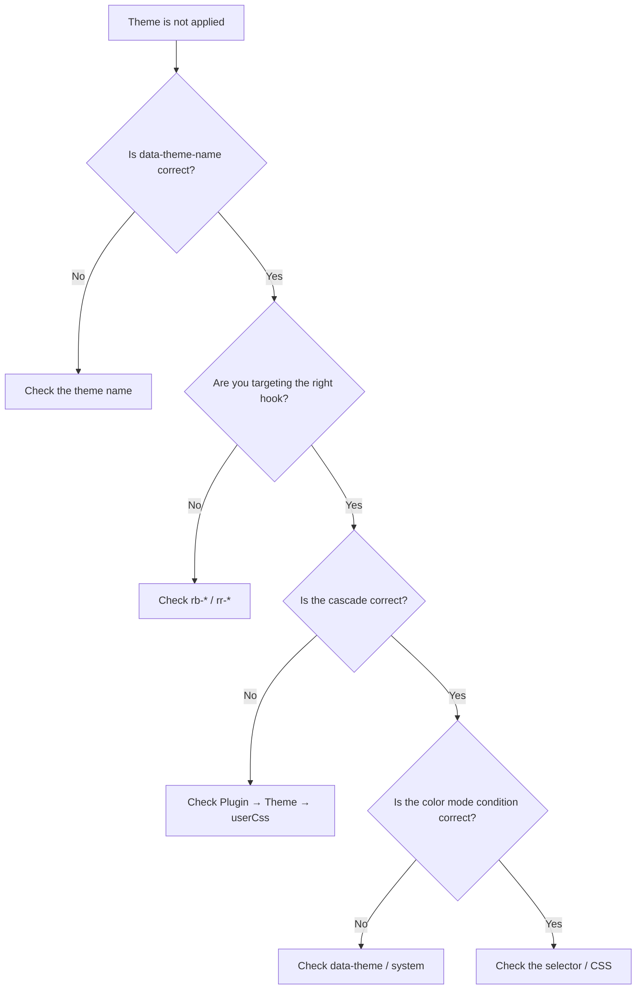

This page is part of [Themes in Depth](../theme-system.md) and covers stable CSS hooks and the cascade.

# Stable CSS hooks and the cascade

## 3-5. userCss

`userCss` loads last (top of the cascade) and is the final override. It is for sites that want to tweak one thing without forking the theme. Theme stylesheets load before `userCss`, so `userCss` wins. A theme package should not rely on stronger selectors or heavy use of `!important` to beat `userCss`.

```ts
theme: defaultTheme({
  userCss: ["/extensions/custom.css"],
}),
```

## 5. Stable CSS hooks

Themes target documented stable hooks, not internal markup. There are two class namespaces.

- **`rb-*`** — structural hooks and semantic design tokens provided by the framework. Structural hooks: `.rb-theme-root` (the theme root container), `.rb-site`, `.rb-article`, `.rb-article-layout`, `.rb-article-header`, `.rb-article-body`, `.rb-article-content`, `.rb-article-meta`, `.rb-article-footer`, `.rb-sidebar`.
- **`rr-<feature>`** — the root hook on the outermost element rendered by a plugin or feature. Examples: `.rr-search`, `.rr-callout`, `.rr-table-of-contents`, `.rr-backlinks`, `.rr-local-graph`, `.rr-code`, `.rr-code-tabs`, `.rr-lightbox`, `.rr-excalidraw`, `.rr-mermaid`, `.rr-query`, `.rr-cardlink`, `.rr-diff-history`, `.rr-attachment`, `.rr-media`, `.rr-recent-posts`, `.rr-garden-explorer`.

A theme should style only these root hooks and the descendants a plugin documents. BEM elements (`__…`) and modifiers (`--…`) are internal implementation details. For example, a plugin may internally use:

```text
.rr-search
.rr-search__input
.rr-search__result
.rr-search--loading
```

The public hook is `.rr-search`; `__input`, `__result`, and `--loading` are treated as internal implementation unless the plugin explicitly documents them as public hooks. Generic helpers such as `.sr-only` are not plugin hooks. Plugin output uses `rr-*` hooks only; target those hooks from themes.

### 5-1. Character layer

A theme is not limited to tokens. Within the theme boundary it may style the
stable hooks directly to give a site a visual character.

- Put token definitions inside `@layer base`; put visual character rules
  **unlayered**. The app's structural CSS and plugin CSS are unlayered, so
  unlayered theme rules win over them without `!important`. Never use
  `!important`.
- Target only stable hooks: `.rb-site`, `.rb-article`, `.rb-article-layout`,
  `.rb-article-header`, `.rb-article-body`, `.rb-article-content`,
  `.rb-article-meta`, `.rb-article-footer`, `.rb-sidebar`, and the `rr-*` plugin
  roots above. Do not invent new `rb-*` / `rr-*` class names; `.rr-*` BEM parts
  are internal.
- `.rb-article-content` is where the Markdown semantic baseline lives: the
  structural rules that keep Markdown readable after the CSS reset (list
  markers and indentation, headings, paragraph and block spacing, tables,
  figures, definitions, inline code, and preformatted blocks). A theme styles
  the appearance of that baseline through `--rb-*` tokens and character rules;
  it does not need to re-declare the structure. The baseline is layered, so a
  theme's unlayered character rules and utility classes both win over it.
- `.rb-article-body` is the article body shell that hosts the header, metadata,
  rendered Markdown, and plugin slots. It carries no Markdown typography itself,
  so plugin components keep their own headings wherever they are placed.
- A theme may ship self-hosted webfonts (Latin subsets) in its package under
  `styles/fonts/`, reference them with relative `url()`, and include the font
  license file. Japanese and other CJK text should fall back to system font
  stacks rather than shipping large font files.

```text
styles/
├─ theme.css
└─ fonts/
   └─ example-serif-latin.woff2
```

```css
/* Tokens stay layered. */
@layer base {
  :is(:root, .rb-theme-root)[data-theme-name="example"] {
    --rb-color-accent: #b45309;
  }
}

/* Character rules are unlayered, so they beat app and plugin CSS. */
:is(:root, .rb-theme-root)[data-theme-name="example"] .rb-article-header {
  border-bottom: var(--rb-rule-width) solid var(--rb-color-border);
}

@font-face {
  font-family: "Example Serif";
  src: url("./fonts/example-serif-latin.woff2") format("woff2");
  font-weight: 400 700;
  font-display: swap;
}
```

Character rules are still presentation-only: they must not change content,
structure, or behavior.

## 6. CSS cascade

Load order is a key contract for presentation extensions.

```text
framework structural CSS
→ base / app structural CSS
→ Plugin default CSS
→ Theme CSS
→ config token inline style
→ userCss
```

This order is guaranteed, not incidental. `@riebeckite/honox` generates `.riebeckite/framework-styles.css` (framework structural CSS), `.riebeckite/plugin-styles.css` (plugin styles in resolved plugin order), and `.riebeckite/theme-styles.css` (theme styles). The site imports the framework stylesheet before the plugin stylesheet, and the plugin stylesheet before the theme stylesheet, so theme CSS always overrides plugin defaults and `userCss` is the final override.



The resulting relationship is:

```text
Plugin
  → standard appearance

Theme
  → changes the plugin's appearance

userCss
  → the site author's final adjustment
```

Do not reorder these imports or edit the generated files. Each generated file notes its cascade position in a header comment. The cascade usually does not depend on `!important`.

## Troubleshooting: the theme is not applied

If a theme does not apply as expected, check in this order:



In particular, verify:

1. `data-theme-name` matches the theme's `name`.
2. You target the correct `.rb-*` / `.rr-*` stable hook.
3. The order is Plugin CSS → Theme CSS → `userCss`.
4. `data-theme=""` is not left behind when using `system`.
5. The selector does not leak outside the theme root.
