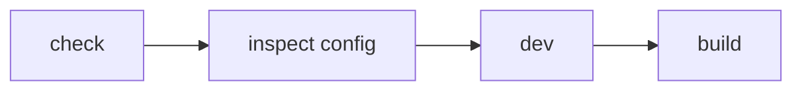

# テーマの配布と検証

このページは [テーマ作成の詳細](../theme-system.ja.md) の一部で、Theme のパッケージ化、配布、検証を扱います。

## 27. Package として配布する

公開 Theme は、たとえば次の構成にできます。

```text id="c4cx40"
packages/themes/example/
├─ src/
│  └─ index.ts
├─ styles/
│  ├─ theme.css
│  └─ fonts/          # 必要な場合のみ
├─ package.json
├─ README_ja.md
└─ README.md
```

Riebeckite Repository 内では、

```text id="7s39yd"
packages/themes/minimal
```

が雛形になります。

`src/index.ts` では Theme Factory を公開します。

```ts id="lhhz91"
import { defineTheme } from "@riebeckite/core";

export function exampleTheme() {
  return defineTheme({
    name: "example",

    styles: [
      {
        moduleSpecifier:
          "@riebeckite/theme-example/style.css",
      },
    ],
  });
}
```

`package.json` では Stylesheet を、

```text id="8md3uw"
./style.css
```

として Export します。


## 28. Repository 外で Theme を配布する

外部 Theme Package は Riebeckite monorepo の内部構造へ依存させません。

基本的には、

```text id="a8r4we"
@riebeckite/core
```

の Public API だけを利用します。

次のような Internal Import は避けてください。

```ts id="0q5wfe"
import {
  something,
} from "@riebeckite/core/src/...";
```

また、

```text id="mpy5js"
../../../../packages/core/...
```

のような monorepo 内部 Path にも依存しません。

Theme の Stylesheet も Package 自身の Export として公開します。


## 29. Theme を検証する

Theme を作成・変更したら、次の順番で確認します。



まず Configuration を確認します。

```sh id="cb8y30"
pnpm exec riebeckite check
```

次に解決された Theme 設定を確認します。

```sh id="56lmdw"
pnpm exec riebeckite inspect config
```

実際の表示を確認する場合は、

```sh id="i9vjkb"
pnpm exec riebeckite dev
```

を使います。

最後に生成物まで確認します。

```sh id="tsbdjv"
pnpm exec riebeckite build
```

`check`、`doctor`、`inspect` は Build Output を変更しません。

Theme を交換しても、

- Route
- Manifest
- Content Graph
- Client Behavior

は変わらないことが基本です。
