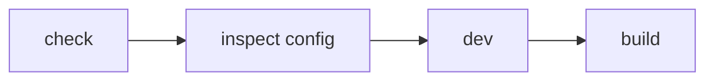

This page is part of [Themes in Depth](../theme-system.md) and covers packaging and verification.

# Packaging and verification

## 8. Packaging for distribution

A published theme can use a layout such as:

```text
packages/themes/example/
├─ src/
│  └─ index.ts
├─ styles/
│  ├─ theme.css
│  └─ fonts/          # only if needed
├─ package.json
├─ README_ja.md
└─ README.md
```

Inside the Riebeckite repository, `packages/themes/minimal` is the template:

```text
packages/themes/minimal/
├─ src/index.ts      ← factory that calls defineTheme
├─ styles/theme.css  ← the theme stylesheet
├─ package.json      ← exports ./style.css
├─ README_ja.md
└─ README.md
```

`src/index.ts` exposes the theme factory:

```ts
import { defineTheme } from "@riebeckite/core";

export function exampleTheme() {
  return defineTheme({
    name: "example",
    styles: [
      {
        moduleSpecifier: "@riebeckite/theme-example/style.css",
      },
    ],
  });
}
```

`package.json` exports the stylesheet as `./style.css`.

A distributed theme depends only on `@riebeckite/core` and exports its stylesheet as `./style.css`. Never reference monorepo paths. For the package surface and current constraints, see "Public packages and import paths" in [Framework Reference](../../reference/README.md).

Avoid internal imports such as:

```ts
import {
  something,
} from "@riebeckite/core/src/...";
```

and monorepo-internal paths such as:

```text
../../../../packages/core/...
```

## 9. Verify

After creating or changing a theme, check in this order:



```sh
npm exec riebeckite check             # validate config and plugin resolution
npm exec riebeckite inspect config    # inspect the resolved theme
npm exec riebeckite dev               # check the look locally
npm exec riebeckite build             # check the generated output
```

`check` / `doctor` / `inspect` are read-only. Swapping a theme does not change routes, the manifest, the graph, or client behavior. If the look is wrong, check the cascade order (`userCss` last) and whether you are targeting `rr-*` or `rb-*`.
