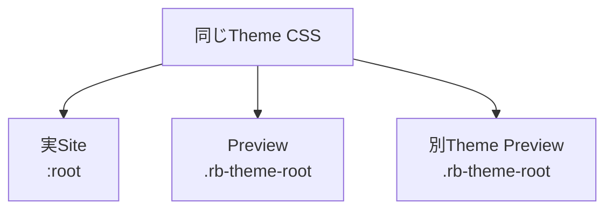

# Theme Root と Attributes

このページは [テーマ作成の詳細](../theme-system.ja.md) の一部で、Theme Root と Theme 固有 Attribute を扱います。

## 15. Theme Root

Theme CSS は Document 全体へ無条件に適用しません。

基本 Selector は、

```css id="36j35i"
:is(:root, .rb-theme-root)
[data-theme-name="<name>"]
```

です。

`<name>` には Theme の Identity Name が入ります。

組み込み Theme では、たとえば、

```text id="l0yyse"
riebeckite
minimal
gruvbox
sakura
tokyonight
rerurate
```

があります。


## 16. Theme Root が必要な理由

通常の Site では Application が `<html>` に Theme 名を付けます。

```html id="18amdy"
<html data-theme-name="minimal">
```

この場合は `:root` が Theme Root になります。

一方、Theme Gallery では、

```html id="3ynnb9"
<div
  class="rb-theme-root"
  data-theme-name="minimal"
>
  ...
</div>

<div
  class="rb-theme-root"
  data-theme-name="gruvbox"
>
  ...
</div>
```

のように、同じ Document 内で複数 Theme を表示できます。



そのため Theme CSS を裸の、

```css id="69pszy"
:root {
  /* ... */
}
```

として定義しないでください。


## 17. Theme Rule の Scope

Color Mode、Typography、Theme Option、Element Rule も同じ Theme Root に閉じ込めます。

```css id="bsov79"
/* Light */
:is(:root, .rb-theme-root)
[data-theme-name="<name>"] {
  /* ... */
}

/* Dark */
:is(:root, .rb-theme-root)
[data-theme-name="<name>"]
[data-theme="dark"] {
  /* ... */
}

/* System */
@media (prefers-color-scheme: dark) {
  :is(:root, .rb-theme-root)
  [data-theme-name="<name>"]
  :not([data-theme]) {
    /* ... */
  }
}

/* Typography */
:is(:root, .rb-theme-root)
[data-theme-name="<name>"]
[data-typography="serif"] {
  /* ... */
}

/* Theme Option */
:is(:root, .rb-theme-root)
[data-theme-name="<name>"]
[data-example-option="on"] {
  /* ... */
}

/* Elements */
:is(:root, .rb-theme-root)
[data-theme-name="<name>"]
:focus-visible {
  /* ... */
}
```

`data-theme-name` は Application が出力します。

Preview では `.rb-theme-root` と同じ Theme Name を指定します。


## 18. Theme 固有 Attributes

Theme 固有 Option を CSS へ渡したい場合は、安全な `data-*` Attribute を利用します。

```ts id="ylx4jp"
return defineTheme({
  name: "newspaper",

  attributes: {
    "data-newspaper-density":
      "compact",
  },
});
```

CSS では、

```css id="4evhcs"
:is(:root, .rb-theme-root)
[data-theme-name="newspaper"]
[data-newspaper-density="compact"] {
  /* ... */
}
```

のように利用できます。

Theme API から、

```text id="cn9sza"
class
style
id
lang
```

などを自由に変更する設計にはしません。

Framework が所有する Attribute と Theme 固有 Attribute を分離してください。

### ThemeRoot と themeRootAttributes

Framework は `ThemeRoot` という UI primitive を提供し、`<html>` 要素への theme 属性の付与を担当します。

```tsx
import { ThemeRoot } from "@riebeckite/honox/ui";

<ThemeRoot
  theme={config.theme}
  lang={c.get("htmlLanguage") ?? config.site.locale}
>
  {children}
</ThemeRoot>
```

`ThemeRoot` は次のように `<html>` 要素を描画します。

```html
<html
  lang="ja"
  data-theme-name="minimal"
  data-theme="dark"
  data-typography="system"
  data-article-layout="article"
>
```

Framework は `themeRootAttributes(theme)` を使って、theme の `attributes` に加え、以下の予約属性を `<html>` へ出力します。

- `data-theme`: Color Mode の状態 (`"light"` / `"dark"` / 未設定の場合は削除)
- `data-theme-name`: Theme の識別子
- `data-typography`: Typography Preset の値
- `data-article-layout`: Article Layout Preset の値

独自の `<html>` 属性を追加したい場合は、`ThemeRoot` の代わりに `themeRootAttributes` を直接使えます。

```tsx
import { themeRootAttributes } from "@riebeckite/honox/ui";

<html
  lang={c.get("htmlLanguage") ?? config.site.locale}
  {...themeRootAttributes(config.theme)}
  data-custom-attr="..."
>
  ...
</html>
```

ただし、Framework が予約する `data-theme`, `data-theme-name`, `data-typography`, `data-article-layout` は theme 側の `attributes` では上書きされません。

Plugin や Theme が独自に `themeAttributes()` を実装していた場合は、Framework が提供する `ThemeRoot` / `themeRootAttributes()` への移行を検討してください。Framework が所有する attribute namespace と Theme 固有の namespace を明確に分離できます。
