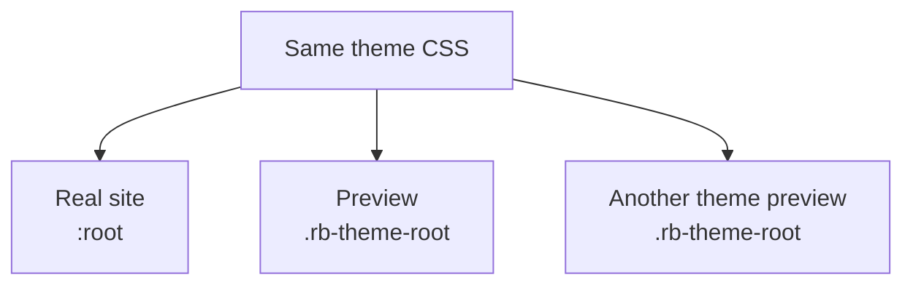

This page is part of [Themes in Depth](../theme-system.md) and covers the theme root and theme attributes.

# Theme root and attributes

## 3-6. Theme root selector

Built-in themes do not target the bare `:root`. Every rule is scoped to the
theme's identity name so the same stylesheet can style the real document and
an embedded preview:

```css
:is(:root, .rb-theme-root)[data-theme-name="<name>"]
```

`<name>` is the theme's identity name: `riebeckite` for the default theme,
otherwise one of `minimal`, `gruvbox`, `sakura`, `tokyonight`, `rerurate`.

- On a real site the app sets `data-theme-name` on `<html>`, so the `:root`
  branch matches the document root.
- In a preview such as a theme gallery, the same stylesheet styles any
  element carrying `class="rb-theme-root" data-theme-name="<name>"`, so
  several themes can render side by side in one document.



Never define the theme CSS against a bare `:root`:

```css
:root {
  /* ... */
}
```

Light, dark, system, typography, theme options, and element/pseudo rules all
carry the same prefix:

```css
:is(:root, .rb-theme-root)[data-theme-name="<name>"] { /* light */ }
:is(:root, .rb-theme-root)[data-theme-name="<name>"][data-theme="dark"] { /* dark */ }
@media (prefers-color-scheme: dark) {
  :is(:root, .rb-theme-root)[data-theme-name="<name>"]:not([data-theme]) { /* system */ }
}
:is(:root, .rb-theme-root)[data-theme-name="<name>"][data-typography="serif"] { /* typography */ }
:is(:root, .rb-theme-root)[data-theme-name="<name>"][data-tokyonight-neon="on"] { /* theme option */ }
:is(:root, .rb-theme-root)[data-theme-name="<name>"] :focus-visible { /* element/pseudo */ }
```

The app provides `data-theme-name`; a preview container only needs the
`.rb-theme-root` hook and the matching name.

## 4. Color mode, attributes, and options in detail

Beyond the contract in 3-1, theme-specific options can be passed to CSS through safe `data-*` attributes.

```ts
return defineTheme({
  name: "newspaper",
  attributes: {
    "data-newspaper-density": "compact",
  },
});
```

The attribute can then be targeted from CSS:

```css
:is(:root, .rb-theme-root)[data-theme-name="newspaper"][data-newspaper-density="compact"] {
  /* ... */
}
```

The theme API is not designed to modify `class`, `style`, `id`, or `lang` freely. It keeps the namespace of framework-owned attributes separate from theme-specific ones.

## Theme Root and themeRootAttributes

The framework provides `ThemeRoot`, a UI primitive that handles setting theme attributes on the `<html>` element.

```tsx
import { ThemeRoot } from "@riebeckite/honox/ui";

<ThemeRoot
  theme={config.theme}
  lang={c.get("htmlLanguage") ?? config.site.locale}
>
  {children}
</ThemeRoot>
```

`ThemeRoot` renders the `<html>` element with the following attributes:

```html
<html
  lang="en"
  data-theme-name="minimal"
  data-theme="dark"
  data-typography="system"
  data-article-layout="article"
>
```

The framework uses `themeRootAttributes(theme)` to emit the theme's own `attributes` plus reserved attributes:

- `data-theme`: Color Mode state (`"light"` / `"dark"` / omitted for "system")
- `data-theme-name`: Theme identity name
- `data-typography`: Typography preset value
- `data-article-layout`: Article layout preset value

To add your own `<html>` attributes, use the `themeRootAttributes` helper directly instead of `ThemeRoot`:

```tsx
import { themeRootAttributes } from "@riebeckite/honox/ui";

<html
  lang={c.get("htmlLanguage") ?? config.site.locale}
  {...themeRootAttributes(config.theme)}
  data-custom-attr="..."
>
  ...
</html>
```

However, the framework-reserved `data-theme`, `data-theme-name`, `data-typography`, and `data-article-layout` cannot be overwritten by the theme's `attributes`.

If a plugin or theme previously implemented its own `themeAttributes()`, consider migrating to the framework-provided `ThemeRoot` / `themeRootAttributes()`. This clarifies the separation between framework-owned and theme-specific attribute namespaces.
