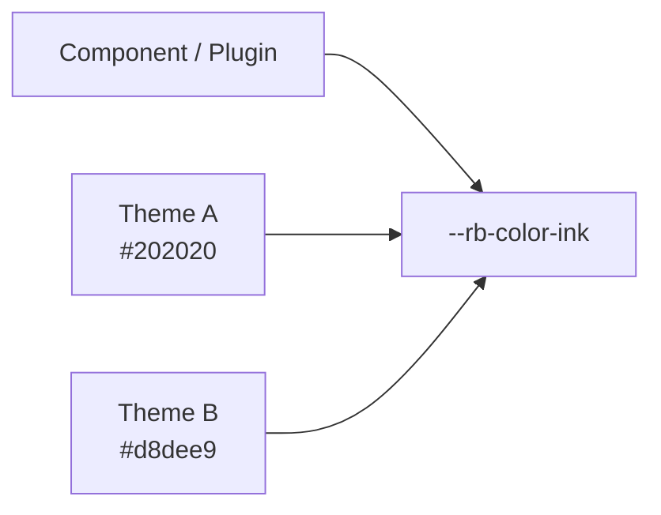

# Design Tokens

このページは [テーマ作成の詳細](../theme-system.ja.md) の一部で、Design Token（Color / Typography / Layout）と Semantic Token の使い方を扱います。

## 10. Design Tokens

Theme の中心となるのが Semantic Design Token です。

Component や Plugin は、

```text id="9vwkwf"
このThemeの黒
このThemeの灰色
```

のような Theme 固有の値を参照するのではなく、

```text id="zfg9dh"
本文色
背景色
Accent
Border
```

という**意味**を参照します。



これによって Theme を交換しても Component を変更する必要がありません。


## 11. Color Tokens

主な Color Token は次のとおりです。

| Token | CSS Variable |
| --- | --- |
| `paper` | `--rb-color-paper` |
| `ink` | `--rb-color-ink` |
| `muted` | `--rb-color-muted` |
| `accent` | `--rb-color-accent` |
| `border` | `--rb-color-border` |
| `borderStrong` | `--rb-color-border-strong` |
| `surface` | `--rb-color-surface` |
| `surfaceHover` | `--rb-color-surface-hover` |
| `overlay` | `--rb-color-overlay` |
| `danger` | `--rb-color-danger` |
| `success` | `--rb-color-success` |
| `codeBackground` | `--rb-color-code-background` |


## 12. Typography Tokens

| Token | CSS Variable |
| --- | --- |
| `bodyFont` | `--rb-font-body` |
| `headingFont` | `--rb-font-heading` |
| `monoFont` | `--rb-font-mono` |


## 13. Layout Tokens

| Token | CSS Variable |
| --- | --- |
| `pageMaxWidth` | `--rb-layout-page-max` |
| `articleMaxWidth` | `--rb-layout-article-max` |
| `sidebarWidth` | `--rb-layout-sidebar` |
| `contentGap` | `--rb-layout-gap` |

CSS では次のように定義します。

```css id="u6csj3"
@layer base {
  :is(:root, .rb-theme-root)
  [data-theme-name="example"] {
    --rb-color-paper: #fafafa;
    --rb-color-ink: #202020;
    --rb-color-accent: #555;

    --rb-font-body:
      system-ui, sans-serif;

    --rb-layout-article-max: 48rem;
  }
}
```

Token 名と CSS Variable 名が完全に同じとは限りません。

たとえば、

```text id="avjyrb"
borderStrong
  → --rb-color-border-strong

surfaceHover
  → --rb-color-surface-hover

codeBackground
  → --rb-color-code-background
```

のように kebab-case へ変換されます。


## 14. Semantic Token を使う

Plugin や Component でも Semantic Token を利用してください。

```css id="0ld7xq"
/* Good */

.rr-example {
  color:
    var(--rb-color-ink);

  background:
    var(--rb-color-surface);
}
```

次のように Theme 固有の色を直接指定することは避けます。

```css id="5tkz4j"
/* Avoid */

.rr-example {
  color: #171717;
  background: #f6efe2;
}
```

後者では Theme を交換しても Plugin の色が変わりません。

Plugin 固有の意味を持つ Token が必要なら、

```text id="fbfuw6"
--rr-*
```

を Plugin 側で定義できます。

必要に応じて、

```css id="8qr5yn"
--rr-example-background:
  var(--rb-color-surface);
```

のように `--rb-*` を fallback として利用できます。
