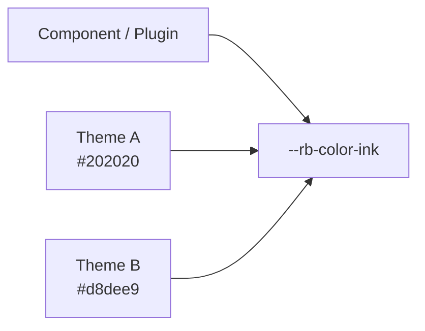

This page is part of [Themes in Depth](../theme-system.md) and covers design tokens.

# Design tokens

## 3-4. tokens

Core's `ThemeDesignTokens` has the following semantic groups. In stylesheets they are handled as `--rb-*` semantic CSS custom properties.

Components and plugins reference a **meaning** such as body color, background, accent, or border, rather than a theme-specific value such as "this theme's black" or "this theme's gray".



This is what lets a theme be swapped without touching components.

**Color:**

| Token | CSS variable |
| --- | --- |
| `paper` | `--rb-color-paper` |
| `ink` | `--rb-color-ink` |
| `muted` | `--rb-color-muted` |
| `accent` | `--rb-color-accent` |
| `border` | `--rb-color-border` |
| `borderStrong` | `--rb-color-border-strong` |
| `surface` | `--rb-color-surface` |
| `surfaceHover` | `--rb-color-surface-hover` |
| `overlay` | `--rb-color-overlay` |
| `danger` | `--rb-color-danger` |
| `success` | `--rb-color-success` |
| `codeBackground` | `--rb-color-code-background` |

**Typography:**

| Token | CSS variable |
| --- | --- |
| `bodyFont` | `--rb-font-body` |
| `headingFont` | `--rb-font-heading` |
| `monoFont` | `--rb-font-mono` |

**Layout:**

| Token | CSS variable |
| --- | --- |
| `pageMaxWidth` | `--rb-layout-page-max` |
| `articleMaxWidth` | `--rb-layout-article-max` |
| `sidebarWidth` | `--rb-layout-sidebar` |
| `contentGap` | `--rb-layout-gap` |

```css
@layer base {
  :is(:root, .rb-theme-root)[data-theme-name="<name>"] {
    --rb-color-paper: #fafafa;
    --rb-color-ink: #202020;
    --rb-color-accent: #555;
    --rb-font-body: system-ui, sans-serif;
    --rb-layout-article-max: 48rem;
  }
}
```

Note that the CSS variable names are kebab-case versions of the token names (`borderStrong` → `--rb-color-border-strong`, and so on); the input token name and the CSS variable differ.

**Why semantic tokens**: if components or plugins reference a specific theme's color names directly, the theme can no longer be swapped.

```css
/* good */
.rr-example {
  color: var(--rb-color-ink);
  background: var(--rb-color-surface);
}

/* avoid */
.rr-example {
  color: #171717;
  background: #f6efe2;
}
```

Tokens with plugin-specific meaning are owned by the plugin as `--rr-*`, falling back to `--rb-*` when available:

```css
--rr-example-background: var(--rb-color-surface);
```
