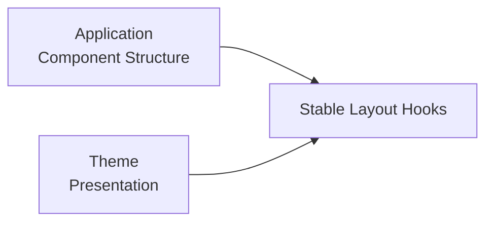

# Typography と Article Layout

このページは [テーマ作成の詳細](../theme-system.ja.md) の一部で、Typography と Article Layout の指定を扱います。

## 8. Typography

Theme は Typography Preset を指定できます。

```ts id="6q5em7"
type ThemeTypographyPreset =
  | "system"
  | "serif"
  | "sans";
```

Preset は、

- Body
- Heading
- Code

などの Semantic Font Token に反映されます。

Font を個々の Component に直接指定するのではなく、Semantic Token を通して Site 全体の Typography を統一します。


## 9. Article Layout

Theme は Article Layout Preset を指定できます。

```ts id="l0kwo9"
type ThemeArticleLayoutPreset =
  | "article"
  | "sidebar"
  | "full-width";
```

Theme が決めるのは Layout の **Presentation** です。

Route や Component Tree そのものを Theme が差し替えるわけではありません。


