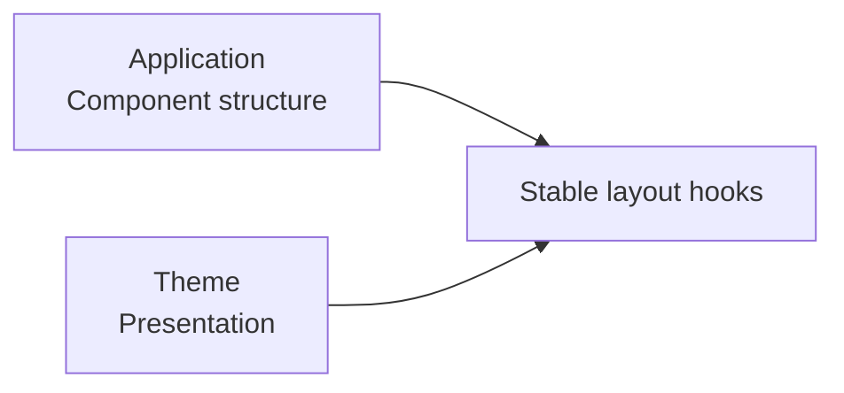

This page is part of [Themes in Depth](../theme-system.md) and covers typography and article layout.

# Typography and article layout

## 3-2. typography

```ts
type ThemeTypographyPreset = "system" | "serif" | "sans";
```

The preset is reflected in semantic font tokens such as body and heading.

## 3-3. articleLayout

```ts
type ThemeArticleLayoutPreset = "article" | "sidebar" | "full-width";
```

A theme defines the presentation of a layout preset; it does not replace the route or the component tree.


