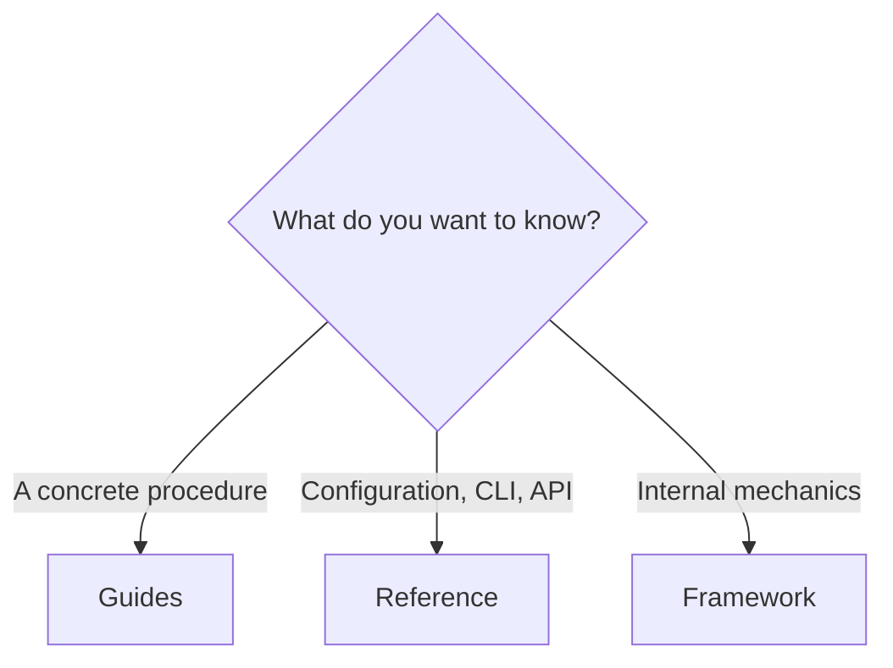
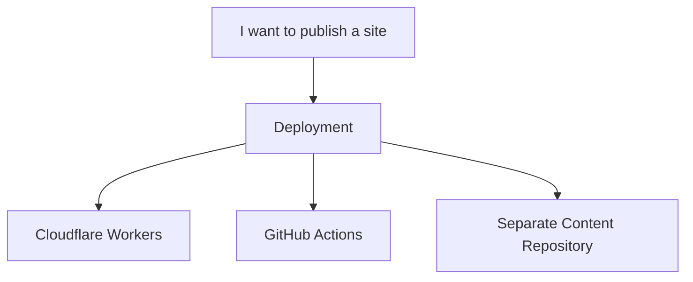

# Guides

Guides start from a task: "I want to publish an Obsidian vault", "I want a multilingual site", "I want to deploy automatically". If you are new, finish [Getting Started](../getting-started/README.md) first.



If you are new to Riebeckite, start with [Getting Started](../getting-started/README.md) before Guides.

## By task

| I want to… | Guide |
| --- | --- |
| Write and organize articles | [Writing content](./writing-content.md) |
| Customize the site UI with HonoX | [Customizing your site](./customizing-your-site.md) |
| Build a homepage and browse routes | [Discovery recipes](./discovery-recipes.md) |
| Publish an Obsidian vault | [Obsidian](./obsidian.md) |
| Keep content and the site in separate repositories | [Content repositories](./content-repositories.md) |
| Build a multilingual site | [Localization](./localization.md) |
| Collect page views | [Analytics](./analytics.md) |
| Replace the icon, logo, or link preview image | [Branding your site](./branding.md) |
| Deploy | [Deployment](./deployment/README.md) |
| Upgrade Riebeckite or read migration notes | [Upgrading](./upgrading.md) |
| Migrate an existing site from another platform | [Migration guides](./migration/README.md) |

## What each guide covers

- [Writing content](./writing-content.md) — the basics of writing articles in Riebeckite, including Markdown and frontmatter.
- [Obsidian](./obsidian.md) — using an existing Obsidian vault as Riebeckite content.
- [Content repositories](./content-repositories.md) — managing the site application and Markdown content in separate repositories.
- [Localization](./localization.md) — multiple languages, URLs, and language switching.
- [Analytics](./analytics.md) — adding analytics to a Riebeckite site.
- [Branding your site](./branding.md) — replacing the site favicon, header logo, and link preview image.
- [Customizing your site](./customizing-your-site.md) — editing routes, components, islands, and CSS in `app/` as a normal HonoX application.
- [Discovery recipes](./discovery-recipes.md) — building a homepage and browse routes.
- [Upgrading](./upgrading.md) — updating Riebeckite packages and reviewing changes.
- [Migration guides](./migration/README.md) — planning a safe migration from Quartz, documentation platforms, static site generators, or static application frameworks.

## Deployment guides

Deployment has its own section because the choices multiply once automation is involved.



| I want to… | Guide |
| --- | --- |
| Deploy to Cloudflare Workers | [Cloudflare Workers](./deployment/cloudflare-workers.md) |
| Understand the generated GitHub Actions workflow | [GitHub Actions](./deployment/github-actions.md) |
| Read articles from a separate repository in CI | [Separate content repository](./deployment/separate-content-repository.md) |

## Where to look next

- The **exact** configuration fields, CLI commands, and API contracts live in [Reference](../reference/README.md).
- How the content, plugin, and theme systems are built lives in [Framework](../framework/README.md).

## Guides and the other chapters

The documentation is divided by role:

```text
Build a site for the first time
  → Getting Started

Learn the procedure for a task
  → Guides

Find a plugin
  → Plugins

Find a theme
  → Themes

Look up configuration, CLI, and APIs
  → Reference

Understand the internal structure
  → Framework
```

Guides focus on **what you need to do to accomplish a goal**, rather than on internal implementation details.
