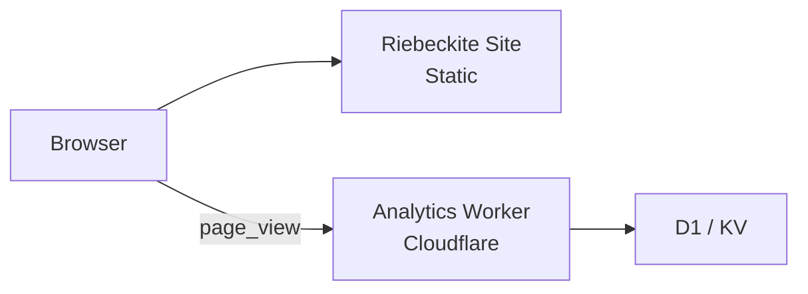
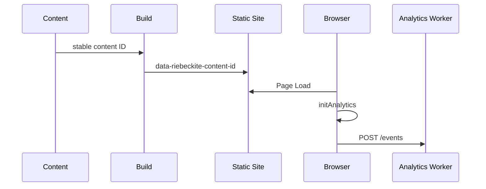
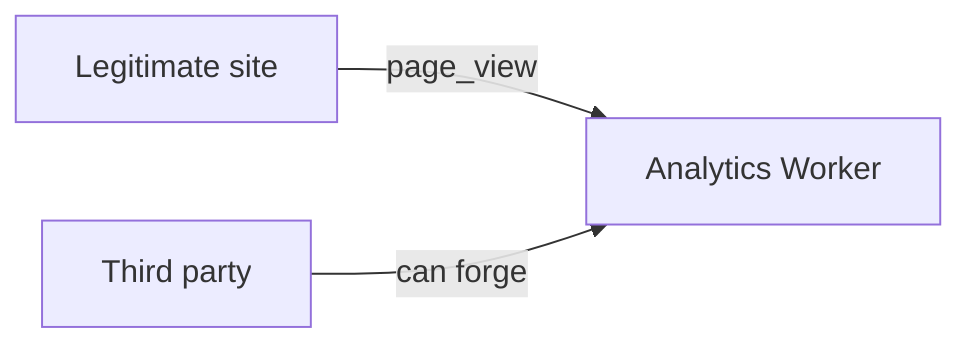
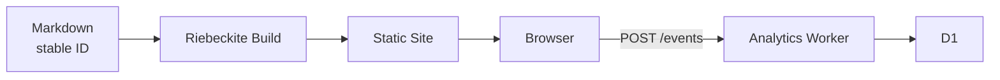
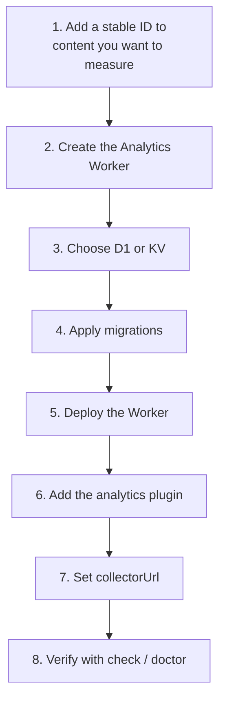

# Analytics

Riebeckite collects a page view per article. Analytics is split into two
packages with a deliberate boundary: a storage-independent plugin that registers
browser page-view tracking, and an independent Cloudflare Worker that accepts,
validates, and stores those events.

| Package | Role |
| --- | --- |
| `@riebeckite/plugin-analytics` | Sends page views from the site. |
| `@riebeckite/analytics-cloudflare` | Receives events and stores/aggregates them on Cloudflare. |



The site itself stays a normal static build. The analytics Worker is a separate
deployment that never replaces the static site's `wrangler.jsonc` or main entry.

## Which package does what?

### `@riebeckite/plugin-analytics`

The plugin on the Riebeckite site side. It provides, mainly:

- identification of the content to measure
- sending `page_view` from the browser
- the `AnalyticsProvider` contract
- the analytics query contract

It does not depend on Cloudflare, D1, KV, or any particular database.

### `@riebeckite/analytics-cloudflare`

A standalone Worker package for receiving analytics events on Cloudflare. It
provides, mainly:

- receiving events
- request validation
- CORS
- rate limiting
- storing to D1 / KV
- read APIs for page views

```text
Riebeckite Site
  → @riebeckite/plugin-analytics

Analytics Worker
  → @riebeckite/analytics-cloudflare
```

## How tracking works

Page views are recorded against a content entry's **stable content ID**.



There are three broad stages.

### 1. Content ID

Content you want to measure gets a stable `id` in its frontmatter.

```yaml
---
id: guide-1
---
```

This ID identifies the article. A URL can change while you still want the same
content to be treated as one entry, so URLs like

```text
/old-guide
/new-guide
```

are not used as the analytics identity. See
[Content System](../framework/content-system.md#stable-content-ids) for details.

### 2. A marker is added at build time

During the build, a hidden element is added to every published entry that has a
stable content ID.

```html
<span
  hidden
  data-riebeckite-content-id="guide-1"
></span>
```

The browser-side analytics reads the content ID from this marker.

### 3. The browser sends the event

`initAnalytics` runs once per document. It reads the content ID and sends a
`page_view` event as JSON to the configured `collectorUrl`.

```json
{
  "type": "page_view",
  "contentId": "guide-1",
  "occurredAt": "2026-01-01T00:00:00.000Z",
  "path": "/guide",
  "lang": "en"
}
```

The identity used is

```text
contentId
```

`path` and `lang` are contextual metadata. Content without a stable ID is not
measured.

## Page view unit

The current Riebeckite uses static document navigation, so the basic model is

```text
Page Load
   ↓
initAnalytics
   ↓
page_view × 1
```

One `page_view` is sent per page load. SPA route transitions are not tracked
automatically.

## Configuring the site

```ts
import { analytics, MemoryAnalyticsProvider } from "@riebeckite/plugin-analytics";

export default defineConfig({
  // ...
  plugins: [
    analytics({
      provider: new MemoryAnalyticsProvider(),
      publicConfig: { collectorUrl: "https://analytics.example.com/events" },
    }),
  ],
});
```

There are two main settings:

```text
provider
publicConfig.collectorUrl
```

### `provider`

`provider` is the private runtime implementation of the `AnalyticsProvider`
contract. A provider offers

```text
capabilities
capture
query
```

Private information such as credentials and storage bindings stays inside the
provider. It must never be passed to the browser.

### `publicConfig.collectorUrl`

`collectorUrl` is the URL the browser sends events to.

```ts
publicConfig: {
  collectorUrl: "https://analytics.example.com/events",
}
```

It can be either a site-relative path or an HTTP(S) URL that accepts a JSON
`POST` body. `publicConfig` is, as the name says, exposed to the browser — never
put secrets in it.

### `MemoryAnalyticsProvider`

`MemoryAnalyticsProvider` is for tests and local experiments. It is not a
persistent analytics store for production. Use a real collector such as the
Cloudflare Worker in production.

## Checking the configuration

The analytics plugin's options go through the normal plugin validation. For
example, a malformed `provider` or `collectorUrl` can be checked with

```sh
pnpm exec riebeckite check
```

or

```sh
pnpm exec riebeckite doctor
```

## AnalyticsProvider

`AnalyticsProvider` declares which analytics features it supports through
`capabilities`. The main capabilities are

```text
capture
content_page_views
popular_content
```

### Storing events

```ts
await provider.capture(event);
```

`capture` stores a page view event.

### Reading content page views

```ts
await provider.query({
  type: "content_page_views",
  contentId: "guide-1",
  timeRange: { from: "2026-01-01T00:00:00.000Z" },
});
```

Returns the total page views for one content entry. The time range is optional.

### Reading popular content

```ts
await provider.query({ type: "popular_content", limit: 10 });
```

Returns a ranking based on page views. `limit` and the time range are optional.

### Unsupported queries

A provider that cannot satisfy a query throws

```text
UnsupportedAnalyticsQueryError
```

When implementing your own provider, use

```ts
assertAnalyticsQuerySupported(provider, query);
```

Capability and query helpers are exported from the package root.

## Collecting events with a Cloudflare Worker

To collect events on Cloudflare, use `@riebeckite/analytics-cloudflare`. The
package exposes

```text
createWorker(options)
```

and storage adapters. There is no default storage: **choose exactly one of D1 or
KV explicitly.**

### D1 and KV

| Storage | Event capture | Total page views | Popular ranking | Time range |
| --- | --- | --- | --- | --- |
| D1 | Yes | Yes | Yes | Yes |
| KV | Yes | No | No | No |

#### D1

For D1, use

```text
D1AnalyticsStorage
d1Storage(db)
```

D1 aggregates per UTC day. It uses atomic SQLite upserts and **does not store raw
page view events**. This makes the following available:

- `capture`
- `content_page_views`
- `popular_content`
- day-based time-range queries

Use this if you want to make real use of aggregated analytics.

#### KV

For KV, use

```text
KvAnalyticsStorage
kvStorage(namespace)
```

KV supports `capture` only. Totals are best-effort, and concurrent writes can
lose counts. It therefore does not support

```text
content_page_views
popular_content
```

Using those APIs returns HTTP `501`.

### D1 Worker example

```ts
import { createWorker, d1Storage } from "@riebeckite/analytics-cloudflare";

export interface Env { ANALYTICS_DB: D1Database; }

export default {
  fetch(request: Request, env: Env) {
    return createWorker({
      storage: d1Storage(env.ANALYTICS_DB),
      cors: { allowedOrigins: ["https://www.example.com"] },
    }).fetch(request);
  },
};
```

Cloudflare passes `env` at `fetch` execution time, so the storage binding is also
constructed per request.

```text
Request
   ↓
fetch(request, env)
   ↓
d1Storage(env.ANALYTICS_DB)
   ↓
createWorker(...)
```

Do not try to read `env` at module top level.

### Worker endpoints

The analytics Worker provides the following endpoints.

| Endpoint | Description |
| --- | --- |
| `POST /events` | Receives a `page_view`. |
| `GET /content/:contentId/page-views` | Total page views for a content entry. |
| `GET /popular` | Popular content. |

#### `POST /events`

Accepts a JSON `page_view` payload. The maximum body size is 8 KiB. On success it
returns

```text
204 No Content
```

Invalid requests are rejected.

| Condition | Response |
| --- | --- |
| Invalid JSON | `400` |
| Unknown or invalid field | `400` |
| Non-JSON `Content-Type` | `415` |
| Body larger than 8 KiB | `413` |
| Rate limit exceeded | `429` |

#### Page view API

```text
GET /content/:contentId/page-views?from=&to=
```

Returns the total page views for one content entry.

#### Popular API

```text
GET /popular?limit=&from=&to=
```

Returns popular content.

Read APIs are available only when the storage adapter advertises the
corresponding capability.

### CORS

Origins are denied by default, so you normally name the site's origin explicitly.

```ts
cors: {
  allowedOrigins: ["https://www.example.com"],
}
```

To allow every origin, specify

```text
"any"
```

Use that only when you deliberately expose a public collector.

### CORS is not authentication

Setting `allowedOrigins` does not make analytics events trustworthy. `Origin` is
not authentication, so a third party can impersonate an allowed origin and send

```text
POST /events
```

directly.



Treat collected page views as **untrusted measurement data**.

### Rate limiting

To reduce abuse, you can optionally set `rateLimit`. It limits the number of
requests per connecting IP in a fixed window. When the limit is exceeded it
returns

```text
429 Too Many Requests
```

#### D1 rate limiter

For production, use

```text
D1AnalyticsRateLimiter
d1RateLimiter(...)
```

```ts
d1RateLimiter(db, { maxRequests: 100, windowMs: 60_000 });
```

Because it keeps an atomic counter on D1, it is shared across Worker isolates.
If you use it, apply

```text
migrations/0002_analytics_rate_limits.sql
```

before deploying.

#### Memory rate limiter

`MemoryAnalyticsRateLimiter` is for tests and local development. It only holds
process-local counters, so it is not shared across short-lived Worker isolates
and is not suitable for limiting distributed production traffic.

### Limits of rate limiting

Rate limiting is not authentication. It can mainly

```text
A large number of requests from a single client
        ↓
Throttle down to a certain amount
```

It cannot fully prevent events sent from many distributed clients, nor forged
legitimate-looking page views. That is why it matters to
**treat analytics data itself as untrusted even when CORS and rate limiting are
configured.**

### Privacy

The analytics Worker does not read or store

```text
Cookie
User-Agent
Fingerprint
```

The `path` and `lang` in an event are also contextual metadata and are not stored
in D1. Only when rate limiting is enabled does it read

```text
CF-Connecting-IP
```

as the rate-limit key. The D1 rate limiter stores that key only for the active
rate-limit window.

## Deploying

The D1 schema is never created automatically during a request. Always apply the
migrations before deploying:

```sh
pnpm exec wrangler d1 execute ANALYTICS_DB --file node_modules/@riebeckite/analytics-cloudflare/migrations/0001_analytics_page_views.sql
pnpm exec wrangler d1 execute ANALYTICS_DB --file node_modules/@riebeckite/analytics-cloudflare/migrations/0002_analytics_rate_limits.sql
```

The first is the schema for analytics aggregation. The second is required if you
use the D1 rate limiter.

Riebeckite ships analytics Worker templates:

```text
templates/analytics-cloudflare/d1
templates/analytics-cloudflare/kv
```

Copy the template matching your storage into a **separate Worker directory or
repository**.

```text
my-site/
  └─ Static Riebeckite Site

my-analytics/
  └─ Analytics Worker
```

The analytics Worker has its own `main`. Do not replace the static Riebeckite
site's

```text
wrangler.jsonc
main
```

After applying the migrations, deploy the Worker:

```sh
pnpm exec wrangler deploy
```

Then point the site's `collectorUrl` at the Worker's `/events`:

```ts
analytics({
  // ...
  publicConfig: {
    collectorUrl: "https://analytics.example.com/events",
  },
});
```

The final arrangement looks like this:



## Diagnostics

`@riebeckite/plugin-diagnostics` reports an `analytics-untracked` finding (info
severity) for each published note without a stable content ID when the config
enables the analytics plugin.

```text
Published note
   ↓
No stable content ID
   ↓
analytics-untracked
```

This makes tracking gaps visible directly in

```sh
pnpm exec riebeckite check
pnpm exec riebeckite doctor
pnpm exec riebeckite build
```

It never modifies content. See
[Diagnostics](../framework/diagnostics.md) for the check/doctor/inspect contract.

## Introduction flow

If you are adopting analytics for the first time, this order is the easiest to
follow.



D1 is required to use page-view aggregation and rankings in production. Limit KV
to uses that need only `capture`.

## Summary

Riebeckite analytics separates the static site from the analytics backend.

```text
Static Riebeckite Site
  ↓
@riebeckite/plugin-analytics
  ↓
page_view
  ↓
Standalone Analytics Worker
  ↓
D1 / KV
```

The site stays static, and analytics storage or Cloudflare-specific processing
never enters the site or the core.

It also separates the following roles:

```text
Content identity
  → stable content ID

Public metadata
  → path / lang

Storage
  → D1 / KV

Abuse mitigation
  → CORS / rate limit
```

In particular, CORS and rate limiting are not authentication that guarantees the
validity of analytics events. Treat collected page views as untrusted
measurement data.

## Reading list

- [Content System](../framework/content-system.md#stable-content-ids) — stable content IDs
- [Diagnostics](../framework/diagnostics.md) — structured findings, `check`, and `doctor`
- [Framework Reference](../reference/README.md) — public package surface
- [HonoX Integration](../framework/honox-integration.md) — the static site build this
  Worker runs beside
- [Usage Guide](./README.md) — deployment of the static site
