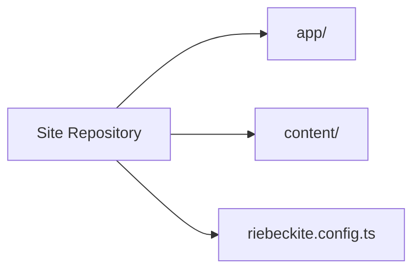
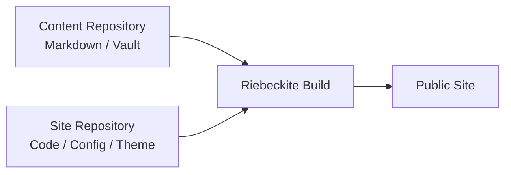
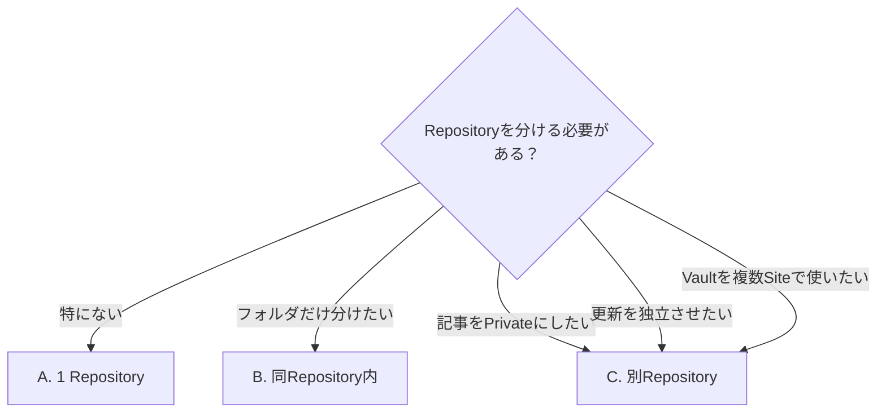
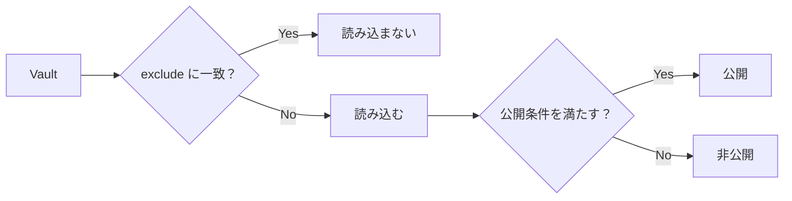
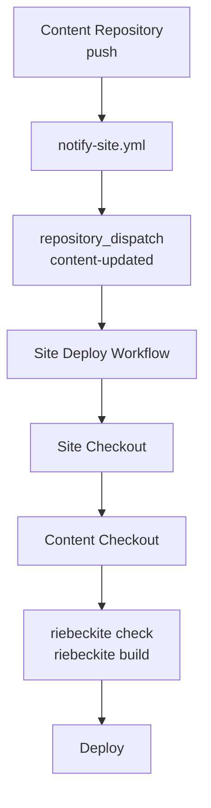
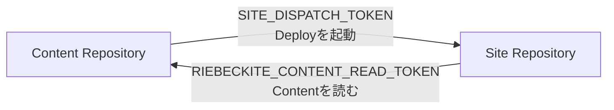
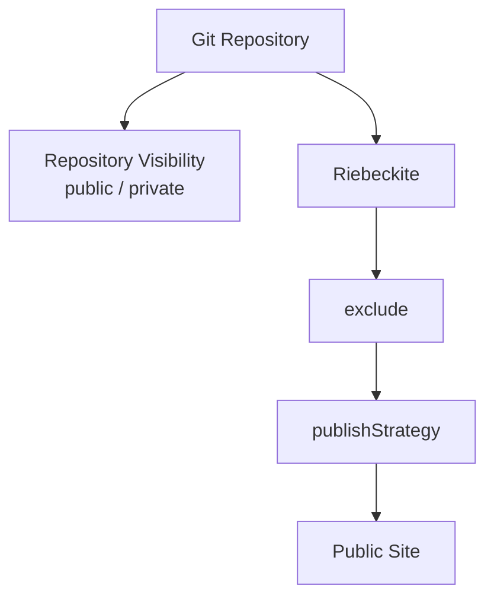
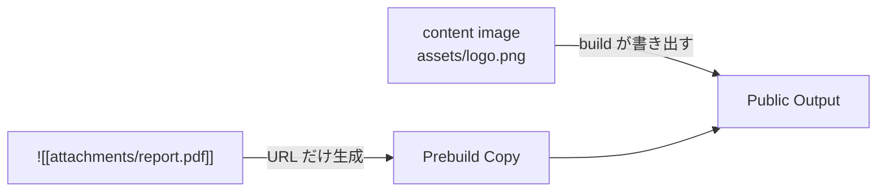
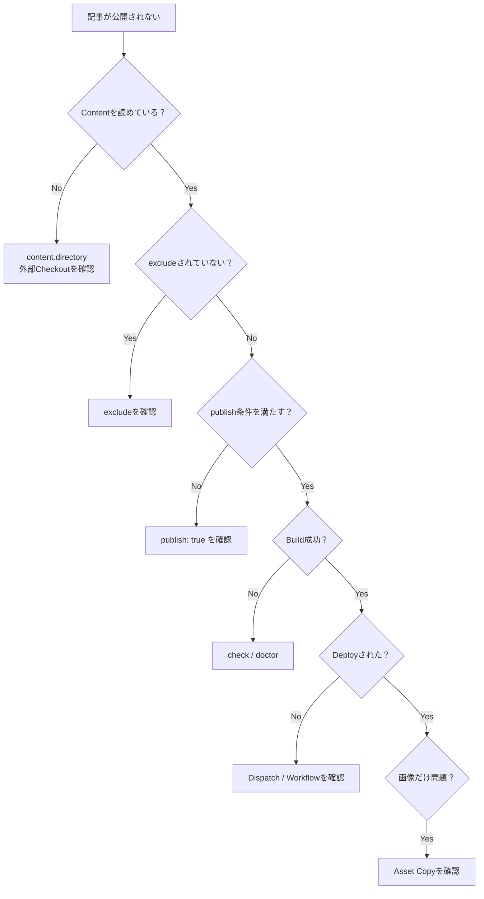
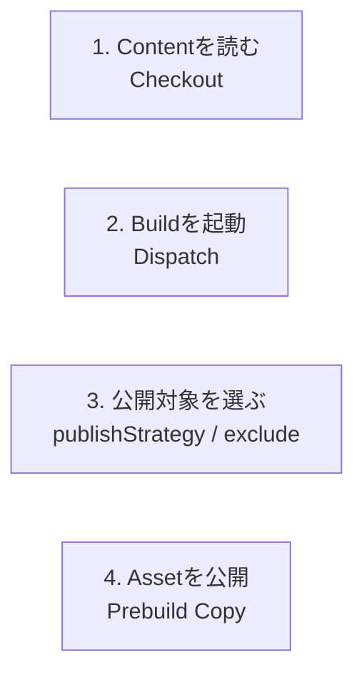

# 記事とサイトのリポジトリ分離

Riebeckite では、**記事とサイトを同じ Repository に置く必要はありません。**

たとえば、

```text
記事
  → Markdown / Obsidian Vault

サイト
  → Application / Config / Theme / Plugin
```

を別々に管理できます。

この Guide では、

- そもそも Repository を分けるべきか
- どのような構成にするか
- 外部 Vault を Site から読む方法
- Private Repository の記事を CI から読む方法
- 記事更新から Site を再デプロイする方法
- 公開してよい Content をどう制御するか

を説明します。

`repository_dispatch`、外部 Checkout、`notify-site.yml` などの詳細な GitHub Actions 構成は [リポジトリ分離の詳細編](./deployment/separate-content-repository.md) を参照してください。

## この構成が向いている人

Repository の分離は、特に次のような場合に便利です。

- Obsidian Vault と Site Code を別々に管理したい
- 記事 Repository は Private、Site Repository は Public にしたい
- 1つの Vault を複数の Site から利用したい
- 記事の更新と Site Code の更新を分けたい
- 記事 Repository の Push から Site を自動デプロイしたい

一方、小さな個人 Site を1つの Repository で管理するだけなら、無理に分離する必要はありません。

## まずは1 Repository で始める

通常の Riebeckite Site は、

```text
site/
├─ content/
├─ app/
├─ riebeckite.config.ts
└─ package.json
```

という構成です。

`create-riebeckite` で Site を作成した場合も、基本的にはこの形から始まります。



既存の Obsidian Vault を利用するなど、明確に分離する理由がなければ、最初はこの構成で十分です。

## Repository を分けるとどうなる？

分離すると、

```text
site repository          content repository
├─ app/                  ├─ article-a.md
├─ riebeckite.config.ts  ├─ article-b.md
├─ package.json          ├─ attachments/
└─ ...                   └─ ...
```

のようになります。

役割も明確に分かれます。

| Repository | 主な内容 |
| --- | --- |
| Site | Application、Config、Theme、Plugin、Deploy |
| Content | Markdown、Obsidian Vault、添付ファイル |



Riebeckite Build が両方を組み合わせて、最終的な Site を生成します。

## どの構成を選ぶ？

大きく3つの構成があります。

| パターン | 構成 | 公開範囲 | 向いているケース |
| --- | --- | --- | --- |
| A. 1 Repository | Site と `content/` を同じ Repository に置く | 同じ | 小さな個人 Site |
| B. 同じ Repository 内で分離 | `site/` と `vault/` を並べる | 同じ | 履歴は共有しつつ場所を分けたい |
| C. 別 Repository | Site と Content を別 Repository にする | 別々に設定可能 | Private Vault、独立した更新、複数 Site |

迷った場合は、次のように選べます。



特に、

**記事 Repository 自体を公開したくないなら C**

が分かりやすい構成です。

以下では C の構成を説明します。

A と B でも Content の設定方法は基本的に同じですが、外部 Repository の Checkout や Repository Dispatch は必要ありません。

## 記事は Site の外に置ける

Riebeckite の `content.directory` は、Site Root からの相対 Path で外部 Directory を指定できます。

たとえば、

```text
workspace/
├─ vault/
│  ├─ article-a.md
│  └─ article-b.md
│
└─ site/
   ├─ app/
   ├─ riebeckite.config.ts
   └─ package.json
```

なら、

```ts
// site/riebeckite.config.ts

export default defineConfig({
  content: {
    directory: "../vault",
  },
});
```

とできます。

記事を Site Directory の内部へコピーする必要はありません。

`content.directory` の基準は Site の `appRoot` です。

詳しい Root の解決規則は [Configuration](../reference/configuration.md) の「Filesystem root と外部 Vault」を参照してください。

## 何をどこへ置く？

たとえば次のように分けられます。

| 内容 | 置き場所 |
| --- | --- |
| Markdown | Vault |
| 画像・添付ファイル | Vault の `attachments/` など |
| Obsidian 設定 | Vault の `.obsidian/` |
| Site Code | Site Repository |
| Riebeckite Config | Site Repository |
| Theme / Plugin 設定 | Site Repository |
| Deploy 設定 | Site Repository |
| 非公開 Note | Vault 内の `private/` など |

Riebeckite が公開対象として扱う範囲は、後述する `publishStrategy` と `exclude` で制御します。

## 別 Repository 構成を作る

ここからは、

```text
notes
  → Content Repository

my-site
  → Site Repository
```

として説明します。

## 1. Content Repository を作る

まず記事用の Repository を用意します。

```sh
mkdir notes
cd notes
git init
```

Obsidian を利用する場合は、この Directory を Vault として開きます。

最初の記事を作ります。

```md
---
title: はじめまして
publish: true
---

最初のノートです。
```

既定の `explicit` Publish Strategy では、

```yaml
publish: true
```

が付いた Note だけが公開対象になります。

## `.gitignore`

OS の一時 File や Obsidian の Workspace State を Git 管理したくない場合は `.gitignore` に追加します。

```gitignore
.DS_Store
Thumbs.db

.obsidian/workspace.json
.obsidian/workspace-mobile.json
```

`.obsidian/` 自体を Git 管理しても構いません。

Site の Content として読みたくないものは、後で `exclude` から除外できます。

## Private Repository にする

記事そのものを公開したくない場合は、Content Repository を GitHub の Private Repository にします。

```sh
git add .
git commit -m "最初のノート"

git remote add origin \
  git@github.com:<you>/notes.git

git push -u origin main
```

これによって、

```text
Content Repository
  → Private

Site Repository
  → Public
```

という構成にできます。

## 2. Site を作る

GitHub Actions を利用する場合は、Content Repository と Site Repository を指定して Site を生成できます。対話式の CLI では `Separate GitHub repository` を選び、Content repository と Site repository を入力するのと同じ構成になります（GitHub Actions のデプロイ設定は自動です）。

```sh
npx create-riebeckite my-site \
  --github-actions \
  --content-repository <you>/notes \
  --site-repository <you>/my-site

cd my-site
npm install
```

Preset は必要に応じて `--preset` で変更できます。

既定の `starter` から始めても問題ありません。

この構成では、Deploy Workflow が Content Repository を Site の、

```text
content/
```

へ Checkout します。

また、外部 Content Repository 用の、

```text
content-updated
repository_dispatch
github/notify-site.yml
```

も生成されます。

## ローカルでの配置

開発環境では、

```text
workspace/
├─ notes/
└─ my-site/
```

のように兄弟 Directory として配置すると扱いやすくなります。

ただし、CI では Site Checkout 内の、

```text
my-site/
└─ content/
```

へ Content Repository を Checkout します。

ローカル配置と CI 配置が同じとは限らない点に注意してください。

## 3. `content.directory` を設定する

生成された Deploy Workflow に合わせる場合は、

```ts
export default defineConfig({
  // ...

  content: {
    directory: "content",

    exclude: [
      ".obsidian/**",
      "Templates/**",
      "private/**",
    ],
  },

  // ...
});
```

とします。

`directory: "content"` は CI が Content Repository を Checkout する場所です。

`exclude` には Site へ読み込ませたくないものを指定します。

典型的には、

```text
.obsidian/**
Templates/**
private/**
```

などです。

## `exclude` と `publish: true` は別物

この2つは役割が異なります。



`exclude` は、

**そもそも Content として読み込ませない**

ための設定です。

`publish: true` は、

**読み込んだ Content のうち何を公開するか**

を決めます。

Private Content を扱う場合は、両方を利用して公開境界を明確にしておくのがおすすめです。

## 4. Content が読めているか確認する

表示を確認する前に CLI で状態を確認できます。

```sh
npm exec riebeckite check
npm exec riebeckite doctor
npm exec riebeckite inspect config
npm exec -- riebeckite inspect content --list
```

それぞれの役割は次のとおりです。

| Command | 確認すること |
| --- | --- |
| `check` | Config と Plugin Contract |
| `doctor` | Content Source などの問題 |
| `inspect config` | 解決済み Config |
| `inspect content --list` | 実際に読み込まれた Content |

特に、

```sh
npm exec riebeckite inspect config
```

の `Directory` を確認してください。

ここには解決済みの絶対 Path が表示されます。

```text
期待する Vault
       ↑
Directory がここを指しているか確認
```

また、

```sh
npm exec -- riebeckite inspect content --list
```

では読み込まれた Note の `PATH` を確認できます。

想定より多い・少ない場合は `exclude` を確認してください。

記事が読み込まれているのに公開されない場合は、`publish: true` も確認します。

## 5. CI を理解する

別 Repository 構成では、特に重要な違いがあります。

**「CI が Content Repository を読める」ことと、「Content の更新で Deploy が起動する」ことは別です。**



外部 Checkout だけ設定しても、Content Repository の Push から Site Workflow は起動しません。

外部 Checkout が解決するのは、

```text
Site CI が Content を読める
```

という問題です。

Repository Dispatch が解決するのは、

```text
Content が更新されたら
Site CI を起動する
```

という問題です。

この2つを混同しないでください。

## 6. Content Repository から Site へ通知する

生成された、

```text
github/notify-site.yml
```

を Content Repository の、

```text
.github/workflows/notify-site.yml
```

へ配置します。

Content Repository の `main` に Push されると、Site Repository へ、

```text
content-updated
```

を送信します。

Site 側では、

```yaml
repository_dispatch:
  types:
    - content-updated
```

を受け取って Deploy Workflow を起動します。

## `SITE_DISPATCH_TOKEN`

Content Repository 側には、

```text
SITE_DISPATCH_TOKEN
```

を Secret として設定します。

これは Content Repository から Site Repository へ Dispatch を送るための Token です。

Fine-grained PAT を利用する場合は、

```text
対象
  → Site Repository のみ

権限
  → Contents: read and write
```

が必要です。

Classic PAT の `repo` Scope や、`Contents: write` を持つ GitHub App Installation Token も利用できます。

Fine-grained PAT も Classic PAT も、[GitHub の Settings → Developer settings → Personal access tokens](https://github.com/settings/tokens) から作成できます。作成した値は、この Content Repository の **Settings → Secrets and variables → Actions** に `SITE_DISPATCH_TOKEN` という名前で登録します。

## `RIEBECKITE_CONTENT_READ_TOKEN`

Content Repository が Private または Internal の場合は、Site Repository 側に、

```text
RIEBECKITE_CONTENT_READ_TOKEN
```

を登録します。

これは Site CI が Content Repository を Checkout するための Token です。

Fine-grained PAT の場合は、

```text
対象
  → Content Repository のみ

権限
  → Contents: read
```

とします。

Content Repository が Public なら、この Secret は不要です。

Site Repository の通常の `GITHUB_TOKEN` では、別の Private / Internal Repository を読むことはできません。

この Token は **Site Repository の Settings → Secrets and variables → Actions** に登録します。

## 2つの Token の違い

名前が似ていますが、役割はまったく異なります。

| Secret | 置く場所 | 目的 |
| --- | --- | --- |
| `SITE_DISPATCH_TOKEN` | Content Repository | Site Workflow を起動する |
| `RIEBECKITE_CONTENT_READ_TOKEN` | Site Repository | Private Content を Checkout する |



この関係を覚えておくと CI の問題を切り分けやすくなります。

## 7. Deploy の流れ

Repository Dispatch を利用した場合は、最終的に次の順番になります。

```text
1. Content Repository に push

2. notify-site.yml が実行

3. Site Repository へ
   content-updated を送信

4. Site Deploy Workflow が起動

5. Site Repository を checkout

6. Content Repository を
   content/ へ checkout

7. riebeckite check

8. riebeckite build

9. Deploy
```

処理は次の順番で進みます。

```text
通知
  ↓
起動
  ↓
Checkout
  ↓
Build
```

## 他の運用方法

Repository Dispatch 以外の方法も利用できます。

| 方法 | Content Push で Deploy | 特徴 |
| --- | --- | --- |
| 同じ Repository | される | 最も単純 |
| 別 Repository + Dispatch | される | Content 更新を即時反映 |
| 別 Repository + Schedule | 遅れて反映 | Dispatch Token 不要 |
| Manual | されない | 必要なときだけ実行 |
| Git Submodule | されない | Site 側で参照 Commit の更新が必要 |

## Schedule

Site Workflow に `schedule` を追加すれば、定期的に Content Repository の最新状態を取得できます。

この場合、

```text
SITE_DISPATCH_TOKEN
```

は不要です。

ただし Content 更新から Deploy まで遅延します。

## Git Submodule

Content Repository を Git Submodule として管理することもできます。

```sh
git submodule add \
  git@github.com:<you>/notes.git \
  content
```

この場合、

```text
site/
└─ content/
   └─ → notes repository
```

という関係になります。

CI では `actions/checkout` に、

```yaml
submodules: recursive
```

を設定します。

ただし Content を更新しただけでは Site の Submodule Reference は更新されません。

Content 更新後に Site 側でも、

```sh
cd my-site
cd content
git pull
cd ..

git add content
git commit -m "記事を更新"
git push
```

という操作が必要です。

そのため、記事 Push だけで自動 Deploy したい場合は Repository Dispatch の方が向いています。

## 日常の運用

Repository Dispatch を設定した後は、記事側では通常どおり編集して Push します。

```sh
cd notes

# Obsidianなどで編集

git add .
git commit -m "記事を追加"
git push
```

その後、

```text
Content Push
     ↓
notify-site
     ↓
repository_dispatch
     ↓
Site Build
     ↓
Deploy
```

が自動で実行されます。

Site Code を変更するときは Site Repository を通常どおり編集して Push します。

## 手元で確認する

Site は Site Directory から実行します。

```sh
cd my-site

npm run dev
npm run check
npm run doctor
```

`riebeckite build` も Site Directory で実行します。

Content Repository は入力であり、Riebeckite Application 自体を実行する場所ではありません。

## 公開のルール

Repository を分離しても、**Repository の公開範囲と Riebeckite の公開判定は別物**です。

たとえば Private Repository に Note が存在していても、

```yaml
publish: true
```

が付けば、Build 後の Public Site に内容が出る可能性があります。

逆に Public Repository に置いている Note は、Site に出さなくても Repository 自体から読むことができます。

この2つを分けて考えてください。



## `publishStrategy`

公開対象は、

```text
content.filters.publishStrategy
```

で決まります。

既定は `explicit` です。

| Strategy | 公開条件 | 向いている用途 |
| --- | --- | --- |
| `explicit` | `publish: true` がある | 公開対象を明示的に選ぶ |
| `selective` | `private: true` / `draft: true` がない | 基本すべて公開する |

Private Vault を利用する場合は `explicit` が安全側の設定です。

```text
explicit

公開し忘れる
  → あり得る

公開指定していないNoteが
意図せずSiteに出る
  → 起こりにくい
```

## 公開境界を二重にする

Private Content を扱う場合は、

```text
exclude
+
publishStrategy: explicit
```

を組み合わせます。

たとえば、

```ts
content: {
  directory: "content",

  exclude: [
    ".obsidian/**",
    "Templates/**",
    "private/**",
  ],

  filters: {
    publishStrategy: "explicit",
  },
},
```

とします。

そして公開する Note だけに、

```yaml
publish: true
```

を付けます。

## Obsidian で除外した方がよいもの

一般的には、

```text
.obsidian/**
Templates/**
private/**
```

などを `exclude` に指定します。

特に `.obsidian/` には Workspace State や Obsidian 固有の設定が含まれるため、Content として読み込ませないようにします。

## 添付ファイルに注意する

Vault 内の Asset は、content image と attachment / media で公開方法が異なります。

| 種類 | 対象 | URL | 公開の担当 |
| --- | --- | --- | --- |
| Content image | 画像（png、jpg、svg など） | `/<Vault からの相対 logical path>` | build 時に generated output として書き出される |
| Attachment / Media | Markdown でも画像でもないファイル | `/assets/attachments/<Vault からの相対 logical path>` | Site 側の Prebuild |

Content image は、公開ページから参照されているものだけが build の出力に含まれるため、手動で `public/` へコピーする必要はありません。

一方の attachment / media について、

```md
![[attachments/report.pdf]]
```

が URL に変換されても、実際の `report.pdf` が Public Output に存在しなければ Browser では `404` になります。



公開する attachment / media だけをコピーする Prebuild 処理を Site 側に用意してください。

Riebeckite Repository 内では、

```text
apps/web/scripts/build_images.ts
```

が参照実装です。

詳しい Asset の扱いは [リポジトリ分離の詳細編](./deployment/separate-content-repository.md) を参照してください。

## よくある質問

### Site 内の `content/` のまま一部だけ非公開にできる？

できます。

Repository 分離は、公開・非公開を制御するために必須ではありません。

```text
Repositoryを物理的に分ける
  → Repository構成の問題

何をSiteに公開するか
  → publishStrategy / exclude の問題
```

同じ Repository の `content/` を使いながら、

- 非公開 Note に `publish: true` を付けない
- Private Directory を `exclude` する

という運用もできます。

### Vault を移動したら記事が表示されなくなった

`content.directory` を確認してください。

相対 Path は Site Root を基準に解決されます。

```sh
npm exec riebeckite inspect config
```

で解決済み `Directory` を確認できます。

絶対 Path も利用できますが、開発端末と CI で環境が異なりやすいため、通常は相対 Path の方が扱いやすくなります。

### 記事は表示されるのに Asset だけ `404` になる

まず、どの種類の Asset かを区別してください。

画像が `404` になる場合は、その画像が公開ページから参照されているか確認します。content image は公開ページから参照されているものだけが build の出力に含まれるため、参照が漏れていないかを先に確認します。

Attachment / Media が `404` になる場合は Copy 処理を確認してください。URL が生成されていても、実ファイルが、

```text
public/assets/attachments/
```

などの Public Directory に存在しなければ表示できません。

### CI でだけ Vault が見つからない

CI 上に Content Repository が存在するか確認してください。

別 Repository の場合は、

- 外部 Checkout
- Submodule

などで CI Workspace に Content を取得する必要があります。

そのうえで `content.directory` が CI 上の配置と一致しているか確認します。

### Windows でも同じ設定を使える？

はい。

`exclude` Pattern は `/` 区切りで記述します。

実際の OS の Path Separator には依存しません。

## トラブルシューティング

| 症状 | 確認すること |
| --- | --- |
| 記事が表示されない | `publish: true`、`exclude`、`inspect content --list` |
| `Directory` が違う | `inspect config` と `content.directory` |
| CI で Vault が見つからない | 外部 Checkout / Submodule |
| Content Push で Deploy されない | `notify-site.yml` / `SITE_DISPATCH_TOKEN` / `repository_dispatch` |
| Private Content を Checkout できない | `RIEBECKITE_CONTENT_READ_TOKEN` |
| 画像だけ `404` | 公開ページからの参照があるか、build の出力を確認 |
| Attachment / Media だけ `404` | Prebuild の Asset Copy |
| ローカルと CI で Path が違う | Site Root を基準にした相対 Path |
| Submodule が更新されない | Site 側の Submodule Reference |

## 問題を切り分ける

問題が起きた場合は、次の順番で確認すると原因を絞りやすくなります。



より詳しい CI 認証、Root 解決、Asset、GitHub Actions の問題については [リポジトリ分離の詳細編](./deployment/separate-content-repository.md) を参照してください。

## まとめ

最初から Repository を分離する必要はありません。

```text
単純なSite
  → Site + content を1 Repository

既存Vaultを使う
  → 外部Directoryも選択肢

記事をPrivateにする
  → Contentを別Private Repository

Content Pushで自動Deploy
  → Repository Dispatch
```

別 Repository にする場合は、特に次の4つを分けて考えることが重要です。



Repository を分離すること自体は、Riebeckite の公開判定を変更しません。

**Repository の境界、Content の読み込み、Deploy の起動、Site への公開は、それぞれ別の責務です。**

### 関連資料

- [リポジトリ分離の詳細編](./deployment/separate-content-repository.md) — Root 解決、CI 認証、Assets、GitHub Actions、トラブル対応
- [Configuration](../reference/configuration.md) — `appRoot` / `configRoot` / `contentRoot`
- [Guides](./README.md) — その他の利用 Guide
- Cloudflare デプロイテンプレート — Deploy Workflow

