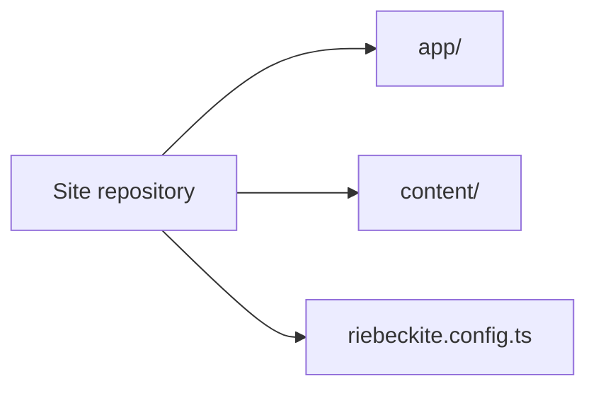
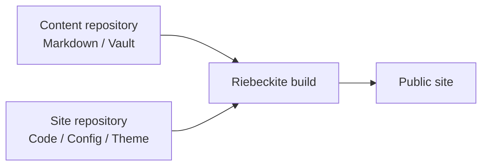
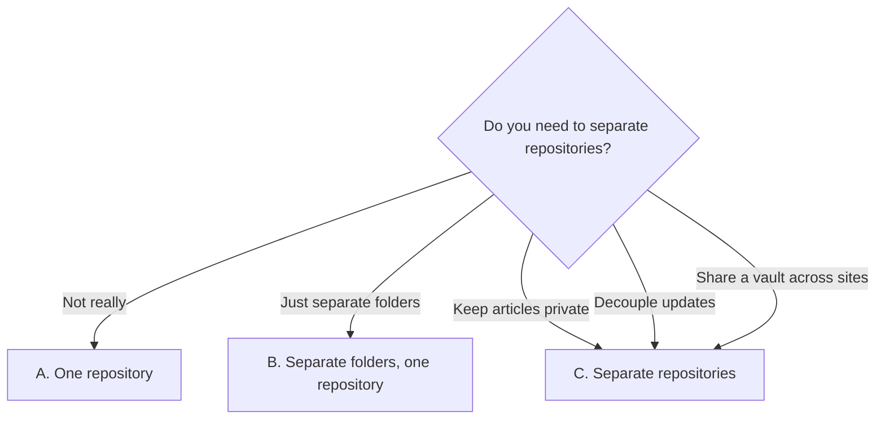
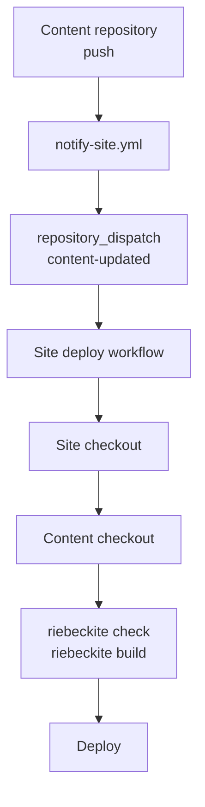
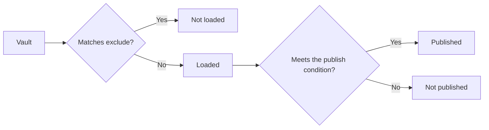
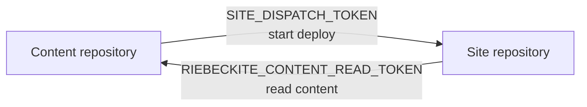
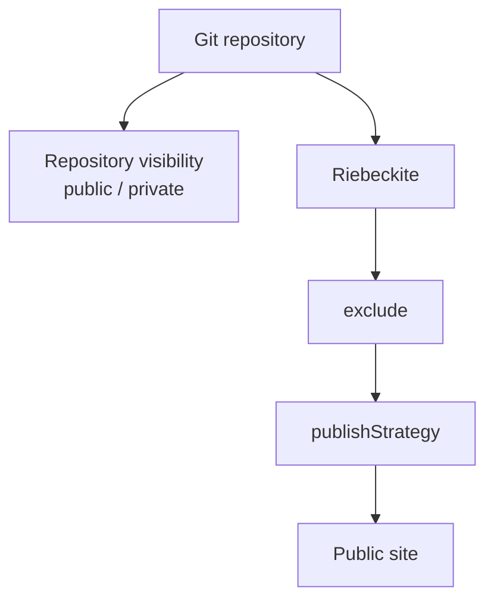
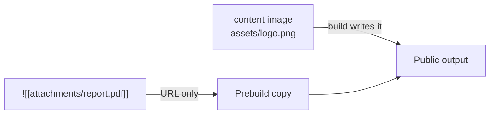
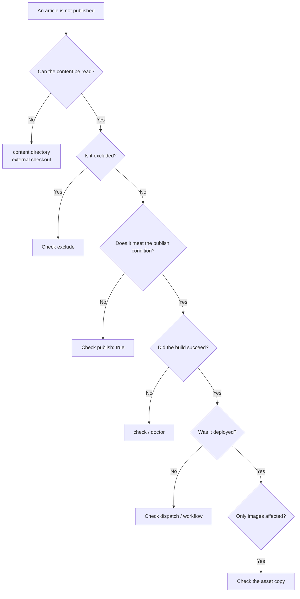
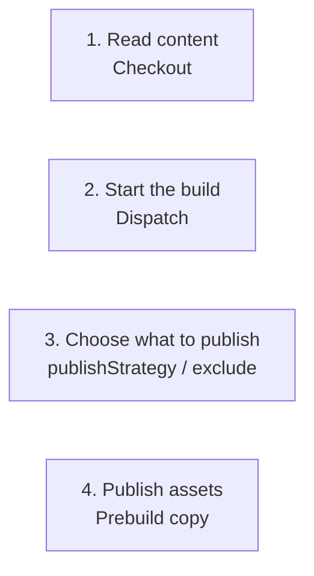

# Separating content from the site

For **keeping articles (Markdown / an Obsidian vault) separate from the site (code, configuration, themes)** — in different locations or different repositories — this guide explains why you might split them and what the resulting layout looks like. The concrete GitHub Actions automation, including repository dispatch and external checkout, lives in the [in-depth companion](./deployment/separate-content-repository.md).

## Who this guide is for

- You write notes in Obsidian and want them managed separately from the site code
- You want articles private and only the site public
- You want one vault shared by several sites
- You want article updates and site updates deployed independently

If all you want is a small personal blog in a single repository, there is no need to split anything. Pattern A (one repository) is enough.

## Start with one repository

The beginner setup keeps content and site code together:

```text
site repository
├─ content/
├─ app/
├─ riebeckite.config.ts
└─ package.json
```

This is what `npx create-riebeckite my-site` generates. Use it for your first site unless you already know you need a separate vault or repository.



When the split is useful, the shape becomes:

```text
site repository           content repository
├─ app/                  ├─ article-a.md
├─ riebeckite.config.ts  ├─ article-b.md
└─ ...                   └─ attachments/
```

The site repository owns the app, configuration, theme, plugins, and deployment. The content repository owns Markdown and attachments.



Riebeckite build combines both to produce the final site.

## The idea: articles can live outside the site

`content.directory` in `riebeckite.config.ts` is a **relative path from the site root (appRoot)** and can point at a folder outside it. Articles do not have to live inside the site.

```ts
// site/riebeckite.config.ts
export default defineConfig({
  content: {
    directory: "../vault", // the vault folder one level above the site
  },
  // ...
});
```

The base for a relative path is always the site root. So the same vault is read whether you run the CLI from `app/` inside the site or from a CI working directory. The precise definitions (appRoot / configRoot / contentRoot) are in [Configuration](../reference/configuration.md), "Filesystem root and an external vault".

With this, you can split things like:

| What to separate | Where it goes (example) |
| --- | --- |
| Article bodies (`.md`) | Any folder inside the vault |
| Attachments and images | `attachments/` and similar inside the vault |
| Obsidian settings | `.obsidian/` inside the vault |
| Site code and configuration | `site/` |
| Theme and plugin settings | The site repository |
| Deployment settings | The site repository |
| Notes you never publish | `private/` and similar inside the vault (excluded) |

## Choose a pattern

First decide at what granularity to split articles from the site.

| Pattern | Layout | Article visibility | Choose it when |
| --- | --- | --- | --- |
| A. One repository | Site and articles in one Git repository (use `content/`) | Same visibility as the repository | You want a single repository for a personal blog |
| B. Separate folders, one repository | `site/` and `vault/` side by side in one repository | Same visibility as the repository | You share history but want locations and settings apart |
| C. Separate repositories | Articles private, site public | Independent for articles and site | You want articles private or updates decoupled |

How to decide:

- **You do not want articles public** → C. With a private repository, a forgotten `publish: true` cannot expose the content itself.
- **Articles and site are both fine to publish** → A or B. One repository to manage.
- **You want article updates decoupled from the site deploy** → C. Add a repository-dispatch notification if an articles push must start a deploy; an extra checkout alone only supplies files to a deploy that already started.
- **You want one vault shared by several sites** → C, or a layout where the vault lives independently. Keep the vault in one place and have each site reference it read-only.



The steps below are for C. For A and B the configuration is the same; only **step 5 (fetching the articles repository in deployment) is unnecessary**.

## Steps: separate repositories (pattern C)

### How deployment is triggered (the whole flow)

With separate repositories, letting CI **read** the articles and **starting** the deployment are two different things. The setup generated by `--github-actions --content-repository <owner/repo> --site-repository <owner/repo>` connects them in this order:

1. You push to `main` in the articles repository.
2. The articles repository's `notify-site.yml` sends `content-updated` to the site repository (`SITE_DISPATCH_TOKEN`).
3. The site repository's deploy workflow starts via `repository_dispatch`.
4. The workflow checks out the site, then checks out the articles repository into `content/` (with `RIEBECKITE_CONTENT_READ_TOKEN` when private).
5. `riebeckite check` → `riebeckite build` → deploy to Cloudflare Workers.



Steps 2 and 3 are the point. The extra checkout only makes the articles **readable**; it does not make the site workflow observe pushes to the articles repository. GitHub Actions only picks up events in the repository that contains the workflow, so a push to another repository is connected by this notification (repository dispatch).

### 0. Align on terms

- **Vault**: the folder holding articles (`.md`) and attachments; the unit Obsidian opens.
- **`publish: true`**: marks a note as published. Under the explicit strategy, only marked notes reach the site.
- **`exclude`**: patterns the site does not read. A file may be in the articles repository and still be kept out of the build.

### 1. Create the articles repository (the vault)

Create a folder anywhere and initialize it as a Git repository. If you use Obsidian, open this folder as a vault.

```sh
mkdir notes
cd notes
git init
```

Add a first note. Leave `publish: true` off notes you want to keep private.

```md
---
title: Hello
publish: true
---

My first note.
```

If you do not want to track OS temp files or Obsidian workspace state, add a `.gitignore`. Committing `.obsidian/` itself is fine (the site side excludes it from reading later).

```gitignore
.DS_Store
Thumbs.db
.obsidian/workspace.json
.obsidian/workspace-mobile.json
```

Push to a **private** GitHub repository and the articles stay unpublished.

```sh
git add .
git commit -m "first note"
# After creating a private repository on GitHub:
git remote add origin git@github.com:<you>/notes.git
git push -u origin main
```

### 2. Generate the site

Generate the site with the common GitHub Actions deployment assets. This works with every preset; a preset changes only the starter site. In the interactive CLI the same setup is choosing `Separate GitHub repository` and entering the content and site repository values; the GitHub Actions deployment is then configured automatically.

```sh
npx create-riebeckite my-site --github-actions \
  --content-repository <you>/notes \
  --site-repository <you>/my-site
cd my-site
npm install
```

The generated deployment checks out the vault into the site's `content/` directory. Because `--content-repository` is present, it also generates the `content-updated` dispatch receiver and `github/notify-site.yml`. `create-riebeckite` accepts `--preset` to choose a starter; the default `starter` is fine to begin with. The site repository may still contain starter files under `content/`; use them only as local examples. In day-to-day work, edit and push the content repository.

```text
workspace/
├─ notes/     ← the articles from step 1 (the vault)
└─ my-site/   ← the site from step 2
```

This side-by-side layout is useful locally, but CI uses `content/` inside the site checkout after the workflow checks out the content repository there. Keep your local preview aligned with CI by either copying/checking out the vault to `my-site/content` or by setting `content.directory` locally to the same files you intend CI to build.

### 3. Point content.directory at the vault

In `my-site/riebeckite.config.ts`:

```ts
// my-site/riebeckite.config.ts
export default defineConfig({
  // ...
  content: {
    directory: "content",
    exclude: [".obsidian/**", "Templates/**", "private/**"],
  },
  // ...
});
```

- `directory: "content"` matches the path used by the deployment workflow.
- `exclude` holds things you never publish: Obsidian settings (`.obsidian/**`), templates (`Templates/**`), and a private-notes folder (`private/**`).

`exclude` keeps things from being loaded; `publish: true` marks things to publish. Using both gives you two layers of protection (see [Publication rules](#publication-rules)).



### 4. Verify loading

Before checking the rendered site, verify loading with the CLI.

```sh
npm exec riebeckite check
npm exec riebeckite doctor
npm exec riebeckite inspect config
npm exec -- riebeckite inspect content --list
```

- `check` validates the configuration and plugin contracts.
- `doctor` reports unreadable or invalid content sources.
- `inspect config` prints the resolved **absolute** path under `Directory`. Confirm it points at the intended vault.
- `inspect content --list` lists the `PATH` of every loaded note. Use it to confirm how `exclude` is taking effect and whether you are loading starter content or the real content repository.

A wrong path is usually the relative `directory`. If articles do not appear, check for `publish: true` (the explicit strategy).

### 5. Set up checkout, trigger, and secrets

The generated deploy workflow checks out the site and then the configured content repository into `content/`. It runs for a site push, manual dispatch, or `content-updated` repository dispatch. The generated notification workflow supplies the cross-repository trigger; the content checkout itself does **not** observe pushes in another repository.

Copy the generated `github/notify-site.yml` into the content repository as `.github/workflows/notify-site.yml`. Its `main` push sends `content-updated` to the site. Store `SITE_DISPATCH_TOKEN` only in the content repository. A fine-grained PAT restricted to the site repository needs **Contents: read and write**; alternatively use a classic PAT with `repo` scope or a GitHub App installation token with **Contents: write**.

```yaml
repository_dispatch:
  types: [content-updated]
```

For a private or internal content repository, store `RIEBECKITE_CONTENT_READ_TOKEN` in the **site** repository. Restrict its fine-grained PAT or GitHub App token to the content repository with **Contents: read**. A public content repository needs no extra checkout token. The site repository's `GITHUB_TOKEN` cannot read a different private/internal repository. The unpinned checkout intentionally reads the content default branch's newest tip for each dispatch. The site repository also needs `CLOUDFLARE_API_TOKEN` and `CLOUDFLARE_ACCOUNT_ID` for the deploy step.

| Deployment choice | Article push deploys | Setup |
| --- | --- | --- |
| Same repository | Yes | Keep `content/`; site `push` starts the workflow. |
| Separate repositories + dispatch | Yes | External checkout plus the content notification workflow above. |
| Separate repositories + schedule | Delayed | Add `schedule` to the site workflow; no dispatch token. |
| Manual dispatch | No | Run `workflow_dispatch` in the Actions tab. |
| Git submodule | No | Update the site-side submodule reference and push it. |

### Do not confuse the two tokens

The two tokens have similar names but opposite roles.

| Secret | Where it lives | Purpose |
| --- | --- | --- |
| `SITE_DISPATCH_TOKEN` | Content repository | Start the site workflow |
| `RIEBECKITE_CONTENT_READ_TOKEN` | Site repository | Check out private content |



Keeping this relationship in mind makes CI problems easier to isolate.

**Submodule alternative**

```sh
git submodule add git@github.com:<you>/notes.git content
```

`content` becomes a link to the articles repository. Add `submodules: recursive` to `actions/checkout@v4` in the workflow so CI fetches the dependency. After updating articles, you must update the submodule reference on the site side and push (a two-step operation).

With either option, run `riebeckite build` from the site directory. That is why the workflow runs `npm ci` → `npm exec riebeckite check` → `npm exec riebeckite build`.

### 6. Day-to-day operation

Once configured, you mostly just write and push.

**Updating articles (repository dispatch)**

```sh
cd notes
# edit in Obsidian
git add .
git commit -m "add an article"
git push
```

The content workflow dispatches the site workflow, which checks out the latest default-branch content, rebuilds, and deploys. A missing dispatch secret fails without printing its value; wrong token access, inaccessible content, build, and Cloudflare errors fail at their respective steps. Site-side changes live in the other repository: edit `my-site` and push as usual.

**Updating articles (submodule alternative)**

```sh
cd my-site
cd content && git pull && cd ..
git add content
git commit -m "update articles"
git push
```

**Checking locally**

```sh
cd my-site
npm run dev      # local preview
npm run check    # validate configuration
npm run doctor   # diagnose loading problems
```

## Publication rules

When articles and the site are separate, be explicit about where the publication boundary lies.

### How publication is decided

`content.filters.publishStrategy` decides which notes are published. The default is `explicit`.

| Strategy | Published when | Choose it when |
| --- | --- | --- |
| `explicit` (default, recommended) | Only notes with `publish: true` | You want to opt articles in deliberately |
| `selective` | Notes without `private: true` or `draft: true` | You publish almost everything and hide only exceptions |

Using `explicit` with a private vault is the safest arrangement: you may forget to publish something, but you are unlikely to publish something by accident.

Repository visibility and Riebeckite's publication decision are separate concerns:



### Rules to follow

- **Never put `publish: true` on private notes**, and exclude whole private folders with `content.exclude`.
- **Put `.obsidian/` in `exclude`** so Obsidian settings and workspace state never mix into the site.
- **Exclude template folders** (`Templates/**` and the like) so note templates are not published as articles.
- **Know which asset kind you are copying.** Content images (png, jpg, svg, and similar) are published by the build as generated output, so they need no manual copy. Attachments and media (files that are neither Markdown nor images) get URLs but are not copied, so they need a prebuild step on the site side that copies only the files you publish (reference: call `apps/web/scripts/build_images.ts` from `prebuild`). See the assets section of the [in-depth companion](./deployment/separate-content-repository.md) for how it works.

### Attachments and media

Assets inside the vault are published differently depending on their kind:

| Kind | Target | URL | Published by |
| --- | --- | --- | --- |
| Content image | Images (png, jpg, svg, and similar) | `/<logical path from the vault>` | Written as generated output by the build |
| Attachment / media | Files that are neither Markdown nor images | `/assets/attachments/<logical path from the vault>` | A prebuild step on the site side |

A content image reaches the build output only when a published page references it, so you never copy it into `public/` by hand. An attachment or media file, by contrast, gets a URL but no file:

```md
![[attachments/report.pdf]]
```

If `report.pdf` is not present in the public output, the browser gets a `404`.



Provide a prebuild step on the site side that copies only the attachments and media you publish.

## FAQ

**Can I keep articles in the site's `content/` and make only some notes private?**

Yes. Leave `content.directory` at the default `content`, remove `publish: true` from private notes, and add folders to `exclude` as needed. Repository separation is a way to place the vault physically elsewhere; publication control itself belongs to `publishStrategy` and `exclude`.

**Articles vanished after I moved the vault.**

`content.directory` is relative, so the distance from the site root changes when the vault moves. Check the resolved `Directory` with `inspect config` and fix the number of `../` levels. Absolute paths also work, but they drift between developer machines and CI, so relative paths are usually recommended.

**Articles render but assets 404.**

First identify the asset kind. If an image 404s, confirm a published page actually references it: content images reach the build output only through a reference from a published page. If an attachment or media file 404s, confirm the prebuild copy step runs before the build and targets `public/assets/attachments/`.

**CI alone says the vault was not found.**

CI does not have the vault unless you add the additional checkout or submodule. Check the step 5 setup and confirm the relative `directory` matches the CI layout (for example `notes`).

**Does this work the same on Windows?**

Yes. Write `exclude` patterns with `/` separators; they do not depend on the platform's path separator.

## Isolating the problem

When something is not published, checking in this order narrows the cause quickly:



## Troubleshooting

| Symptom | Fix |
| --- | --- |
| Articles do not appear | Check `publish: true`, `exclude` patterns, and `inspect content --list` |
| `Directory` does not point at the intended vault | Check `inspect config` and revisit the relative `directory` |
| CI build cannot find the vault | Add the extra checkout or submodule support |
| Content push does not deploy | Check `notify-site.yml`, `SITE_DISPATCH_TOKEN`, and `repository_dispatch` |
| Private content cannot be checked out | Check `RIEBECKITE_CONTENT_READ_TOKEN` |
| Images 404 after deploy | Confirm a published page references the image and that it is in the build output |
| Attachments or media 404 after deploy | Confirm the prebuild copy runs before the build and targets `public/assets/attachments/` |
| Works locally but the path differs in CI | Check the CI working directory and the base (site root). `../notes` vs `notes` is a common source of drift |
| Submodule articles do not update | Update the `content` reference on the site side, commit, and push |

For deeper diagnosis, see the troubleshooting section of the [in-depth companion](./deployment/separate-content-repository.md).

## Summary

You do not have to separate repositories from the start.

```text
simple site
  → site + content in one repository

existing vault
  → an external directory is also an option

keep articles private
  → put content in a separate private repository

auto-deploy on content push
  → repository dispatch
```

When you do split repositories, keep these four concerns apart:



Separating repositories does not itself change Riebeckite's publication decision.

**The repository boundary, reading content, starting a deploy, and publishing to the site are separate responsibilities.**

## Further reading

- [Separating content and the site (in depth)](./deployment/separate-content-repository.md) — the in-depth companion (root resolution, CI auth, assets, troubleshooting)
- [Configuration](../reference/configuration.md) — root resolution details
- [Usage Guide](./README.md) — external vault examples and assets
- Cloudflare deploy template — deployment workflow details
