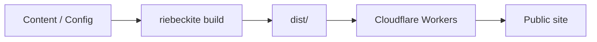
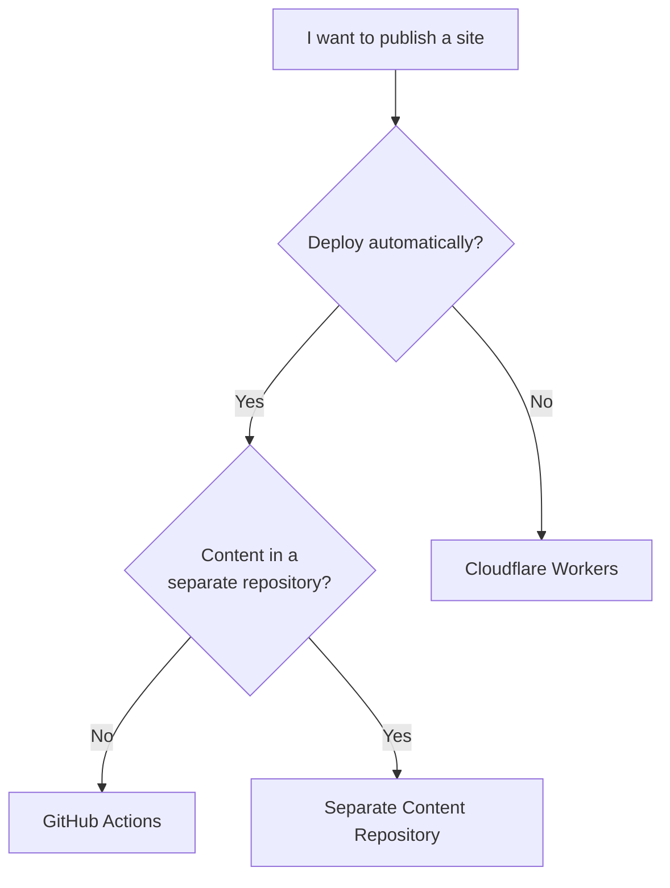

# Deployment

A Riebeckite build produces static files in `dist/`. Deployment means serving that folder, and the choices are about *how* it gets there.



Running

```sh
npm exec riebeckite build
```

generates the publishable site into `dist/`. For a normal static site, that `dist/` is served from Cloudflare Workers as Static Assets.

| I want to… | Guide |
| --- | --- |
| Deploy to Cloudflare Workers by hand | [Cloudflare Workers](./cloudflare-workers.md) |
| Deploy automatically from GitHub | [GitHub Actions](./github-actions.md) |
| Read articles from a separate repository in CI | [Separate content repository](./separate-content-repository.md) |
| Just get a site online today | [Getting Started / Deployment](../../getting-started/deployment.md) |

Publishing locally is the quickest first step: generate a site with `create-riebeckite`'s `Cloudflare Workers` choice, then run `npm run build` and `npm exec riebeckite deploy`. `deploy` does not build; it creates `wrangler.jsonc` when it is missing, opens the Wrangler login on the first run, and uploads `dist/`. GitHub Actions and repository separation are options you can add later. If you already published locally, `npm exec riebeckite deploy setup` prepares GitHub Actions continuous deployment, including the two repository secrets.



## Choosing a method

| Method | Deploy on article push | Needs secrets |
| --- | ---: | --- |
| Same repository + `push` | Yes | `CLOUDFLARE_API_TOKEN`, `CLOUDFLARE_ACCOUNT_ID` |
| Separate repository + `repository_dispatch` | Yes | Above + `SITE_DISPATCH_TOKEN` (content repo) and, if private, `RIEBECKITE_CONTENT_READ_TOKEN` (site repo) |
| Separate repository + `schedule` | Delayed | `CLOUDFLARE_API_TOKEN`, `CLOUDFLARE_ACCOUNT_ID` |
| Manual dispatch | No | `CLOUDFLARE_API_TOKEN`, `CLOUDFLARE_ACCOUNT_ID` |
| Local, from your machine (`npm exec riebeckite deploy`) | No | None (Wrangler OAuth) |

## What the build produces

Riebeckite pre-renders content routes and plugin endpoints during the build. The generated `dist/` is therefore deployed as **static assets**, with no runtime `main` entry.

Build state (`.riebeckite/`, plugin caches) stays at build time and never reaches the Worker runtime.

In Riebeckite, Build and Deploy are separate steps:

```text
Build
  → generate dist/ from content and configuration

Deploy
  → serve dist/ from Cloudflare Workers
```

The publish target is `dist/`:

```text
dist/
  → published

.riebeckite/
Plugin cache
  → not published
```

A normal static site does not need a runtime `main` either. The Riebeckite build does not run on Workers; the built `dist/` is served.

## Checking before you deploy

Before deploying, you can verify in this order:

```sh
npm exec riebeckite check
npm exec riebeckite doctor
npm exec riebeckite build
```

Once `build` succeeds, deploy the generated `dist/`.

## Deployment guides

### Cloudflare Workers

[Cloudflare Workers](./cloudflare-workers.md)

Publishing `dist/` to Cloudflare Workers from your machine. `npm exec riebeckite deploy` handles the login and generates `wrangler.jsonc`.

### GitHub Actions

[GitHub Actions](./github-actions.md)

Automating the build and the Cloudflare Workers deployment on a push to the site repository.

### Separate Content Repository

[Separate content repository](./separate-content-repository.md)

Managing content such as an Obsidian vault and the site in separate repositories. This also covers authentication for a private content repository and starting the site deployment from a content update.

## Summary

Riebeckite deployment is enough to think of as:

```text
Content
  ↓
riebeckite build
  ↓
dist/
  ↓
Cloudflare Workers
```

- Publish manually → [Cloudflare Workers](./cloudflare-workers.md)
- Publish automatically on push → [GitHub Actions](./github-actions.md)
- Separate the content repository → [Separate content repository](./separate-content-repository.md)

## See also

- Cloudflare deployment template — the files this section documents
- [Build system](../../framework/build-system.md) — what `riebeckite build` writes
- [Analytics](../analytics.md) — the optional, separate page-view collector


