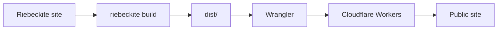
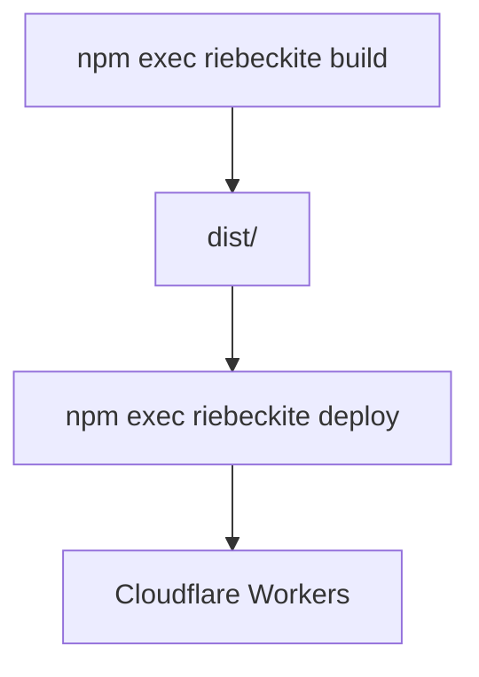
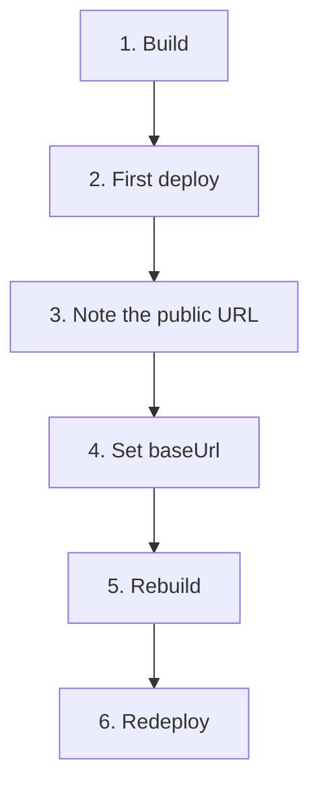
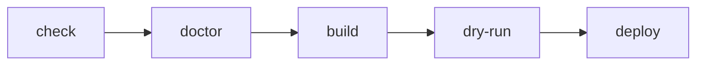
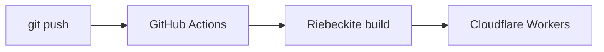
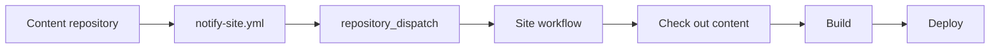

# Cloudflare Workers deployment

This guide focuses only on publishing a Riebeckite site to Cloudflare Workers.

The overall flow is:



For a normal Riebeckite static site, the `dist/` produced by the build is published as Cloudflare Workers Static Assets.

## Prerequisites

In the site folder, make sure these commands succeed.

```sh
npm install
npm exec riebeckite build
```

A successful build creates `dist/`.

```text
my-site/
├─ app/
├─ content/
├─ dist/               ← publish this
├─ riebeckite.config.ts
└─ package.json
```

Cloudflare Workers serves the files from `dist/`. Build-time state such as `.riebeckite/` and plugin caches is not published.

Incremental processing happens during `riebeckite build` on your machine or GitHub Actions runner. Wrangler then uploads the newly generated `dist/` as Workers Static Assets; Workers do not perform incremental builds. The generated GitHub Actions workflow persists `.riebeckite/cache` and `.riebeckite/build/content-state.json` for this build step, never `dist/`.

## 1. Create a Cloudflare account

Create an account at [cloudflare.com](https://www.cloudflare.com/). The free plan is enough to get started.

## 2. Get wrangler

A site generated with `create-riebeckite`'s `Cloudflare Workers` choice already includes the Wrangler dependency and `wrangler.jsonc`, so no extra install or setup is needed.

For a site generated with `Not now`, or when preparing one manually, run this in the site folder:

```sh
npm install -D wrangler
```

wrangler is the official command-line tool for deploying to Cloudflare Workers.

## 3. Add wrangler.jsonc

`npm exec riebeckite deploy` creates `wrangler.jsonc` from the site folder name when the file is missing, so this step is only needed when you want to review or customize it. To create it yourself, add a `wrangler.jsonc` in the site root:

```text
my-site/
|- dist/
|- package.json
|- riebeckite.config.ts
`- wrangler.jsonc
```

Change `name` first.

```jsonc
{
  "name": "my-riebeckite-site",
  "assets": {
    "directory": "./dist"
  }
}
```

`name` is the Worker name on Cloudflare. Choose a name that is unique to you. Keep `assets.directory` as `./dist`.

This maps to:

```text
Riebeckite
    ↓
generates dist/
    ↓
Wrangler
    ↓
publishes dist/ as Static Assets
```

## 4. Log in to Cloudflare

`riebeckite deploy` opens the browser and asks you to log in on the first run. To log in ahead of time, or if you run Wrangler directly, use:

```sh
npx wrangler login
```

A browser window opens. Log in to Cloudflare and grant access.

## 5. Deploy

```sh
npm exec riebeckite deploy
```

`riebeckite deploy` calls Wrangler to publish `dist/`. It logs you in first when needed and creates `wrangler.jsonc` when it is missing. Choosing `Cloudflare Workers` in `create-riebeckite` and answering `Yes` to `Deploy now?` runs this build and deploy immediately after scaffolding. To run Wrangler directly instead, use `npx wrangler deploy`.



The deploy prints a URL such as `https://<name>.<account>.workers.dev`. Open it in a browser. If the site loads, deployment worked.

## 6. Match baseUrl to the deployed URL

After the first successful deploy, update `baseUrl` in `riebeckite.config.ts`.

```ts
site: {
  baseUrl: "https://my-riebeckite-site.example.workers.dev",
},
```

Then build and deploy again.

```sh
npm exec riebeckite build
npm exec riebeckite deploy
```

This makes sitemap and feed URLs match the public site.

In other words, the first publish follows this flow:



## 7. Check before publishing

You can verify the Cloudflare Workers configuration without deploying.

### Dry run

```sh
npx wrangler deploy --dry-run
```

This checks the deployment preparation without actually publishing. Use it when you do not want to go live yet but want to confirm the Wrangler configuration.

### Wrangler dev

```sh
npx wrangler dev
```

This serves a local version close to the deployed Worker. A simple way to think about it:

```text
Day-to-day article and site development
  → riebeckite dev

Check the Cloudflare serving state
  → wrangler dev

Publish for real
  → riebeckite deploy
```

## 8. Redeploying an updated site

After a site is published, the steps to update articles or configuration are the same.

```sh
npm exec riebeckite build
npm exec riebeckite deploy
```

```text
Change content
     ↓
Build
     ↓
Update dist/
     ↓
Deploy
```

`riebeckite deploy` only tells Wrangler to publish `dist/`; it does not rebuild Riebeckite content. If you changed anything on the Riebeckite side, run `npm exec riebeckite build` first.

## 9. Pre-deploy checklist

Before deploying to production, you can verify in this order.

```sh
npm exec riebeckite check
npm exec riebeckite doctor
npm exec riebeckite build
npm exec -- riebeckite deploy --dry-run
npm exec riebeckite deploy
```

Each command has a role:

| Command | Role |
| --- | --- |
| `riebeckite check` | Validate config and plugins |
| `riebeckite doctor` | Diagnose site-wide problems |
| `riebeckite build` | Generate `dist/` |
| `riebeckite deploy --dry-run` | Check what will be deployed (calls Wrangler internally) |
| `riebeckite deploy` | Publish to Cloudflare Workers |

When something fails, separate which stage is failing.



## Build and deploy are separate

Riebeckite's build and Cloudflare's deploy are separate operations.

```text
Riebeckite
  → generates the site

Wrangler
  → publishes the generated site to Cloudflare
```

So if `npm exec riebeckite build` fails, look at the Riebeckite side; if `npm exec riebeckite deploy` fails, look at the Cloudflare / Wrangler side. Separating these boundaries makes deployment problems easier to investigate.

## Automated deployment with GitHub Actions

Instead of running `npm exec riebeckite deploy` manually, you can deploy when you push to GitHub.



If the site is already published from your machine, promote it from the site folder:

```sh
npm exec riebeckite deploy setup
```

This creates `.github/workflows/deploy.yml` and registers `CLOUDFLARE_API_TOKEN` and `CLOUDFLARE_ACCOUNT_ID` as repository secrets, then waits for you to push.

### When the site and content are in the same repository

For a same-repository site that is not published yet, generate the workflow with:

```sh
npx create-riebeckite my-site --github-actions
```

This generates the Cloudflare Workers `wrangler.jsonc` and the deployment workflow. After that, a push to `main` in the site repository builds and deploys automatically.

### When content is in a separate repository

For a separate content repository, generate both workflow files with:

```sh
npx create-riebeckite my-site --github-actions \
  --content-repository OWNER/notes \
  --site-repository OWNER/my-site
```

This separates:

```text
OWNER/notes
  → content repository

OWNER/my-site
  → site repository
```

The generated setup checks out `OWNER/notes` into `content/`, receives `content-updated` repository dispatch events, and writes `github/notify-site.yml` for the content repository. Copy that file to `.github/workflows/notify-site.yml` in the content repository.

### External content needs both checkout and notification

When the content repository is separate, checking out the content and starting the site workflow on a content update are two different things.



An external checkout alone does not start the site workflow on a content push.

See [GitHub Actions](./github-actions.md) for the full workflow and [Separate Content Repository](./separate-content-repository.md) for the separate-repository setup.

## Common problems

### `dist/` is missing

Run `npm exec riebeckite build` first. Cloudflare Workers publishes the Static Assets generated in `dist/`.

### The published content is stale after updating the site

Run `npm exec riebeckite build` and `npm exec riebeckite deploy` again after the change. `riebeckite deploy` does not replace Riebeckite's build.

### The URL is wrong after publishing

Check that `site.baseUrl` in `riebeckite.config.ts` matches the actual published URL. If you change it, build and deploy again.

### Riebeckite's build fails

Use `npm exec riebeckite check` and `npm exec riebeckite doctor` to check the Riebeckite-side config and content.

### Wrangler fails

If Riebeckite's `build` succeeded, use `npx wrangler deploy --dry-run` to check the Wrangler-side configuration. Also check `name` and `assets.directory` in `wrangler.jsonc`.

## Summary

The minimal steps to publish a Riebeckite site to Cloudflare Workers are:

```sh
npm exec riebeckite build
npm exec riebeckite deploy
```

A site generated with `create-riebeckite`'s `Cloudflare Workers` choice already includes Wrangler, so `npm install -D wrangler` is not needed. For an existing site generated with `Not now`, run it first.

After the first deployment gives you the public URL:

```text
riebeckite.config.ts
      ↓
set site.baseUrl
      ↓
rebuild
      ↓
redeploy
```

The roles are:

```text
riebeckite build
  → creates dist/

wrangler dev
  → checks Cloudflare serving locally

riebeckite deploy
  → publishes dist/ to Cloudflare Workers
```

When you need automated deployment, move that sequence to run from [GitHub Actions](./github-actions.md) rather than changing the manual deploy mechanism.

## Next steps

- [Fast path to publishing a site](../../getting-started/deployment.md)
- [GitHub Actions](./github-actions.md)
- [Separate Content Repository](./separate-content-repository.md)
- [Usage Guide](../README.md)
- [CLI](../../reference/cli.md)
