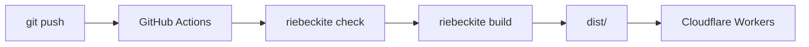
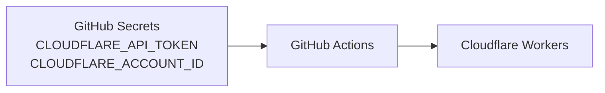
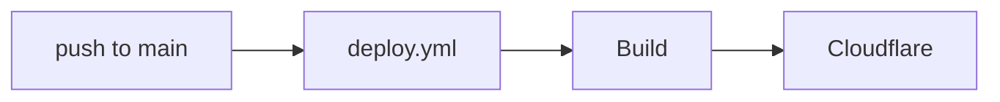
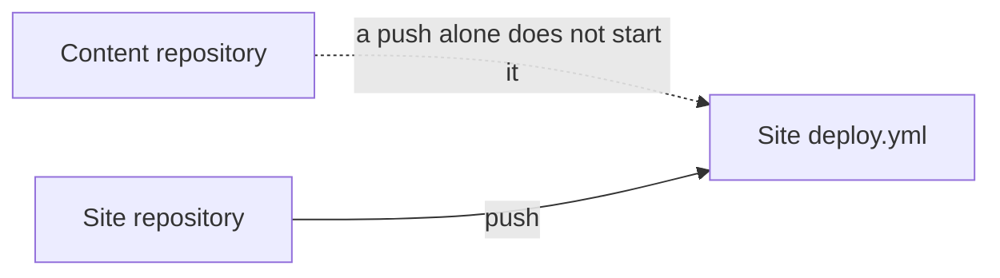
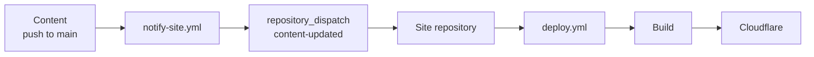
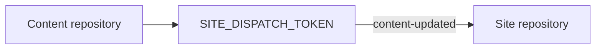
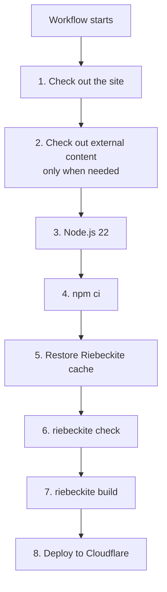
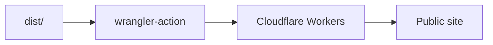
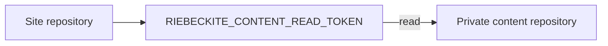
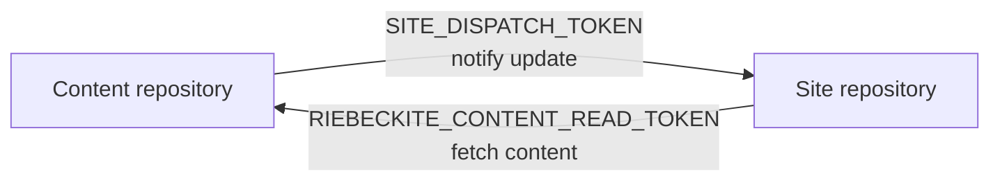

# GitHub Actions

Riebeckite can automate **deployment to Cloudflare Workers from a push to GitHub** with GitHub Actions.



For the common layout where the site and its content live in the same repository, a push to `main` is enough to run the build and deploy.

## Create a site with GitHub Actions enabled

The interactive CLI asks about deployment at the end of setup; choose `GitHub Actions` for continuous deployment. Choose `Cloudflare Workers` instead for a local first publish. From the command line:

```sh
npx create-riebeckite my-site --preset starter --github-actions
```

With `--github-actions`, the generator adds two things to the site:

```text
my-site/
├─ .github/
│  └─ workflows/
│     └─ deploy.yml
│
├─ wrangler.jsonc
└─ ...
```

| File | Role |
| --- | --- |
| `wrangler.jsonc` | Cloudflare Workers deployment settings |
| `.github/workflows/deploy.yml` | The GitHub Actions build/deploy workflow |

Normally you use the generated workflow as your starting point.

## Add it to an existing site

If you already published with Local-first, you can add continuous deployment without recreating the site. Run this in the project:

```sh
npm exec riebeckite deploy setup
```

The command:

1. Detects the Git repository and the GitHub remote.
2. Checks that the GitHub CLI (`gh`) is installed and logged in.
3. Creates `.github/workflows/deploy.yml` from the same template when it does not exist. An existing non-Riebeckite workflow is reported and never overwritten; the command then stops before registering secrets.
4. Reads the Cloudflare account from your Wrangler login, asking you to choose when there is more than one.
5. Registers `CLOUDFLARE_ACCOUNT_ID` and `CLOUDFLARE_API_TOKEN` as repository secrets. The token is read from a hidden prompt, or from `CLOUDFLARE_API_TOKEN` in the environment for non-interactive use.

It does not create a GitHub repository and does not push. When it finishes, push to deploy:

```sh
git push
```

Run it again any time. A matching workflow and existing secrets are detected and skipped, so only the remaining steps run. If a different deployment workflow already exists, replace or remove it first, then run the command again.

## What you need

To deploy from GitHub Actions you need:

- `package-lock.json`
- `CLOUDFLARE_API_TOKEN`
- `CLOUDFLARE_ACCOUNT_ID`
- For `deploy setup`: the GitHub CLI (`gh`) installed and logged in, plus Wrangler in the project (Local-first sites already have it)

### `package-lock.json`

The generated workflow installs dependencies with:

```sh
npm ci
```

So commit `package-lock.json` to the repository.

```text
package.json
package-lock.json
      ↓
npm ci
      ↓
the same dependencies installed in CI
```

Without `package-lock.json`, the generated workflow's `npm ci` cannot be used as-is.

## Put the repository on GitHub

GitHub Actions reads a repository on GitHub. If the site repository does not exist yet, create it.

### Initialize with Git

In the site directory, run:

```sh
git init
git add .
git commit -m "First commit"
```

`.gitignore` is generated, so `node_modules/` and `dist/` are not committed, while `package-lock.json` is. Keep that file, because `npm ci` cannot run without it.

If you are new to Git, `git commit` may fail with `Author identity unknown`. Set the following and try again:

```sh
git config --global user.name "Your Name"
git config --global user.email "you@example.com"
```

### Create a repository on GitHub and push

1. Open [New repository on GitHub](https://github.com/new). Choose a repository name and create it. Do **not** add a README file or a `.gitignore`; you already have local history, and adding either makes the push fail.
2. Run the "…or push an existing repository from the command line" commands shown right after creation. For a `main` setup:

```sh
git remote add origin https://github.com/<you>/my-site.git
git branch -M main
git push -u origin main
```

When `git push -u origin main` succeeds, the files appear on the GitHub repository page. From the next push to `main`, the workflow can run.

## Cloudflare secrets

Set the following GitHub Actions secrets on the site repository:

```text
CLOUDFLARE_API_TOKEN
CLOUDFLARE_ACCOUNT_ID
```

Both come from Cloudflare.

### Create `CLOUDFLARE_API_TOKEN`

1. Log in to the [Cloudflare dashboard](https://dash.cloudflare.com/) and open **My Profile** from the account menu in the top right. You can also open [API Tokens](https://dash.cloudflare.com/profile/api-tokens) directly.
2. Choose **Create Token** → **Create Custom Token**.
3. Under **Permissions**, add **Account** / **Workers Scripts** / **Edit**.
4. Under **Account Resources**, include your account.
5. Press **Continue to review** → **Create Token**.
6. Copy the token value that is shown. Once you close this screen, the value is never shown again.

For the reasoning behind permissions, see [Cloudflare's official guide](https://developers.cloudflare.com/fundamentals/api/get-started/create-token/). If a token leaks, you can rotate it from the same screen.

### Find `CLOUDFLARE_ACCOUNT_ID`

Open **Workers & Pages** in the dashboard; the browser address bar looks like:

```text
https://dash.cloudflare.com/<ACCOUNT_ID>/workers-and-pages
```

`<ACCOUNT_ID>` is the value for `CLOUDFLARE_ACCOUNT_ID`. The **Account ID** shown on a Worker's detail page is the same value.

### Register them in GitHub

On the GitHub site repository, open **Settings** → **Secrets and variables** → **Actions** → **New repository secret**, and register each name and value:

```text
Name: CLOUDFLARE_API_TOKEN   Value: the token you copied
Name: CLOUDFLARE_ACCOUNT_ID  Value: the ACCOUNT_ID above
```

`riebeckite deploy setup` automates these two registrations for a site that is already a Git repository, using the account from your Wrangler login and a token you paste into a hidden prompt. Follow the manual steps above when you prefer to add the secrets by hand or when the CLI is unavailable.

The workflow reads them from the GitHub repository's Actions:



Do not put these directly in source code or `riebeckite.config.ts`; manage them as repository secrets.

## When the workflow runs

The generated workflow starts on:

| Trigger | Purpose |
| --- | --- |
| `push` to `main` | Deploy site changes automatically |
| `workflow_dispatch` | Run manually from GitHub |
| `repository_dispatch: content-updated` | Run from a content update in another repository |

For an ordinary site repository the flow is:

```text
push to main
    ↓
GitHub Actions
    ↓
Deploy
```

## When the site and content are in the same repository

This is the simplest layout.

```text
my-site/
├─ content/
├─ app/
├─ riebeckite.config.ts
└─ .github/
   └─ workflows/
      └─ deploy.yml
```

Because the articles and the site live in the same repository:



Change an article and push to `main`, and the push itself starts the workflow.

## When the site and content are in separate repositories

If you split out a content repository, the flow changes a little.

```text
Content repository
  → Markdown / Obsidian vault

Site repository
  → Riebeckite / config / theme / plugin
```

A push to the content repository **does not start the site repository's workflow by itself**, because a GitHub Actions workflow belongs to its own repository.



To deploy the site automatically from a content update, notify the site repository from the content repository.

## `repository_dispatch`

To start a site workflow from another repository, use:

```text
repository_dispatch
```

Riebeckite's generated workflow is set up to receive the event:

```text
content-updated
```

The overall flow is:



## `notify-site.yml`

Place this on the content repository side:

```text
.github/workflows/notify-site.yml
```

This workflow's job is not to build the site. It is to notify the site repository that the content was updated:

```text
Content repository
      ↓
notify the site repository
"the content was updated"
```

The site repository's `deploy.yml`, on receiving that notification, runs the build and deploy.

## `SITE_DISPATCH_TOKEN`

To send a `repository_dispatch` from the content repository to the site repository, set:

```text
SITE_DISPATCH_TOKEN
```

as a secret on the content repository side.



This token is **for starting the site repository's workflow from the content repository**.

## How the workflow flows

The generated deployment workflow roughly processes in this order:



### 1. Check out the site repository

First the site repository is fetched.

```text
GitHub runner
    ↓
Site repository
```

This contains the Riebeckite config, the application, plugin/theme settings, `package.json`, and `package-lock.json`.

### 2. Check out external content

When the content is in the same repository, this extra step is not needed.

When you use a separate repository, the content repository is checked out into:

```text
content/
```

```text
Runner

Site repository
├─ app/
├─ riebeckite.config.ts
├─ package.json
└─ content/          ← external content repository
```

In that case Riebeckite can read it as:

```ts
content: {
  directory: "content",
},
```

### 3. Set up Node.js

The generated workflow sets up Node.js 22.

```text
GitHub runner
      ↓
Node.js 22
```

The subsequent `npm ci` and Riebeckite CLI run in this environment.

### 4. Install packages

It runs:

```sh
npm ci
```

`npm ci` installs dependencies according to `package-lock.json`, so when you use the generated workflow you must commit `package-lock.json`.

### 5. Restore Riebeckite build state

The generated workflow restores `.riebeckite/cache` (the Markdown and plugin processing cache) and `.riebeckite/build/content-state.json` (incremental build state) with `actions/cache`, scoped by the runner OS and `package-lock.json` hash and saved under a per-run generation. Each run writes a new generation keyed by the run id and attempt, and `restore-keys` fall back to the newest compatible generation, so an existing entry is never overwritten in place. The lockfile hash is only a coarse compatibility boundary: Riebeckite's schema version, app/pipeline/content fingerprints, and plugin cache versions decide the actual reuse. The output cache (`.riebeckite/ssg-output-cache.json`) is deliberately not persisted because it is large and its build-time saving does not offset the transfer cost. `dist/` is not cached. A cache miss is safe and simply performs cold processing.

After the build, a new cache generation is saved automatically. The `hits`, `misses`, and `bypasses` on the build log's `Persistent content cache` line show whether Riebeckite actually reused anything after the Actions cache was restored. Deleting the cache or removing the workflow's cache step makes processing cold, but does not affect output correctness. GitHub evicts old cache generations automatically, so the cache list stays bounded.

### 6. Validate the site

Then it runs:

```sh
npm exec riebeckite check
```

If config or plugin resolution has a problem, it fails here before deploying.

```text
Checkout
   ↓
Install
   ↓
check
   ↓
stop if there is a problem
```

This is a guard against deploying a broken configuration.

### 7. Build the site

Once `check` succeeds, it runs:

```sh
npm exec riebeckite build
```

Riebeckite generates the publishable:

```text
dist/
```

```text
Content
Config
Plugin
Theme
   ↓
riebeckite build
   ↓
dist/
```

### 8. Deploy to Cloudflare Workers

Finally it deploys to Cloudflare Workers using:

```text
cloudflare/wrangler-action@v3
```



Here:

```text
CLOUDFLARE_API_TOKEN
CLOUDFLARE_ACCOUNT_ID
```

are used.

## Using a private content repository

Checkout authentication differs between a public and a private content repository.

To read a private content repository, set this on the site repository:

```text
RIEBECKITE_CONTENT_READ_TOKEN
```



This token's role is **to read the private content repository from the site's workflow**.

## Do not confuse the two tokens

In a split layout, two similarly named tokens appear.

| Secret | Where to store it | Role |
| --- | --- | --- |
| `RIEBECKITE_CONTENT_READ_TOKEN` | Site repository | Read the private content repository |
| `SITE_DISPATCH_TOKEN` | Content repository | Notify the site repository of an update |

It helps to think in terms of direction.

```text
RIEBECKITE_CONTENT_READ_TOKEN

Site ─────read─────> Content
```

```text
SITE_DISPATCH_TOKEN

Content ───notify───> Site
```

That is:



## Site pushes vs. content pushes

With separate repositories there are two deployment paths.

### When you change the site

```text
Site repository
      ↓
push to main
      ↓
deploy.yml
      ↓
check out content
      ↓
Build
      ↓
Deploy
```

The site's `push` starts the workflow directly.

### When you change the content

```text
Content repository
      ↓
push to main
      ↓
notify-site.yml
      ↓
repository_dispatch
      ↓
Site deploy.yml
      ↓
check out content
      ↓
Build
      ↓
Deploy
```

Here one extra step — the notification from the content repository to the site repository — is added.

In both cases, the build ultimately runs **on the site repository side**.

## Running the deploy workflow manually

The generated workflow also supports:

```text
workflow_dispatch
```

so you can run the workflow manually from GitHub.

```text
GitHub
  ↓
Actions
  ↓
Deploy workflow
  ↓
Run workflow
```

This is useful when you want to deploy the current state again without making a new commit to the content or site.

## When deployment does not work

First, separate "the workflow did not start" from "the workflow started but failed".


## The workflow does not start

For a push to the site repository, check that you pushed to:

```text
main
```

For a push to the content repository, check:

```text
notify-site.yml
SITE_DISPATCH_TOKEN
repository_dispatch
content-updated
```

A push to the content repository alone does not start the site workflow.

## `npm ci` fails

The generated workflow uses:

```sh
npm ci
```

so check that `package-lock.json` is committed to the repository.

## Content checkout fails

For a private content repository, check:

```text
RIEBECKITE_CONTENT_READ_TOKEN
```

The site repository's workflow must be able to read the content repository with that token.

## `check` fails

Run the same command locally:

```sh
npm exec riebeckite check
```

Fix the config or plugin problem before pushing.

## `build` fails

Check whether you can reproduce it locally with:

```sh
npm exec riebeckite build
```

If you split repositories, also check that the content exists in the same place CI expects it.

## Cloudflare deployment fails

If the build succeeded, check:

```text
CLOUDFLARE_API_TOKEN
CLOUDFLARE_ACCOUNT_ID
wrangler.jsonc
```

Riebeckite's build and the Cloudflare deployment are separate stages, so determining which one failed makes the cause easier to find.

## Summary

For an ordinary site repository the flow is:

```text
push to main
    ↓
GitHub Actions
    ↓
npm ci
    ↓
riebeckite check
    ↓
riebeckite build
    ↓
Cloudflare Workers
```

With a separate content repository:

```text
push content
    ↓
notify-site.yml
    ↓
repository_dispatch
    ↓
Site workflow
    ↓
check out content
    ↓
Build
    ↓
Deploy
```

The roles to remember in particular are:

```text
SITE_DISPATCH_TOKEN
  → notify from content to site

RIEBECKITE_CONTENT_READ_TOKEN
  → read content from site

CLOUDFLARE_API_TOKEN
CLOUDFLARE_ACCOUNT_ID
  → deploy to Cloudflare
```

## Local verification

Exercise the build and the configuration without deploying:

```sh
npm install
npm exec riebeckite build
npx wrangler deploy --dry-run
```

`wrangler deploy --dry-run` validates `wrangler.jsonc` and the asset directory without contacting Cloudflare. `npx wrangler dev` serves the same output locally.

## Notes

- **Static assets are enough.** Riebeckite pre-renders content routes and plugin endpoints, so `dist/` is served as static assets with no runtime `main` entry.
- **Build state stays at build time.** `.riebeckite/` and plugin caches are not part of `dist/` and never reach the Worker runtime.
- **Attachments are site-owned.** Copy only the files you intend to publish in a `prebuild` step before the build.

## See also

- [Cloudflare Workers](./cloudflare-workers.md) — the manual deployment path
- [Separate content repository](./separate-content-repository.md) — CI reading articles from another repository
- Cloudflare deployment template — the source files
- [Build system](../../framework/build-system.md) — what the build writes
