# GitHub Actions

Riebeckite では、GitHub Actions を使って **GitHub への Push から Cloudflare Workers への Deployment を自動化**できます。

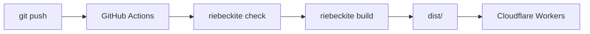

Site と Content が同じ Repository にある一般的な構成なら、`main` へ Push するだけで Build と Deploy を実行できます。

## GitHub Actions を有効にして Site を作る

対話式の CLI では、最後にデプロイ設定を尋ねたところで `GitHub Actions` を選びます。手元からの初回公開（Local-first）は `Cloudflare Workers` を選びます。コマンドラインから GitHub Actions を指定する場合は次のとおりです。

```bash id="f10w6x"
npx create-riebeckite my-site --github-actions
```

これによって、Cloudflare Workers への Deployment に必要な、

```text id="hw99qe"
my-site/
├─ .github/
│  └─ workflows/
│     └─ deploy.yml
│
├─ wrangler.jsonc
└─ ...
```

が生成されます。

| File | 役割 |
| --- | --- |
| `wrangler.jsonc` | Cloudflare Workers の Deployment 設定 |
| `.github/workflows/deploy.yml` | GitHub Actions の Build / Deploy Workflow |

通常は、生成された Workflow を出発点として利用します。

## 既存の Site に追加する

すでに Local-first で公開している場合は、Site を作り直さずに継続デプロイを追加できます。Site の Directory で次を実行します。

```sh id="d3setupj1"
npm exec riebeckite deploy setup
```

このコマンドは次の順で進みます。

1. Git Repository と GitHub Remote を検出する
2. GitHub CLI（`gh`）が install 済みでログイン済みか確認する
3. `.github/workflows/deploy.yml` が無ければ、同じテンプレートから作成する。Riebeckite 以外の既存 workflow は上書きせず、検出したことを報告し、secret の登録には進まずに停止する
4. Wrangler のログイン状態から Cloudflare Account を取得する。複数ある場合は選択する
5. `CLOUDFLARE_ACCOUNT_ID` と `CLOUDFLARE_API_TOKEN` を Repository Secret として登録する。Token は hidden prompt、または non-interactive 用の環境変数 `CLOUDFLARE_API_TOKEN` から読み取る

GitHub Repository の作成と push は行いません。完了後、次で Deploy します。

```sh
git push
```

再実行も可能です。一致する workflow と登録済みの secret は検出され、残りの手順だけを実行します。別の deployment workflow が既にある場合は、置き換えるか削除してから再実行してください。

## 必要なもの

GitHub Actions から Deployment するには、次の設定が必要です。

- `package-lock.json`
- `CLOUDFLARE_API_TOKEN`
- `CLOUDFLARE_ACCOUNT_ID`
- `deploy setup` を使う場合は GitHub CLI（`gh`）の install とログイン、および Wrangler の依存（Local-first の Site には含まれています）

### `package-lock.json`

生成される Workflow は、

```sh id="8ihzjv"
npm ci
```

を使って依存 Package をインストールします。

そのため、

```text id="3oyv7c"
package-lock.json
```

を Repository に Commit してください。

```text id="s9xb5j"
package.json
package-lock.json
      ↓
npm ci
      ↓
同じ依存関係をCIでinstall
```

`package-lock.json` がない状態では、生成 Workflow の `npm ci` をそのまま利用できません。

## Repository を GitHub に置く

GitHub Actions は GitHub 上の Repository を読みます。Site Repository がまだなければ、作ります。

### Git で初期化する

Site の Directory で、次を実行します。

```sh
git init
git add .
git commit -m "First commit"
```

`.gitignore` は生成済みなので `node_modules/` や `dist/` は commit されません。一方で `package-lock.json` は commit されます。このファイルが無いと、この後説明する `npm ci` が動かないので必ず残してください。

Git を初めて使う場合、`git commit` が `Author identity unknown` で失敗することがあります。そのときは次を設定してからやり直します。

```sh
git config --global user.name "あなたの名前"
git config --global user.email "you@example.com"
```

### GitHub に Repository を作って push する

1. [GitHub で New repository](https://github.com/new) を開きます。Repository 名を決めて作成します。**Add a README file** と **Add .gitignore** は**付けません**。ローカルに既に履歴があるため、両方を入れると push が拒否されます。
2. 作成直後の画面に表示される「…or push an existing repository from the command line」のコマンドを、そのまま実行します。`main` を使う構成の例は次のとおりです。

```sh
git remote add origin https://github.com/<you>/my-site.git
git branch -M main
git push -u origin main
```

`git push -u origin main` が成功したら、GitHub の Repository ページにファイルが表示されます。これで `main` への次回 push から Workflow を動かせます。

## Cloudflare の Secrets

Site Repository に、次の GitHub Actions Secrets を設定します。

```text id="79c4ea"
CLOUDFLARE_API_TOKEN
CLOUDFLARE_ACCOUNT_ID
```

どちらも Cloudflare 側で用意します。

### `CLOUDFLARE_API_TOKEN` を作る

1. [Cloudflare ダッシュボード](https://dash.cloudflare.com/) にログインし、右上のアカウントメニューから **My Profile** を開きます。直接 [API Tokens](https://dash.cloudflare.com/profile/api-tokens) でも開けます。
2. **Create Token** → **Create Custom Token** を選びます。
3. **Permissions** に **Account** / **Workers Scripts** / **Edit** を追加します。
4. **Account Resources** に自分の Account を含めます。
5. **Continue to review** → **Create Token** を押します。
6. 表示されたトークンの値をコピーします。この画面を閉じると、この値は二度と表示されません。

権限の詳しい考え方は [Cloudflare の公式手順](https://developers.cloudflare.com/fundamentals/api/get-started/create-token/) を参照してください。トークンが事故で漏れたときは、同じ画面からローテーションできます。

### `CLOUDFLARE_ACCOUNT_ID` を探す

ダッシュボードで **Workers & Pages** を開くと、ブラウザのアドレスバーが次の形式になります。

```text
https://dash.cloudflare.com/<ACCOUNT_ID>/workers-and-pages
```

`<ACCOUNT_ID>` が `CLOUDFLARE_ACCOUNT_ID` の値です。Worker の詳細ページに表示される **Account ID** と同じ値でも構いません。

### GitHub に登録する

GitHub の Site Repository → **Settings** → **Secrets and variables** → **Actions** → **New repository secret** を開き、名前と値をそれぞれ登録します。

```text
名前: CLOUDFLARE_API_TOKEN   値: 上でコピーしたトークン
名前: CLOUDFLARE_ACCOUNT_ID  値: 上の ACCOUNT_ID
```

`riebeckite deploy setup` は、すでに Git Repository になっている Site に対してこの2つの登録を自動化します。Wrangler のログインから Account を取得し、Token は hidden prompt に貼り付けます。手元で secret を登録したい場合や、CLI を使えない場合は、上記の手動手順をそのまま利用してください。

GitHub Repository の Actions から、Workflow がこれらを参照します。

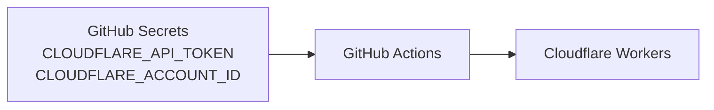

これらは Source Code や `riebeckite.config.ts` に直接書かず、Repository Secret として管理します。

## Workflow が動くタイミング

生成される Workflow は、次の3つの Trigger に対応します。

| Trigger | 用途 |
| --- | --- |
| `main` への `push` | Site の変更を自動 Deploy |
| `workflow_dispatch` | GitHub から手動実行 |
| `repository_dispatch: content-updated` | 別 Repository の Content 更新から実行 |

通常の Site Repository では、

```text id="whvm5u"
mainへpush
    ↓
GitHub Actions
    ↓
Deploy
```

という流れになります。

## Site と Content が同じ Repository の場合

最も単純な構成です。

```text id="8tqoq6"
my-site/
├─ content/
├─ app/
├─ riebeckite.config.ts
└─ .github/
   └─ workflows/
      └─ deploy.yml
```

記事も Site も同じ Repository にあるため、

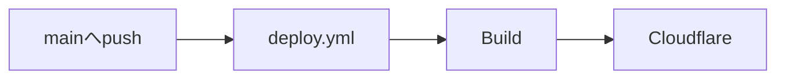

となります。

記事を変更して `main` に Push すれば、その Push 自体が Workflow を起動します。

## Site と Content が別 Repository の場合

Content Repository を分離している場合は少し流れが変わります。

```text id="w3jwej"
Content Repository
  → Markdown / Obsidian Vault

Site Repository
  → Riebeckite / Config / Theme / Plugin
```

Content Repository に Push しても、**それだけでは Site Repository の Workflow は起動しません。**

GitHub Actions の Workflow は、それぞれの Repository に属しているためです。

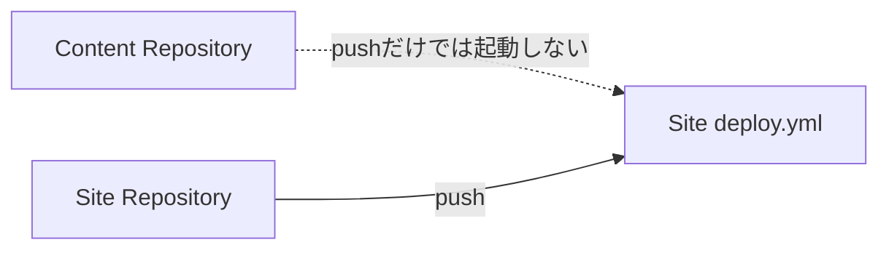

Content の更新から Site を自動 Deploy するには、Content Repository から Site Repository へ通知します。

## `repository_dispatch`

別 Repository から Site Workflow を起動するために、

```text id="ejx6wo"
repository_dispatch
```

を利用します。

Riebeckite の生成 Workflow は、

```text id="5ss0v6"
content-updated
```

という Event を受け取れる構成です。

全体の流れは、

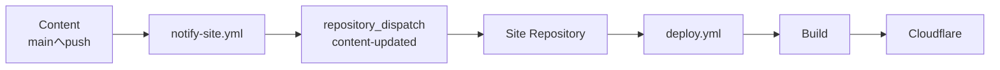

となります。

## `notify-site.yml`

Content Repository 側には、

```text id="7p33l5"
.github/workflows/notify-site.yml
```

を置きます。

この Workflow の役割は Site を Build することではありません。

```text id="kw1g8g"
Content Repository
      ↓
Site Repositoryへ
「Contentが更新された」と通知
```

することです。

その通知を受けた Site Repository の `deploy.yml` が Build と Deploy を実行します。

## `SITE_DISPATCH_TOKEN`

Content Repository から Site Repository へ `repository_dispatch` を送るには、

```text id="b18f8j"
SITE_DISPATCH_TOKEN
```

を Content Repository 側の Secret として設定します。

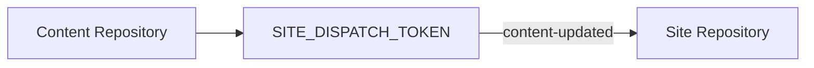

この Token は、

**Content Repository から Site Repository の Workflow を起動するためのもの**

です。

## Workflow の流れ

生成された Deployment Workflow は、概ね次の順番で処理します。

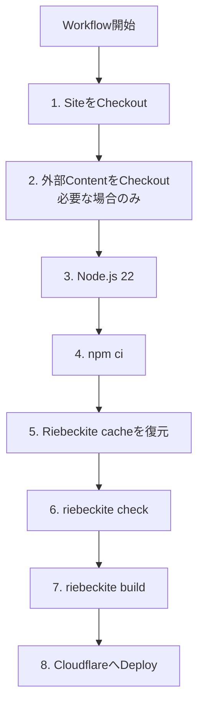

### 1. Site Repository を Checkout

最初に Site Repository を取得します。

```text id="cq3r5o"
GitHub Runner
    ↓
Site Repository
```

ここには、

- Riebeckite Config
- Application
- Plugin / Theme の設定
- `package.json`
- `package-lock.json`

などが含まれます。

### 2. 外部 Content を Checkout

Content が同じ Repository にある場合、この追加処理は必要ありません。

別 Repository を利用している場合は、Content Repository を、

```text id="7xb8gc"
content/
```

へ Checkout します。

```text id="1rhw6a"
Runner

Site Repository
├─ app/
├─ riebeckite.config.ts
├─ package.json
└─ content/          ← 外部Content Repository
```

その場合、Riebeckite 側では、

```ts id="k2zv1m"
content: {
  directory: "content",
},
```

として読み込めます。

### 3. Node.js を設定

生成 Workflow では Node.js 22 を設定します。

```text id="db4q7u"
GitHub Runner
      ↓
Node.js 22
```

その後の `npm ci` や Riebeckite CLI はこの環境で実行されます。

### 4. Package をインストール

```sh id="82x1ig"
npm ci
```

を実行します。

`npm ci` は `package-lock.json` に従って依存 Package をインストールします。

そのため、生成 Workflow を利用する場合は `package-lock.json` を Commit しておく必要があります。

### 5. Riebeckite の build state を復元

生成 Workflow は `actions/cache` で `.riebeckite/cache`（Markdown と Plugin の処理 cache）と `.riebeckite/build/content-state.json`（incremental build の state）を復元します。key には runner OS、`package-lock.json` の hash、run ごとの generation を含めます。各 run は run id と attempt で新しい generation として保存し、`restore-keys` が最新の互換 generation を取得するため、既存 entry をその場で上書きしません。lockfile の hash は大まかな互換性の境界にすぎず、実際の再利用は Riebeckite の schema version、app/pipeline/content fingerprint、Plugin の cacheVersion が判断します。output cache（`.riebeckite/ssg-output-cache.json`）は大きく、build 短縮分が転送コストに見合わないため意図的に永続化しません。`dist/` は cache しません。

build 後は新しい cache generation が自動保存されます。build log の `Persistent content cache` 行にある `hits`、`misses`、`bypasses` を見ると、Actions cache の復元後に Riebeckite 内部で実際に再利用されたかを確認できます。cache を削除する、または workflow の cache step を外すと cold processing になりますが、出力の正しさには影響しません。古い cache generation は GitHub が自動的に破棄するため、cache 一覧は肥大しません。

### 6. Site を検証

次に、

```sh id="e8v6ki"
npm exec riebeckite check
```

を実行します。

Config や Plugin の解決に問題があれば、Deploy 前にここで失敗します。

```text id="ryypt0"
Checkout
   ↓
Install
   ↓
check
   ↓
問題があれば停止
```

壊れた設定のまま Deployment まで進めないための確認です。

### 7. Site を Build

`check` が成功したら、

```sh id="4brn9u"
npm exec riebeckite build
```

を実行します。

Riebeckite が公開用の、

```text id="qqd5y7"
dist/
```

を生成します。

```text id="k2bc05"
Content
Config
Plugin
Theme
   ↓
riebeckite build
   ↓
dist/
```

### 7. Cloudflare Workers へ Deploy

最後に、

```text id="b6nmf8"
cloudflare/wrangler-action@v3
```

を使って Cloudflare Workers へ Deploy します。

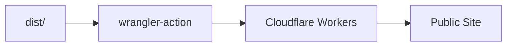

ここで、

```text id="7y1w2d"
CLOUDFLARE_API_TOKEN
CLOUDFLARE_ACCOUNT_ID
```

が利用されます。

## Private Content Repository を使う

Content Repository が Public の場合と Private の場合では、Checkout の認証が異なります。

Private Content Repository を読む場合は、Site Repository に、

```text id="c2wnxd"
RIEBECKITE_CONTENT_READ_TOKEN
```

を設定します。

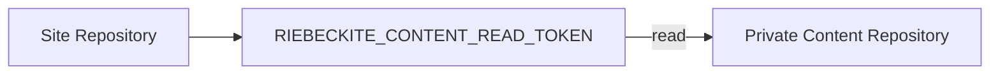

この Token の役割は、

**Site の Workflow から Private Content Repository を読み込むこと**

です。

## 2つの Token を混同しない

Repository を分離した構成では、似た名前の Token が2つ登場します。

| Secret | 保存する場所 | 役割 |
| --- | --- | --- |
| `RIEBECKITE_CONTENT_READ_TOKEN` | Site Repository | Private Content Repository を読む |
| `SITE_DISPATCH_TOKEN` | Content Repository | Site Repository に更新を通知する |

方向で覚えると分かりやすくなります。

```text id="xklxpf"
RIEBECKITE_CONTENT_READ_TOKEN

Site ─────read─────> Content
```

```text id="50j8kg"
SITE_DISPATCH_TOKEN

Content ───notify───> Site
```

つまり、

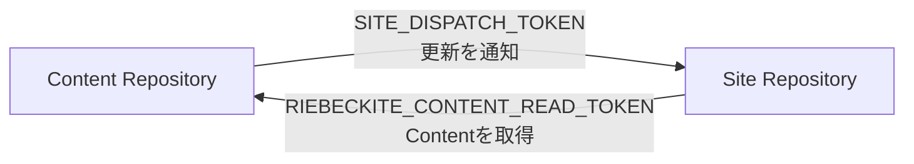

です。

## Site Push と Content Push の違い

Repository を分離した場合は、2つの Deployment 経路があります。

### Site を変更した場合

```text id="z48j9w"
Site Repository
      ↓
mainへpush
      ↓
deploy.yml
      ↓
ContentをCheckout
      ↓
Build
      ↓
Deploy
```

Site の `push` が直接 Workflow を起動します。

### Content を変更した場合

```text id="rqr5jk"
Content Repository
      ↓
mainへpush
      ↓
notify-site.yml
      ↓
repository_dispatch
      ↓
Site deploy.yml
      ↓
ContentをCheckout
      ↓
Build
      ↓
Deploy
```

こちらでは、Content Repository から Site Repository への通知が1段階追加されます。

どちらの場合も、最終的に **Site Repository 側で Build する**点は同じです。

## 手動で Deploy Workflow を実行する

生成 Workflow は、

```text id="25pv89"
workflow_dispatch
```

にも対応しています。

そのため、GitHub 上から Workflow を手動実行できます。

```text id="0coc2a"
GitHub
  ↓
Actions
  ↓
Deploy Workflow
  ↓
Run workflow
```

Content や Site に新しい Commit を作らず、現在の状態でもう一度 Deployment したい場合などに利用できます。

## Deployment が動かない場合

まず「Workflow が起動していない」のか、「Workflow は起動したが失敗した」のかを分けます。

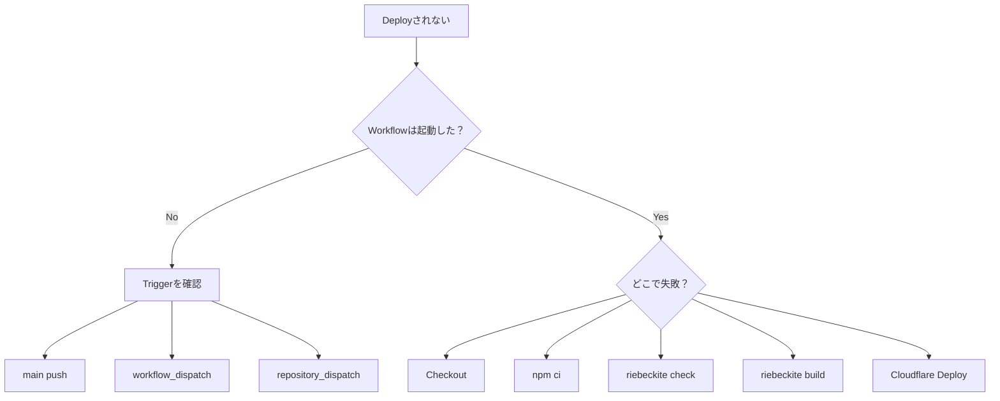

## Workflow が起動しない

Site Repository への Push なら、

```text id="r3q62q"
main
```

へ Push しているか確認します。

Content Repository への Push なら、

```text id="1xb7gc"
notify-site.yml
SITE_DISPATCH_TOKEN
repository_dispatch
content-updated
```

を確認します。

Content Repository への Push だけでは Site Workflow は起動しません。

## `npm ci` で失敗する

生成 Workflow は、

```sh id="dtah4e"
npm ci
```

を利用します。

そのため、

```text id="afg8hg"
package-lock.json
```

が Repository に Commit されているか確認してください。

## Content の Checkout で失敗する

Private Content Repository の場合は、

```text id="9d9gdo"
RIEBECKITE_CONTENT_READ_TOKEN
```

を確認します。

Site Repository の Workflow が、その Token を使って Content Repository を読み取れる必要があります。

## `check` で失敗する

```sh id="5jffy5"
npm exec riebeckite check
```

と同じ Command を手元でも実行します。

Config や Plugin の問題を修正してから Push してください。

## `build` で失敗する

手元で、

```sh id="o2n6np"
npm exec riebeckite build
```

を実行して再現するか確認します。

Repository を分離している場合は、CI と同じ場所に Content が存在することも確認してください。

## Cloudflare Deployment で失敗する

Build までは成功している場合は、

```text id="rxagkm"
CLOUDFLARE_API_TOKEN
CLOUDFLARE_ACCOUNT_ID
wrangler.jsonc
```

を確認します。

Riebeckite の Build と Cloudflare Deployment は別の段階なので、どちらで失敗したかを分けて調べると原因を特定しやすくなります。

## まとめ

通常の Site Repository では、

```text id="8p29zx"
mainへpush
    ↓
GitHub Actions
    ↓
npm ci
    ↓
riebeckite check
    ↓
riebeckite build
    ↓
Cloudflare Workers
```

という流れになります。

Content Repository を分離している場合は、

```text id="yt0pvq"
Contentをpush
    ↓
notify-site.yml
    ↓
repository_dispatch
    ↓
Site Workflow
    ↓
ContentをCheckout
    ↓
Build
    ↓
Deploy
```

となります。

特に覚えておきたいのは、

```text id="30lm4f"
SITE_DISPATCH_TOKEN
  → ContentからSiteへ通知する

RIEBECKITE_CONTENT_READ_TOKEN
  → SiteからContentを読む

CLOUDFLARE_API_TOKEN
CLOUDFLARE_ACCOUNT_ID
  → CloudflareへDeployする
```

という役割の違いです。

### 関連資料

- [Deployment Guides](./README.md) — Deployment 方法の選択
- [Cloudflare Workers](./cloudflare-workers.md) — Cloudflare Workers の設定と手動 Deployment
- [Separate Content Repository](./separate-content-repository.md) — Content と Site を別 Repository で運用する
