# Separating Content and the Site (In Depth)

[Separating Content from the Site](../content-repositories.md) explains separate-repository operation as a walkthrough. This page is its "in depth" companion: it explains **why the configuration works this way** and covers the cases you dig into later — root resolution, copying assets, authenticating CI, and running submodules.

If you are new, read [separating content from the site](../content-repositories.md) first, and use this page when you want to understand the mechanics or when operations go wrong.

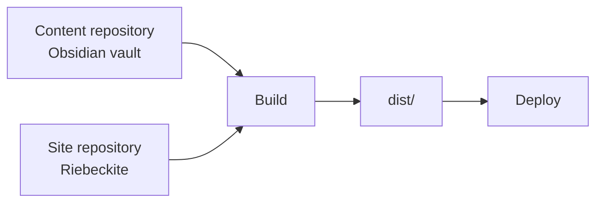

**Content storage and the Riebeckite application can live in separate places.**

## 1. Why "outside the site" works

The resolution rules for `content.directory` in `riebeckite.config.ts`:

| Name | Role | Default / resolution base |
| --- | --- | --- |
| `appRoot` | The HonoX/Vite application. Owns `app/`, `public/`, routes, generated styles, and build output | Vite's `root` |
| `configRoot` | The directory that contains `riebeckite.config.ts` | `appRoot` |
| `contentRoot` | The absolute filesystem root of the configured content directory or Obsidian vault | `path.resolve(appRoot, content.directory)` |

The key point: a relative `content.directory` is **always relative to `appRoot`**, and does not change when `configRoot` or the working directory changes. The integration resolves all three roots before running content or plugins, and the CLI uses the same result. So from a nested directory, a CI working directory, or an editor task, the same vault is always read.

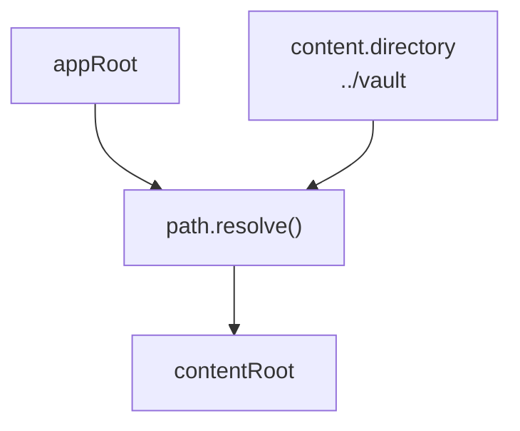

```ts
// site/riebeckite.config.ts
export default defineConfig({
  content: {
    directory: "../vault", // relative to appRoot
  },
});
```

Do not assemble the value from `process.cwd()`, and do not point `appRoot` at the vault. The vault is source data; the Vite application root stays the site.

### 1-1. How the roots are determined

Walking through the order reveals the common pitfalls.

1. **The CLI** walks up from the working directory looking for `riebeckite.config.ts` / `.js` / `.mjs`. The directory of the first match becomes `configRoot`. If none is found it fails with `Could not find riebeckite.config.*`.
2. **appRoot** is found by scanning under `configRoot` for `vite.config.ts` / `.js` / `.mjs` (skipping `node_modules`, `.git`, and `tests`). Finding none is an error, and finding more than one is also an error.
3. **contentRoot** resolves as `path.resolve(appRoot, content.directory)`. An absolute `directory` lands on the same value here.

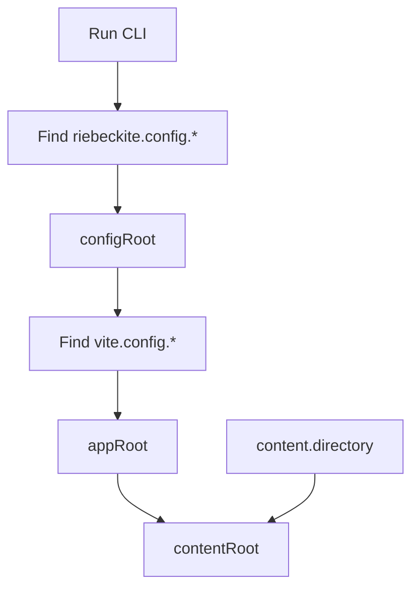

If you intentionally keep `riebeckite.config.ts` outside the Vite application, pass `configRoot` and `appRoot` to `riebeckiteVite()`. Either way, the base for a relative `content.directory` stays `appRoot`.

In other words, "the same vault from anywhere" holds as long as **the config is inside (or above) the site and `appRoot` is unambiguous**. Running from an unrelated directory finds no config at all, and a monorepo with multiple `vite.config.*` files fails with `Found multiple Vite applications`. Both mean the tool could not pin down which site's config applies.

### 1-2. Reading content from the application side

When an application route or island creates its own `ContentManager`, use the same absolute path rather than the raw relative value.

```ts
// site/app/config.ts
import path from "node:path";
import { fileURLToPath } from "node:url";
import { resolveConfigModule } from "@riebeckite/core";
import * as rawConfigModule from "../riebeckite.config";

const appRoot = fileURLToPath(new URL("../", import.meta.url));
const rawConfig = resolveConfigModule(rawConfigModule);

export const config = {
  ...rawConfig,
  content: {
    ...rawConfig.content,
    directory: path.resolve(appRoot, rawConfig.content.directory),
  },
};
```

Pass `config.content.directory` to the `ContentManager`. It is already absolute, so resolving it again against another base is a common source of errors.

### 1-3. What not to do

- Build `content.directory` from `process.cwd()`. The result changes with where you run.
- Point `appRoot` (Vite's `root`) at the vault. That moves the site's `app/`, `public/`, and build output.
- Assume a relative `directory` is relative to `configRoot`. The base is always `appRoot`.

The rule of thumb:

```text
Do not use
  → process.cwd()

Base
  → appRoot
```

## 2. The three patterns

| Pattern | Layout | Choose it when | Deployment consideration |
| --- | --- | --- | --- |
| A. One repository | Site and articles in one Git repository (use `content/`) | You want a single repository for a personal blog | No extra setup |
| B. Separate folders, one repository | `site/` and `vault/` side by side in one repository | You share history but want locations and visibility apart | Set `content.directory: "../vault"` on the site side |
| C. Separate repositories (recommended) | Articles private, site public | You want articles private or updates decoupled | CI needs setup to fetch the articles repository |

### 2-1. Pattern A layout

```text
blog/
├─ riebeckite.config.ts     ← appRoot (directory: "content")
├─ app/
├─ public/
└─ content/                 ← articles live here
   └─ index.md
```

The simplest option, and exactly what `create-riebeckite` generates. Article visibility matches the repository.

### 2-2. Pattern B layout

```text
notes-repo/
├─ site/                ← appRoot (contains riebeckite.config.ts)
│  └─ riebeckite.config.ts
└─ vault/               ← referenced by directory: "../vault"
```

One repository and one history, with the locations split. Visibility is still per repository, as in A. The only change from A is `content.directory: "../vault"`.

### 2-3. Sharing one vault across several sites

An extension of C: keep the vault in its own place and have several sites reference it.

```text
workspace/
├─ notes/           ← shared vault (its own private repository)
├─ blog/            ← site 1 (directory: "../notes")
└─ docs/            ← site 2 (directory: "../notes")
```

Treat the vault as read-only source data and vary `exclude`, `publishStrategy`, and plugins per site. No site writes back, so the same notes can be published in different shapes. Deploy each site independently, giving each CI the additional checkout from section 3-2.

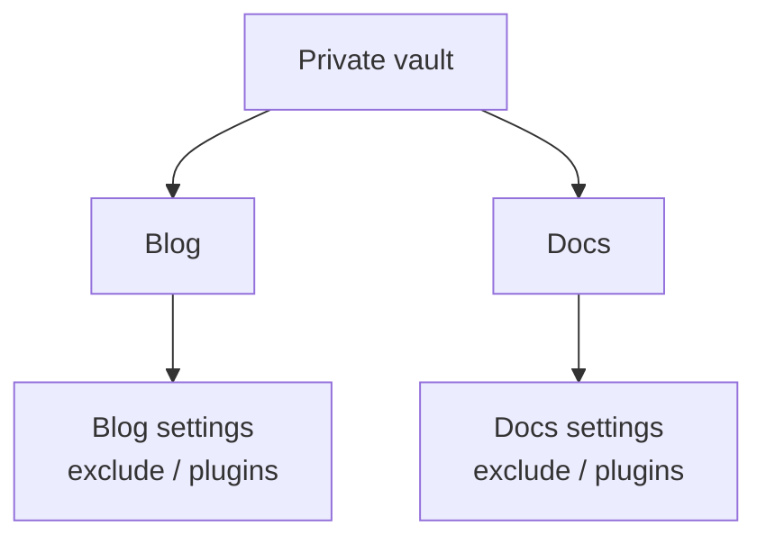

Each site can set `exclude`, `publishStrategy`, plugins, theme, and deployment independently, so the same note can have a different publication range and presentation per site.

### 2-4. Decision flow

1. You want articles private, or updates decoupled → **C**.
2. Articles and site can share visibility → next.
3. You only want locations and settings apart → **B**. You want one repository → **A**.
4. You want one vault for several sites → **C + shared vault** (2-3).

## 3. Pattern C in detail

The basic flow is in [separating content from the site](../content-repositories.md). This section adds the details that walkthrough omits.

### 3-1. Keep the vault in a private repository

- After `git init`, create the **private** GitHub repository before the first push.
- `.obsidian/` is generated when Obsidian opens the vault. Even if it is pushed, putting `.obsidian/**` in `content.exclude` keeps it out of the site build. If you do not want to track it, a middle ground is to gitignore only `.obsidian/workspace*.json`.
- The baseline for private notes is: no `publish: true`. Add a second layer by excluding a private folder (for example `private/**`) in `content.exclude` so those notes are not even loaded.
- Leave `publishStrategy` at the default `explicit`. `selective` is the "publish almost everything, hide exceptions" model, which is riskier for a private vault.

### 3-2. Fetching content is separate from triggering a deployment

The default deploy workflow (generated by `--github-actions`) checks out **only the site repository**.

**Option 1: extra checkout plus repository dispatch (recommended for automatic deployment)**

```yaml
- name: Check out the site
  uses: actions/checkout@v4

- name: Check out the notes
  uses: actions/checkout@v4
  with:
    repository: <you>/notes
    token: ${{ secrets.RIEBECKITE_CONTENT_READ_TOKEN || github.token }}
    path: content
```

- With `path: content`, set `content.directory` to `"content"`.
- This checkout makes files available only after the site workflow starts. Add `repository_dispatch: types: [content-updated]` to the site workflow and put a notification workflow in the content repository to start it on its `main` pushes.
- Do not set `ref` when article updates should deploy the newest default-branch content. The checkout then reads its current tip; the default `fetch-depth: 1` is enough.

Checking out content and triggering a deployment are separate concerns:

```text
Check out the content repository
        ≠
Start a build when the content updates
```

A checkout makes the content readable **after the workflow has started**. If you also want a push to the content repository to deploy the site automatically, you need a mechanism that **starts the site workflow**:

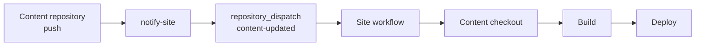

If you do not pin a `ref` in the additional checkout, you get the latest state of the content repository's default branch, which is convenient when article updates should flow straight into the site:

```text
Content main
   ↓
push
   ↓
Site workflow
   ↓
Latest content at that moment
```

The default `fetch-depth: 1` is enough. If you want to pin the exact content commit a site uses, use a Git submodule instead.

**Option 2: Git submodule**

```sh
cd my-site
git submodule add git@github.com:<you>/notes.git content
```

- `content` becomes a link to the articles repository; align `directory` in `riebeckite.config.ts` with `content`.
- Add `submodules: recursive` to `actions/checkout@v4` in the workflow so CI fetches the dependency.
- The referenced commit of a submodule is **recorded in the site repository**. Updating articles is a two-step operation: update the reference on the site side, commit, and push.

```sh
cd content && git pull
cd ..
git add content
git commit -m "update articles"
```

`git submodule update --remote` follows the latest remote, but you still need the site-side commit.

**Comparing the options**

| Aspect | Option 1 (extra checkout) | Option 2 (submodule) |
| --- | --- | --- |
| Article push deploys automatically | Yes, with repository dispatch | No (update the reference) |
| Locality | `path: content`, `directory: "content"` | Fixed at `directory: "content"` |
| History pinning | Follows the branch tip | Can pin a specific commit |
| Local operations | Often a normal clone | Requires `submodule update` |
| Best for | Article-first workflows | Pinning article revisions on the site side |

If article updates dominate, Option 1 is the easier fit; if you want the history pinned on the site side, use Option 2.

### 3-3. Authentication for private repositories in CI

- `github.token` is scoped to the current repository. It can read another **public** GitHub repository, but cannot read a different private or internal repository.
- For a private/internal vault, register `RIEBECKITE_CONTENT_READ_TOKEN` in the site repository. Use a fine-grained PAT restricted to the vault with **Contents: read**, or an equivalent read-only GitHub App installation token.
- The content notification needs a separate `SITE_DISPATCH_TOKEN` stored only in the content repository. Restrict a fine-grained PAT to the site repository with **Contents: read and write**; classic PATs require `repo` scope and GitHub App tokens require **Contents: write**.
- If the submodule was added with an SSH URL (`git@github.com:...`), CI needs an SSH key. Switching to an HTTPS URL and passing `token:` is simpler to configure.

The read token and the dispatch token serve different directions:

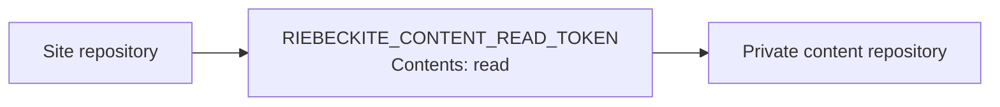

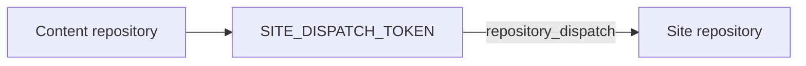

```text
RIEBECKITE_CONTENT_READ_TOKEN
  → read private content from the site

SITE_DISPATCH_TOKEN
  → start the site workflow from the content repository
```

Create a PAT from [GitHub Settings → Developer settings → Personal access tokens](https://github.com/settings/tokens), then register the value under each repository's **Settings → Secrets and variables → Actions**.

```yaml
- name: Check out the notes
  uses: actions/checkout@v4
  with:
    repository: <you>/notes
    token: ${{ secrets.NOTES_READ_TOKEN }}
    path: notes
```

### 3-4. Keep the local and CI layouts aligned

A relative `directory` is appRoot-relative, so different layouts locally and in CI resolve differently.

| Environment | Layout | `directory` |
| --- | --- | --- |
| Local (siblings) | `workspace/notes` and `workspace/my-site` | `"../notes"` |
| CI (extra checkout) | `my-site/notes` | `"notes"` |
| Submodule | `my-site/content` | `"content"` |

Changing the value (`../notes` locally, `notes` in CI) points both at the same vault. If you would rather use one value, either keep the vault under `my-site` locally or make CI lay it out as `../notes`.

## 4. Publication rules and assets

### 4-1. How publication is decided

`content.filters.publishStrategy` takes two values.

| Value | Published when | What it means |
| --- | --- | --- |
| `explicit` (default) | The `publish` frontmatter is `true` | Only notes that opt in |
| `selective` | Neither `private` nor `draft` is `true` | Everything except notes that opt out |

The decision is centralized in `isPublished` / `isPublishable`, and note rendering, diagnostics, and the prebuild asset collection all use the same rule. Do not reimplement the publication decision on the site side; that is how "visible in preview, missing in production" disagreements start.

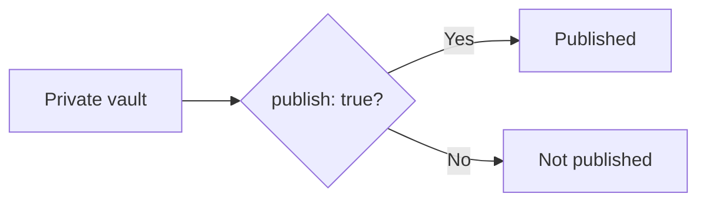

For a private vault, the default `explicit` is the easier model to reason about.

### 4-2. How to write `exclude`

`exclude` matches glob patterns against the path relative to contentRoot (normalized to `/` separators). Note that patterns are **anchored to the whole path**.

| Pattern | Matches | Does not match |
| --- | --- | --- |
| `.obsidian/**` | `.obsidian/app.json` | `notes/.obsidian/app.json` |
| `**/.obsidian/**` | both of the above | — |
| `Templates/**` | `Templates/daily.md` | `notes/Templates/daily.md` |
| `**/Templates/**` | both of the above | — |
| `private/**` | `private/secret.md` | `notes/private/secret.md` |

`*` stays within one segment; `**` crosses segments. If a folder of the same name can appear in subfolders, prefix `**/` to be safe. That is why the scaffold defaults use `**/templates/**` and `**/private/**`.

`exclude` filters before loading, so excluded notes never appear in link resolution or the graph. For notes you want private, in addition to leaving off `publish: true`, exclude the whole folder where possible.

### 4-3. Content images and attachments are published differently

Vault files fall into three kinds, and each one is published by a different owner:

|Kind|Subject|Public URL|Published by|
| --- | --- | --- | --- |
|Content image|An image (`png`, `jpg`, `svg`, …)|`/<relative logical path from the vault>`|The build, as generated output|
|Attachment / Media|A file that is neither Markdown nor an image|`/assets/attachments/<relative logical path from the vault>`|A prebuild step on the site side|
|Static asset|A file the site application owns|anywhere under `/`|Vite's `public/` directory|

Content images need nothing from the site side: `obsidianMarkdown()` writes every image referenced from a published page into the build output, keeping its logical path, and the development server serves the same logical path straight from the content. Images that nothing references, or that only non-public pages reference, are not written.

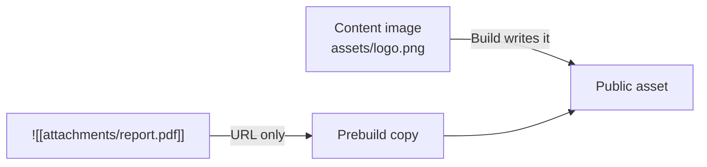

Attachments and media are different. An embed such as:

```md
![[attachments/report.pdf]]
```

produces a URL, but **the file itself is not copied into the public directory**. Add a prebuild step on the site side that copies only the files you publish. Reference implementation: `apps/web/scripts/build_images.ts` (called from the `prebuild` script, `tsx scripts/build_images.ts`, copying into `public/assets/attachments/`).

That implementation works like this:

1. Walk contentRoot to enumerate images (`IMAGE_EXTENSIONS`) and attachments (`isAttachmentPath`).
2. Build the content with `ContentManager` and collect only the assets **referenced** by published notes — from links and from `src` / `href` in the rendered HTML.
3. Copy only referenced assets into `public/assets/attachments/<relative path from the vault>` (images into `public/<relative path>`, so the dev server can serve them before the first build), skipping the copy when size and mtime are unchanged.
4. Delete orphaned attachments that exist in public but not in content.

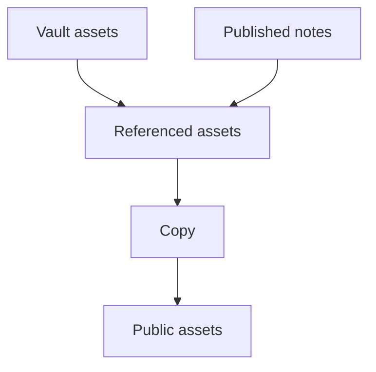

In short, the rule is "copy because a **published note references it**", not "copy because it exists in the vault". Do not take the shortcut of copying the entire vault. It risks leaking private notes, images referenced only from non-public pages, unreferenced attachments, and `.obsidian` metadata. Content images are already filtered and emitted by the build; attachment and media publishing stays the site application's responsibility, so copy only the files a **published** note references. To detect a published note that crosses the boundary by linking to an unpublished one, run `riebeckite-diagnostics` from `@riebeckite/plugin-diagnostics`; it reports those references as `publish-boundary` warnings, and `runDiagnostics()` produces the same result programmatically. See [Diagnostics](../../plugins/diagnostics.md).

### 4-4. The generated URL

A content image keeps its logical path from the vault:

```text
Vault:
assets/logo.png

Public URL:
/assets/logo.png
```

Attachments and media use a dedicated prefix so that a file and an image with the same name cannot collide:

```text
/assets/attachments/<relative logical path from the vault>
```

For example:

```text
Vault:
attachments/report.pdf

Public URL:
/assets/attachments/attachments/report.pdf
```

- `attachment()` reads the embedded file's size from the resolved vault root and rejects paths outside the root.
- `media()` renders the matching audio/video for the same logical path.

Keeping the physical location under `public/` consistent with the visible URL reduces post-build 404s.

### 4-5. Repository visibility vs. publication boundary

Making a repository private and deciding what Riebeckite publishes are separate concerns:

```text
Repository visibility
  → who can read the Git repository

Riebeckite publication
  → what ends up in the site
```

Even with a private vault, a build that copies non-public information into the public output publishes it. Keep three things aligned:

```text
exclude
      +
publishStrategy
      +
asset copy that targets only published notes
```

In particular, do not copy the whole vault into `public/`. See [4-3](#4-3-content-images-and-attachments-are-published-differently) for how the prebuild copy selects referenced assets.

## 5. Verification

You can confirm roots and publication boundaries before building, with the CLI. Run it from a nested directory to prove the working directory does not matter.

```sh
cd site/app
npm exec riebeckite check
npm exec riebeckite doctor
npm exec riebeckite inspect config
npm exec -- riebeckite inspect content --list
npm exec riebeckite inspect graph
npm exec riebeckite build
```

Check the results in this order:

1. `check` validates the configuration and plugin contracts.
2. `doctor` reports unreadable or invalid filesystem content sources.
3. In `inspect config`, `Directory` is the resolved absolute path, `Publishing` is `publishStrategy`, and `Exclude` is the pattern count. Settle where the vault points here first.
4. Before investigating WikiLinks or embeds, use `inspect content --list` to confirm the expected logical paths are loaded.
5. Use `inspect graph` to confirm notes you excluded are not appearing as nodes.
6. `build` validates the integration and route rendering.

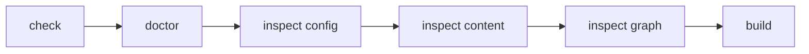

### 5-1. Confirming the working directory does not matter

To investigate root-resolution problems, run the CLI not only from the site root but also from a nested directory:

```sh
cd site/app

npm exec riebeckite inspect config
npm exec -- riebeckite inspect content --list
```

Both should resolve the same application and vault. Running from an unrelated directory can fail to find the config at all.

## 6. Troubleshooting (in depth)

| Symptom | Fix |
| --- | --- |
| Articles do not appear | Check `publish: true`, `exclude` patterns, and `inspect content --list` |
| `doctor` reports a source problem | Check the resolved directory with `inspect config`; verify the relative `directory` against its base (appRoot) |
| `Could not find riebeckite.config.*` | Confirm you are not running from outside the site. The CLI walks ancestors to find the config |
| `Found multiple Vite applications` | More than one `vite.config.*` exists. Narrow the target site, or pass `appRoot` / `configRoot` to `riebeckiteVite()` |
| CI build cannot find the vault | Confirm the workflow has the extra checkout or `submodules: recursive` |
| A private repository not resolvable via `github.token` (e.g., another host) | Confirm a dedicated secret (PAT, etc.) is passed with `token:` |
| The submodule is not fetched in CI | Confirm `actions/checkout@v4` has `submodules: recursive`, and that an SSH URL has a key available |
| Submodule articles do not update | On the site side: `cd content && git pull` → `git add content` → commit → push |
| Images 404 after deploy | Confirm a published page references the image and that it is in the build output |
| Attachments or media 404 after deploy | Confirm the prebuild copy runs before the build and targets `public/assets/attachments/` |
| An image exists in the vault but is not copied | Confirm the referencing note is published (`publish: true`) and that the reference is collected as a `link.kind` |
| Works locally but the path differs in CI | Check the CI working directory and the relative base (appRoot). `../notes` vs `notes` is a common source of drift |
| An excluded folder is still loaded | Remember patterns are anchored; add `**/` if needed (4-2) |

### 6-1. Common path problems

When content is not found, do not start with "where am I running the command from" but with "which `appRoot` did Riebeckite resolve":

```sh
npm exec riebeckite inspect config
```

A relative `content.directory` is always based on `appRoot`:

```text
process.cwd()
  ×

configRoot
  ×

appRoot
  ○
```

### 6-2. Common CI problems

Split the problem first into "the workflow did not start" versus "the workflow started but there is no content":

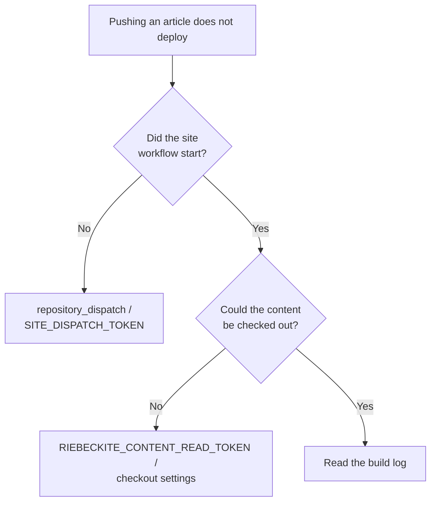

These are two separate mechanisms, so isolate which one is failing.

## 7. Summary

Separating content from the site is easier to reason about when you keep four boundaries apart:

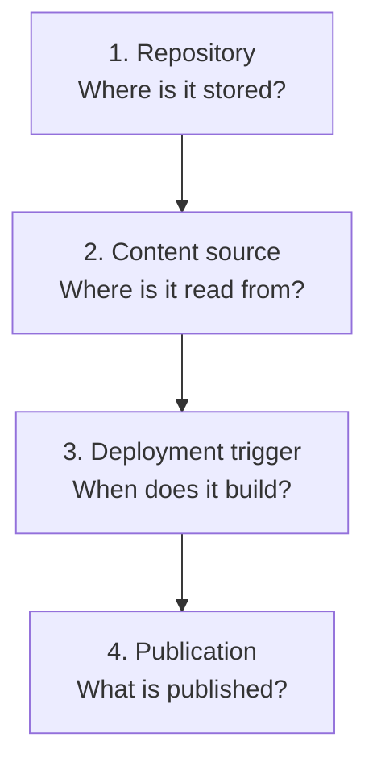

Each boundary has its own setting:

```text
Repository
  → where content and the site are stored

content.directory
  → where Riebeckite reads content from

checkout / repository_dispatch
  → how CI fetches it and when it builds

publishStrategy / exclude / asset copy
  → what is exposed on the public site
```

In particular, note that:

```text
Making the content repository private
        ≠
Automatically making the publication boundary safe
```

Even with a private vault, keep the public boundary intact across `publishStrategy`, `exclude`, and the asset copy.

## Further reading

- [Separating Content from the Site](../content-repositories.md) — a step-by-step introduction
- [Configuration](../../reference/configuration.md) — root resolution and external vaults in detail
- [Usage Guide](../README.md) — external vault examples and assets
- Cloudflare deploy template — deployment workflow details

